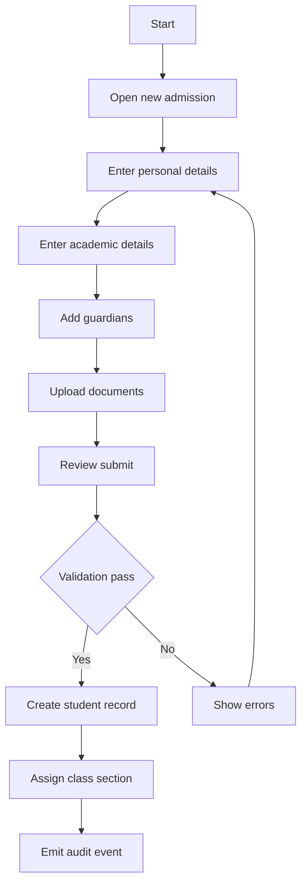
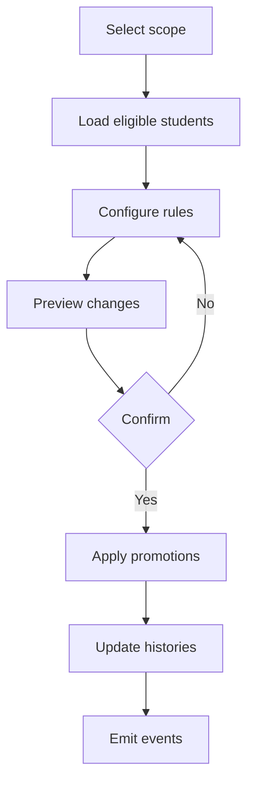
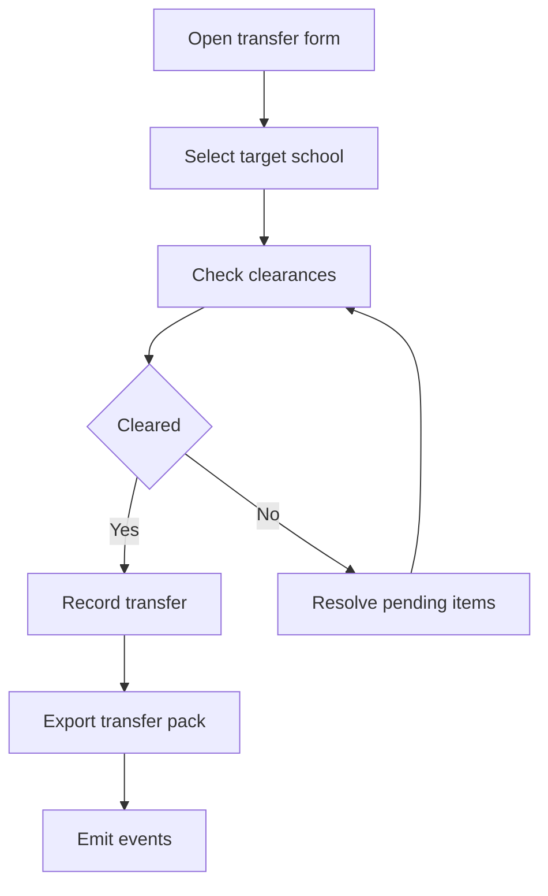
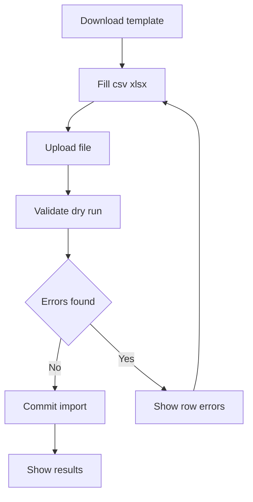

# Student Module Development Plan

Objective: Deliver a complete Student Management capability for the School Admin portal that aligns with Nigerian school structures creche, nursery, primary 1 to 6, JSS 1 to 3, SSS 1 to 3, supports multi school types, and integrates with existing modules.

Key existing artifacts to align with:
- [student.entity.ts](server/src/students/student.entity.ts)
- [user.entity.ts](server/src/users/user.entity.ts)
- [mobile-student.controller.ts](server/src/mobile/controllers/mobile-student.controller.ts)
- [students/page.tsx](client/src/app/school-admin/students/page.tsx)
- [navData.ts](client/src/app/school-admin/_constants/navData.ts)
- [schools.types.ts](common/types/schools/schools.types.ts)
- [users.types.ts](common/types/users/users.types.ts)
- [school.entity.ts](server/src/schools/school.entity.ts)
- [schoolAdminApi.ts](client/src/redux/api/schoolAdminApi.ts)
- [baseApi.ts](client/src/redux/api/baseApi.ts)
- [DEVELOPMENT_PLAN.MD](requirement/4. Academic Management Module/DEVELOPMENT_PLAN.MD)
- [ENTITY_RELATIONSHIP_DIAGRAM.MD](requirement/4. Academic Management Module/ENTITY_RELATIONSHIP_DIAGRAM.MD)

## 1. Scope

In scope
- Student admission onboarding create single and bulk import
- Class section assignment and re assignment
- Promotion demotion repeat per academic year
- Transfer within school and across schools
- Graduation and alumni archival
- Student profile with guardians medical transportation hostel finance documents
- Search filters reporting for admin
- Role based access control and audit trail

Out of scope now
- Detailed timetable teaching delivery managed by Timetable module
- Examination grading managed by Examination module
- Fees billing managed by Finance module

## 2. Nigerian education taxonomy baseline

We will standardize a canonical taxonomy with stage code friendly keys while allowing schools to customize names.

Stages and default classes
- Creche Nursery Early Years EY
  - Creche
  - Nursery 1
  - Nursery 2
  - Kindergarten optional KG 1 KG 2 depending on school
- Primary PRY
  - Primary 1 PRY1 to Primary 6 PRY6
- Junior Secondary JSS
  - JSS 1 JSS1 to JSS 3 JSS3
- Senior Secondary SSS
  - SSS 1 SSS1 to SSS 3 SSS3

Canonical grade code format
- EY Creche Nursery 1 Nursery 2 KG1 KG2
- PRY1 PRY2 PRY3 PRY4 PRY5 PRY6
- JSS1 JSS2 JSS3
- SSS1 SSS2 SSS3

Configuration policy
- Each school can enable one or more stage groups depending on its type see [school.entity.ts](server/src/schools/school.entity.ts)
- Admin can rename display labels but canonical codes remain stable for data integrity
- Mapping table GradeCode to DisplayName will be stored at school settings

## 3. Architecture and module boundaries

Backend NestJS
- Students Module new controller service dto validators repository
- Integrate with Users module for optional user accounts linkage see [user.entity.ts](server/src/users/user.entity.ts)
- Respect multi tenancy by schoolId see [student.entity.ts](server/src/students/student.entity.ts) and [school.entity.ts](server/src/schools/school.entity.ts)
- Emit domain events for audit and for cross module reactions PromotionCompleted TransferCompleted

Frontend NextJS
- School Admin portal screens list profile create edit promotion bulk import transfer graduation
- Use RTK Query via [schoolAdminApi.ts](client/src/redux/api/schoolAdminApi.ts) and [baseApi.ts](client/src/redux/api/baseApi.ts)
- Reuse or extend existing UI on [students/page.tsx](client/src/app/school-admin/students/page.tsx)

Shared types
- Add Students shared types in common types students students.types.ts referenced by both client and server
- Align with [users.types.ts](common/types/users/users.types.ts) and [schools.types.ts](common/types/schools/schools.types.ts)

## 4. Data model recommendations

Non breaking additions to [student.entity.ts](server/src/students/student.entity.ts)
- Add stage string one of EY PRY JSS SSS
- Add gradeCode string canonical eg PRY3 JSS2
- Add streamSection string keep currentSection for display continuity or migrate both
- Add isBoarding boolean and hostel link optional aligns with hostel json already present
- Add promotionHistory jsonb array of records fromGrade toGrade academicYear by userId timestamp
- Add transferHistory jsonb array of records fromSchool toSchool reason academicYear by timestamp
- Add graduationYear number nullable

Supporting settings store
- In [school.entity.ts](server/src/schools/school.entity.ts) settings academic add gradeMapping array of GradeCode DisplayName order
- Seed defaults per school type at creation

Identifiers
- Admission number format default SCHOOLCODE YYYY sequence example GVS 2025 000123 configurable per school
- StudentId remains UUID internal

Indexing
- Composite indexes schoolId gradeCode status for fast filters
- Unique admissionNumber already present ensure scoped globally or by school policy choose globally unique for simplicity

## 5. API surface specification school admin

Base path api school admin students requires school context

List students
- GET api school admin students
- Query search status stage gradeCode section page limit sort
- Returns paginated list with summary counts by stage and status

Get student by id
- GET api school admin students id

Create student admission
- POST api school admin students
- Payload personal academic guardians medical preferences documents minimal required firstName lastName dateOfBirth gender admissionNumber stage gradeCode section admissionDate

Update student
- PUT api school admin students id

Archive delete student soft delete
- DELETE api school admin students id
- Soft delete flag with reason

Assign reassign class section
- POST api school admin students id assign class
- Payload gradeCode section effectiveDate reason

Promotion end of year
- POST api school admin students promotion
- Payload scope gradeCode section optional studentIds targetGradeCode rules repeaters include
- Creates promotion batch and updates promotionHistory

Demotion repeat
- POST api school admin students demotion
- Similar payload with reasons academicStanding

Transfer within school
- POST api school admin students id transfer internal
- Payload fromSection toSection effectiveDate reason

Transfer to another school
- POST api school admin students id transfer external
- Payload targetSchoolId exitReason clearanceDocuments
- Marks current student as transferred and emits event with transferHistory appended

Graduation
- POST api school admin students id graduate
- Payload graduationYear clearance status update to graduated alumni flag

Bulk import
- POST api school admin students import
- CSV XLSX with headers FirstName LastName DateOfBirth Gender AdmissionNumber Stage GradeCode Section Email Phone GuardianName GuardianPhone
- Validation preview dry run rollback on failure

Document upload
- POST api school admin students id documents
- Uses existing document pattern in entity

Status management
- PATCH api school admin students id status
- Payload status enum active inactive suspended withdrawn transferred

Notes
- All endpoints must enforce schoolId scoping via guard similar to others
- Consider versioning v1 prefix if required

## 6. Frontend UX flows School Admin

Students list directory
- Enhance [students/page.tsx](client/src/app/school-admin/students/page.tsx) to load from API not local sample
- Filters by stage grade section status admissionYear search
- Bulk actions promote transfer export invite to portal

Admission create flow
- Modal or full page multi step Personal Academic Guardians Medical Documents Review
- Pre fill grade options based on school settings mapping
- Save as draft or submit

Student profile page
- New route school admin students id with tabs Overview Academic Attendance Finance Documents History
- Reuses shared components for cards badges tables

Promotion wizard
- New route school admin students promotion
- Steps Select scope Configure rules Preview Confirm Execute

Transfer flow
- Internal quick action within profile
- External opens form to choose target school and generates transfer certificate PDF

Bulk import wizard
- Download template
- Upload validate preview
- Map columns to fields optional
- Import progress and results

Graduation flow
- Mark SSS3 as graduated with clearance checklist library fees hostel
- Move to alumni view

## 7. Validation and business rules

- AdmissionNumber unique across system required at create
- Stage and gradeCode must be compatible eg JSS grades only when stage JSS
- Age guidelines optional warnings for stage outliers
- Transfer external requires no outstanding finance or library flags configurable overrides
- Promotion blocked for suspended students unless override
- Soft delete only for pending inactive not for graduated transferred
- All changes recorded in audit trail with userId timestamp

## 8. Security and compliance

- Enforce RoleGuard school admin see existing guard patterns
- PII protection only authorized roles can access contact medical data
- Field level masking for sensitive fields in tables
- GDPR NDPR export delete requests via Users module see [users.types.ts](common/types/users/users.types.ts)
- Add activity logs events for student create update promote transfer graduate

## 9. Observability and audit

- Emit domain events to audit stream
- Metrics number of admissions promotions transfers per period
- Error tracing for bulk import row level issues

## 10. Implementation plan sprints

Sprint 1 Foundations 1 week
- Backend scaffold Students module entities dto validator repository controller routes
- Shared types draft common types students students.types.ts
- Frontend connect list page to API basic filters

Sprint 2 Admission and profile 1 week
- Create student POST with validation
- Student profile route read update PUT
- Documents upload initial

Sprint 3 Class assignment promotion 1 week
- Assign reassign class endpoints and UI
- Promotion batch endpoint wizard with preview

Sprint 4 Transfer and graduation 1 week
- Internal and external transfer flows
- Graduation flow alumni archival

Sprint 5 Bulk import polish 1 week
- CSV XLSX import with dry run and progress
- Error reporting and retry
- UX polish accessibility i18n

## 11. Testing strategy

Unit tests
- Validation rules mapping utilities promotion calculations

Integration tests
- Endpoints with school scoping RBAC
- Bulk import file processing

E2E tests
- Admission flow
- Promotion wizard
- Transfer internal external
- Graduation

## 12. Data migration and seeding

- Seed school default grade mappings based on type using settings
- Provide migration script to backfill stage and gradeCode for existing rows by parsing currentGrade
- Provide one time tool to generate admissionNumber if missing based on policy

## 13. Risks and mitigations

- Inconsistent grade naming across schools Mitigate with canonical gradeCode and per school display mapping
- Bulk import bad data Mitigate with dry run preview row level errors
- Promotion cross module dependencies Keep changes local to student until Exam Timetable integrate
- External transfer data sharing Define minimal dataset and export package

## 14. Deliverables checklist

Backend
- New Students module files students.module.ts students.controller.ts students.service.ts dtos validators
- Endpoints implemented as in section 5
- Unit integration tests

Frontend
- Students list updated
- Admission form multi step
- Profile page tabs
- Promotion wizard
- Transfer and graduation forms
- Bulk import wizard

Shared
- Common student types and grade taxonomy
- CSV templates for import
- Docs admin guide

## 15. Mermaid workflows

Admission flow

Promotion batch

Transfer external

Bulk import

## 16. Next actions

- Confirm taxonomy defaults and display names per school
- Approve API spec and routes
- Approve UI flows and routes
- Kick off Sprint 1