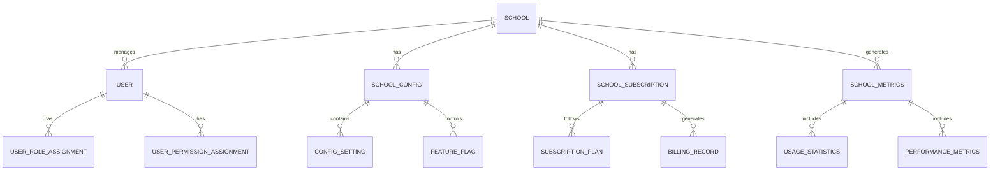
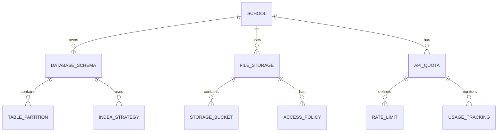
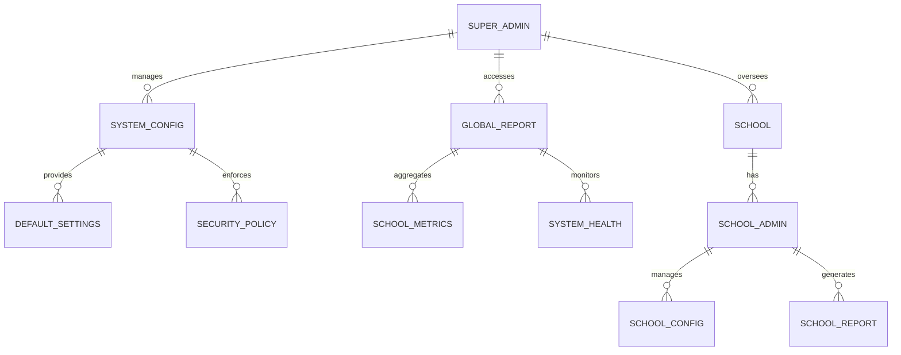
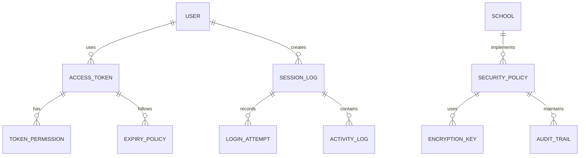
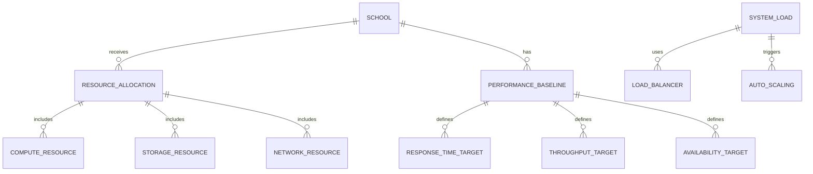
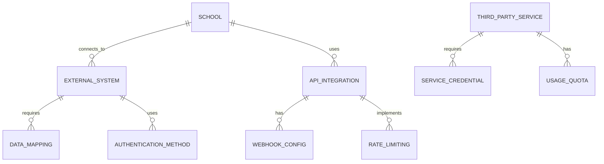

# Multi-School Architecture - Entity Relationship Diagram

## Overview
This ER diagram illustrates the core entities and relationships that enable multi-school architecture in Academia Pro, supporting centralized administration while maintaining complete data isolation between schools.

## Core Entities

## Data Isolation Architecture

## Centralized Administration

## Security & Access Control

## Scalability & Performance

## Integration Points

## Entity Descriptions

### **SCHOOL**
**Purpose**: Central entity representing an educational institution
**Key Attributes**:
- `school_id` (Primary Key)
- `name`, `code` (Identification)
- `address`, `contact_info` (Location & contact)
- `type` (Primary/Secondary/Mixed)
- `capacity` (Student capacity)
- `status` (Active/Inactive/Suspended)
- `created_date`, `updated_date` (Audit fields)

### **USER**
**Purpose**: System users with school-specific access
**Key Attributes**:
- `user_id` (Primary Key)
- `school_id` (Foreign Key - multi-school isolation)
- `username`, `email` (Authentication)
- `role_type` (Super Admin/School Admin/Regular User)
- `status` (Active/Inactive/Suspended)
- `last_login` (Activity tracking)

### **SCHOOL_CONFIG**
**Purpose**: School-specific configuration settings
**Key Attributes**:
- `config_id` (Primary Key)
- `school_id` (Foreign Key)
- `config_type` (Academic/Operational/Security)
- `setting_key`, `setting_value` (Configuration data)
- `is_active` (Status)
- `updated_by`, `updated_date` (Audit)

### **SCHOOL_SUBSCRIPTION**
**Purpose**: Subscription and billing management per school
**Key Attributes**:
- `subscription_id` (Primary Key)
- `school_id` (Foreign Key)
- `plan_id` (Foreign Key)
- `start_date`, `end_date` (Subscription period)
- `status` (Active/Expired/Cancelled)
- `billing_cycle` (Monthly/Annual)

### **DATABASE_SCHEMA**
**Purpose**: Database isolation and partitioning
**Key Attributes**:
- `schema_id` (Primary Key)
- `school_id` (Foreign Key)
- `schema_name` (Database schema identifier)
- `partition_strategy` (Data partitioning approach)
- `encryption_enabled` (Security flag)
- `backup_schedule` (Data protection)

### **ACCESS_TOKEN**
**Purpose**: Authentication and authorization tokens
**Key Attributes**:
- `token_id` (Primary Key)
- `user_id` (Foreign Key)
- `token_value` (Encrypted token)
- `issued_at`, `expires_at` (Token lifecycle)
- `ip_address` (Origin tracking)
- `is_revoked` (Status)

### **RESOURCE_ALLOCATION**
**Purpose**: Dynamic resource management per school
**Key Attributes**:
- `allocation_id` (Primary Key)
- `school_id` (Foreign Key)
- `resource_type` (Compute/Storage/Network)
- `allocated_amount` (Resource quantity)
- `usage_limit` (Maximum usage)
- `auto_scaling_enabled` (Dynamic scaling)

## Key Relationships

### **Data Isolation**
- **SCHOOL → DATABASE_SCHEMA**: One school owns one database schema
- **SCHOOL → FILE_STORAGE**: One school uses dedicated file storage
- **DATABASE_SCHEMA → TABLE_PARTITION**: One schema contains multiple partitions

### **Access Control**
- **USER → ACCESS_TOKEN**: One user can have multiple active tokens
- **ACCESS_TOKEN → TOKEN_PERMISSION**: One token has multiple permissions
- **USER → SESSION_LOG**: One user creates multiple session logs

### **Administration**
- **SUPER_ADMIN → SCHOOL**: One super admin oversees multiple schools
- **SCHOOL_ADMIN → SCHOOL_CONFIG**: One admin manages school configuration
- **SCHOOL → SCHOOL_METRICS**: One school generates usage metrics

### **Resource Management**
- **SCHOOL → RESOURCE_ALLOCATION**: One school receives resource allocation
- **RESOURCE_ALLOCATION → COMPUTE_RESOURCE**: One allocation includes compute resources
- **SYSTEM_LOAD → AUTO_SCALING**: System load triggers auto-scaling

## Performance Considerations

### **Query Optimization**
- **School-specific indexes** on frequently queried tables
- **Partition pruning** for efficient data access
- **Connection pooling** per school schema
- **Read replicas** for reporting queries

### **Caching Strategy**
- **School configuration caching** in Redis
- **Token validation caching** for performance
- **Metrics aggregation caching** for dashboards
- **Resource allocation caching** for scaling decisions

### **Monitoring & Alerting**
- **Per-school performance monitoring**
- **Resource usage alerting**
- **Security incident detection**
- **Automated scaling triggers**

## Security Architecture

### **Data Encryption**
- **Database-level encryption** for sensitive data
- **File-level encryption** for uploaded documents
- **API-level encryption** for data transmission
- **Key management** with rotation policies

### **Access Control**
- **Role-based access control** (RBAC) per school
- **Attribute-based access control** (ABAC) for fine-grained permissions
- **Multi-factor authentication** for administrative access
- **Session management** with automatic timeout

### **Audit & Compliance**
- **Comprehensive audit logging** for all administrative actions
- **GDPR compliance** for data subject rights
- **Data retention policies** per school requirements
- **Regular security assessments** and penetration testing

## Scalability Features

### **Horizontal Scaling**
- **School-based partitioning** for database scaling
- **Microservices architecture** for component isolation
- **Load balancing** across multiple instances
- **CDN integration** for global content delivery

### **Auto-Scaling**
- **CPU utilization-based scaling**
- **Request volume-based scaling**
- **Time-based scaling** for peak usage periods
- **Predictive scaling** using machine learning

### **Resource Optimization**
- **Dynamic resource allocation** based on school size
- **Usage-based billing** for cost optimization
- **Resource pooling** for efficient utilization
- **Automated cleanup** of unused resources

## Implementation Guidelines

### **Database Design**
- **Schema-per-school** for complete data isolation
- **Shared system tables** for common configurations
- **Partitioned tables** for large datasets
- **Optimized indexes** for query performance

### **API Design**
- **School-scoped endpoints** with automatic filtering
- **Rate limiting** per school to prevent abuse
- **Caching layers** for improved performance
- **Webhook support** for real-time integrations

### **Deployment Strategy**
- **Multi-tenant infrastructure** with isolation
- **Automated provisioning** for new schools
- **Blue-green deployments** for zero downtime
- **Disaster recovery** with cross-region replication

This ER diagram provides the foundation for implementing a robust multi-school architecture that ensures data isolation, security, and scalability while maintaining centralized administrative capabilities.