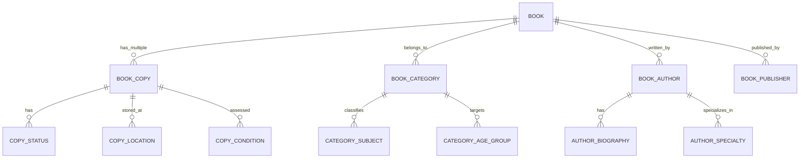
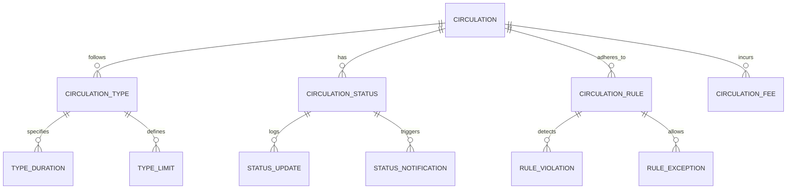
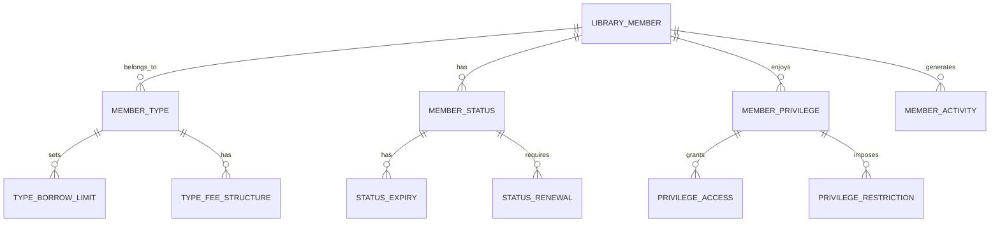
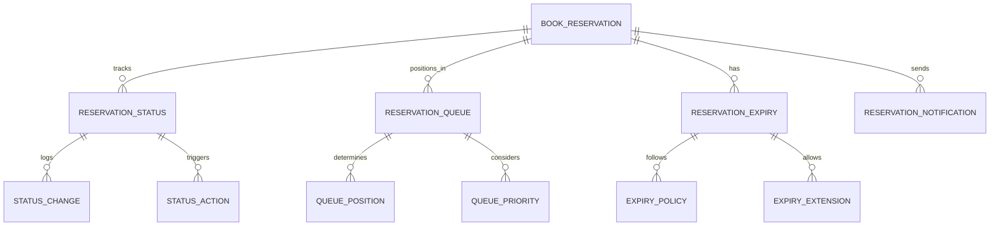
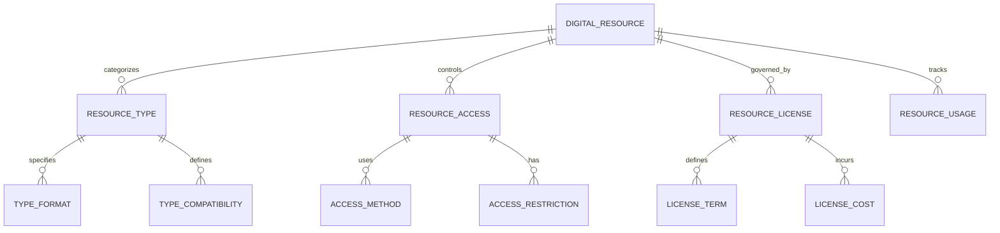
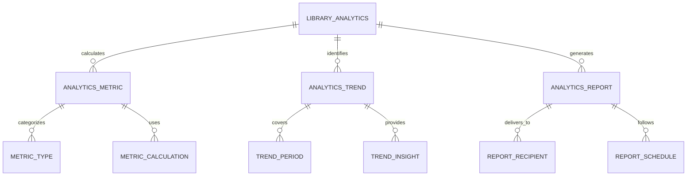
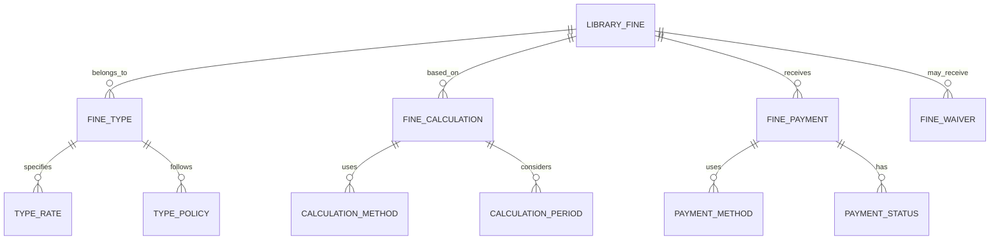

# Library Management Module - Entity Relationship Diagram

## Overview
This ER diagram illustrates the entities and relationships for comprehensive library management, including book cataloging, circulation tracking, member management, digital resources, and library analytics for efficient library operations.

## Book Catalog & Inventory Management

## Circulation & Lending Management

## Member & Patron Management

## Reservation & Hold Management

## Digital Library & E-Resources

## Library Analytics & Reporting

## Fine & Penalty Management

## Entity Descriptions

### **BOOK**
**Purpose**: Master book record with bibliographic information
**Key Attributes**:
- `book_id` (Primary Key)
- `school_id` (Foreign Key)
- `isbn` (International Standard Book Number)
- `title` (Book title)
- `subtitle` (Book subtitle)
- `edition` (Edition number)
- `publication_year` (Year of publication)
- `language` (Book language)
- `page_count` (Number of pages)
- `description` (Book summary)
- `cover_image_path` (Book cover image)

### **BOOK_COPY**
**Purpose**: Individual physical copy of a book
**Key Attributes**:
- `copy_id` (Primary Key)
- `book_id` (Foreign Key)
- `copy_number` (Unique copy identifier)
- `barcode` (Barcode for identification)
- `acquisition_date` (Date book was acquired)
- `acquisition_cost` (Cost of acquisition)
- `condition` (Excellent/Good/Fair/Poor)
- `location` (Shelf location in library)
- `status` (Available/Checked Out/Reserved/Lost/Damaged)
- `last_inventory_date` (Last inventory check)

### **CIRCULATION**
**Purpose**: Book lending and borrowing transactions
**Key Attributes**:
- `circulation_id` (Primary Key)
- `member_id` (Foreign Key)
- `copy_id` (Foreign Key)
- `checkout_date` (Date book was checked out)
- `due_date` (Date book is due back)
- `return_date` (Actual return date)
- `renewal_count` (Number of times renewed)
- `fine_amount` (Outstanding fine amount)
- `status` (Active/Returned/Overdue/Lost)
- `checkout_staff_id` (Staff who processed checkout)

### **LIBRARY_MEMBER**
**Purpose**: Library member information and privileges
**Key Attributes**:
- `member_id` (Primary Key)
- `school_id` (Foreign Key)
- `user_id` (Foreign Key - links to main user system)
- `member_number` (Unique member identifier)
- `member_type` (Student/Teacher/Staff/External)
- `join_date` (Date member joined library)
- `expiry_date` (Membership expiry date)
- `max_books_allowed` (Maximum books that can be borrowed)
- `max_loan_period` (Maximum loan period in days)
- `status` (Active/Inactive/Suspended/Expired)

### **BOOK_RESERVATION**
**Purpose**: Book reservation and hold requests
**Key Attributes**:
- `reservation_id` (Primary Key)
- `member_id` (Foreign Key)
- `book_id` (Foreign Key)
- `reservation_date` (Date reservation was made)
- `queue_position` (Position in reservation queue)
- `expiry_date` (Reservation expiry date)
- `notification_sent` (Whether pickup notification was sent)
- `status` (Active/Fulfilled/Expired/Cancelled)
- `pickup_deadline` (Deadline for picking up reserved book)

### **DIGITAL_RESOURCE**
**Purpose**: Digital library resources and e-books
**Key Attributes**:
- `resource_id` (Primary Key)
- `school_id` (Foreign Key)
- `title` (Resource title)
- `type` (E-book/Journal/Video/Audio)
- `format` (PDF/ePub/MP4/MP3)
- `file_size` (Size in bytes)
- `license_type` (Perpetual/Subscription/Trial)
- `access_url` (URL for accessing resource)
- `thumbnail_path` (Preview image)
- `description` (Resource description)
- `upload_date`, `uploaded_by`

### **LIBRARY_ANALYTICS**
**Purpose**: Library usage and performance analytics
**Key Attributes**:
- `analytics_id` (Primary Key)
- `school_id` (Foreign Key)
- `analysis_period` (Daily/Weekly/Monthly/Yearly)
- `start_date`, `end_date`
- `total_books`, `total_members`, `total_circulations`
- `popular_books` (Most borrowed books)
- `member_engagement` (Active member percentage)
- `collection_utilization` (Books borrowed vs available)
- `generated_date`, `generated_by`

### **LIBRARY_FINE**
**Purpose**: Fine calculation and management for overdue books
**Key Attributes**:
- `fine_id` (Primary Key)
- `circulation_id` (Foreign Key)
- `member_id` (Foreign Key)
- `fine_type` (Overdue/Damage/Lost Book)
- `fine_amount` (Calculated fine amount)
- `fine_rate` (Daily/Weekly fine rate)
- `overdue_days` (Number of days overdue)
- `waiver_amount` (Amount waived if any)
- `payment_status` (Unpaid/Partially Paid/Fully Paid/Waived)
- `generated_date`, `due_date`

## Key Relationships

### **Book Management**
- **BOOK → BOOK_COPY**: One book can have multiple physical copies
- **BOOK → BOOK_CATEGORY**: One book belongs to one or more categories
- **BOOK → BOOK_AUTHOR**: One book can have multiple authors
- **BOOK → BOOK_PUBLISHER**: One book is published by one publisher

### **Circulation Management**
- **CIRCULATION → CIRCULATION_TYPE**: One circulation follows one type
- **CIRCULATION → CIRCULATION_STATUS**: One circulation has one status
- **CIRCULATION → CIRCULATION_RULE**: One circulation adheres to rules
- **CIRCULATION → CIRCULATION_FEE**: One circulation may incur fees

### **Member Management**
- **LIBRARY_MEMBER → MEMBER_TYPE**: One member belongs to one type
- **LIBRARY_MEMBER → MEMBER_STATUS**: One member has one status
- **LIBRARY_MEMBER → MEMBER_PRIVILEGE**: One member enjoys privileges
- **LIBRARY_MEMBER → MEMBER_ACTIVITY**: One member generates activities

### **Reservation System**
- **BOOK_RESERVATION → RESERVATION_STATUS**: One reservation has status tracking
- **BOOK_RESERVATION → RESERVATION_QUEUE**: One reservation has queue position
- **BOOK_RESERVATION → RESERVATION_EXPIRY**: One reservation has expiry
- **RESERVATION_QUEUE → QUEUE_POSITION**: One queue determines positions

### **Digital Resources**
- **DIGITAL_RESOURCE → RESOURCE_TYPE**: One resource belongs to one type
- **DIGITAL_RESOURCE → RESOURCE_ACCESS**: One resource has access control
- **DIGITAL_RESOURCE → RESOURCE_LICENSE**: One resource is governed by license
- **RESOURCE_ACCESS → ACCESS_METHOD**: One access uses specific method

### **Analytics & Reporting**
- **LIBRARY_ANALYTICS → ANALYTICS_METRIC**: One analysis calculates metrics
- **LIBRARY_ANALYTICS → ANALYTICS_TREND**: One analysis identifies trends
- **ANALYTICS_REPORT → REPORT_RECIPIENT**: One report delivers to recipients
- **ANALYTICS_METRIC → METRIC_CALCULATION**: One metric uses calculations

### **Fine Management**
- **LIBRARY_FINE → FINE_TYPE**: One fine belongs to one type
- **LIBRARY_FINE → FINE_CALCULATION**: One fine is based on calculation
- **LIBRARY_FINE → FINE_PAYMENT**: One fine receives payment
- **FINE_CALCULATION → CALCULATION_METHOD**: One calculation uses method

## Business Rules & Validation

### **Book Management Rules**
- **Unique ISBN**: Each book must have unique ISBN
- **Copy Tracking**: Each physical copy must be uniquely identifiable
- **Condition Assessment**: Regular condition assessment required
- **Catalog Standards**: Adherence to library cataloging standards

### **Circulation Rules**
- **Loan Limits**: Members cannot exceed borrowing limits
- **Loan Periods**: Different loan periods for different member types
- **Renewal Limits**: Maximum number of renewals allowed
- **Overdue Penalties**: Automatic fine calculation for overdue items

### **Member Rules**
- **Eligibility Verification**: Members must meet eligibility criteria
- **Membership Renewal**: Timely renewal to maintain active status
- **Privilege Management**: Different privileges for different member types
- **Activity Monitoring**: Tracking of member library usage

### **Reservation Rules**
- **Queue Management**: First-come, first-served for reservations
- **Expiry Handling**: Automatic expiry of unclaimed reservations
- **Notification System**: Automated notifications for reservation status
- **Priority System**: Special priority for certain member types

## Security & Compliance

### **Resource Security**
- **Access Control**: Role-based access to library resources
- **Digital Rights**: Protection of digital content copyrights
- **Physical Security**: Security measures for physical book collection
- **Audit Trails**: Complete logging of all library transactions

### **Data Privacy**
- **Member Privacy**: Protection of member borrowing records
- **GDPR Compliance**: Data protection for member information
- **Confidentiality**: Privacy of borrowing habits and preferences
- **Data Retention**: Appropriate retention periods for library records

## Performance Considerations

### **Database Optimization**
- **Partitioning**: Library data partitioned by school and date
- **Indexing**: Optimized indexes on frequently searched fields
- **Caching**: Popular book information cached for quick access
- **Archival**: Historical circulation data moved to archival storage

### **Search Optimization**
- **Full-text Search**: Advanced search across book titles, authors, subjects
- **Faceted Search**: Multi-faceted search with filters and categories
- **Auto-complete**: Intelligent search suggestions
- **Relevance Ranking**: Search results ranked by relevance

### **Scalability Features**
- **Horizontal Scaling**: Database sharding by school
- **Load Balancing**: Distributed processing of library operations
- **CDN Integration**: Fast delivery of digital content
- **Auto-scaling**: Automatic scaling based on library usage

## Implementation Guidelines

### **Cataloging Standards**
- **MARC Records**: Use of MARC standards for book cataloging
- **Subject Classification**: Dewey Decimal or Library of Congress classification
- **Metadata Enrichment**: Comprehensive metadata for better discovery
- **Authority Control**: Consistent author and subject headings

### **Digital Library Integration**
- **Multiple Formats**: Support for various digital formats
- **DRM Integration**: Digital rights management for protected content
- **Offline Access**: Download capabilities for offline reading
- **Cross-device Sync**: Synchronization across multiple devices

### **Self-Service Systems**
- **Automated Check-out**: Self-service borrowing stations
- **RFID Integration**: RFID tags for automated book tracking
- **Mobile App**: Mobile library access and management
- **Online Reservations**: Web-based reservation system

### **Analytics & Insights**
- **Usage Analytics**: Comprehensive library usage statistics
- **Collection Analysis**: Analysis of collection effectiveness
- **Member Insights**: Understanding member behavior and preferences
- **Predictive Analytics**: Forecasting future library needs

This ER diagram provides a comprehensive foundation for implementing a robust library management system that supports book cataloging, circulation tracking, member management, digital resources, and comprehensive library analytics while ensuring security, compliance, and scalability.