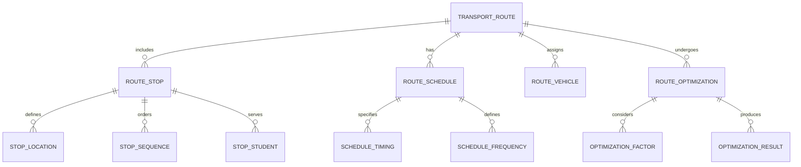
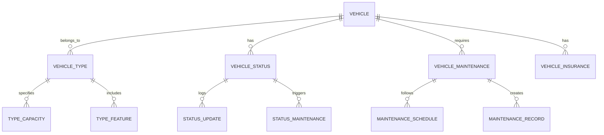
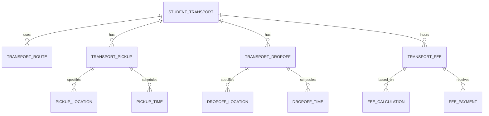
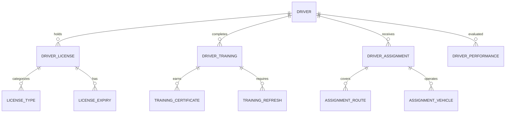
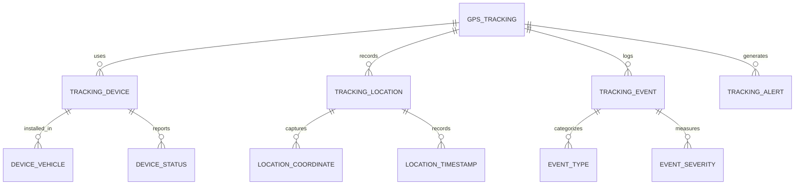
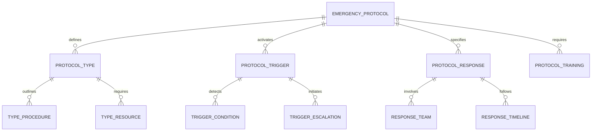
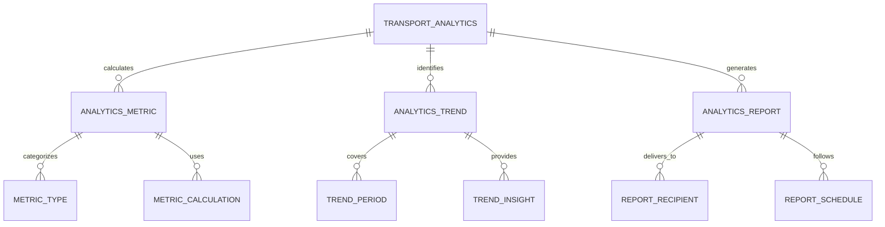
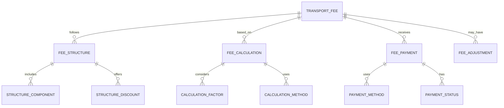

# Transportation Management Module - Entity Relationship Diagram

## Overview
This ER diagram illustrates the entities and relationships for comprehensive school transportation management, including route planning, fleet management, student assignments, real-time tracking, and transportation analytics for safe and efficient student commuting.

## Route Planning & Management

## Fleet & Vehicle Management

## Student Transportation Assignment

## Driver & Attendant Management

## Real-Time Tracking & Monitoring

## Emergency & Safety Management

## Transportation Analytics & Reporting

## Transportation Fee Management

## Entity Descriptions

### **TRANSPORT_ROUTE**
**Purpose**: Transportation route definition and management
**Key Attributes**:
- `route_id` (Primary Key)
- `school_id` (Foreign Key)
- `route_name` (Route identifier)
- `route_type` (Morning Pickup/Evening Drop-off/Both)
- `distance_km` (Total route distance)
- `estimated_duration` (Expected travel time)
- `max_capacity` (Maximum student capacity)
- `status` (Active/Inactive/Under Maintenance)
- `created_date`, `last_modified`

### **VEHICLE**
**Purpose**: Fleet vehicle information and management
**Key Attributes**:
- `vehicle_id` (Primary Key)
- `school_id` (Foreign Key)
- `registration_number` (Vehicle registration)
- `vehicle_type` (Bus/Van/Mini-bus)
- `make`, `model`, `year` (Vehicle specifications)
- `capacity` (Seating capacity)
- `fuel_type` (Petrol/Diesel/Electric)
- `insurance_expiry` (Insurance validity)
- `fitness_certificate_expiry` (Roadworthiness certificate)
- `status` (Active/Maintenance/Out of Service)

### **STUDENT_TRANSPORT**
**Purpose**: Student transportation assignment and tracking
**Key Attributes**:
- `transport_id` (Primary Key)
- `student_id` (Foreign Key)
- `route_id` (Foreign Key)
- `pickup_stop_id` (Foreign Key)
- `dropoff_stop_id` (Foreign Key)
- `transport_status` (Active/Inactive/Temporary)
- `start_date`, `end_date` (Transportation period)
- `emergency_contact` (Emergency contact information)
- `medical_conditions` (Relevant medical information)
- `special_requirements` (Accessibility or special needs)

### **DRIVER**
**Purpose**: Driver information and management
**Key Attributes**:
- `driver_id` (Primary Key)
- `school_id` (Foreign Key)
- `employee_id` (HR system reference)
- `license_number` (Driving license number)
- `license_expiry` (License expiry date)
- `experience_years` (Driving experience)
- `training_completion_date` (Last safety training)
- `background_check_date` (Last background verification)
- `status` (Active/On Leave/Terminated)

### **GPS_TRACKING**
**Purpose**: Real-time GPS tracking and monitoring
**Key Attributes**:
- `tracking_id` (Primary Key)
- `vehicle_id` (Foreign Key)
- `latitude`, `longitude` (GPS coordinates)
- `speed_kmh` (Vehicle speed)
- `timestamp` (Location timestamp)
- `accuracy_meters` (GPS accuracy)
- `satellite_count` (Number of satellites)
- `device_battery` (Device battery level)
- `network_signal` (Network connectivity status)

### **EMERGENCY_PROTOCOL**
**Purpose**: Emergency response protocols and procedures
**Key Attributes**:
- `protocol_id` (Primary Key)
- `school_id` (Foreign Key)
- `protocol_name` (Emergency protocol identifier)
- `emergency_type` (Accident/Medical/Evacuation/Security)
- `trigger_conditions` (Conditions that activate protocol)
- `response_procedures` (Step-by-step response actions)
- `contact_list` (Emergency contact numbers)
- `last_drill_date` (Last emergency drill conducted)
- `status` (Active/Under Review/Archived)

### **TRANSPORT_ANALYTICS**
**Purpose**: Transportation performance and efficiency analytics
**Key Attributes**:
- `analytics_id` (Primary Key)
- `school_id` (Foreign Key)
- `analysis_period` (Daily/Weekly/Monthly)
- `start_date`, `end_date`
- `total_routes`, `total_vehicles`, `total_students`
- `average_speed`, `fuel_efficiency`, `on_time_percentage`
- `route_utilization`, `vehicle_utilization`
- `incident_count`, `emergency_response_time`
- `generated_date`, `generated_by`

### **TRANSPORT_FEE**
**Purpose**: Transportation fee calculation and management
**Key Attributes**:
- `fee_id` (Primary Key)
- `student_id` (Foreign Key)
- `academic_year_id` (Foreign Key)
- `route_id` (Foreign Key)
- `monthly_fee` (Calculated monthly fee)
- `distance_factor` (Fee based on distance)
- `frequency_factor` (Fee based on usage frequency)
- `discount_percentage` (Applied discounts)
- `final_fee` (Fee after discounts)
- `payment_status` (Paid/Outstanding/Overdue)

## Key Relationships

### **Route Management**
- **TRANSPORT_ROUTE → ROUTE_STOP**: One route includes multiple stops
- **TRANSPORT_ROUTE → ROUTE_SCHEDULE**: One route has schedule information
- **TRANSPORT_ROUTE → ROUTE_VEHICLE**: One route assigns vehicles
- **ROUTE_STOP → STOP_LOCATION**: One stop defines location

### **Fleet Management**
- **VEHICLE → VEHICLE_TYPE**: One vehicle belongs to one type
- **VEHICLE → VEHICLE_STATUS**: One vehicle has status tracking
- **VEHICLE → VEHICLE_MAINTENANCE**: One vehicle requires maintenance
- **VEHICLE_MAINTENANCE → MAINTENANCE_SCHEDULE**: One maintenance follows schedule

### **Student Assignment**
- **STUDENT_TRANSPORT → TRANSPORT_ROUTE**: One student uses one route
- **STUDENT_TRANSPORT → TRANSPORT_PICKUP**: One student has pickup location
- **STUDENT_TRANSPORT → TRANSPORT_DROPOFF**: One student has dropoff location
- **TRANSPORT_PICKUP → PICKUP_LOCATION**: One pickup specifies location

### **Driver Management**
- **DRIVER → DRIVER_LICENSE**: One driver holds one license
- **DRIVER → DRIVER_TRAINING**: One driver completes training
- **DRIVER → DRIVER_ASSIGNMENT**: One driver receives assignments
- **DRIVER_LICENSE → LICENSE_EXPIRY**: One license has expiry date

### **GPS Tracking**
- **GPS_TRACKING → TRACKING_DEVICE**: One tracking uses one device
- **GPS_TRACKING → TRACKING_LOCATION**: One tracking records locations
- **GPS_TRACKING → TRACKING_EVENT**: One tracking logs events
- **TRACKING_DEVICE → DEVICE_VEHICLE**: One device installed in one vehicle

### **Emergency Management**
- **EMERGENCY_PROTOCOL → PROTOCOL_TYPE**: One protocol defines type
- **EMERGENCY_PROTOCOL → PROTOCOL_TRIGGER**: One protocol has trigger conditions
- **EMERGENCY_PROTOCOL → PROTOCOL_RESPONSE**: One protocol specifies response
- **PROTOCOL_TRIGGER → TRIGGER_CONDITION**: One trigger detects conditions

### **Analytics & Reporting**
- **TRANSPORT_ANALYTICS → ANALYTICS_METRIC**: One analysis calculates metrics
- **TRANSPORT_ANALYTICS → ANALYTICS_TREND**: One analysis identifies trends
- **ANALYTICS_REPORT → REPORT_RECIPIENT**: One report delivers to recipients
- **ANALYTICS_METRIC → METRIC_CALCULATION**: One metric uses calculations

### **Fee Management**
- **TRANSPORT_FEE → FEE_STRUCTURE**: One fee follows structure
- **TRANSPORT_FEE → FEE_CALCULATION**: One fee is based on calculation
- **TRANSPORT_FEE → FEE_PAYMENT**: One fee receives payment
- **FEE_CALCULATION → CALCULATION_FACTOR**: One calculation considers factors

## Business Rules & Validation

### **Route Management Rules**
- **Capacity Validation**: Routes cannot exceed vehicle capacity
- **Distance Optimization**: Routes optimized for minimal travel time
- **Stop Sequencing**: Logical sequencing of pickup and dropoff stops
- **Schedule Compliance**: Routes must adhere to school timing requirements

### **Vehicle Management Rules**
- **Maintenance Compliance**: Vehicles must pass regular maintenance checks
- **Insurance Validation**: Valid insurance required for all vehicles
- **Capacity Adherence**: Vehicles assigned according to capacity specifications
- **Safety Standards**: All vehicles must meet safety certification requirements

### **Student Assignment Rules**
- **Location Verification**: Student addresses must be within route coverage
- **Capacity Balancing**: Even distribution of students across routes
- **Safety Considerations**: Special needs students assigned appropriate vehicles
- **Schedule Compatibility**: Student schedules must align with route timings

### **Driver Management Rules**
- **License Validation**: Valid driving license required for all drivers
- **Training Requirements**: Regular safety training completion mandatory
- **Experience Verification**: Minimum experience requirements for route assignments
- **Background Checks**: Regular background verification for all drivers

## Security & Compliance

### **Transportation Security**
- **Driver Verification**: Comprehensive background checks for all drivers
- **Vehicle Security**: GPS tracking and immobilizer systems
- **Student Safety**: Emergency contact systems and safety protocols
- **Access Control**: Secure access to transportation management systems

### **Regulatory Compliance**
- **Traffic Regulations**: Compliance with local traffic and transportation laws
- **Safety Standards**: Adherence to vehicle safety and roadworthiness standards
- **Insurance Requirements**: Comprehensive insurance coverage for vehicles and passengers
- **Data Privacy**: Protection of student transportation and personal data

## Performance Considerations

### **Real-Time Processing**
- **GPS Data Processing**: High-frequency GPS data processing and storage
- **Alert Generation**: Real-time alert generation for route deviations
- **Location Updates**: Continuous location tracking and parent notifications
- **Emergency Response**: Instant emergency protocol activation

### **Database Optimization**
- **Time-Series Data**: GPS tracking data partitioned by time
- **Spatial Indexing**: Geographic data optimized for location queries
- **Route Caching**: Frequently used route information cached
- **Archival Strategy**: Historical tracking data moved to archival storage

### **Scalability Features**
- **Horizontal Scaling**: Database sharding by school and geographic region
- **Load Balancing**: Distributed processing of GPS tracking data
- **CDN Integration**: Global distribution of mapping and route data
- **Auto-scaling**: Automatic scaling based on transportation load

## Implementation Guidelines

### **GPS Integration**
- **Device Compatibility**: Support for multiple GPS tracking device manufacturers
- **Data Accuracy**: High-accuracy GPS positioning for precise tracking
- **Real-Time Sync**: Continuous synchronization of tracking data
- **Offline Capability**: Tracking functionality during network outages

### **Route Optimization**
- **Algorithm Selection**: Advanced algorithms for route optimization
- **Dynamic Re-routing**: Real-time route adjustments for traffic and incidents
- **Multi-Objective Optimization**: Balancing time, distance, and safety factors
- **Predictive Analytics**: Forecasting optimal routes based on historical data

### **Mobile Applications**
- **Parent App**: Real-time tracking and notifications for parents
- **Driver App**: Route guidance and student management for drivers
- **Admin App**: Fleet management and analytics for administrators
- **Emergency App**: Quick emergency response and communication

### **Emergency Management**
- **Automated Detection**: AI-powered incident detection from GPS data
- **Rapid Response**: Pre-defined emergency response protocols
- **Communication Integration**: Integration with emergency services
- **Post-Incident Analysis**: Comprehensive incident reporting and analysis

This ER diagram provides a comprehensive foundation for implementing a robust transportation management system that supports route planning, fleet management, student assignments, real-time tracking, and comprehensive transportation analytics while ensuring safety, compliance, and scalability.