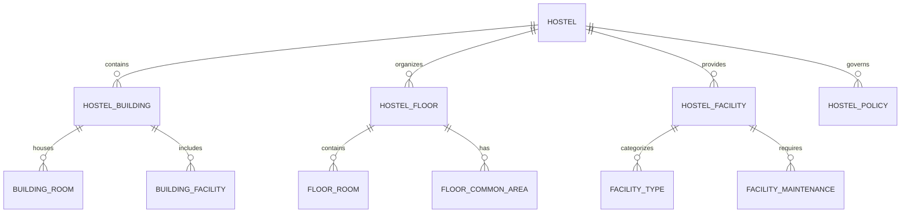
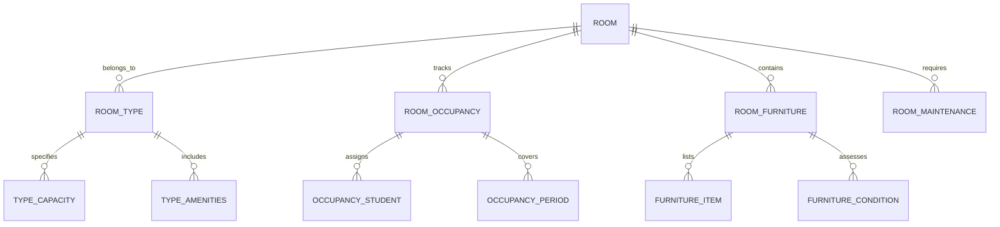
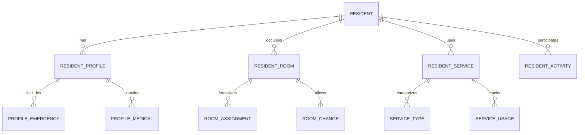
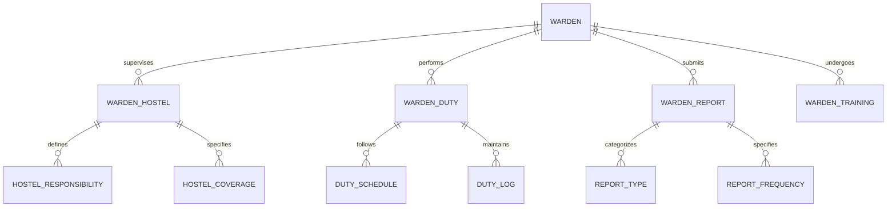
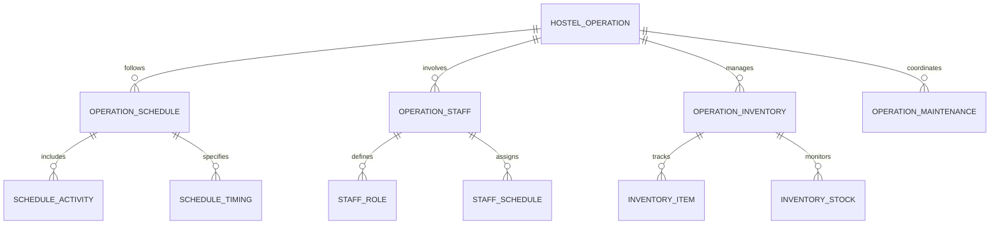
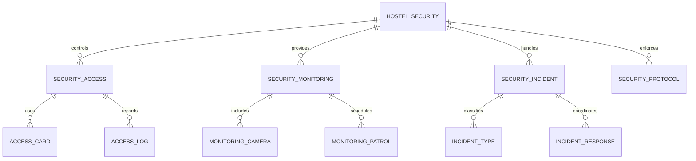
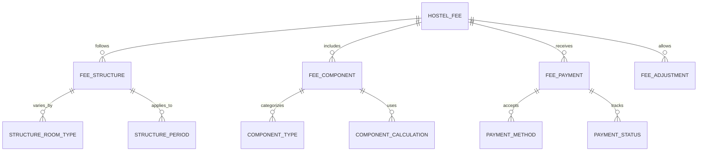

# Hostel-Dormitory Management Module - Entity Relationship Diagram

## Overview
This ER diagram illustrates the entities and relationships for comprehensive hostel and dormitory management, including room allocation, resident management, facility maintenance, and hostel operations for boarding students.

## Hostel Infrastructure & Setup

## Room Management & Allocation

## Resident Management & Services

## Warden & Staff Management

## Hostel Operations & Maintenance

## Security & Access Control

## Hostel Fee & Billing Management

## Entity Descriptions

### **HOSTEL**
**Purpose**: Main hostel facility management and configuration
**Key Attributes**:
- `hostel_id` (Primary Key)
- `school_id` (Foreign Key)
- `hostel_name` (Hostel identifier)
- `hostel_type` (Boys/Girls/Mixed)
- `total_capacity` (Total student capacity)
- `building_count` (Number of buildings)
- `warden_id` (Foreign Key - Chief Warden)
- `status` (Active/Inactive/Under Maintenance)
- `established_date`, `last_renovated`

### **ROOM**
**Purpose**: Individual room management and allocation
**Key Attributes**:
- `room_id` (Primary Key)
- `hostel_id` (Foreign Key)
- `building_id` (Foreign Key)
- `floor_number` (Floor location)
- `room_number` (Room identifier)
- `room_type` (Single/Double/Triple/Suite)
- `capacity` (Maximum occupants)
- `monthly_rent` (Room rent amount)
- `status` (Available/Occupied/Under Maintenance)
- `last_inspection_date`

### **RESIDENT**
**Purpose**: Student resident information and management
**Key Attributes**:
- `resident_id` (Primary Key)
- `student_id` (Foreign Key)
- `hostel_id` (Foreign Key)
- `room_id` (Foreign Key)
- `admission_date` (Date of hostel admission)
- `expected_departure` (Expected departure date)
- `guardian_contact` (Emergency contact information)
- `medical_conditions` (Health information)
- `status` (Active/On Leave/Departed)
- `total_stay_months` (Duration of stay)

### **WARDEN**
**Purpose**: Hostel warden and supervisory staff management
**Key Attributes**:
- `warden_id` (Primary Key)
- `school_id` (Foreign Key)
- `employee_id` (HR system reference)
- `warden_name`, `contact_info`
- `warden_type` (Chief Warden/Deputy Warden/Assistant Warden)
- `qualification` (Educational background)
- `experience_years` (Years of experience)
- `assigned_hostels` (Multiple hostel assignments)
- `status` (Active/On Leave/Terminated)

### **HOSTEL_OPERATION**
**Purpose**: Daily hostel operations and service management
**Key Attributes**:
- `operation_id` (Primary Key)
- `hostel_id` (Foreign Key)
- `operation_type` (Cleaning/Maintenance/Security/Mess)
- `frequency` (Daily/Weekly/Monthly)
- `scheduled_time` (Operation timing)
- `responsible_staff` (Assigned staff member)
- `last_completed` (Last completion date)
- `next_scheduled` (Next scheduled date)
- `status` (Scheduled/In Progress/Completed)

### **HOSTEL_SECURITY**
**Purpose**: Hostel security management and incident handling
**Key Attributes**:
- `security_id` (Primary Key)
- `hostel_id` (Foreign Key)
- `security_level` (Basic/Enhanced/Maximum)
- `access_control_system` (Card/Biometric/Combination)
- `cctv_coverage` (Camera coverage percentage)
- `emergency_response_time` (Target response time in minutes)
- `last_security_audit` (Last security assessment)
- `security_rating` (Current security rating)

### **HOSTEL_FEE**
**Purpose**: Hostel fee calculation and payment management
**Key Attributes**:
- `fee_id` (Primary Key)
- `resident_id` (Foreign Key)
- `hostel_id` (Foreign Key)
- `room_id` (Foreign Key)
- `fee_period` (Monthly/Quarterly/Annual)
- `fee_amount` (Calculated fee amount)
- `due_date` (Payment due date)
- `payment_status` (Paid/Pending/Overdue)
- `late_fee_amount` (Additional charges)
- `generated_date`, `paid_date`

## Key Relationships

### **Hostel Infrastructure**
- **HOSTEL → HOSTEL_BUILDING**: One hostel contains multiple buildings
- **HOSTEL_BUILDING → BUILDING_ROOM**: One building houses multiple rooms
- **HOSTEL → HOSTEL_FLOOR**: One hostel organizes into floors
- **HOSTEL_FLOOR → FLOOR_ROOM**: One floor contains multiple rooms

### **Room Management**
- **ROOM → ROOM_TYPE**: One room belongs to one type
- **ROOM → ROOM_OCCUPANCY**: One room tracks occupancy
- **ROOM_OCCUPANCY → OCCUPANCY_STUDENT**: One occupancy assigns students
- **ROOM → ROOM_MAINTENANCE**: One room requires maintenance

### **Resident Management**
- **RESIDENT → RESIDENT_PROFILE**: One resident has one profile
- **RESIDENT → RESIDENT_ROOM**: One resident occupies one room
- **RESIDENT_ROOM → ROOM_ASSIGNMENT**: One room occupation formalizes assignment
- **RESIDENT → RESIDENT_SERVICE**: One resident uses multiple services

### **Warden Management**
- **WARDEN → WARDEN_HOSTEL**: One warden supervises multiple hostels
- **WARDEN → WARDEN_DUTY**: One warden performs multiple duties
- **WARDEN_DUTY → DUTY_SCHEDULE**: One duty follows schedule
- **WARDEN → WARDEN_REPORT**: One warden submits multiple reports

### **Operations Management**
- **HOSTEL_OPERATION → OPERATION_SCHEDULE**: One operation follows schedule
- **HOSTEL_OPERATION → OPERATION_STAFF**: One operation involves staff
- **OPERATION_STAFF → STAFF_SCHEDULE**: One staff member has schedule
- **HOSTEL_OPERATION → OPERATION_MAINTENANCE**: One operation coordinates maintenance

### **Security Management**
- **HOSTEL_SECURITY → SECURITY_ACCESS**: One security system controls access
- **SECURITY_ACCESS → ACCESS_CARD**: One access system uses cards
- **HOSTEL_SECURITY → SECURITY_MONITORING**: One security provides monitoring
- **SECURITY_MONITORING → MONITORING_CAMERA**: One monitoring includes cameras

### **Fee Management**
- **HOSTEL_FEE → FEE_STRUCTURE**: One fee follows structure
- **FEE_STRUCTURE → STRUCTURE_ROOM_TYPE**: One structure varies by room type
- **HOSTEL_FEE → FEE_PAYMENT**: One fee receives payment
- **FEE_PAYMENT → PAYMENT_METHOD**: One payment uses method

## Business Rules & Validation

### **Room Allocation Rules**
- **Capacity Limits**: Rooms cannot exceed specified capacity
- **Gender Separation**: Boys and girls assigned to appropriate hostels
- **Age Appropriateness**: Room assignments consider student age groups
- **Special Needs**: Accommodations for students with special requirements

### **Resident Management Rules**
- **Check-in/Check-out**: Formal procedures for resident arrival and departure
- **Visitor Policies**: Controlled visitor access with registration
- **Disciplinary Actions**: Clear procedures for rule violations
- **Academic Performance**: Monitoring of resident academic progress

### **Security Rules**
- **Access Control**: 24/7 access control with proper logging
- **Emergency Procedures**: Defined protocols for various emergency situations
- **Incident Reporting**: Mandatory reporting of all security incidents
- **Background Checks**: Regular security clearance for staff and residents

### **Maintenance Rules**
- **Scheduled Maintenance**: Regular maintenance schedules for all facilities
- **Emergency Repairs**: Priority handling of urgent maintenance issues
- **Quality Standards**: Maintenance work meets specified quality standards
- **Documentation**: Complete documentation of all maintenance activities

## Security & Compliance

### **Resident Safety**
- **Emergency Preparedness**: Comprehensive emergency response plans
- **Health and Hygiene**: Regular health inspections and hygiene maintenance
- **Fire Safety**: Fire prevention and evacuation procedures
- **Medical Facilities**: On-site or nearby medical facility access

### **Data Privacy**
- **Resident Information**: Protection of personal and medical information
- **Access Logs**: Monitoring and auditing of system access
- **GDPR Compliance**: Data protection regulations compliance
- **Confidentiality**: Maintaining confidentiality of resident records

## Performance Considerations

### **Database Optimization**
- **Partitioning**: Resident data partitioned by academic year
- **Indexing**: Optimized indexes on frequently queried fields
- **Caching**: Room availability and resident information cached
- **Archival**: Historical resident data moved to archival storage

### **Real-time Monitoring**
- **Occupancy Tracking**: Real-time room occupancy monitoring
- **Security Monitoring**: Continuous security system monitoring
- **Maintenance Tracking**: Real-time maintenance request tracking
- **Incident Response**: Immediate incident detection and response

### **Scalability Features**
- **Multi-hostel Support**: Support for multiple hostel facilities
- **Load Balancing**: Distributed processing across hostel operations
- **Auto-scaling**: Automatic scaling based on resident load
- **Integration**: Seamless integration with main school system

## Implementation Guidelines

### **Room Allocation System**
- **Automated Assignment**: AI-powered room assignment optimization
- **Preference Matching**: Matching student preferences with available rooms
- **Conflict Resolution**: Automated resolution of room assignment conflicts
- **Change Management**: Flexible room change procedures

### **Resident Portal**
- **Self-Service**: Online room requests and service requests
- **Payment Integration**: Online fee payment and billing
- **Communication**: Direct communication with hostel administration
- **Emergency Reporting**: Quick emergency incident reporting

### **Warden Dashboard**
- **Real-time Monitoring**: Live view of hostel operations and occupancy
- **Incident Management**: Centralized incident reporting and tracking
- **Maintenance Coordination**: Maintenance request management and tracking
- **Reporting**: Comprehensive reports on hostel operations and performance

### **Security Integration**
- **Access Control Systems**: Integration with electronic access control
- **CCTV Integration**: Live camera feeds and recording management
- **Alarm Systems**: Automated alarm monitoring and response
- **Emergency Communication**: Integration with emergency services

This ER diagram provides a comprehensive foundation for implementing a robust hostel and dormitory management system that supports room allocation, resident management, facility maintenance, security, and comprehensive hostel operations while ensuring safety, compliance, and scalability.