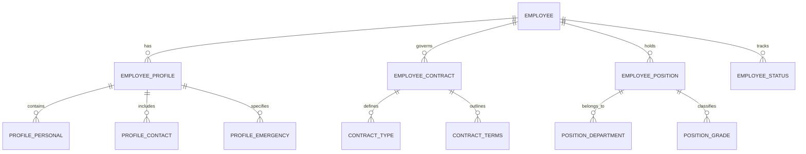
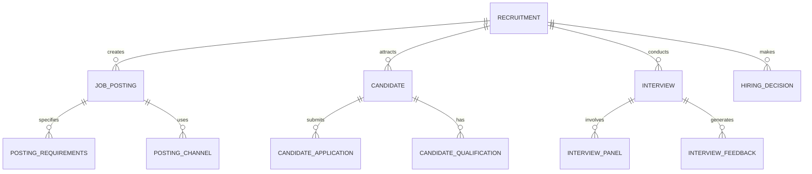
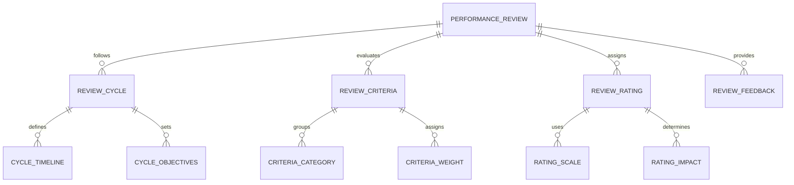
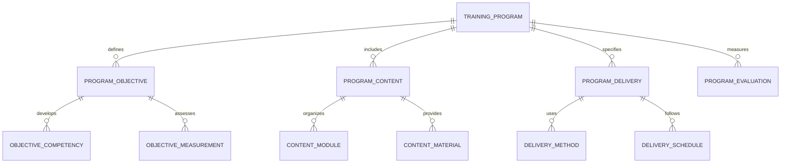
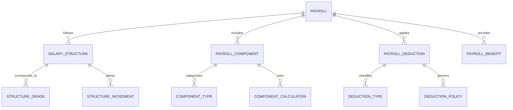
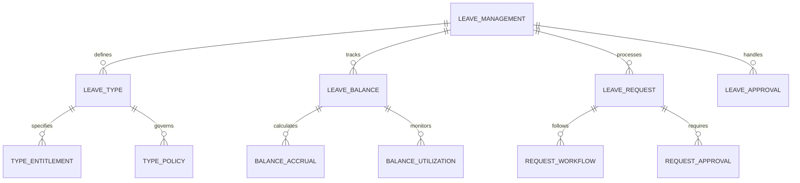
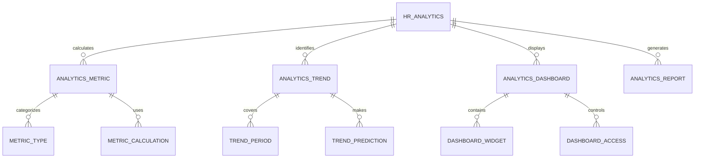

# Staff & HR Management Module - Entity Relationship Diagram

## Overview
This ER diagram illustrates the entities and relationships for comprehensive staff and human resources management, including employee lifecycle, payroll, performance management, and HR operations for educational institutions.

## Employee Information & Lifecycle

## Recruitment & Onboarding

## Performance Management & Development

## Training & Development

## Payroll & Compensation

## Leave & Attendance Management

## HR Analytics & Reporting

## Entity Descriptions

### **EMPLOYEE**
**Purpose**: Core employee information and management
**Key Attributes**:
- `employee_id` (Primary Key)
- `school_id` (Foreign Key)
- `employee_number` (Unique employee identifier)
- `first_name`, `last_name`, `date_of_birth`
- `gender`, `nationality`, `marital_status`
- `hire_date`, `termination_date`
- `employment_status` (Active/On Leave/Terminated)
- `department_id`, `position_id`
- `manager_id` (Reporting manager)

### **EMPLOYEE_PROFILE**
**Purpose**: Comprehensive employee profile information
**Key Attributes**:
- `profile_id` (Primary Key)
- `employee_id` (Foreign Key)
- `personal_email`, `phone_number`
- `address`, `emergency_contact`
- `qualification` (Highest education)
- `experience_years` (Total work experience)
- `skills`, `certifications`
- `bank_details`, `tax_id`
- `passport_number`, `visa_status`

### **EMPLOYEE_CONTRACT**
**Purpose**: Employment contract and terms management
**Key Attributes**:
- `contract_id` (Primary Key)
- `employee_id` (Foreign Key)
- `contract_type` (Permanent/Contract/Probation)
- `start_date`, `end_date`
- `working_hours`, `work_location`
- `salary_grade`, `basic_salary`
- `probation_period`, `notice_period`
- `contract_terms`, `signed_date`

### **RECRUITMENT**
**Purpose**: Recruitment process and candidate management
**Key Attributes**:
- `recruitment_id` (Primary Key)
- `school_id` (Foreign Key)
- `position_id` (Foreign Key)
- `recruitment_start_date`, `recruitment_end_date`
- `vacancy_count` (Number of positions)
- `budget_allocated` (Recruitment budget)
- `status` (Open/Closed/Cancelled)
- `hiring_manager_id` (Responsible manager)

### **PERFORMANCE_REVIEW**
**Purpose**: Employee performance evaluation and management
**Key Attributes**:
- `review_id` (Primary Key)
- `employee_id` (Foreign Key)
- `review_period` (Quarterly/Half-yearly/Annual)
- `review_date`, `next_review_date`
- `reviewer_id` (Person conducting review)
- `overall_rating` (Performance rating)
- `strengths`, `areas_for_improvement`
- `goals_achieved`, `new_goals`
- `status` (Draft/Submitted/Approved)

### **TRAINING_PROGRAM**
**Purpose**: Employee training and development programs
**Key Attributes**:
- `program_id` (Primary Key)
- `school_id` (Foreign Key)
- `program_name`, `program_description`
- `program_type` (Technical/Soft Skills/Management)
- `target_audience` (All Staff/Department Specific/Individual)
- `duration_hours`, `cost_per_participant`
- `trainer_name`, `training_provider`
- `start_date`, `end_date`
- `status` (Planned/Ongoing/Completed)

### **PAYROLL**
**Purpose**: Salary calculation and payroll processing
**Key Attributes**:
- `payroll_id` (Primary Key)
- `employee_id` (Foreign Key)
- `pay_period` (Monthly/Weekly/Bi-weekly)
- `pay_date` (Salary payment date)
- `gross_salary`, `net_salary`
- `basic_pay`, `allowances`, `deductions`
- `tax_amount`, `provident_fund`
- `payment_method` (Bank Transfer/Cash/Cheque)
- `status` (Processed/Paid/Held)

### **LEAVE_MANAGEMENT**
**Purpose**: Employee leave tracking and management
**Key Attributes**:
- `leave_id` (Primary Key)
- `employee_id` (Foreign Key)
- `leave_type` (Annual/Casual/Medical/Maternity)
- `start_date`, `end_date`, `total_days`
- `reason` (Detailed leave reason)
- `emergency_contact` (During leave period)
- `status` (Applied/Approved/Rejected/Completed)
- `approved_by`, `approved_date`
- `workload_coverage` (Leave coverage plan)

### **HR_ANALYTICS**
**Purpose**: HR metrics and analytics for decision making
**Key Attributes**:
- `analytics_id` (Primary Key)
- `school_id` (Foreign Key)
- `analysis_type` (Headcount/Turnover/Performance/Diversity)
- `analysis_period` (Monthly/Quarterly/Annual)
- `start_date`, `end_date`
- `total_employees`, `new_hires`, `terminations`
- `average_tenure`, `turnover_rate`
- `performance_distribution`, `training_completion`
- `generated_date`, `generated_by`

## Key Relationships

### **Employee Management**
- **EMPLOYEE → EMPLOYEE_PROFILE**: One employee has one profile
- **EMPLOYEE → EMPLOYEE_CONTRACT**: One employee has contract terms
- **EMPLOYEE → EMPLOYEE_POSITION**: One employee holds positions
- **EMPLOYEE_POSITION → POSITION_DEPARTMENT**: One position belongs to department

### **Recruitment Process**
- **RECRUITMENT → JOB_POSTING**: One recruitment creates job postings
- **JOB_POSTING → CANDIDATE**: One posting attracts candidates
- **CANDIDATE → CANDIDATE_APPLICATION**: One candidate submits applications
- **RECRUITMENT → INTERVIEW**: One recruitment conducts interviews

### **Performance Management**
- **PERFORMANCE_REVIEW → REVIEW_CYCLE**: One review follows cycle
- **PERFORMANCE_REVIEW → REVIEW_CRITERIA**: One review evaluates criteria
- **REVIEW_CRITERIA → CRITERIA_CATEGORY**: One criteria belongs to category
- **PERFORMANCE_REVIEW → REVIEW_RATING**: One review assigns rating

### **Training & Development**
- **TRAINING_PROGRAM → PROGRAM_OBJECTIVE**: One program defines objectives
- **TRAINING_PROGRAM → PROGRAM_CONTENT**: One program includes content
- **PROGRAM_CONTENT → CONTENT_MODULE**: One content organizes into modules
- **TRAINING_PROGRAM → PROGRAM_EVALUATION**: One program measures effectiveness

### **Payroll Management**
- **PAYROLL → SALARY_STRUCTURE**: One payroll follows structure
- **PAYROLL → PAYROLL_COMPONENT**: One payroll includes components
- **PAYROLL_COMPONENT → COMPONENT_TYPE**: One component categorizes type
- **PAYROLL → PAYROLL_DEDUCTION**: One payroll applies deductions

### **Leave Management**
- **LEAVE_MANAGEMENT → LEAVE_TYPE**: One management defines types
- **LEAVE_MANAGEMENT → LEAVE_BALANCE**: One management tracks balances
- **LEAVE_BALANCE → BALANCE_ACCRUAL**: One balance calculates accruals
- **LEAVE_MANAGEMENT → LEAVE_REQUEST**: One management processes requests

### **HR Analytics**
- **HR_ANALYTICS → ANALYTICS_METRIC**: One analytics calculates metrics
- **HR_ANALYTICS → ANALYTICS_TREND**: One analytics identifies trends
- **ANALYTICS_DASHBOARD → DASHBOARD_WIDGET**: One dashboard contains widgets
- **HR_ANALYTICS → ANALYTICS_REPORT**: One analytics generates reports

## Business Rules & Validation

### **Employee Management Rules**
- **Unique Employee Numbers**: Each employee has unique identifier
- **Contract Compliance**: Employment terms must be followed
- **Position Eligibility**: Employees must meet position requirements
- **Status Transitions**: Proper workflow for status changes

### **Recruitment Rules**
- **Fair Hiring Practices**: Equal opportunity employment
- **Qualification Verification**: Candidate qualifications must be verified
- **Interview Standards**: Consistent interview processes
- **Hiring Approvals**: Multi-level approval for hiring decisions

### **Performance Rules**
- **Regular Reviews**: Performance reviews conducted on schedule
- **Objective Criteria**: Performance evaluation based on clear criteria
- **Feedback Loop**: Regular feedback and improvement planning
- **Goal Alignment**: Performance goals aligned with organizational objectives

### **Payroll Rules**
- **Accurate Calculations**: Salary calculations must be mathematically correct
- **Tax Compliance**: Proper tax deductions and compliance
- **Timely Payments**: Salaries paid on scheduled dates
- **Audit Trail**: Complete audit trail for all payroll transactions

## Security & Compliance

### **Data Privacy**
- **Employee Information Protection**: Sensitive employee data secured
- **Access Controls**: Role-based access to HR information
- **GDPR Compliance**: Data protection regulations compliance
- **Confidentiality**: Maintaining confidentiality of employee records

### **Labor Law Compliance**
- **Employment Standards**: Compliance with labor laws and regulations
- **Contract Terms**: Adherence to employment contract terms
- **Working Conditions**: Compliance with workplace safety standards
- **Disciplinary Procedures**: Fair and documented disciplinary processes

## Performance Considerations

### **Database Optimization**
- **Partitioning**: Employee data partitioned by department and status
- **Indexing**: Optimized indexes on frequently queried HR fields
- **Caching**: Employee profile and organizational data cached
- **Archival**: Historical employee data moved to archival storage

### **Processing Optimization**
- **Batch Processing**: Bulk payroll and performance review processing
- **Real-time Updates**: Immediate updates for employee status changes
- **Automated Calculations**: Automated salary and leave calculations
- **Workflow Automation**: Automated approval workflows

### **Scalability Features**
- **Multi-school Support**: Support for multiple school HR management
- **Load Balancing**: Distributed processing of HR operations
- **Auto-scaling**: Automatic scaling based on employee count
- **Integration**: Seamless integration with payroll and finance systems

## Implementation Guidelines

### **Employee Self-Service Portal**
- **Profile Management**: Self-service profile updates and maintenance
- **Leave Requests**: Online leave application and tracking
- **Payroll Access**: Secure access to payslips and salary information
- **Training Enrollment**: Self-enrollment in training programs

### **Manager Dashboard**
- **Team Overview**: Comprehensive view of team members and performance
- **Approval Workflows**: Streamlined approval processes for requests
- **Performance Tracking**: Real-time performance monitoring and feedback
- **Resource Planning**: Workforce planning and succession planning

### **HR Analytics Platform**
- **Workforce Metrics**: Comprehensive workforce analytics and insights
- **Predictive Analytics**: Predictive modeling for retention and performance
- **Compliance Reporting**: Automated compliance and regulatory reporting
- **Strategic Planning**: Data-driven HR strategy and decision making

### **Integration Capabilities**
- **Payroll Systems**: Integration with external payroll providers
- **Learning Management**: Integration with training and development platforms
- **Performance Tools**: Integration with performance management software
- **Applicant Tracking**: Integration with recruitment and ATS systems

This ER diagram provides a comprehensive foundation for implementing a robust staff and HR management system that supports employee lifecycle management, recruitment, performance evaluation, training, payroll, and comprehensive HR analytics while ensuring compliance, security, and scalability.