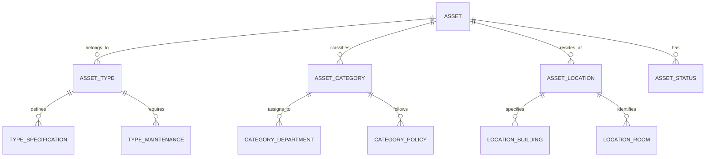
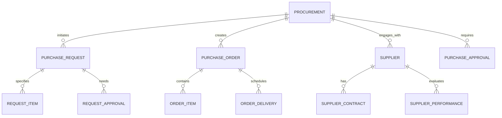
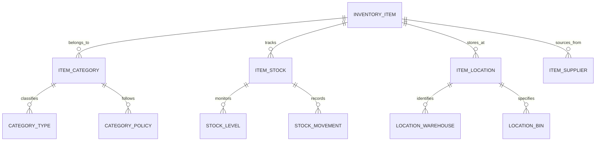
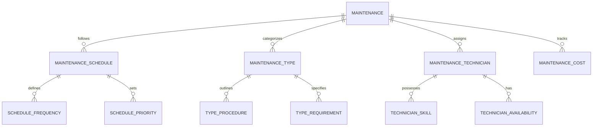
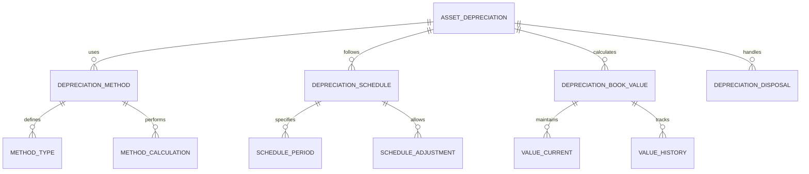
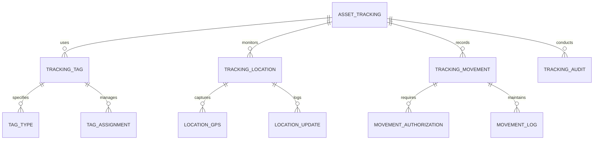
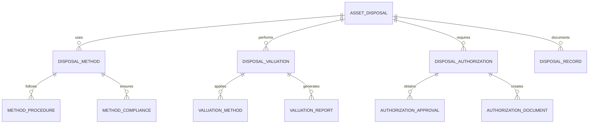

# Inventory & Asset Management Module - Entity Relationship Diagram

## Overview
This ER diagram illustrates the entities and relationships for comprehensive inventory and asset management, including procurement, tracking, maintenance, and depreciation management for educational institutions.

## Asset Classification & Management

## Procurement & Acquisition

## Inventory Tracking & Control

## Maintenance & Service Management

## Depreciation & Financial Management

## Asset Tracking & Audit

## Disposal & Retirement Management

## Entity Descriptions

### **ASSET**
**Purpose**: Core asset information and management
**Key Attributes**:
- `asset_id` (Primary Key)
- `school_id` (Foreign Key)
- `asset_tag` (Unique asset identifier)
- `asset_name`, `asset_description`
- `asset_type` (Fixed/Movable/Consumable)
- `purchase_date`, `purchase_cost`
- `warranty_period`, `warranty_expiry`
- `current_value`, `depreciation_rate`
- `location_id`, `assigned_to_department`
- `status` (Active/Inactive/Under Maintenance/Disposed)

### **INVENTORY_ITEM**
**Purpose**: Inventory item tracking and management
**Key Attributes**:
- `item_id` (Primary Key)
- `school_id` (Foreign Key)
- `item_code` (Unique item identifier)
- `item_name`, `item_description`
- `item_category` (Stationery/Equipment/Supplies)
- `unit_of_measure` (Pieces/Kg/Liters)
- `minimum_stock_level`, `maximum_stock_level`
- `reorder_point`, `reorder_quantity`
- `current_stock`, `reserved_stock`
- `unit_cost`, `total_value`

### **PROCUREMENT**
**Purpose**: Procurement process and vendor management
**Key Attributes**:
- `procurement_id` (Primary Key)
- `school_id` (Foreign Key)
- `procurement_type` (Asset/Inventory/Service)
- `request_date`, `approval_date`
- `total_estimated_cost`, `total_actual_cost`
- `procurement_status` (Requested/Approved/Ordered/Received)
- `requested_by`, `approved_by`
- `supplier_id`, `delivery_date`

### **MAINTENANCE**
**Purpose**: Asset and equipment maintenance management
**Key Attributes**:
- `maintenance_id` (Primary Key)
- `asset_id` (Foreign Key)
- `maintenance_type` (Preventive/Corrective/Predictive)
- `scheduled_date`, `actual_date`
- `maintenance_description`, `work_performed`
- `technician_id`, `technician_name`
- `parts_used`, `labor_cost`, `total_cost`
- `next_maintenance_date`, `maintenance_status`

### **ASSET_DEPRECIATION**
**Purpose**: Asset depreciation calculation and tracking
**Key Attributes**:
- `depreciation_id` (Primary Key)
- `asset_id` (Foreign Key)
- `depreciation_method` (Straight Line/Declining Balance)
- `depreciation_rate` (Annual depreciation percentage)
- `depreciation_period` (Useful life in years)
- `accumulated_depreciation`, `current_book_value`
- `depreciation_start_date`, `last_depreciation_date`
- `salvage_value`, `depreciation_status`

### **ASSET_TRACKING**
**Purpose**: Asset location and movement tracking
**Key Attributes**:
- `tracking_id` (Primary Key)
- `asset_id` (Foreign Key)
- `tracking_tag_id` (RFID/GPS/Barcode)
- `current_location`, `previous_location`
- `movement_date`, `movement_reason`
- `moved_by_person`, `authorized_by`
- `gps_coordinates`, `location_accuracy`
- `tracking_status` (Active/Inactive/Lost)

### **ASSET_DISPOSAL**
**Purpose**: Asset disposal and retirement management
**Key Attributes**:
- `disposal_id` (Primary Key)
- `asset_id` (Foreign Key)
- `disposal_date`, `disposal_reason`
- `disposal_method` (Sale/Scrap/Donation/Transfer)
- `disposal_value`, `book_value_at_disposal`
- `disposal_gain_loss` (Profit/Loss on disposal)
- `disposed_by`, `approved_by`
- `disposal_status` (Planned/Completed/Cancelled)

## Key Relationships

### **Asset Management**
- **ASSET → ASSET_TYPE**: One asset belongs to one type
- **ASSET → ASSET_CATEGORY**: One asset classifies into category
- **ASSET → ASSET_LOCATION**: One asset resides at location
- **ASSET → ASSET_STATUS**: One asset has status

### **Procurement Management**
- **PROCUREMENT → PURCHASE_REQUEST**: One procurement initiates request
- **PURCHASE_REQUEST → REQUEST_ITEM**: One request specifies items
- **PROCUREMENT → PURCHASE_ORDER**: One procurement creates order
- **PURCHASE_ORDER → ORDER_ITEM**: One order contains items

### **Inventory Management**
- **INVENTORY_ITEM → ITEM_CATEGORY**: One item belongs to category
- **INVENTORY_ITEM → ITEM_STOCK**: One item tracks stock
- **ITEM_STOCK → STOCK_LEVEL**: One stock monitors levels
- **ITEM_STOCK → STOCK_MOVEMENT**: One stock records movements

### **Maintenance Management**
- **MAINTENANCE → MAINTENANCE_SCHEDULE**: One maintenance follows schedule
- **MAINTENANCE → MAINTENANCE_TYPE**: One maintenance categorizes type
- **MAINTENANCE → MAINTENANCE_TECHNICIAN**: One maintenance assigns technician
- **MAINTENANCE_TECHNICIAN → TECHNICIAN_SKILL**: One technician possesses skills

### **Depreciation Management**
- **ASSET_DEPRECIATION → DEPRECIATION_METHOD**: One depreciation uses method
- **ASSET_DEPRECIATION → DEPRECIATION_SCHEDULE**: One depreciation follows schedule
- **DEPRECIATION_METHOD → METHOD_CALCULATION**: One method performs calculation
- **ASSET_DEPRECIATION → DEPRECIATION_BOOK_VALUE**: One depreciation calculates value

### **Asset Tracking**
- **ASSET_TRACKING → TRACKING_TAG**: One tracking uses tag
- **ASSET_TRACKING → TRACKING_LOCATION**: One tracking monitors location
- **TRACKING_LOCATION → LOCATION_GPS**: One location captures GPS
- **ASSET_TRACKING → TRACKING_MOVEMENT**: One tracking records movement

### **Disposal Management**
- **ASSET_DISPOSAL → DISPOSAL_METHOD**: One disposal uses method
- **ASSET_DISPOSAL → DISPOSAL_VALUATION**: One disposal performs valuation
- **DISPOSAL_VALUATION → VALUATION_METHOD**: One valuation applies method
- **ASSET_DISPOSAL → DISPOSAL_AUTHORIZATION**: One disposal requires authorization

## Business Rules & Validation

### **Asset Management Rules**
- **Unique Asset Tags**: Each asset must have unique identifier
- **Location Tracking**: Assets must have defined locations
- **Status Validation**: Asset status must follow defined workflow
- **Category Compliance**: Assets must belong to appropriate categories

### **Procurement Rules**
- **Approval Workflows**: Procurement requires multi-level approvals
- **Budget Compliance**: Procurement must stay within allocated budgets
- **Supplier Evaluation**: Suppliers must meet quality and delivery standards
- **Contract Compliance**: Procurement must follow supplier contracts

### **Inventory Rules**
- **Stock Level Monitoring**: Items must maintain minimum stock levels
- **Reorder Point Alerts**: Automatic alerts when items reach reorder points
- **First-In-First-Out**: Inventory management follows FIFO principle
- **Quality Control**: Incoming inventory must pass quality checks

### **Maintenance Rules**
- **Scheduled Maintenance**: Assets must follow preventive maintenance schedules
- **Emergency Maintenance**: Priority handling of critical maintenance issues
- **Documentation**: Complete documentation of all maintenance activities
- **Cost Tracking**: Maintenance costs must be tracked and budgeted

## Security & Compliance

### **Asset Security**
- **Access Control**: Physical and digital access control for assets
- **Theft Prevention**: Security measures to prevent asset theft
- **Insurance Coverage**: Adequate insurance for valuable assets
- **Audit Trails**: Complete audit trail for asset movements

### **Data Security**
- **Inventory Data Protection**: Secure storage of inventory information
- **Access Logging**: Monitoring of access to asset management system
- **Data Backup**: Regular backup of asset and inventory data
- **Disaster Recovery**: Recovery procedures for asset data loss

## Performance Considerations

### **Database Optimization**
- **Partitioning**: Asset data partitioned by category and location
- **Indexing**: Optimized indexes on frequently queried asset fields
- **Caching**: Asset location and status information cached
- **Archival**: Historical asset data moved to archival storage

### **Real-time Tracking**
- **Location Updates**: Real-time asset location monitoring
- **Status Monitoring**: Immediate status change notifications
- **Maintenance Alerts**: Automated maintenance schedule alerts
- **Inventory Alerts**: Real-time low stock and reorder alerts

### **Scalability Features**
- **Multi-location Support**: Support for multiple school locations
- **Load Balancing**: Distributed processing of asset operations
- **Auto-scaling**: Automatic scaling based on asset count
- **Integration**: Seamless integration with procurement and finance systems

## Implementation Guidelines

### **Asset Tracking System**
- **RFID Integration**: RFID tag integration for automated tracking
- **GPS Tracking**: GPS integration for mobile asset tracking
- **Barcode System**: Barcode integration for manual tracking
- **Mobile App**: Mobile application for asset scanning and updates

### **Inventory Management System**
- **Automated Reordering**: AI-powered inventory reordering system
- **Demand Forecasting**: Predictive analytics for inventory needs
- **Supplier Integration**: Direct integration with supplier systems
- **Quality Control**: Automated quality control and inspection processes

### **Maintenance Management**
- **Predictive Maintenance**: AI-powered predictive maintenance scheduling
- **IoT Integration**: Sensor integration for equipment monitoring
- **Work Order System**: Automated work order generation and tracking
- **Vendor Management**: Integration with maintenance service providers

### **Financial Integration**
- **Depreciation Calculation**: Automated depreciation calculations
- **Budget Tracking**: Integration with financial budgeting systems
- **Cost Center Allocation**: Asset cost allocation to departments
- **Tax Compliance**: Tax-related asset and inventory reporting

This ER diagram provides a comprehensive foundation for implementing a robust inventory and asset management system that supports procurement, tracking, maintenance, depreciation, and disposal management while ensuring security, compliance, and scalability.