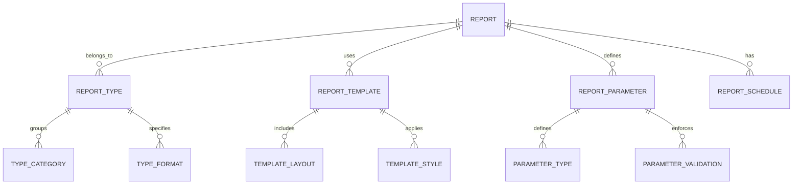
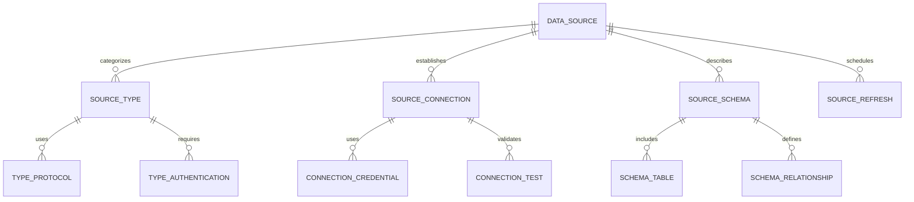
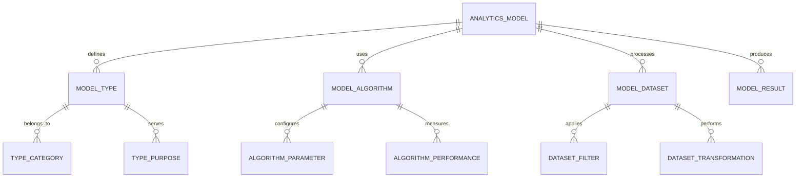
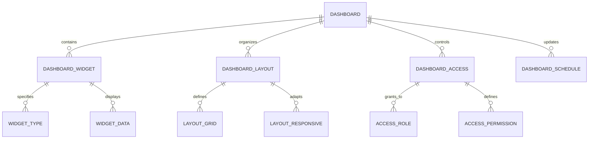
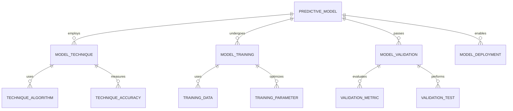
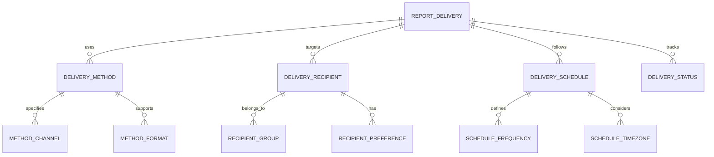
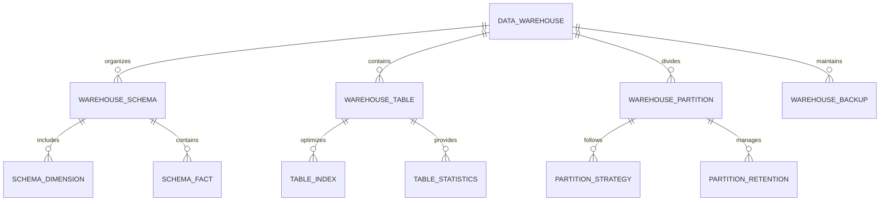

# Reports & Analytics Module - Entity Relationship Diagram

## Overview
This ER diagram illustrates the entities and relationships for comprehensive reporting and analytics capabilities, including data aggregation, visualization, predictive analytics, and automated report generation for educational institutions.

## Report Definition & Configuration

## Data Source & Aggregation

## Analytics & Metrics Calculation

## Dashboard & Visualization

## Predictive Analytics & Forecasting

## Report Distribution & Delivery

## Data Warehouse & ETL

## Entity Descriptions

### **REPORT**
**Purpose**: Report definition and configuration management
**Key Attributes**:
- `report_id` (Primary Key)
- `school_id` (Foreign Key)
- `report_name`, `report_description`
- `report_type` (Operational/Financial/Academic/Compliance)
- `report_category` (Standard/Custom/Ad-hoc)
- `report_format` (PDF/Excel/HTML/Dashboard)
- `created_by`, `created_date`
- `last_run_date`, `run_count`
- `status` (Active/Inactive/Draft)
- `access_level` (Public/Restricted/Private)

### **DATA_SOURCE**
**Purpose**: Data source connection and management
**Key Attributes**:
- `source_id` (Primary Key)
- `school_id` (Foreign Key)
- `source_name`, `source_description`
- `source_type` (Database/API/File/Web Service)
- `connection_string`, `authentication_method`
- `refresh_frequency` (Real-time/Hourly/Daily/Weekly)
- `last_refresh_date`, `refresh_status`
- `data_volume`, `record_count`
- `status` (Active/Inactive/Error)

### **ANALYTICS_MODEL**
**Purpose**: Analytics model definition and execution
**Key Attributes**:
- `model_id` (Primary Key)
- `school_id` (Foreign Key)
- `model_name`, `model_description`
- `model_type` (Descriptive/Predictive/Prescriptive)
- `algorithm_type` (Regression/Classification/Clustering)
- `training_status` (Not Started/Training/Completed/Failed)
- `accuracy_score`, `performance_metric`
- `last_trained_date`, `next_training_date`
- `created_by`, `created_date`

### **DASHBOARD**
**Purpose**: Dashboard configuration and management
**Key Attributes**:
- `dashboard_id` (Primary Key)
- `school_id` (Foreign Key)
- `dashboard_name`, `dashboard_description`
- `dashboard_category` (Executive/Operational/Departmental)
- `layout_type` (Grid/Flexible/Responsive)
- `refresh_interval` (Real-time/5min/15min/1hour)
- `created_by`, `created_date`
- `last_modified_date`, `view_count`
- `status` (Published/Draft/Archived)

### **PREDICTIVE_MODEL**
**Purpose**: Predictive analytics model management
**Key Attributes**:
- `predictive_id` (Primary Key)
- `school_id` (Foreign Key)
- `model_name`, `model_purpose`
- `prediction_type` (Student Performance/Enrollment/Revenue)
- `technique_used` (Machine Learning/Statistical/Time Series)
- `training_accuracy`, `validation_accuracy`
- `prediction_horizon` (Days/Weeks/Months)
- `last_prediction_date`, `next_prediction_date`
- `model_confidence`, `model_reliability`

### **REPORT_DELIVERY**
**Purpose**: Report distribution and delivery management
**Key Attributes**:
- `delivery_id` (Primary Key)
- `report_id` (Foreign Key)
- `delivery_method` (Email/FTP/SFTP/API/Webhook)
- `recipient_list`, `recipient_groups`
- `delivery_schedule` (Immediate/Daily/Weekly/Monthly)
- `delivery_format` (PDF/Excel/CSV/JSON)
- `last_delivery_date`, `next_delivery_date`
- `delivery_status` (Success/Failed/Pending)
- `retry_count`, `max_retries`

### **DATA_WAREHOUSE**
**Purpose**: Data warehouse schema and management
**Key Attributes**:
- `warehouse_id` (Primary Key)
- `school_id` (Foreign Key)
- `warehouse_name`, `warehouse_description`
- `database_type` (PostgreSQL/MySQL/Redshift/Snowflake)
- `storage_size_gb`, `record_count`
- `last_etl_date`, `etl_status`
- `backup_frequency`, `retention_period`
- `created_date`, `last_modified_date`

## Key Relationships

### **Report Management**
- **REPORT → REPORT_TYPE**: One report belongs to one type
- **REPORT → REPORT_TEMPLATE**: One report uses one template
- **REPORT → REPORT_PARAMETER**: One report defines parameters
- **REPORT → REPORT_SCHEDULE**: One report has schedule

### **Data Management**
- **DATA_SOURCE → SOURCE_TYPE**: One source categorizes type
- **DATA_SOURCE → SOURCE_CONNECTION**: One source establishes connection
- **SOURCE_CONNECTION → CONNECTION_CREDENTIAL**: One connection uses credentials
- **DATA_SOURCE → SOURCE_SCHEMA**: One source describes schema

### **Analytics Management**
- **ANALYTICS_MODEL → MODEL_TYPE**: One model defines type
- **ANALYTICS_MODEL → MODEL_ALGORITHM**: One model uses algorithm
- **MODEL_ALGORITHM → ALGORITHM_PARAMETER**: One algorithm configures parameters
- **ANALYTICS_MODEL → MODEL_RESULT**: One model produces results

### **Dashboard Management**
- **DASHBOARD → DASHBOARD_WIDGET**: One dashboard contains widgets
- **DASHBOARD → DASHBOARD_LAYOUT**: One dashboard organizes layout
- **DASHBOARD_WIDGET → WIDGET_TYPE**: One widget specifies type
- **DASHBOARD → DASHBOARD_ACCESS**: One dashboard controls access

### **Predictive Analytics**
- **PREDICTIVE_MODEL → MODEL_TECHNIQUE**: One model employs technique
- **PREDICTIVE_MODEL → MODEL_TRAINING**: One model undergoes training
- **MODEL_TRAINING → TRAINING_DATA**: One training uses data
- **PREDICTIVE_MODEL → MODEL_DEPLOYMENT**: One model enables deployment

### **Report Delivery**
- **REPORT_DELIVERY → DELIVERY_METHOD**: One delivery uses method
- **REPORT_DELIVERY → DELIVERY_RECIPIENT**: One delivery targets recipients
- **DELIVERY_METHOD → METHOD_CHANNEL**: One method specifies channel
- **REPORT_DELIVERY → DELIVERY_STATUS**: One delivery tracks status

### **Data Warehouse**
- **DATA_WAREHOUSE → WAREHOUSE_SCHEMA**: One warehouse organizes schema
- **DATA_WAREHOUSE → WAREHOUSE_TABLE**: One warehouse contains tables
- **WAREHOUSE_SCHEMA → SCHEMA_DIMENSION**: One schema includes dimensions
- **WAREHOUSE_TABLE → TABLE_INDEX**: One table optimizes with indexes

## Business Rules & Validation

### **Report Management Rules**
- **Access Control**: Reports must have appropriate access controls
- **Data Accuracy**: Reports must use validated and accurate data
- **Performance Standards**: Reports must meet performance requirements
- **Version Control**: Report versions must be tracked and managed

### **Data Source Rules**
- **Connection Security**: Data sources must use secure connections
- **Data Quality**: Data sources must provide quality and consistent data
- **Refresh Frequency**: Data sources must have appropriate refresh schedules
- **Error Handling**: Data source failures must have proper error handling

### **Analytics Rules**
- **Model Validation**: Analytics models must be validated and tested
- **Data Privacy**: Analytics must comply with data privacy regulations
- **Ethical Use**: Analytics must be used ethically and responsibly
- **Performance Monitoring**: Analytics models must be monitored for performance

## Security & Compliance

### **Data Security**
- **Encryption**: Data in transit and at rest must be encrypted
- **Access Control**: Role-based access to reports and analytics
- **Audit Trails**: Complete audit trail for all data access and modifications
- **Data Masking**: Sensitive data must be masked in reports

### **Compliance Requirements**
- **GDPR Compliance**: Data processing must comply with privacy regulations
- **Data Retention**: Reports and analytics data must follow retention policies
- **Regulatory Reporting**: Support for regulatory and compliance reporting
- **Data Sovereignty**: Data must comply with local data sovereignty laws

## Performance Considerations

### **Database Optimization**
- **Partitioning**: Analytics data partitioned by time and school
- **Indexing**: Optimized indexes on frequently queried analytics fields
- **Caching**: Report results and dashboard data cached for performance
- **Archival**: Historical analytics data moved to archival storage

### **Processing Optimization**
- **ETL Optimization**: Efficient Extract, Transform, Load processes
- **Parallel Processing**: Concurrent processing of multiple reports
- **Query Optimization**: Optimized queries for large datasets
- **Resource Management**: Efficient use of computing resources

### **Scalability Features**
- **Horizontal Scaling**: Database sharding by school and data type
- **Load Balancing**: Distributed processing of analytics workloads
- **Auto-scaling**: Automatic scaling based on processing demands
- **Cloud Integration**: Integration with cloud analytics services

## Implementation Guidelines

### **Business Intelligence Platform**
- **Data Integration**: Seamless integration with multiple data sources
- **Real-time Analytics**: Support for real-time data processing and analytics
- **Self-service Analytics**: User-friendly tools for ad-hoc analysis
- **Mobile Analytics**: Mobile-optimized dashboards and reports

### **Advanced Analytics**
- **Machine Learning**: Integration with machine learning platforms
- **Predictive Modeling**: Advanced predictive analytics capabilities
- **Natural Language Processing**: NLP for query and report generation
- **Computer Vision**: Image and video analytics for security and monitoring

### **API Integration**
- **RESTful APIs**: Standard APIs for report generation and data access
- **Webhook Support**: Real-time notifications for report completion
- **Bulk Operations**: Efficient handling of bulk report generation
- **Third-party Integration**: APIs for external BI and analytics tools

### **Data Governance**
- **Data Quality**: Automated data quality checks and validation
- **Metadata Management**: Comprehensive metadata for all data assets
- **Data Lineage**: Tracking of data from source to report
- **Data Catalog**: Centralized catalog of all data assets and reports

This ER diagram provides a comprehensive foundation for implementing a robust reports and analytics system that supports data integration, advanced analytics, predictive modeling, and comprehensive reporting while ensuring security, compliance, and scalability.