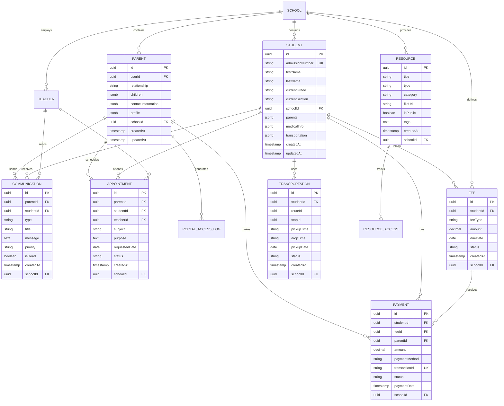

# Parent Portal Architecture Diagram

## System Architecture Overview


## Module Structure


## Database Schema Relationships



## API Endpoint Architecture

```mermaid
graph LR
    subgraph "Dashboard Endpoints"
        GET_DASH[/dashboard/:parentId]
        GET_CHILD_DASH[/dashboard/:parentId/child/:studentId]
        GET_NOTIF[/dashboard/:parentId/notifications]
    end

    subgraph "Academic Endpoints"
        GET_GRADES[/academic/:parentId/grades]
        GET_ATTENDANCE[/academic/:parentId/attendance]
        GET_ASSIGNMENTS[/academic/:parentId/assignments]
        GET_TIMETABLE[/academic/:parentId/timetable]
    end

    subgraph "Communication Endpoints"
        GET_COMM[/communication/:parentId]
        POST_COMM[/communication]
        PUT_COMM_READ[/communication/:id/read]
        POST_COMM_RESP[/communication/:id/response]
    end

    subgraph "Appointment Endpoints"
        GET_APPT[/appointment/:parentId]
        POST_APPT[/appointment]
        PUT_APPT[/appointment/:id]
        DELETE_APPT[/appointment/:id]
    end

    subgraph "Financial Endpoints"
        GET_FEES[/fee/:parentId]
        POST_PAYMENT[/payment]
        GET_PAYMENTS[/payment/:parentId]
        GET_RECEIPT[/payment/:id/receipt]
    end

    subgraph "Transportation Endpoints"
        GET_TRANSPORT[/transportation/:parentId]
        POST_TRACK[/transportation/:id/track]
        GET_ROUTES[/transportation/routes]
    end

    subgraph "Resource Endpoints"
        GET_RESOURCES[/resource/:parentId]
        GET_SEARCH[/resource/:parentId/search]
        GET_DOWNLOAD[/resource/:id/download]
    end
```

## Security Architecture


## Integration Points


## Data Flow Architecture


This comprehensive architecture provides a scalable, secure, and maintainable foundation for the Parent Portal module, ensuring all requirements are met while following best practices for enterprise-level applications.