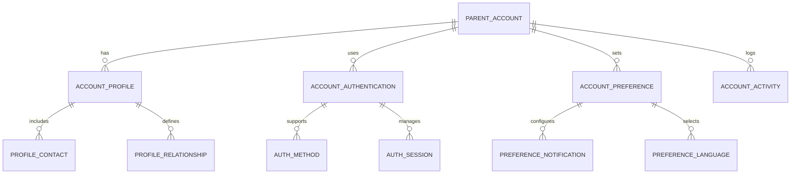
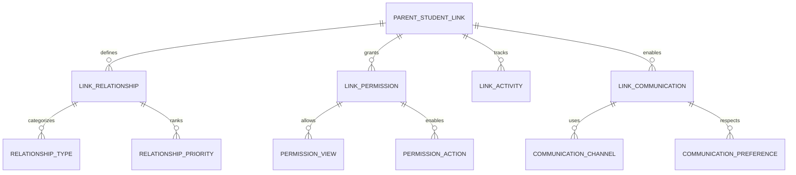
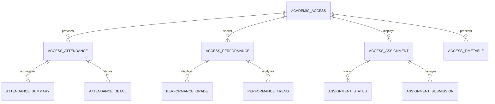
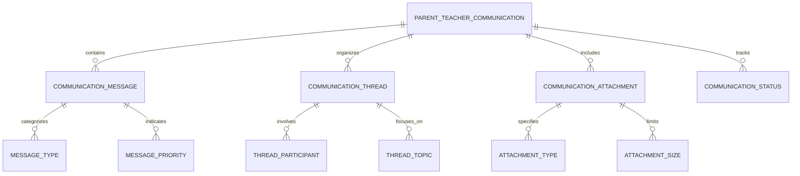
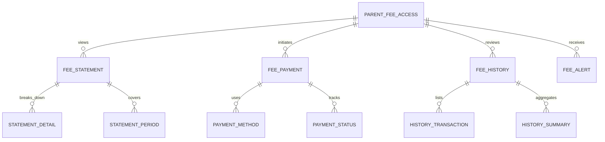
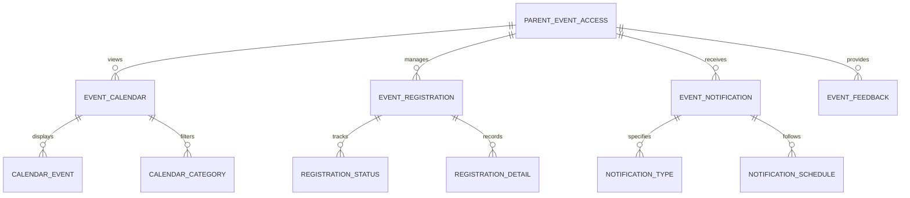
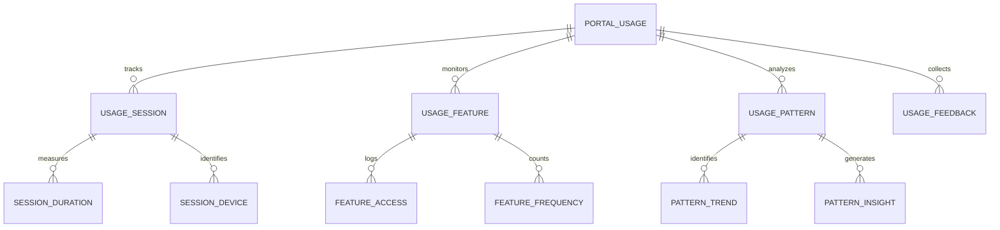

# Parent Portal - Entity Relationship Diagram

## Overview
This ER diagram illustrates the entities and relationships for the parent portal, providing parents with comprehensive access to their child's academic information, communication tools, and school engagement features.

## Parent Account & Authentication

## Student-Parent Relationship Management

## Academic Information Access

## Communication & Messaging

## Fee & Payment Management

## Event & Activity Participation

## Portal Analytics & Usage Tracking

## Entity Descriptions

### **PARENT_ACCOUNT**
**Purpose**: Parent account management and authentication
**Key Attributes**:
- `parent_id` (Primary Key)
- `school_id` (Foreign Key)
- `email_address` (Primary login identifier)
- `phone_number` (Alternative contact)
- `account_status` (Active/Inactive/Suspended)
- `registration_date`, `last_login_date`
- `password_hash`, `password_reset_token`
- `two_factor_enabled`, `two_factor_method`
- `preferred_language`, `timezone`

### **PARENT_STUDENT_LINK**
**Purpose**: Relationship between parents and their children
**Key Attributes**:
- `link_id` (Primary Key)
- `parent_id` (Foreign Key)
- `student_id` (Foreign Key)
- `relationship_type` (Father/Mother/Guardian/Legal Custodian)
- `is_primary_contact` (Primary emergency contact)
- `contact_priority` (1st/2nd/3rd contact)
- `communication_preference` (Email/SMS/Phone)
- `consent_given` (Data sharing consent)
- `link_status` (Active/Inactive)

### **ACADEMIC_ACCESS**
**Purpose**: Parent access to student's academic information
**Key Attributes**:
- `access_id` (Primary Key)
- `parent_id` (Foreign Key)
- `student_id` (Foreign Key)
- `access_level` (Full/Limited/Restricted)
- `last_access_date`, `access_count`
- `restricted_subjects` (If any restrictions)
- `emergency_access` (Emergency override access)
- `access_log_enabled` (Audit trail enabled)

### **PARENT_TEACHER_COMMUNICATION**
**Purpose**: Communication between parents and teachers
**Key Attributes**:
- `communication_id` (Primary Key)
- `parent_id` (Foreign Key)
- `teacher_id` (Foreign Key)
- `student_id` (Foreign Key)
- `subject`, `message_content`
- `communication_type` (Email/Chat/Voice)
- `priority` (Normal/Urgent/Emergency)
- `status` (Sent/Delivered/Read/Replied)
- `sent_date`, `delivered_date`, `read_date`

### **PARENT_FEE_ACCESS**
**Purpose**: Parent access to fee and payment information
**Key Attributes**:
- `fee_access_id` (Primary Key)
- `parent_id` (Foreign Key)
- `student_id` (Foreign Key)
- `view_fee_statement` (Permission to view)
- `initiate_payment` (Permission to pay)
- `payment_limit` (Maximum payment amount)
- `last_fee_check_date`, `fee_alerts_enabled`
- `payment_history_access` (Access to payment history)

### **PARENT_EVENT_ACCESS**
**Purpose**: Parent access to school events and activities
**Key Attributes**:
- `event_access_id` (Primary Key)
- `parent_id` (Foreign Key)
- `student_id` (Foreign Key)
- `calendar_view` (Permission to view calendar)
- `event_registration` (Permission to register)
- `event_notification` (Receive notifications)
- `event_categories` (Interested categories)
- `last_calendar_view`, `notification_preferences`

### **PORTAL_USAGE**
**Purpose**: Parent portal usage tracking and analytics
**Key Attributes**:
- `usage_id` (Primary Key)
- `parent_id` (Foreign Key)
- `session_start`, `session_end`
- `device_type`, `browser_info`, `ip_address`
- `pages_viewed`, `features_used`
- `time_spent_minutes`, `actions_performed`
- `session_rating` (User satisfaction)
- `feedback_provided` (User feedback)

## Key Relationships

### **Account Management**
- **PARENT_ACCOUNT → ACCOUNT_PROFILE**: One account has one profile
- **PARENT_ACCOUNT → ACCOUNT_AUTHENTICATION**: One account uses authentication
- **ACCOUNT_AUTHENTICATION → AUTH_METHOD**: One authentication supports methods
- **PARENT_ACCOUNT → ACCOUNT_PREFERENCE**: One account sets preferences

### **Student-Parent Relationship**
- **PARENT_STUDENT_LINK → LINK_RELATIONSHIP**: One link defines relationship
- **PARENT_STUDENT_LINK → LINK_PERMISSION**: One link grants permissions
- **LINK_RELATIONSHIP → RELATIONSHIP_TYPE**: One relationship categorizes type
- **LINK_PERMISSION → PERMISSION_VIEW**: One permission allows views

### **Academic Information Access**
- **ACADEMIC_ACCESS → ACCESS_ATTENDANCE**: One access provides attendance
- **ACADEMIC_ACCESS → ACCESS_PERFORMANCE**: One access shows performance
- **ACCESS_ATTENDANCE → ATTENDANCE_SUMMARY**: One attendance aggregates summary
- **ACCESS_PERFORMANCE → PERFORMANCE_GRADE**: One performance displays grades

### **Communication Management**
- **PARENT_TEACHER_COMMUNICATION → COMMUNICATION_MESSAGE**: One communication contains messages
- **COMMUNICATION_MESSAGE → MESSAGE_TYPE**: One message categorizes type
- **PARENT_TEACHER_COMMUNICATION → COMMUNICATION_THREAD**: One communication organizes threads
- **COMMUNICATION_THREAD → THREAD_PARTICIPANT**: One thread involves participants

### **Fee & Payment Management**
- **PARENT_FEE_ACCESS → FEE_STATEMENT**: One access views statements
- **PARENT_FEE_ACCESS → FEE_PAYMENT**: One access initiates payments
- **FEE_STATEMENT → STATEMENT_DETAIL**: One statement breaks down details
- **FEE_PAYMENT → PAYMENT_METHOD**: One payment uses method

### **Event Participation**
- **PARENT_EVENT_ACCESS → EVENT_CALENDAR**: One access views calendar
- **PARENT_EVENT_ACCESS → EVENT_REGISTRATION**: One access manages registration
- **EVENT_CALENDAR → CALENDAR_EVENT**: One calendar displays events
- **EVENT_REGISTRATION → REGISTRATION_STATUS**: One registration tracks status

### **Usage Analytics**
- **PORTAL_USAGE → USAGE_SESSION**: One usage tracks sessions
- **PORTAL_USAGE → USAGE_FEATURE**: One usage monitors features
- **USAGE_SESSION → SESSION_DURATION**: One session measures duration
- **USAGE_FEATURE → FEATURE_ACCESS**: One feature logs access

## Business Rules & Validation

### **Account Management Rules**
- **Unique Email**: Each parent account must have unique email
- **Student Verification**: Parent-student relationship must be verified
- **Age Verification**: Parents must meet minimum age requirements
- **Contact Validation**: Contact information must be valid and current

### **Access Control Rules**
- **Relationship Verification**: Only verified parents can access student information
- **Permission Levels**: Different access levels based on relationship type
- **Data Privacy**: Student data access must comply with privacy regulations
- **Emergency Access**: Emergency override access for critical situations

### **Communication Rules**
- **Appropriate Content**: Communications must follow school communication guidelines
- **Response Time**: Teachers must respond within defined timeframes
- **Confidentiality**: Communications must maintain student confidentiality
- **Record Keeping**: All communications must be logged and archived

### **Payment Rules**
- **Payment Limits**: Parents may have payment limits based on account settings
- **Payment Methods**: Only approved payment methods can be used
- **Payment Verification**: All payments must be verified and confirmed
- **Refund Policy**: Clear refund policies and procedures

## Security & Compliance

### **Data Privacy**
- **GDPR Compliance**: Parent data processing must comply with privacy regulations
- **Student Data Protection**: Student information must be protected from unauthorized access
- **Data Encryption**: All data transmissions must be encrypted
- **Access Logging**: All parent portal access must be logged

### **Authentication Security**
- **Multi-factor Authentication**: Strong authentication for sensitive operations
- **Session Management**: Secure session handling with automatic timeouts
- **Password Policies**: Strong password requirements and regular updates
- **Account Recovery**: Secure account recovery procedures

## Performance Considerations

### **Database Optimization**
- **Partitioning**: Parent data partitioned by school and account status
- **Indexing**: Optimized indexes on frequently queried parent fields
- **Caching**: Parent profile and student information cached
- **Archival**: Historical parent activity data archived

### **Real-time Features**
- **Live Updates**: Real-time updates for attendance and grades
- **Instant Notifications**: Push notifications for important events
- **Live Chat**: Real-time communication with teachers
- **Emergency Alerts**: Instant emergency notifications

### **Scalability Features**
- **Horizontal Scaling**: Database sharding by school and geographic region
- **Load Balancing**: Distributed processing of parent portal requests
- **CDN Integration**: Fast delivery of portal content
- **Auto-scaling**: Automatic scaling based on usage patterns

## Implementation Guidelines

### **User Interface Design**
- **Mobile-First**: Responsive design optimized for mobile devices
- **Intuitive Navigation**: Easy-to-use navigation and search features
- **Personalization**: Customized dashboard based on user preferences
- **Accessibility**: WCAG compliance for accessibility standards

### **Integration Points**
- **School Systems**: Seamless integration with school management systems
- **Payment Gateways**: Secure integration with payment processing systems
- **Communication Platforms**: Integration with SMS and email services
- **Calendar Systems**: Integration with calendar and scheduling systems

### **Notification System**
- **Multi-channel**: Support for SMS, email, push notifications
- **Personalization**: Customized notifications based on preferences
- **Scheduling**: Time-based notification delivery
- **Analytics**: Notification effectiveness tracking

### **Self-Service Features**
- **Online Payments**: Secure online fee payment capabilities
- **Document Access**: Digital access to student documents and reports
- **Appointment Booking**: Online appointment scheduling with teachers
- **Feedback System**: Parent feedback collection and analysis

This ER diagram provides a comprehensive foundation for implementing a robust parent portal that enables effective parent-school communication, academic monitoring, fee management, and active participation in school activities while ensuring security, privacy, and user satisfaction.