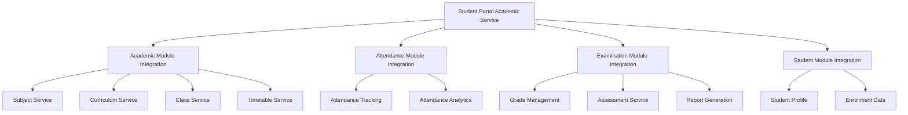
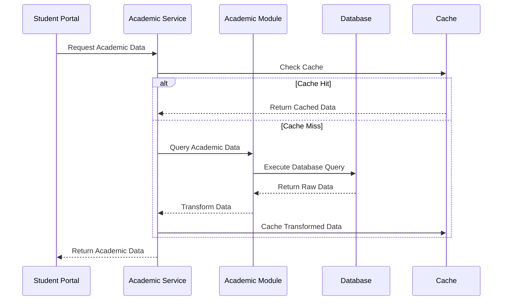
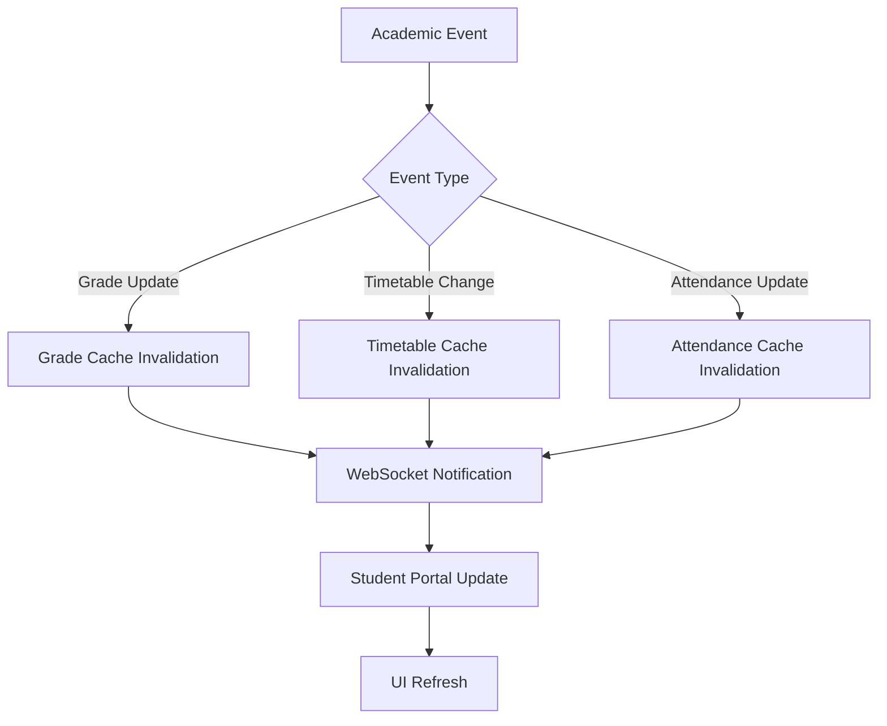
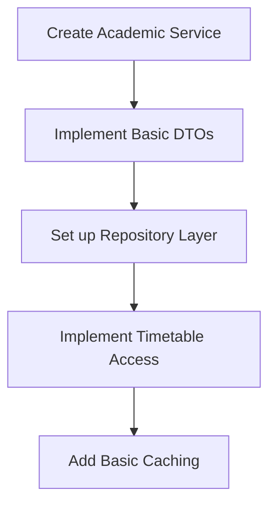
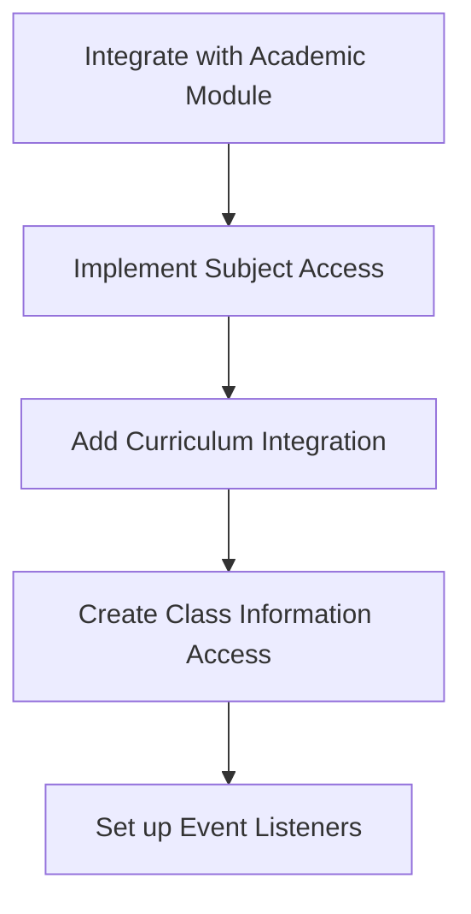
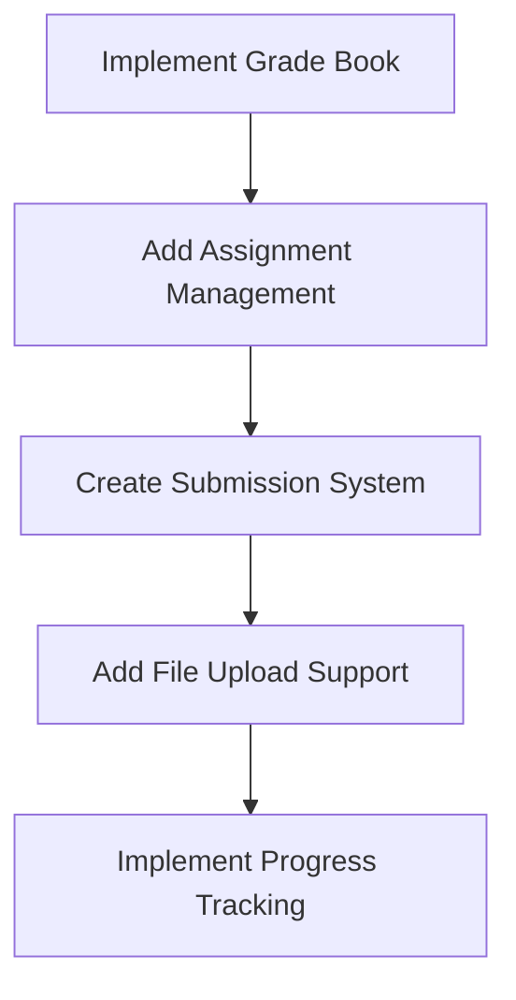
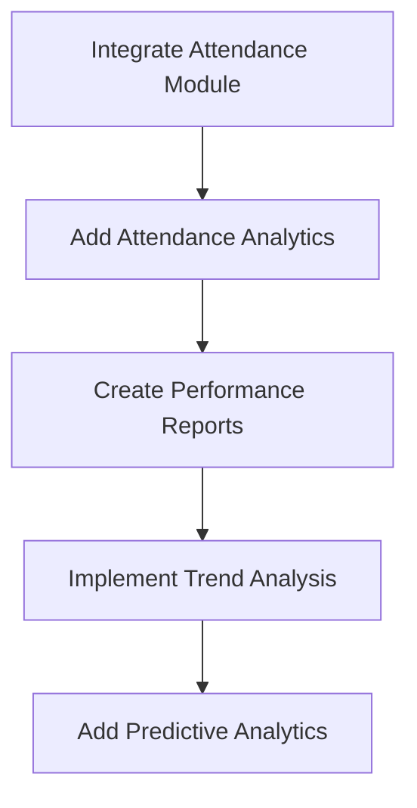
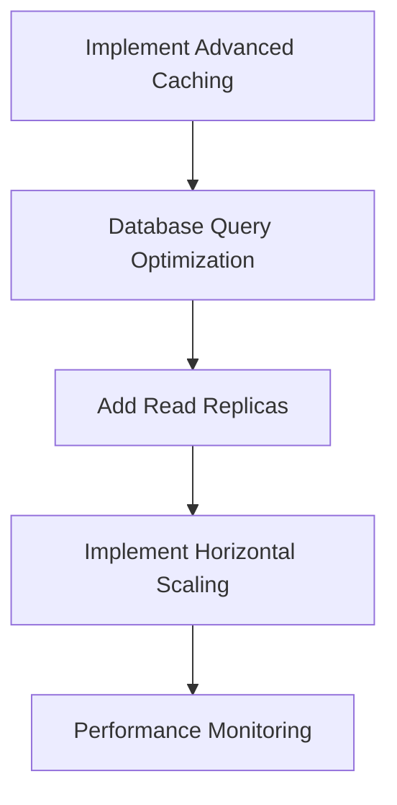
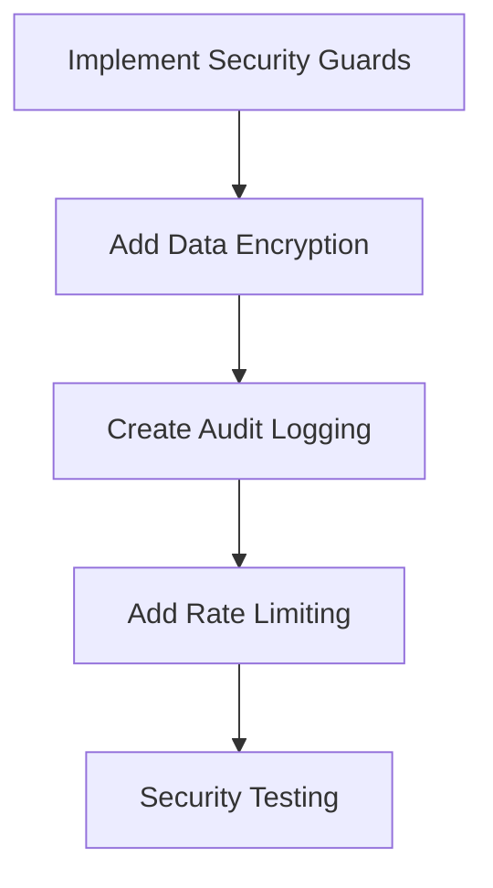
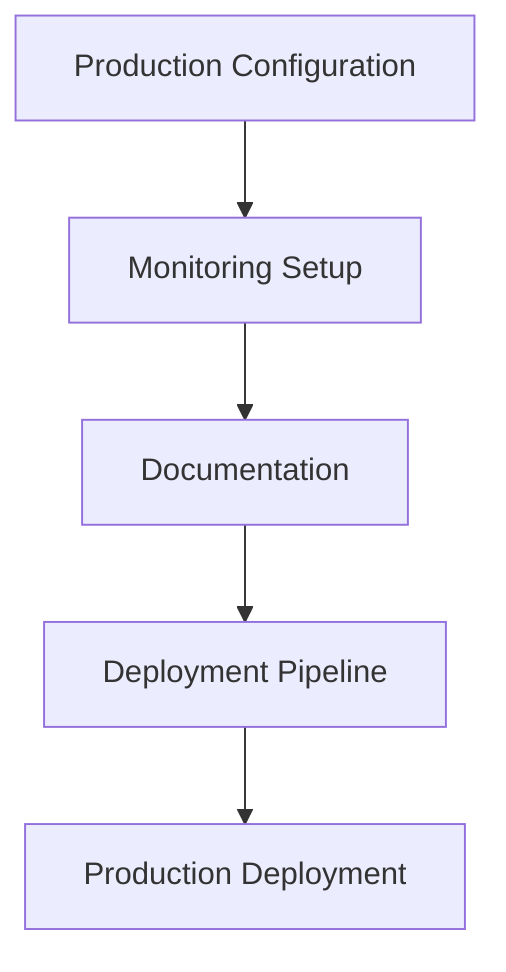

# Academic Service Integration Design for Student Portal

## Executive Summary

This document presents a comprehensive design for the Academic Service integration within the Student Portal module. The Academic Service will provide students with secure, real-time access to their academic information including grades, attendance, assignments, and timetable data. The design leverages the existing Academic Management module while implementing proper security, performance optimization, and seamless integration.

## Table of Contents
1. [Service Architecture](#service-architecture)
2. [Integration Points](#integration-points)
3. [Data Flow Design](#data-flow-design)
4. [API Design](#api-design)
5. [Security Considerations](#security-considerations)
6. [Performance Optimization](#performance-optimization)
7. [Implementation Roadmap](#implementation-roadmap)

---

## Service Architecture

### 1. Core Service Components

```typescript
// server/src/student-portal/services/academic.service.ts
@Injectable()
export class StudentPortalAcademicService {
  constructor(
    private academicService: AcademicService,
    private studentService: StudentsService,
    private attendanceService: AttendanceService, // Future integration
    private examinationService: ExaminationService, // Future integration
    private dataSource: DataSource,
    private cacheManager: Cache,
    private logger: Logger,
  ) {}

  // Core methods for academic data access
  async getStudentTimetable(studentId: string, date?: Date): Promise<TimetableResponse>
  async getStudentGrades(studentId: string, termId?: string): Promise<GradeBookResponse>
  async getStudentAssignments(studentId: string, status?: string): Promise<AssignmentsResponse>
  async getAttendanceRecords(studentId: string, dateRange?: DateRange): Promise<AttendanceResponse>
  async getAcademicProgress(studentId: string): Promise<AcademicProgressResponse>
  async getCourseMaterials(studentId: string, subjectId?: string): Promise<CourseMaterialsResponse>
}
```

### 2. Service Layer Architecture



### 3. Data Access Patterns

#### Repository Pattern Implementation
```typescript
export class AcademicDataRepository {
  constructor(
    @InjectRepository(Student) private studentRepo: Repository<Student>,
    @InjectRepository(Class) private classRepo: Repository<Class>,
    @InjectRepository(Subject) private subjectRepo: Repository<Subject>,
    @InjectRepository(Curriculum) private curriculumRepo: Repository<Curriculum>,
  ) {}

  async getStudentAcademicProfile(studentId: string): Promise<StudentAcademicProfile> {
    // Complex query joining multiple tables
    return this.studentRepo
      .createQueryBuilder('student')
      .leftJoinAndSelect('student.class', 'class')
      .leftJoinAndSelect('class.subjects', 'classSubject')
      .leftJoinAndSelect('classSubject.subject', 'subject')
      .where('student.id = :studentId', { studentId })
      .getOne();
  }
}
```

---

## Integration Points

### 1. Academic Module Integration

#### Current Academic Module Structure
- **Subjects**: Core, elective, practical, language subjects
- **Curriculum**: Grade-wise learning objectives and subject mapping
- **Classes**: Section-wise student grouping and teacher assignments
- **Timetable**: Subject scheduling and resource allocation

#### Integration Interfaces
```typescript
export interface IAcademicIntegration {
  // Timetable access
  getStudentTimetable(studentId: string, date: Date): Promise<ITimetableEntry[]>;
  getWeeklyTimetable(studentId: string, weekStart: Date): Promise<IWeeklyTimetable>;

  // Subject and curriculum access
  getStudentSubjects(studentId: string): Promise<ISubject[]>;
  getSubjectCurriculum(subjectId: string): Promise<ICurriculum>;
  getLearningObjectives(subjectId: string, gradeLevel: string): Promise<ILearningObjective[]>;

  // Class information
  getStudentClassInfo(studentId: string): Promise<IClassInfo>;
  getClassTeacher(subjectId: string, classId: string): Promise<ITeacherInfo>;
}
```

### 2. Future Module Integrations

#### Attendance Module (Planned)
```typescript
export interface IAttendanceIntegration {
  getStudentAttendance(studentId: string, dateRange: IDateRange): Promise<IAttendanceRecord[]>;
  getAttendanceSummary(studentId: string, period: string): Promise<IAttendanceSummary>;
  getAttendancePatterns(studentId: string): Promise<IAttendancePattern>;
}
```

#### Examination & Assessment Module (Planned)
```typescript
export interface IExaminationIntegration {
  getStudentGrades(studentId: string, termId?: string): Promise<IGradeBook>;
  getGradeTrends(studentId: string, subjectId?: string): Promise<IGradeTrend[]>;
  getUpcomingExams(studentId: string): Promise<IExam[]>;
  getAssignmentSubmissions(studentId: string): Promise<IAssignmentSubmission[]>;
}
```

### 3. Data Synchronization Strategy

#### Event-Driven Synchronization
```typescript
export class AcademicDataSynchronizer {
  @OnEvent('student.enrolled')
  async syncStudentEnrollment(@Payload() data: StudentEnrollmentEvent) {
    // Update student academic profile
    await this.updateStudentAcademicProfile(data.studentId);
  }

  @OnEvent('grade.updated')
  async syncGradeUpdate(@Payload() data: GradeUpdateEvent) {
    // Update grade cache and notify student
    await this.invalidateGradeCache(data.studentId);
    await this.notifyGradeUpdate(data);
  }

  @OnEvent('timetable.changed')
  async syncTimetableChange(@Payload() data: TimetableChangeEvent) {
    // Update timetable cache
    await this.invalidateTimetableCache(data.classId);
  }
}
```

---

## Data Flow Design

### 1. Student Data Access Flow



### 2. Real-time Data Updates



### 3. Data Aggregation Strategy

#### Multi-Source Data Aggregation
```typescript
export class AcademicDataAggregator {
  async getStudentDashboardData(studentId: string): Promise<StudentDashboardData> {
    const [timetable, grades, attendance, assignments] = await Promise.all([
      this.getTimetableData(studentId),
      this.getGradeData(studentId),
      this.getAttendanceData(studentId),
      this.getAssignmentData(studentId),
    ]);

    return {
      timetable,
      grades,
      attendance,
      assignments,
      lastUpdated: new Date(),
      dataFreshness: this.calculateDataFreshness([timetable, grades, attendance, assignments]),
    };
  }

  private calculateDataFreshness(dataSources: any[]): DataFreshness {
    // Calculate overall data freshness based on individual source timestamps
    const timestamps = dataSources.map(ds => ds.lastUpdated).filter(Boolean);
    const oldest = Math.min(...timestamps.map(t => t.getTime()));
    const newest = Math.max(...timestamps.map(t => t.getTime()));

    return {
      oldestData: new Date(oldest),
      newestData: new Date(newest),
      freshnessScore: this.calculateFreshnessScore(oldest, newest),
    };
  }
}
```

---

## API Design

### 1. RESTful API Endpoints

#### Timetable Endpoints
```typescript
// GET /api/student-portal/academic/timetable
export interface ITimetableRequest {
  date?: string; // ISO date string
  weekView?: boolean;
  includeSubstitutions?: boolean;
}

// GET /api/student-portal/academic/timetable/upcoming
export interface IUpcomingClassesRequest {
  limit?: number;
  includeDetails?: boolean;
}
```

#### Grade Book Endpoints
```typescript
// GET /api/student-portal/academic/grades
export interface IGradeBookRequest {
  termId?: string;
  subjectId?: string;
  includeTrends?: boolean;
  includeRankings?: boolean;
}

// GET /api/student-portal/academic/grades/subject/{subjectId}
export interface ISubjectGradesRequest {
  termId?: string;
  includeBreakdown?: boolean;
}
```

#### Attendance Endpoints
```typescript
// GET /api/student-portal/academic/attendance
export interface IAttendanceRequest {
  startDate?: string;
  endDate?: string;
  subjectId?: string;
  includePatterns?: boolean;
}

// GET /api/student-portal/academic/attendance/summary
export interface IAttendanceSummaryRequest {
  period?: 'week' | 'month' | 'term' | 'year';
}
```

#### Assignment Endpoints
```typescript
// GET /api/student-portal/academic/assignments
export interface IAssignmentsRequest {
  status?: 'pending' | 'completed' | 'overdue' | 'all';
  subjectId?: string;
  priority?: 'high' | 'medium' | 'low';
  dueDateFilter?: 'today' | 'week' | 'month';
}

// POST /api/student-portal/academic/assignments/{id}/submit
export interface IAssignmentSubmissionRequest {
  content?: string;
  files?: IFileUpload[];
  answers?: Record<string, any>;
  submissionType: 'draft' | 'final';
}
```

### 2. Response Data Structures

#### Comprehensive Response Interfaces
```typescript
export interface ITimetableResponse {
  entries: ITimetableEntry[];
  date: string;
  weekView?: ITimetableEntry[][];
  substitutions?: ISubstitution[];
  lastUpdated: Date;
}

export interface IGradeBookResponse {
  subjects: ISubjectGrade[];
  overall: IOverallGrade;
  trends: IGradeTrend[];
  rankings?: IClassRanking;
  termInfo: ITermInfo;
  lastUpdated: Date;
}

export interface IAttendanceResponse {
  records: IAttendanceRecord[];
  summary: IAttendanceSummary;
  patterns?: IAttendancePattern;
  dateRange: IDateRange;
  lastUpdated: Date;
}

export interface IAcademicProgressResponse {
  overallProgress: IProgressSummary;
  subjectProgress: Record<string, ISubjectProgress>;
  achievements: IAchievement[];
  recommendations: ILearningRecommendation[];
  goals: ILearningGoal[];
  lastUpdated: Date;
}
```

### 3. WebSocket Integration

#### Real-time Updates
```typescript
export interface IRealtimeAcademicEvents {
  'grade.updated': IGradeUpdateEvent;
  'attendance.marked': IAttendanceUpdateEvent;
  'assignment.due': IAssignmentDueEvent;
  'timetable.changed': ITimetableChangeEvent;
  'achievement.unlocked': IAchievementEvent;
}

export interface IGradeUpdateEvent {
  studentId: string;
  subjectId: string;
  grade: IGradeInfo;
  timestamp: Date;
  notification: INotificationData;
}
```

---

## Security Considerations

### 1. Data Access Control

#### Role-Based Access Control (RBAC)
```typescript
export enum StudentPortalPermission {
  VIEW_OWN_GRADES = 'view_own_grades',
  VIEW_OWN_ATTENDANCE = 'view_own_attendance',
  VIEW_OWN_TIMETABLE = 'view_own_timetable',
  VIEW_OWN_ASSIGNMENTS = 'view_own_assignments',
  SUBMIT_ASSIGNMENTS = 'submit_assignments',
  VIEW_PARENT_SHARED_DATA = 'view_parent_shared_data',
}

export class AcademicDataGuard implements CanActivate {
  canActivate(context: ExecutionContext): boolean {
    const request = context.switchToHttp().getRequest();
    const studentId = request.params.studentId;
    const user = request.user;

    // Ensure student can only access their own data
    if (user.role === 'student' && user.studentId !== studentId) {
      return false;
    }

    // Parent access control
    if (user.role === 'parent') {
      return this.checkParentAccess(user.userId, studentId);
    }

    return true;
  }
}
```

### 2. Data Privacy and Encryption

#### Field-Level Encryption
```typescript
export class AcademicDataEncryption {
  // Encrypt sensitive grade information
  async encryptGradeData(gradeData: IGradeInfo): Promise<IEncryptedGrade> {
    const encryptedScore = await this.encryptField(gradeData.score);
    const encryptedFeedback = await this.encryptField(gradeData.feedback);

    return {
      ...gradeData,
      encryptedScore,
      encryptedFeedback,
      encryptionKeyId: this.currentKeyId,
    };
  }

  // Decrypt data for authorized access
  async decryptGradeData(encryptedGrade: IEncryptedGrade): Promise<IGradeInfo> {
    const score = await this.decryptField(encryptedGrade.encryptedScore, encryptedGrade.encryptionKeyId);
    const feedback = await this.decryptField(encryptedGrade.encryptedFeedback, encryptedGrade.encryptionKeyId);

    return {
      ...encryptedGrade,
      score,
      feedback,
    };
  }
}
```

### 3. Audit Logging

#### Comprehensive Audit Trail
```typescript
export class AcademicDataAuditor {
  @OnEvent('academic.data.accessed')
  async logDataAccess(@Payload() event: IDataAccessEvent) {
    await this.auditLogRepository.save({
      studentId: event.studentId,
      userId: event.userId,
      action: event.action,
      resource: event.resource,
      resourceId: event.resourceId,
      ipAddress: event.ipAddress,
      userAgent: event.userAgent,
      timestamp: new Date(),
      success: event.success,
      reason: event.reason,
    });
  }

  async getAccessHistory(studentId: string, dateRange: IDateRange): Promise<IAccessLog[]> {
    return this.auditLogRepository.find({
      where: {
        studentId,
        timestamp: Between(dateRange.start, dateRange.end),
      },
      order: { timestamp: 'DESC' },
    });
  }
}
```

### 4. Rate Limiting and Abuse Prevention

#### API Rate Limiting
```typescript
export class AcademicApiRateLimiter {
  private readonly limits = {
    timetable: { windowMs: 15 * 60 * 1000, max: 100 }, // 100 requests per 15 minutes
    grades: { windowMs: 60 * 60 * 1000, max: 50 }, // 50 requests per hour
    assignments: { windowMs: 30 * 60 * 1000, max: 200 }, // 200 requests per 30 minutes
  };

  async checkRateLimit(userId: string, endpoint: string): Promise<boolean> {
    const limit = this.limits[endpoint];
    if (!limit) return true;

    const key = `ratelimit:${userId}:${endpoint}`;
    const requests = await this.redisClient.incr(key);

    if (requests === 1) {
      await this.redisClient.expire(key, limit.windowMs / 1000);
    }

    return requests <= limit.max;
  }
}
```

---

## Performance Optimization

### 1. Caching Strategy

#### Multi-Level Caching Architecture
```typescript
export interface ICacheConfiguration {
  // Redis cache for frequently accessed data
  studentProfile: {
    ttl: 300, // 5 minutes
    strategy: 'write-through'
  },
  timetableData: {
    ttl: 3600, // 1 hour
    strategy: 'write-through'
  },
  gradeBook: {
    ttl: 1800, // 30 minutes
    strategy: 'write-behind'
  },
  attendanceData: {
    ttl: 900, // 15 minutes
    strategy: 'write-through'
  },

  // CDN for static content
  contentDelivery: {
    provider: 'CloudFront',
    regions: ['us-east-1', 'eu-west-1'],
    cacheBehavior: {
      'static-assets': 'max-age=86400',
      'course-materials': 'max-age=3600',
    }
  }
}
```

#### Cache Invalidation Strategy
```typescript
export class AcademicCacheManager {
  async invalidateStudentData(studentId: string, dataTypes: string[]) {
    const keys = dataTypes.map(type => `academic:${type}:${studentId}`);
    await this.redisClient.del(keys);
  }

  async invalidateClassData(classId: string, dataTypes: string[]) {
    // Get all students in class
    const students = await this.studentService.getStudentsByClass(classId);

    // Invalidate cache for all students
    const operations = students.map(student =>
      this.invalidateStudentData(student.id, dataTypes)
    );

    await Promise.all(operations);
  }

  async warmCache(studentId: string) {
    // Pre-load frequently accessed data
    const [timetable, grades, attendance] = await Promise.all([
      this.academicService.getStudentTimetable(studentId),
      this.academicService.getStudentGrades(studentId),
      this.attendanceService.getStudentAttendance(studentId),
    ]);

    // Cache with appropriate TTL
    await Promise.all([
      this.cacheManager.set(`timetable:${studentId}`, timetable, { ttl: 3600 }),
      this.cacheManager.set(`grades:${studentId}`, grades, { ttl: 1800 }),
      this.cacheManager.set(`attendance:${studentId}`, attendance, { ttl: 900 }),
    ]);
  }
}
```

### 2. Database Optimization

#### Query Optimization
```typescript
export class OptimizedAcademicQueries {
  async getStudentDashboardData(studentId: string): Promise<StudentDashboardData> {
    // Single optimized query with joins
    const query = `
      SELECT
        s.id, s.first_name, s.last_name, s.grade_level,
        c.name as class_name, c.section,
        JSON_AGG(
          JSON_BUILD_OBJECT(
            'subjectId', cs.subject_id,
            'subjectName', sub.name,
            'teacherId', cs.teacher_id,
            'schedule', cs.schedule
          )
        ) as subjects,
        JSON_AGG(
          JSON_BUILD_OBJECT(
            'date', tt.date,
            'entries', tt.entries
          )
        ) FILTER (WHERE tt.date >= CURRENT_DATE) as upcoming_timetable
      FROM students s
      LEFT JOIN classes c ON s.class_id = c.id
      LEFT JOIN class_subjects cs ON c.id = cs.class_id
      LEFT JOIN subjects sub ON cs.subject_id = sub.id
      LEFT JOIN timetable tt ON c.id = tt.class_id AND tt.date >= CURRENT_DATE
      WHERE s.id = $1
      GROUP BY s.id, c.id
    `;

    return this.dataSource.query(query, [studentId]);
  }
}
```

#### Read Replicas Configuration
```typescript
export interface IDatabaseOptimization {
  readReplicas: {
    count: 2,
    regions: ['us-east-1', 'us-west-2'],
    loadBalancing: 'round-robin',
  },

  partitioning: {
    table: 'academic_records',
    strategy: 'monthly',
    retention: '3_years',
  },

  indexing: {
    compositeIndexes: [
      'student_id, academic_year, term',
      'student_id, subject_id, date',
      'class_id, subject_id, date',
    ],
    partialIndexes: [
      'CREATE INDEX idx_active_grades ON grades(student_id) WHERE status = \'active\'',
    ],
  },
}
```

### 3. Horizontal Scaling

#### Microservices Architecture
```typescript
export interface IScalabilityConfig {
  services: {
    academicService: {
      instances: '2-10',
      cpuThreshold: 70,
      memoryThreshold: 80,
    },
    cacheService: {
      instances: '3-15',
      replicationFactor: 3,
    },
    notificationService: {
      instances: '1-5',
      queueBased: true,
    },
  },

  loadBalancing: {
    algorithm: 'least-connections',
    healthChecks: {
      path: '/health',
      interval: 30,
      timeout: 5,
    },
  },

  autoScaling: {
    policies: [
      {
        metric: 'CPUUtilization',
        targetValue: 70,
        scaleInCooldown: 300,
        scaleOutCooldown: 60,
      },
    ],
  },
}
```

---

## Implementation Roadmap

### Phase 1: Foundation (2 weeks)

#### Week 1: Core Service Setup


**Deliverables:**
- Academic service class with basic structure
- Core DTOs for timetable, grades, assignments
- Repository pattern implementation
- Basic caching layer
- Unit tests for core functionality

#### Week 2: Academic Module Integration


**Deliverables:**
- Integration with existing academic module
- Subject and curriculum data access
- Class information retrieval
- Event-driven cache invalidation
- Integration tests

### Phase 2: Extended Features (3 weeks)

#### Week 3-4: Grade Book & Assignments


**Deliverables:**
- Complete grade book functionality
- Assignment submission system
- File upload and management
- Academic progress calculations
- Performance tests

#### Week 5: Attendance & Analytics


**Deliverables:**
- Attendance data integration
- Performance analytics
- Trend analysis and reporting
- Predictive insights
- Dashboard widgets

### Phase 3: Optimization & Security (2 weeks)

#### Week 6: Performance Optimization


**Deliverables:**
- Advanced caching strategies
- Query optimization
- Database scaling
- Performance monitoring
- Load testing

#### Week 7: Security & Compliance


**Deliverables:**
- Comprehensive security implementation
- Data encryption at rest and in transit
- Complete audit trail
- Rate limiting and abuse prevention
- Security penetration testing

### Phase 4: Production Deployment (1 week)

#### Final Week: Production Readiness


**Deliverables:**
- Production environment configuration
- Monitoring and alerting setup
- API documentation
- CI/CD pipeline
- Production deployment and monitoring

---

## Success Metrics

### Performance Metrics
- **Response Time**: < 200ms for cached data, < 500ms for database queries
- **Throughput**: Support 1000+ concurrent students
- **Cache Hit Rate**: > 85% for frequently accessed data
- **Uptime**: 99.9% availability

### User Experience Metrics
- **Data Freshness**: < 5 minutes for critical data
- **Mobile Responsiveness**: < 3 seconds page load on mobile
- **Real-time Updates**: < 10 seconds for grade/attendance updates
- **Offline Capability**: Core features work offline

### Security Metrics
- **Data Breach Prevention**: Zero data breaches
- **Access Control**: 100% compliance with RBAC
- **Audit Coverage**: 100% of data access events logged
- **Encryption**: All sensitive data encrypted

---

## Conclusion

This comprehensive design for the Academic Service integration provides a robust, scalable, and secure solution for student academic data access. The modular architecture ensures maintainability, while the performance optimizations guarantee excellent user experience even at scale.

The implementation roadmap provides a clear path from foundation to production, with measurable milestones and deliverables at each phase. The security-first approach ensures compliance with educational data privacy regulations while maintaining accessibility for authorized users.

**Key Benefits:**
1. **Unified Access**: Single point of access to all academic information
2. **Real-time Updates**: Immediate reflection of academic changes
3. **Performance Optimized**: Fast access through intelligent caching
4. **Security Compliant**: Age-appropriate security with parental controls
5. **Scalable Architecture**: Support for growing student populations
6. **Modular Design**: Easy maintenance and future enhancements

This design positions the Student Portal as a comprehensive academic companion that enhances student engagement and supports academic success through technology.