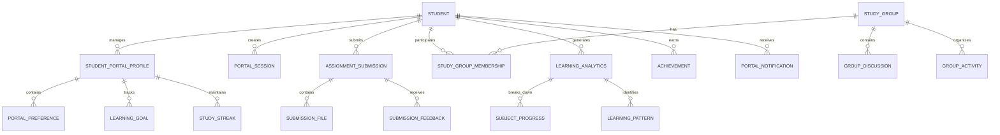
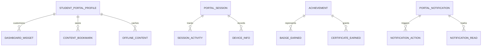
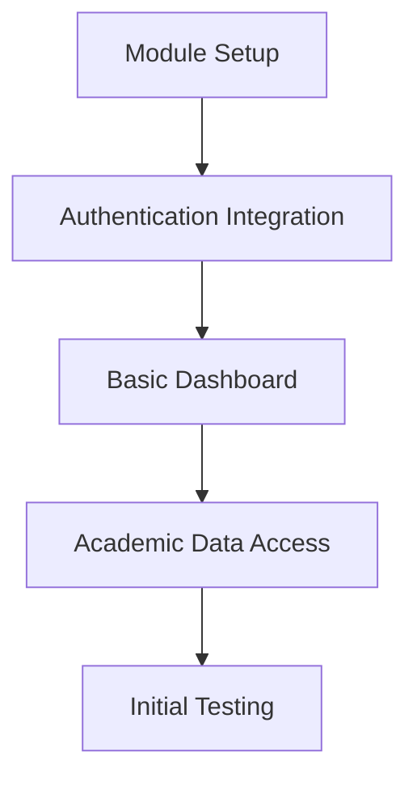
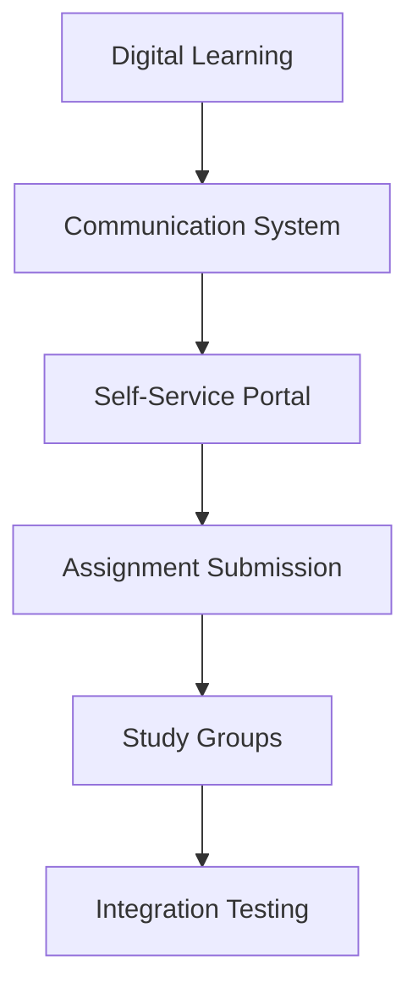
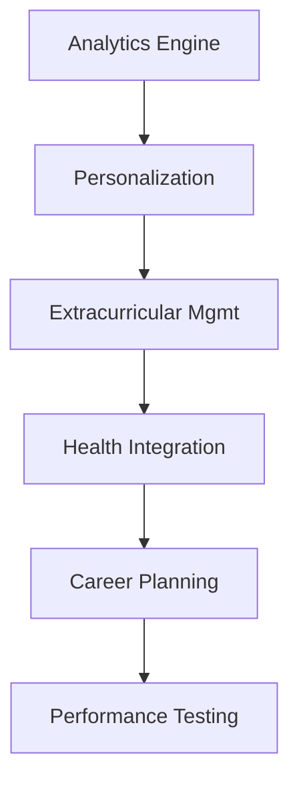
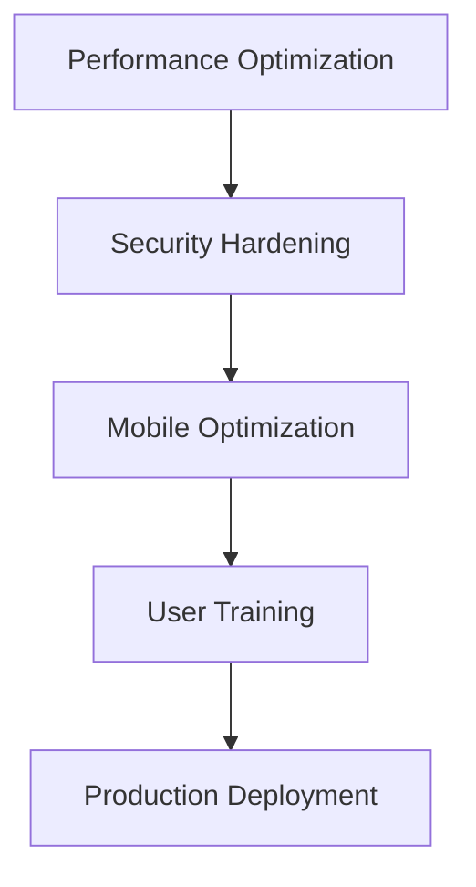

# Student Portal Module - Comprehensive Architecture Design

## Table of Contents
1. [Executive Summary](#executive-summary)
2. [Module Structure and Organization](#module-structure-and-organization)
3. [API Endpoint Design](#api-endpoint-design)
4. [Data Models and Relationships](#data-models-and-relationships)
5. [Integration Points](#integration-points)
6. [Security and Authentication](#security-and-authentication)
7. [Database Schema Design](#database-schema-design)
8. [Implementation Roadmap](#implementation-roadmap)
9. [Technical Considerations](#technical-considerations)

## Executive Summary

The Student Portal module provides a comprehensive digital environment for students to access academic information, engage in self-service activities, participate in digital learning, and communicate with educators and peers. This architecture design builds upon the existing Academia Pro system foundation, leveraging established patterns for authentication, data management, and module integration.

### Key Architectural Principles
- **Student-Centric Design**: All features prioritize student experience and accessibility
- **Security-First Approach**: Age-appropriate security with parental controls
- **Modular Architecture**: Clean separation of concerns with clear boundaries
- **Scalable Integration**: Seamless integration with existing modules
- **Progressive Enhancement**: Core functionality works offline with progressive features

### Business Objectives
- Enhance student engagement through personalized digital experiences
- Reduce administrative workload through self-service capabilities
- Provide real-time access to academic information and resources
- Foster digital citizenship and responsible online behavior
- Support diverse learning needs and accessibility requirements

---

## Module Structure and Organization

### 1. Backend Module Structure (NestJS)

```
server/src/student-portal/
├── controllers/
│   ├── dashboard.controller.ts          # Main dashboard and overview
│   ├── academic.controller.ts           # Academic information access
│   ├── learning.controller.ts           # Digital learning platform
│   ├── communication.controller.ts      # Messaging and collaboration
│   ├── self-service.controller.ts       # Administrative functions
│   ├── extracurricular.controller.ts    # Activities and events
│   ├── health.controller.ts            # Health and wellness
│   └── career.controller.ts            # Career planning
├── services/
│   ├── dashboard.service.ts
│   ├── academic.service.ts
│   ├── learning.service.ts
│   ├── communication.service.ts
│   ├── self-service.service.ts
│   ├── extracurricular.service.ts
│   ├── health.service.ts
│   ├── career.service.ts
│   ├── analytics.service.ts            # Usage analytics
│   └── personalization.service.ts      # Recommendations engine
├── entities/
│   ├── student-profile.entity.ts       # Portal-specific profile
│   ├── portal-session.entity.ts        # Session tracking
│   ├── assignment-submission.entity.ts # Digital submissions
│   ├── study-group.entity.ts          # Collaboration groups
│   ├── learning-analytics.entity.ts   # Progress tracking
│   ├── achievement.entity.ts          # Badges and rewards
│   └── notification.entity.ts         # Portal notifications
├── dtos/
│   ├── dashboard/
│   ├── academic/
│   ├── learning/
│   ├── communication/
│   ├── self-service/
│   ├── extracurricular/
│   ├── health/
│   └── career/
├── guards/
│   ├── student-portal.guard.ts        # Portal access control
│   ├── age-appropriateness.guard.ts   # Content filtering
│   └── parental-control.guard.ts      # Parent oversight
├── interceptors/
│   ├── analytics.interceptor.ts       # Usage tracking
│   └── personalization.interceptor.ts # Content adaptation
├── decorators/
│   ├── student-only.decorator.ts      # Student role restriction
│   └── portal-feature.decorator.ts    # Feature access control
└── student-portal.module.ts
```

### 2. Frontend Module Structure (Next.js/React)

```
client/src/modules/student-portal/
├── components/
│   ├── dashboard/
│   │   ├── DashboardOverview.tsx
│   │   ├── QuickActions.tsx
│   │   ├── RecentActivity.tsx
│   │   └── ProgressWidgets.tsx
│   ├── academic/
│   │   ├── TimetableView.tsx
│   │   ├── GradeBook.tsx
│   │   ├── AssignmentList.tsx
│   │   └── CourseMaterials.tsx
│   ├── learning/
│   │   ├── DigitalClassroom.tsx
│   │   ├── AssignmentSubmission.tsx
│   │   ├── QuizInterface.tsx
│   │   └── ProgressTracker.tsx
│   ├── communication/
│   │   ├── MessageCenter.tsx
│   │   ├── StudyGroups.tsx
│   │   ├── TeacherChat.tsx
│   │   └── Announcements.tsx
│   ├── self-service/
│   │   ├── ProfileManager.tsx
│   │   ├── LeaveRequest.tsx
│   │   ├── DocumentUpload.tsx
│   │   └── ServiceRequests.tsx
│   ├── extracurricular/
│   │   ├── ActivityRegistration.tsx
│   │   ├── EventCalendar.tsx
│   │   ├── AchievementGallery.tsx
│   │   └── ClubParticipation.tsx
│   ├── health/
│   │   ├── HealthDashboard.tsx
│   │   ├── AppointmentBooking.tsx
│   │   ├── WellnessTracker.tsx
│   │   └── EmergencyContacts.tsx
│   └── career/
│       ├── CareerExplorer.tsx
│       ├── GoalSetting.tsx
│       ├── CollegePrep.tsx
│       └── PortfolioBuilder.tsx
├── hooks/
│   ├── useStudentDashboard.ts
│   ├── useAcademicData.ts
│   ├── useLearningProgress.ts
│   ├── useCommunication.ts
│   ├── useSelfService.ts
│   ├── useExtracurricular.ts
│   ├── useHealthData.ts
│   └── useCareerPlanning.ts
├── services/
│   ├── studentPortalApi.ts
│   ├── realtimeService.ts
│   └── offlineStorage.ts
├── types/
│   └── student-portal.types.ts
├── utils/
│   ├── contentFilter.ts
│   ├── accessibility.ts
│   └── personalization.ts
└── contexts/
    ├── StudentPortalContext.tsx
    └── PersonalizationContext.tsx
```

### 3. Shared Types and Interfaces

```typescript
// common/src/types/student-portal/
export interface IStudentPortalProfile {
  id: string;
  studentId: string;
  portalPreferences: IPortalPreferences;
  learningGoals: ILearningGoal[];
  achievements: IAchievement[];
  studyStreak: number;
  totalStudyHours: number;
  lastActive: Date;
}

export interface IPortalPreferences {
  theme: 'light' | 'dark' | 'auto';
  language: string;
  notifications: INotificationSettings;
  accessibility: IAccessibilitySettings;
  dashboardLayout: IDashboardLayout;
}

export interface ILearningGoal {
  id: string;
  title: string;
  description: string;
  category: 'academic' | 'personal' | 'skill';
  targetValue: number;
  currentValue: number;
  deadline: Date;
  status: 'active' | 'completed' | 'overdue';
}
```

---

## API Endpoint Design

### 1. Authentication & Session Management

```typescript
// POST /api/student-portal/auth/login
export interface IStudentLoginRequest {
  email: string;
  password: string;
  rememberMe?: boolean;
  deviceInfo?: IDeviceInfo;
}

// POST /api/student-portal/auth/logout
// GET /api/student-portal/auth/session
export interface ISessionInfo {
  sessionId: string;
  studentId: string;
  loginTime: Date;
  lastActivity: Date;
  deviceInfo: IDeviceInfo;
  permissions: string[];
}
```

### 2. Dashboard & Overview

```typescript
// GET /api/student-portal/dashboard
export interface IDashboardResponse {
  student: IStudentSummary;
  todaySchedule: ITimetableEntry[];
  pendingAssignments: IAssignmentSummary[];
  recentGrades: IGradeSummary[];
  notifications: INotification[];
  quickStats: IDashboardStats;
  personalizedContent: IPersonalizedContent[];
}

// GET /api/student-portal/dashboard/widgets
export interface IWidgetData {
  type: 'grades' | 'attendance' | 'assignments' | 'activities';
  data: any;
  lastUpdated: Date;
}
```

### 3. Academic Information Access

```typescript
// GET /api/student-portal/academic/timetable
export interface ITimetableResponse {
  entries: ITimetableEntry[];
  date: string;
  weekView?: ITimetableEntry[][];
}

// GET /api/student-portal/academic/grades
export interface IGradeBookResponse {
  subjects: ISubjectGrade[];
  overall: IOverallGrade;
  trends: IGradeTrend[];
}

// GET /api/student-portal/academic/assignments
export interface IAssignmentsResponse {
  pending: IAssignment[];
  completed: IAssignment[];
  overdue: IAssignment[];
}
```

### 4. Digital Learning Platform

```typescript
// GET /api/student-portal/learning/courses
export interface ICoursesResponse {
  enrolled: ICourse[];
  available: ICourse[];
  completed: ICourse[];
}

// POST /api/student-portal/learning/assignments/{id}/submit
export interface IAssignmentSubmissionRequest {
  content?: string;
  files?: IFileUpload[];
  answers?: Record<string, any>;
}

// GET /api/student-portal/learning/progress
export interface ILearningProgressResponse {
  overall: IProgressSummary;
  bySubject: Record<string, ISubjectProgress>;
  achievements: IAchievement[];
  recommendations: ILearningRecommendation[];
}
```

### 5. Communication & Collaboration

```typescript
// GET /api/student-portal/communication/messages
export interface IMessagesResponse {
  conversations: IConversation[];
  unreadCount: number;
}

// POST /api/student-portal/communication/messages
export interface ISendMessageRequest {
  recipientId: string;
  recipientType: 'teacher' | 'peer' | 'group';
  content: string;
  attachments?: IFileUpload[];
}

// GET /api/student-portal/communication/study-groups
export interface IStudyGroupsResponse {
  myGroups: IStudyGroup[];
  availableGroups: IStudyGroup[];
  invitations: IGroupInvitation[];
}
```

### 6. Self-Service Capabilities

```typescript
// POST /api/student-portal/self-service/profile
export interface IUpdateProfileRequest {
  personalInfo?: Partial<IStudentPersonalInfo>;
  preferences?: Partial<IPortalPreferences>;
  emergencyContacts?: IEmergencyContact[];
}

// POST /api/student-portal/self-service/leave-request
export interface ILeaveRequestRequest {
  type: 'sick' | 'personal' | 'other';
  startDate: Date;
  endDate: Date;
  reason: string;
  attachments?: IFileUpload[];
}

// GET /api/student-portal/self-service/documents
export interface IDocumentsResponse {
  academic: IDocument[];
  personal: IDocument[];
  certificates: IDocument[];
}
```

### 7. Extracurricular Activities

```typescript
// GET /api/student-portal/extracurricular/activities
export interface IActivitiesResponse {
  registered: IActivity[];
  available: IActivity[];
  upcoming: IActivity[];
}

// POST /api/student-portal/extracurricular/register
export interface IActivityRegistrationRequest {
  activityId: string;
  additionalInfo?: Record<string, any>;
}

// GET /api/student-portal/extracurricular/achievements
export interface IAchievementsResponse {
  badges: IBadge[];
  certificates: ICertificate[];
  leaderboard: ILeaderboardEntry[];
}
```

### 8. Health & Wellness

```typescript
// GET /api/student-portal/health/dashboard
export interface IHealthDashboardResponse {
  medicalInfo: IMedicalSummary;
  appointments: IAppointment[];
  wellness: IWellnessData;
  emergencyContacts: IEmergencyContact[];
}

// POST /api/student-portal/health/appointment
export interface IBookAppointmentRequest {
  type: 'medical' | 'counseling' | 'dental';
  preferredDate: Date;
  reason: string;
  urgency: 'routine' | 'urgent' | 'emergency';
}
```

### 9. Career Planning

```typescript
// GET /api/student-portal/career/explore
export interface ICareerExplorationResponse {
  assessments: ICareerAssessment[];
  interests: IInterestArea[];
  careerPaths: ICareerPath[];
  recommendations: ICareerRecommendation[];
}

// POST /api/student-portal/career/goals
export interface ISetCareerGoalRequest {
  goalType: 'short-term' | 'long-term';
  title: string;
  description: string;
  targetDate: Date;
  milestones: IMilestone[];
}
```

---

## Data Models and Relationships

### Core Entities



### Extended Relationships



---

## Integration Points

### 1. Existing Module Integration

#### Academic Management Module
```typescript
// Integration interfaces
export interface IAcademicIntegration {
  getStudentTimetable(studentId: string, date: Date): Promise<ITimetableEntry[]>;
  getStudentGrades(studentId: string, termId?: string): Promise<IGradeBook>;
  getStudentAssignments(studentId: string, status?: string): Promise<IAssignment[]>;
  getCourseMaterials(courseId: string): Promise<ICourseMaterial[]>;
  submitAssignment(submission: IAssignmentSubmission): Promise<ISubmissionResult>;
}
```

#### Communication Module
```typescript
export interface ICommunicationIntegration {
  sendMessage(message: IMessage): Promise<IMessageResult>;
  getConversations(userId: string): Promise<IConversation[]>;
  createStudyGroup(group: IStudyGroup): Promise<IStudyGroup>;
  joinStudyGroup(studentId: string, groupId: string): Promise<boolean>;
  getAnnouncements(targetAudience: string[]): Promise<IAnnouncement[]>;
}
```

#### Examination & Assessment Module
```typescript
export interface IAssessmentIntegration {
  getStudentResults(studentId: string, examId?: string): Promise<IExamResult[]>;
  getUpcomingExams(studentId: string): Promise<IExam[]>;
  submitExamAnswers(examId: string, answers: Record<string, any>): Promise<IExamSubmission>;
  getGradeTrends(studentId: string, subjectId?: string): Promise<IGradeTrend[]>;
}
```

### 2. External System Integration

#### Learning Management Systems (LMS)
```typescript
export interface ILMSIntegration {
  syncCourses(studentId: string): Promise<ICourse[]>;
  syncAssignments(studentId: string): Promise<IAssignment[]>;
  syncGrades(studentId: string): Promise<IGrade[]>;
  submitToLMS(submission: IAssignmentSubmission): Promise<boolean>;
}
```

#### Digital Content Providers
```typescript
export interface IContentProviderIntegration {
  getContentLibrary(filters: IContentFilters): Promise<IContentItem[]>;
  streamContent(contentId: string): Promise<IContentStream>;
  downloadContent(contentId: string): Promise<IContentDownload>;
  trackContentUsage(usage: IContentUsage): Promise<void>;
}
```

#### Health & Wellness Systems
```typescript
export interface IHealthIntegration {
  getMedicalRecords(studentId: string): Promise<IMedicalRecord[]>;
  scheduleAppointment(appointment: IAppointmentRequest): Promise<IAppointment>;
  updateHealthMetrics(metrics: IHealthMetrics): Promise<void>;
  getWellnessPrograms(): Promise<IWellnessProgram[]>;
}
```

---

## Security and Authentication

### 1. Multi-Layer Security Approach

#### Authentication Layers
```typescript
export interface IStudentAuthentication {
  // Primary authentication
  jwtToken: string;
  refreshToken: string;

  // Session management
  sessionId: string;
  deviceFingerprint: string;

  // Biometric support
  biometricEnabled: boolean;
  biometricToken?: string;

  // Parental controls
  parentalApprovalRequired: boolean;
  parentGuardianId?: string;
}
```

#### Authorization Matrix
```typescript
export interface IPortalPermissions {
  // Academic access
  viewGrades: boolean;
  viewTimetable: boolean;
  submitAssignments: boolean;
  accessMaterials: boolean;

  // Communication
  messageTeachers: boolean;
  joinStudyGroups: boolean;
  participateInForums: boolean;

  // Self-service
  updateProfile: boolean;
  requestLeave: boolean;
  uploadDocuments: boolean;

  // Advanced features
  accessDigitalLearning: boolean;
  participateExtracurricular: boolean;
  accessCareerPlanning: boolean;
}
```

### 2. Age-Appropriate Security

#### Content Filtering
```typescript
export interface IContentFilter {
  gradeLevel: string;
  allowedCategories: string[];
  blockedContent: string[];
  parentalOverride: boolean;
  safeSearchEnabled: boolean;
}
```

#### Usage Monitoring
```typescript
export interface IUsageMonitoring {
  dailyTimeLimit: number;
  sessionTimeout: number;
  activityLogging: boolean;
  parentalAlerts: IParentalAlert[];
}
```

### 3. Data Protection

#### Student Data Privacy
```typescript
export interface IPrivacySettings {
  dataRetention: number; // days
  dataSharing: boolean;
  analyticsOptIn: boolean;
  thirdPartyAccess: boolean;
  parentalAccess: boolean;
}
```

#### Compliance Requirements
- **COPPA Compliance**: Children's Online Privacy Protection Act
- **FERPA Compliance**: Family Educational Rights and Privacy Act
- **GDPR Compliance**: General Data Protection Regulation
- **Age-Appropriate Design**: Child-friendly privacy controls

---

## Database Schema Design

### Core Tables

```sql
-- Student Portal Profile
CREATE TABLE student_portal_profiles (
    id UUID PRIMARY KEY DEFAULT gen_random_uuid(),
    student_id UUID NOT NULL REFERENCES students(id),
    portal_username VARCHAR(50) UNIQUE,
    portal_preferences JSONB DEFAULT '{}',
    learning_goals JSONB DEFAULT '[]',
    achievements JSONB DEFAULT '[]',
    study_streak INTEGER DEFAULT 0,
    total_study_hours DECIMAL(8,2) DEFAULT 0,
    last_active TIMESTAMP,
    is_active BOOLEAN DEFAULT true,
    created_at TIMESTAMP DEFAULT CURRENT_TIMESTAMP,
    updated_at TIMESTAMP DEFAULT CURRENT_TIMESTAMP
);

-- Portal Sessions
CREATE TABLE portal_sessions (
    id UUID PRIMARY KEY DEFAULT gen_random_uuid(),
    student_id UUID NOT NULL REFERENCES students(id),
    session_token VARCHAR(500) NOT NULL,
    device_info JSONB,
    ip_address INET,
    user_agent TEXT,
    login_time TIMESTAMP DEFAULT CURRENT_TIMESTAMP,
    last_activity TIMESTAMP DEFAULT CURRENT_TIMESTAMP,
    logout_time TIMESTAMP,
    is_active BOOLEAN DEFAULT true
);

-- Assignment Submissions
CREATE TABLE assignment_submissions (
    id UUID PRIMARY KEY DEFAULT gen_random_uuid(),
    student_id UUID NOT NULL REFERENCES students(id),
    assignment_id UUID NOT NULL REFERENCES assignments(id),
    submission_content JSONB,
    submission_files JSONB DEFAULT '[]',
    submitted_at TIMESTAMP DEFAULT CURRENT_TIMESTAMP,
    graded_at TIMESTAMP,
    grade DECIMAL(5,2),
    feedback TEXT,
    status ENUM('draft', 'submitted', 'graded', 'returned') DEFAULT 'draft',
    plagiarism_score DECIMAL(5,2),
    ai_detection_score DECIMAL(5,2)
);

-- Study Groups
CREATE TABLE study_groups (
    id UUID PRIMARY KEY DEFAULT gen_random_uuid(),
    name VARCHAR(255) NOT NULL,
    subject_id UUID REFERENCES subjects(id),
    created_by UUID NOT NULL REFERENCES students(id),
    description TEXT,
    max_members INTEGER DEFAULT 20,
    privacy_setting ENUM('public', 'private', 'invite_only') DEFAULT 'public',
    meeting_schedule JSONB,
    is_active BOOLEAN DEFAULT true,
    created_at TIMESTAMP DEFAULT CURRENT_TIMESTAMP
);

-- Group Memberships
CREATE TABLE study_group_memberships (
    id UUID PRIMARY KEY DEFAULT gen_random_uuid(),
    group_id UUID NOT NULL REFERENCES study_groups(id),
    student_id UUID NOT NULL REFERENCES students(id),
    joined_at TIMESTAMP DEFAULT CURRENT_TIMESTAMP,
    role ENUM('member', 'moderator', 'admin') DEFAULT 'member',
    status ENUM('active', 'inactive', 'removed') DEFAULT 'active',
    UNIQUE(group_id, student_id)
);

-- Learning Analytics
CREATE TABLE learning_analytics (
    id UUID PRIMARY KEY DEFAULT gen_random_uuid(),
    student_id UUID NOT NULL REFERENCES students(id),
    subject_id UUID REFERENCES subjects(id),
    session_date DATE NOT NULL,
    study_duration_minutes INTEGER NOT NULL,
    topics_covered JSONB DEFAULT '[]',
    performance_score DECIMAL(5,2),
    learning_objectives_achieved JSONB DEFAULT '[]',
    engagement_metrics JSONB DEFAULT '{}',
    created_at TIMESTAMP DEFAULT CURRENT_TIMESTAMP
);

-- Achievements and Badges
CREATE TABLE achievements (
    id UUID PRIMARY KEY DEFAULT gen_random_uuid(),
    student_id UUID NOT NULL REFERENCES students(id),
    achievement_type VARCHAR(100) NOT NULL,
    title VARCHAR(255) NOT NULL,
    description TEXT,
    badge_icon VARCHAR(500),
    points_earned INTEGER DEFAULT 0,
    criteria_met JSONB,
    earned_at TIMESTAMP DEFAULT CURRENT_TIMESTAMP,
    is_displayed BOOLEAN DEFAULT true
);

-- Portal Notifications
CREATE TABLE portal_notifications (
    id UUID PRIMARY KEY DEFAULT gen_random_uuid(),
    student_id UUID NOT NULL REFERENCES students(id),
    notification_type ENUM('assignment', 'grade', 'announcement', 'reminder', 'achievement') NOT NULL,
    title VARCHAR(255) NOT NULL,
    message TEXT NOT NULL,
    action_url VARCHAR(500),
    priority ENUM('low', 'medium', 'high') DEFAULT 'medium',
    is_read BOOLEAN DEFAULT false,
    read_at TIMESTAMP,
    expires_at TIMESTAMP,
    created_at TIMESTAMP DEFAULT CURRENT_TIMESTAMP
);

-- Content Bookmarks
CREATE TABLE content_bookmarks (
    id UUID PRIMARY KEY DEFAULT gen_random_uuid(),
    student_id UUID NOT NULL REFERENCES students(id),
    content_type VARCHAR(50) NOT NULL,
    content_id VARCHAR(255) NOT NULL,
    title VARCHAR(255),
    url VARCHAR(500),
    thumbnail_url VARCHAR(500),
    tags JSONB DEFAULT '[]',
    notes TEXT,
    created_at TIMESTAMP DEFAULT CURRENT_TIMESTAMP,
    UNIQUE(student_id, content_type, content_id)
);

-- Dashboard Customization
CREATE TABLE dashboard_widgets (
    id UUID PRIMARY KEY DEFAULT gen_random_uuid(),
    student_id UUID NOT NULL REFERENCES students(id),
    widget_type VARCHAR(50) NOT NULL,
    widget_config JSONB DEFAULT '{}',
    position_x INTEGER DEFAULT 0,
    position_y INTEGER DEFAULT 0,
    size_width INTEGER DEFAULT 1,
    size_height INTEGER DEFAULT 1,
    is_visible BOOLEAN DEFAULT true,
    created_at TIMESTAMP DEFAULT CURRENT_TIMESTAMP,
    updated_at TIMESTAMP DEFAULT CURRENT_TIMESTAMP
);
```

### Indexes and Performance Optimization

```sql
-- Performance indexes
CREATE INDEX idx_portal_profiles_student ON student_portal_profiles(student_id);
CREATE INDEX idx_portal_sessions_student ON portal_sessions(student_id);
CREATE INDEX idx_assignment_submissions_student ON assignment_submissions(student_id);
CREATE INDEX idx_learning_analytics_student ON learning_analytics(student_id);
CREATE INDEX idx_notifications_student_unread ON portal_notifications(student_id, is_read);
CREATE INDEX idx_sessions_active ON portal_sessions(is_active, last_activity);

-- Composite indexes for common queries
CREATE INDEX idx_submissions_student_status ON assignment_submissions(student_id, status);
CREATE INDEX idx_analytics_student_date ON learning_analytics(student_id, session_date);
CREATE INDEX idx_groups_subject_active ON study_groups(subject_id, is_active);

-- Partial indexes for active records
CREATE INDEX idx_active_profiles ON student_portal_profiles(is_active) WHERE is_active = true;
CREATE INDEX idx_active_sessions ON portal_sessions(is_active) WHERE is_active = true;
```

---

## Implementation Roadmap

### Phase 1: Foundation (Weeks 1-2)


**Deliverables:**
- Student Portal module structure
- Basic authentication and session management
- Simple dashboard with timetable and assignments
- Academic information access APIs

### Phase 2: Core Features (Weeks 3-6)


**Deliverables:**
- Digital learning platform integration
- Communication and collaboration tools
- Self-service capabilities
- Assignment submission system
- Study group functionality

### Phase 3: Advanced Features (Weeks 7-10)


**Deliverables:**
- Learning analytics and insights
- Personalized recommendations
- Extracurricular activity management
- Health and wellness integration
- Career planning tools

### Phase 4: Optimization & Launch (Weeks 11-12)


**Deliverables:**
- Performance optimization
- Security enhancements
- Mobile app optimization
- User documentation and training
- Production deployment

---

## Technical Considerations

### 1. Performance Optimization

#### Caching Strategy
```typescript
export interface ICacheConfiguration {
  // Redis cache for frequently accessed data
  studentProfile: { ttl: 300 }, // 5 minutes
  timetableData: { ttl: 3600 }, // 1 hour
  gradeBook: { ttl: 1800 }, // 30 minutes

  // CDN for static content
  contentDelivery: {
    provider: 'CloudFront',
    regions: ['us-east-1', 'eu-west-1'],
    cacheBehavior: 'max-age=86400'
  }
}
```

#### Database Optimization
```typescript
export interface IDatabaseOptimization {
  // Read replicas for dashboard queries
  readReplicas: {
    count: 2,
    regions: ['us-east-1', 'us-west-2']
  },

  // Partitioning strategy
  partitioning: {
    table: 'learning_analytics',
    strategy: 'monthly',
    retention: '3_years'
  }
}
```

### 2. Scalability Considerations

#### Horizontal Scaling
```typescript
export interface IScalabilityConfig {
  // Auto-scaling groups
  webServers: {
    minInstances: 2,
    maxInstances: 20,
    targetCPUUtilization: 70
  },

  // Load balancing
  loadBalancer: {
    type: 'application',
    healthCheckPath: '/health',
    sessionAffinity: 'sticky'
  }
}
```

#### Microservices Integration
```typescript
export interface IMicroservicesConfig {
  // Event-driven architecture
  eventBus: {
    provider: 'AWS EventBridge',
    events: ['student.login', 'assignment.submitted', 'grade.updated']
  },

  // API Gateway
  apiGateway: {
    throttling: {
      rateLimit: 1000,
      burstLimit: 2000
    },
    caching: {
      enabled: true,
      ttl: 300
    }
  }
}
```

### 3. Monitoring and Observability

#### Application Monitoring
```typescript
export interface IMonitoringConfig {
  // Application Performance Monitoring
  apm: {
    provider: 'DataDog',
    metrics: ['response_time', 'error_rate', 'throughput'],
    alerts: ['high_error_rate', 'slow_response_time']
  },

  // Real User Monitoring
  rum: {
    provider: 'DataDog',
    trackUserInteractions: true,
    performanceMetrics: true
  }
}
```

#### Business Metrics
```typescript
export interface IBusinessMetrics {
  // Student engagement
  engagement: {
    dailyActiveUsers: number,
    sessionDuration: number,
    featureUsage: Record<string, number>
  },

  // Academic performance
  academic: {
    assignmentSubmissionRate: number,
    onTimeSubmissionRate: number,
    gradeImprovement: number
  },

  // System performance
  system: {
    uptime: number,
    responseTime: number,
    errorRate: number
  }
}
```

### 4. Accessibility and Inclusivity

#### WCAG Compliance
```typescript
export interface IAccessibilityConfig {
  // Screen reader support
  screenReader: {
    ariaLabels: true,
    semanticHTML: true,
    keyboardNavigation: true
  },

  // Visual accessibility
  visual: {
    colorContrast: 'WCAG_AA',
    fontScaling: true,
    highContrastMode: true
  },

  // Motor accessibility
  motor: {
    keyboardShortcuts: true,
    gestureAlternatives: true,
    timeLimits: 'configurable'
  }
}
```

#### Multilingual Support
```typescript
export interface IMultilingualConfig {
  // Supported languages
  languages: ['en', 'es', 'fr', 'de', 'zh', 'ar'],

  // RTL language support
  rtlLanguages: ['ar'],

  // Content localization
  localization: {
    dateFormats: true,
    numberFormats: true,
    currencyFormats: true
  }
}
```

---

## Conclusion

This comprehensive architecture design for the Student Portal module provides a solid foundation for implementing a student-centric digital learning environment. The design emphasizes:

1. **Student-Centric Approach**: Prioritizing student experience and accessibility
2. **Security and Privacy**: Age-appropriate security with parental controls
3. **Scalable Integration**: Seamless integration with existing Academia Pro modules
4. **Progressive Enhancement**: Core functionality with advanced features
5. **Performance and Reliability**: Optimized for high concurrent usage

The modular architecture ensures maintainability, while the comprehensive API design supports all required functionality. The implementation roadmap provides a clear path from foundation to production deployment.

**Next Steps:**
1. Review and approve this architectural design
2. Begin implementation following the phased approach
3. Set up development environment and team structure
4. Start with Phase 1 foundation development

This design positions the Student Portal as a comprehensive solution that enhances student engagement, supports academic success, and provides valuable self-service capabilities while maintaining the highest standards of security and accessibility.