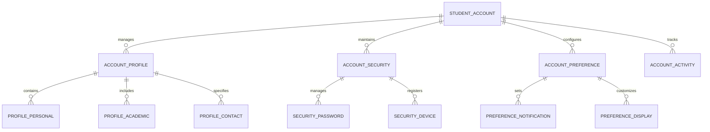
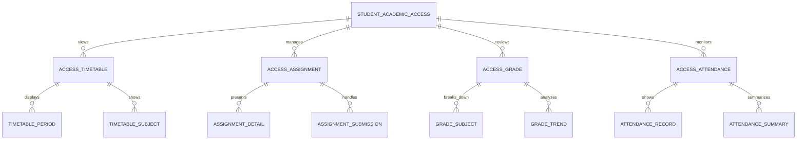
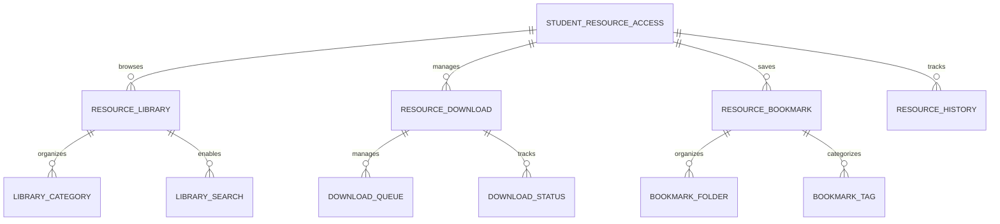
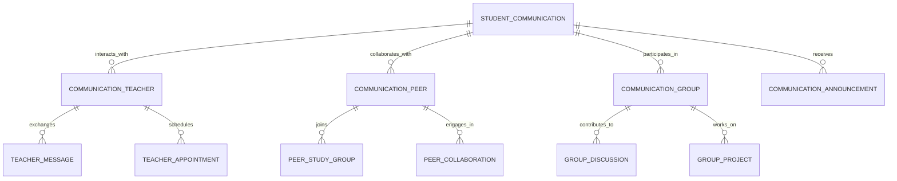
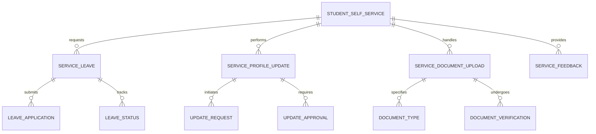
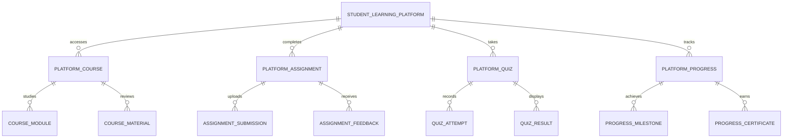
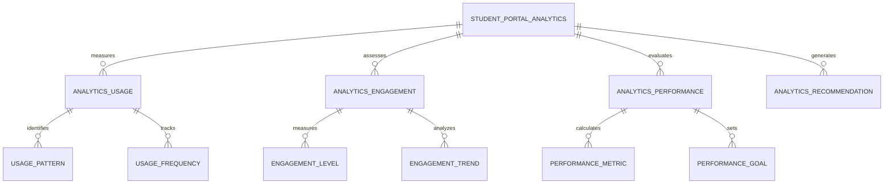

# Student Portal - Entity Relationship Diagram

## Overview
This ER diagram illustrates the entities and relationships for the student portal, providing students with comprehensive access to their academic information, learning resources, communication tools, and self-service capabilities.

## Student Account & Profile Management

## Academic Information & Performance

## Learning Resources & Digital Content

## Communication & Collaboration

## Self-Service & Administrative Functions

## Digital Learning & Assessment

## Portal Analytics & Personalization

## Entity Descriptions

### **STUDENT_ACCOUNT**
**Purpose**: Student account management and authentication
**Key Attributes**:
- `student_id` (Primary Key - links to main student record)
- `portal_username` (Unique portal login identifier)
- `portal_password_hash` (Secure password storage)
- `account_status` (Active/Inactive/Suspended)
- `registration_date`, `last_login_date`
- `password_reset_token`, `token_expiry`
- `two_factor_enabled`, `two_factor_secret`
- `login_attempts`, `account_lockout_until`
- `preferred_language`, `timezone`

### **STUDENT_ACADEMIC_ACCESS**
**Purpose**: Student access to academic information and records
**Key Attributes**:
- `access_id` (Primary Key)
- `student_id` (Foreign Key)
- `access_level` (Full/Restricted/Limited)
- `academic_year_id` (Foreign Key)
- `term_id` (Foreign Key)
- `last_access_date`, `access_count`
- `restricted_features` (Comma-separated list)
- `parent_approval_required` (For certain actions)
- `emergency_access` (Emergency override)

### **STUDENT_RESOURCE_ACCESS**
**Purpose**: Student access to learning resources and digital content
**Key Attributes**:
- `resource_access_id` (Primary Key)
- `student_id` (Foreign Key)
- `resource_library_access` (Permission level)
- `download_quota_mb` (Monthly download limit)
- `download_used_mb` (Current usage)
- `offline_access_enabled` (Offline content access)
- `bookmark_limit` (Maximum bookmarks allowed)
- `resource_categories` (Allowed categories)
- `access_expiry_date` (Access validity)

### **STUDENT_COMMUNICATION**
**Purpose**: Student communication and collaboration features
**Key Attributes**:
- `communication_id` (Primary Key)
- `student_id` (Foreign Key)
- `communication_features_enabled` (Enabled features)
- `teacher_messaging_enabled` (Can message teachers)
- `peer_collaboration_enabled` (Can collaborate with peers)
- `group_participation_limit` (Maximum groups)
- `message_quota_per_day` (Daily message limit)
- `moderation_required` (Content moderation)
- `communication_history_days` (History retention)

### **STUDENT_SELF_SERVICE**
**Purpose**: Student self-service capabilities and administrative functions
**Key Attributes**:
- `self_service_id` (Primary Key)
- `student_id` (Foreign Key)
- `leave_request_enabled` (Can request leave)
- `profile_update_enabled` (Can update profile)
- `document_upload_enabled` (Can upload documents)
- `feedback_submission_enabled` (Can provide feedback)
- `service_request_limit` (Monthly request limit)
- `approval_workflow_enabled` (Requires approvals)
- `self_service_features` (Enabled features list)

### **STUDENT_LEARNING_PLATFORM**
**Purpose**: Student access to digital learning and assessment platform
**Key Attributes**:
- `learning_platform_id` (Primary Key)
- `student_id` (Foreign Key)
- `platform_access_level` (Full/Limited/Restricted)
- `course_enrollment_limit` (Maximum concurrent courses)
- `assignment_submission_deadline` (Grace period days)
- `quiz_attempt_limit` (Maximum quiz attempts)
- `progress_tracking_enabled` (Progress monitoring)
- `certificate_earning_enabled` (Can earn certificates)
- `learning_analytics_enabled` (Learning analytics access)

### **STUDENT_PORTAL_ANALYTICS**
**Purpose**: Student portal usage tracking and personalization
**Key Attributes**:
- `analytics_id` (Primary Key)
- `student_id` (Foreign Key)
- `portal_session_count` (Total sessions)
- `average_session_duration` (Minutes per session)
- `most_used_features` (Top 5 features)
- `learning_progress_score` (0-100 scale)
- `engagement_level` (High/Medium/Low)
- `personalized_recommendations` (AI-generated suggestions)
- `last_analytics_update`, `next_update_date`

## Key Relationships

### **Account Management**
- **STUDENT_ACCOUNT → ACCOUNT_PROFILE**: One account manages one profile
- **STUDENT_ACCOUNT → ACCOUNT_SECURITY**: One account maintains security
- **ACCOUNT_SECURITY → SECURITY_PASSWORD**: One security manages password
- **STUDENT_ACCOUNT → ACCOUNT_PREFERENCE**: One account configures preferences

### **Academic Access**
- **STUDENT_ACADEMIC_ACCESS → ACCESS_TIMETABLE**: One access views timetable
- **STUDENT_ACADEMIC_ACCESS → ACCESS_ASSIGNMENT**: One access manages assignments
- **ACCESS_TIMETABLE → TIMETABLE_PERIOD**: One timetable displays periods
- **ACCESS_ASSIGNMENT → ASSIGNMENT_SUBMISSION**: One assignment handles submissions

### **Resource Access**
- **STUDENT_RESOURCE_ACCESS → RESOURCE_LIBRARY**: One access browses library
- **STUDENT_RESOURCE_ACCESS → RESOURCE_DOWNLOAD**: One access manages downloads
- **RESOURCE_LIBRARY → LIBRARY_CATEGORY**: One library organizes categories
- **RESOURCE_DOWNLOAD → DOWNLOAD_QUEUE**: One download manages queue

### **Communication**
- **STUDENT_COMMUNICATION → COMMUNICATION_TEACHER**: One communication interacts with teachers
- **STUDENT_COMMUNICATION → COMMUNICATION_PEER**: One communication collaborates with peers
- **COMMUNICATION_TEACHER → TEACHER_MESSAGE**: One teacher interaction exchanges messages
- **COMMUNICATION_PEER → PEER_STUDY_GROUP**: One peer collaboration joins groups

### **Self-Service**
- **STUDENT_SELF_SERVICE → SERVICE_LEAVE**: One self-service requests leave
- **STUDENT_SELF_SERVICE → SERVICE_PROFILE_UPDATE**: One self-service performs updates
- **SERVICE_LEAVE → LEAVE_APPLICATION**: One leave request submits application
- **SERVICE_PROFILE_UPDATE → UPDATE_REQUEST**: One profile update initiates request

### **Learning Platform**
- **STUDENT_LEARNING_PLATFORM → PLATFORM_COURSE**: One platform accesses courses
- **STUDENT_LEARNING_PLATFORM → PLATFORM_ASSIGNMENT**: One platform completes assignments
- **PLATFORM_COURSE → COURSE_MODULE**: One course contains modules
- **PLATFORM_ASSIGNMENT → ASSIGNMENT_SUBMISSION**: One assignment handles submission

### **Portal Analytics**
- **STUDENT_PORTAL_ANALYTICS → ANALYTICS_USAGE**: One analytics measures usage
- **STUDENT_PORTAL_ANALYTICS → ANALYTICS_ENGAGEMENT**: One analytics assesses engagement
- **ANALYTICS_USAGE → USAGE_PATTERN**: One usage identifies patterns
- **ANALYTICS_ENGAGEMENT → ENGAGEMENT_LEVEL**: One engagement measures level

## Business Rules & Validation

### **Account Management Rules**
- **Age Verification**: Students must meet minimum age requirements
- **Parental Consent**: Parental consent required for account creation
- **Account Security**: Strong password and security requirements
- **Usage Monitoring**: Account usage must comply with school policies

### **Academic Access Rules**
- **Grade Restrictions**: Certain features restricted by grade level
- **Parental Controls**: Parent approval required for sensitive information
- **Content Filtering**: Age-appropriate content filtering
- **Usage Limits**: Daily usage limits to prevent excessive access

### **Communication Rules**
- **Appropriate Content**: Communications must follow school guidelines
- **Supervision**: Teacher supervision for certain communications
- **Privacy Protection**: Student privacy must be protected
- **Anti-bullying**: Anti-bullying measures and monitoring

### **Self-Service Rules**
- **Approval Workflows**: Certain actions require approval
- **Document Verification**: Uploaded documents must be verified
- **Request Limits**: Limits on self-service requests
- **Audit Trail**: All self-service actions must be logged

## Security & Compliance

### **Student Data Protection**
- **COPPA Compliance**: Children's Online Privacy Protection Act compliance
- **Age-Appropriate Design**: Interface designed for appropriate age groups
- **Parental Controls**: Comprehensive parental control features
- **Content Safety**: Safe content and interaction monitoring

### **Authentication & Access**
- **Secure Authentication**: Multi-factor authentication support
- **Session Management**: Secure session handling and timeouts
- **Device Management**: Registered device management
- **Access Logging**: Complete audit trail of all access

## Performance Considerations

### **Database Optimization**
- **Partitioning**: Student data partitioned by grade and academic year
- **Indexing**: Optimized indexes on frequently accessed student fields
- **Caching**: Student profile and academic data cached
- **Archival**: Historical student activity data archived

### **Real-time Features**
- **Live Updates**: Real-time updates for grades and assignments
- **Instant Notifications**: Push notifications for important updates
- **Live Collaboration**: Real-time collaboration features
- **Progress Tracking**: Live progress updates and analytics

### **Scalability Features**
- **Horizontal Scaling**: Database sharding by school and student groups
- **Load Balancing**: Distributed processing of student portal requests
- **CDN Integration**: Fast delivery of learning content
- **Auto-scaling**: Automatic scaling based on usage patterns

## Implementation Guidelines

### **User Experience Design**
- **Intuitive Interface**: Age-appropriate and intuitive user interface
- **Mobile Optimization**: Fully responsive mobile-first design
- **Gamification**: Learning progress gamification elements
- **Accessibility**: WCAG compliance for accessibility standards

### **Learning Features**
- **Adaptive Learning**: Personalized learning paths and recommendations
- **Progress Visualization**: Visual progress tracking and achievements
- **Interactive Content**: Interactive learning materials and assessments
- **Offline Capability**: Offline access to learning materials

### **Communication Tools**
- **Safe Messaging**: Moderated and safe communication channels
- **Study Groups**: Collaborative study group formation and management
- **Teacher Interaction**: Structured teacher-student communication
- **Feedback Systems**: Student feedback collection and analysis

### **Administrative Features**
- **Self-Service Portal**: Comprehensive self-service capabilities
- **Document Management**: Digital document upload and management
- **Appointment Scheduling**: Online appointment booking with staff
- **Request Tracking**: Request submission and status tracking

This ER diagram provides a comprehensive foundation for implementing a robust student portal that enables academic monitoring, digital learning, communication, self-service, and personalized learning experiences while ensuring security, privacy, and educational effectiveness.