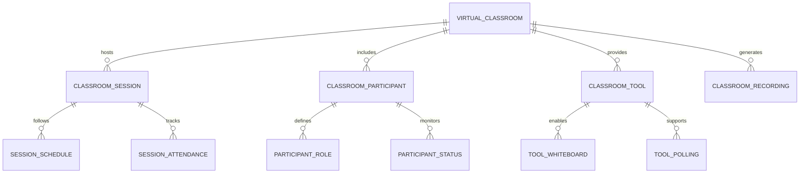
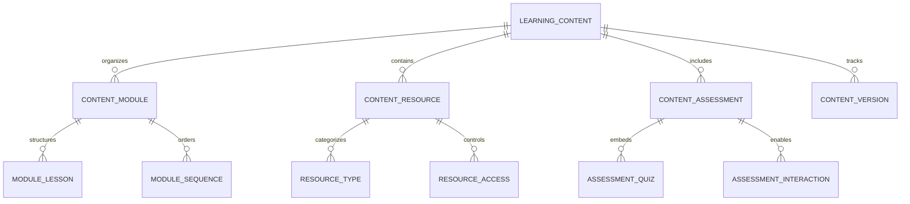
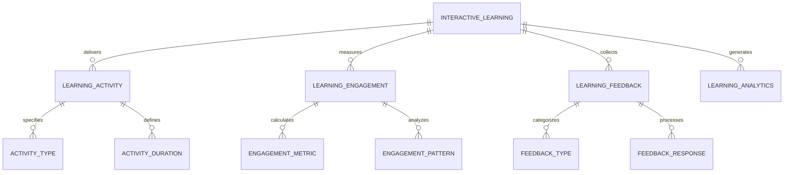
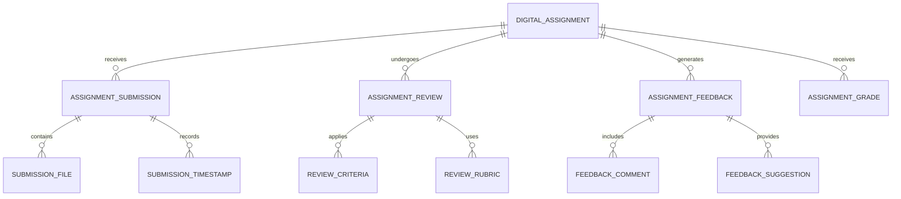
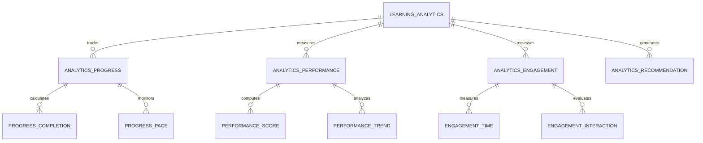
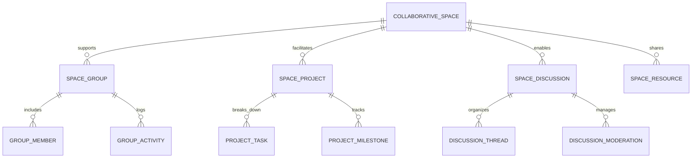
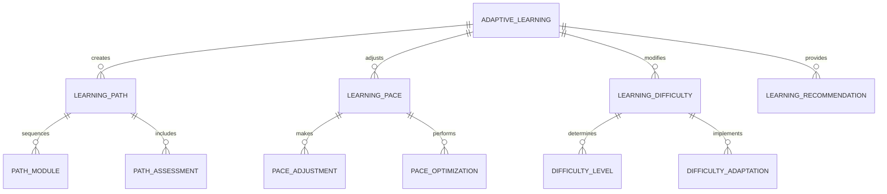

# Online Learning & Digital Classroom Module - Entity Relationship Diagram

## Overview
This ER diagram illustrates the entities and relationships for comprehensive online learning and digital classroom management, supporting virtual classrooms, digital content delivery, interactive learning, and assessment in a blended learning environment.

## Virtual Classroom Management

## Digital Content & Learning Materials

## Interactive Learning & Engagement

## Assignment & Assessment System

## Learning Analytics & Personalization

## Collaborative Learning Environment

## Adaptive Learning & Personalization

## Entity Descriptions

### **VIRTUAL_CLASSROOM**
**Purpose**: Virtual classroom session management and orchestration
**Key Attributes**:
- `classroom_id` (Primary Key)
- `school_id` (Foreign Key)
- `subject_id` (Foreign Key)
- `teacher_id` (Foreign Key)
- `classroom_name`, `classroom_description`
- `max_participants` (Maximum allowed participants)
- `start_time`, `end_time`, `duration_minutes`
- `classroom_type` (Live/Recorded/Hybrid)
- `recording_enabled` (Session recording capability)
- `interactive_tools_enabled` (Whiteboard, polling, etc.)
- `status` (Scheduled/Ongoing/Completed/Cancelled)

### **LEARNING_CONTENT**
**Purpose**: Digital learning content organization and management
**Key Attributes**:
- `content_id` (Primary Key)
- `school_id` (Foreign Key)
- `subject_id` (Foreign Key)
- `grade_level` (Applicable grade)
- `content_title`, `content_description`
- `content_type` (Video/Presentation/Document/Interactive)
- `content_format` (MP4/PDF/HTML/SCORM)
- `file_size_mb`, `duration_minutes`
- `difficulty_level` (Beginner/Intermediate/Advanced)
- `language` (Content language)
- `copyright_info`, `license_type`

### **INTERACTIVE_LEARNING**
**Purpose**: Interactive learning activities and engagement features
**Key Attributes**:
- `interactive_id` (Primary Key)
- `content_id` (Foreign Key)
- `activity_type` (Quiz/Poll/Discussion/Game/Simulation)
- `interaction_mode` (Real-time/Asynchronous)
- `time_limit_minutes` (Activity duration)
- `scoring_enabled` (Points/grades awarded)
- `feedback_immediate` (Instant feedback provided)
- `collaboration_allowed` (Group interaction enabled)
- `adaptive_enabled` (Difficulty adjustment based on performance)

### **DIGITAL_ASSIGNMENT**
**Purpose**: Online assignment creation, submission, and evaluation
**Key Attributes**:
- `assignment_id` (Primary Key)
- `school_id` (Foreign Key)
- `subject_id` (Foreign Key)
- `teacher_id` (Foreign Key)
- `assignment_title`, `assignment_description`
- `assignment_type` (Individual/Group/Project)
- `submission_format` (File/Text/URL)
- `max_file_size_mb`, `allowed_file_types`
- `due_date`, `grace_period_days`
- `late_submission_allowed` (Accept late submissions)
- `plagiarism_check_enabled` (Automated plagiarism detection)
- `peer_review_enabled` (Student peer evaluation)

### **LEARNING_ANALYTICS**
**Purpose**: Learning progress tracking and performance analytics
**Key Attributes**:
- `analytics_id` (Primary Key)
- `student_id` (Foreign Key)
- `content_id` (Foreign Key)
- `session_start_time`, `session_end_time`
- `time_spent_minutes`, `pages_viewed`
- `interactions_count`, `questions_asked`
- `completion_percentage`, `understanding_score`
- `engagement_level` (High/Medium/Low)
- `learning_pace` (Fast/Optimal/Slow)
- `difficulty_preference` (Easy/Medium/Hard)

### **COLLABORATIVE_SPACE**
**Purpose**: Collaborative learning environment and group work facilitation
**Key Attributes**:
- `space_id` (Primary Key)
- `school_id` (Foreign Key)
- `space_name`, `space_description`
- `space_type` (Study Group/Project Team/Class Group)
- `max_members` (Maximum group size)
- `privacy_level` (Public/Private/Invitation-only)
- `moderation_enabled` (Content moderation required)
- `file_sharing_enabled` (Document sharing allowed)
- `discussion_forum_enabled` (Discussion capabilities)
- `created_by`, `creation_date`

### **ADAPTIVE_LEARNING**
**Purpose**: Personalized learning path creation and content adaptation
**Key Attributes**:
- `adaptive_id` (Primary Key)
- `student_id` (Foreign Key)
- `subject_id` (Foreign Key)
- `current_difficulty_level` (Student's current level)
- `learning_style` (Visual/Auditory/Kinesthetic)
- `preferred_pace` (Fast/Moderate/Slow)
- `strength_areas` (Subject strengths)
- `weakness_areas` (Areas needing improvement)
- `recommended_path` (Suggested learning sequence)
- `adaptation_frequency` (How often to adjust)

## Key Relationships

### **Virtual Classroom**
- **VIRTUAL_CLASSROOM → CLASSROOM_SESSION**: One classroom hosts multiple sessions
- **VIRTUAL_CLASSROOM → CLASSROOM_PARTICIPANT**: One classroom includes multiple participants
- **CLASSROOM_SESSION → SESSION_SCHEDULE**: One session follows schedule
- **CLASSROOM_PARTICIPANT → PARTICIPANT_ROLE**: One participant has defined role

### **Learning Content**
- **LEARNING_CONTENT → CONTENT_MODULE**: One content organizes into modules
- **LEARNING_CONTENT → CONTENT_RESOURCE**: One content contains multiple resources
- **CONTENT_MODULE → MODULE_LESSON**: One module structures lessons
- **CONTENT_RESOURCE → RESOURCE_TYPE**: One resource belongs to type

### **Interactive Learning**
- **INTERACTIVE_LEARNING → LEARNING_ACTIVITY**: One learning delivers multiple activities
- **INTERACTIVE_LEARNING → LEARNING_ENGAGEMENT**: One learning measures engagement
- **LEARNING_ACTIVITY → ACTIVITY_TYPE**: One activity specifies type
- **LEARNING_ENGAGEMENT → ENGAGEMENT_METRIC**: One engagement calculates metrics

### **Digital Assignments**
- **DIGITAL_ASSIGNMENT → ASSIGNMENT_SUBMISSION**: One assignment receives multiple submissions
- **DIGITAL_ASSIGNMENT → ASSIGNMENT_REVIEW**: One assignment undergoes review
- **ASSIGNMENT_SUBMISSION → SUBMISSION_FILE**: One submission contains files
- **ASSIGNMENT_REVIEW → REVIEW_CRITERIA**: One review applies criteria

### **Learning Analytics**
- **LEARNING_ANALYTICS → ANALYTICS_PROGRESS**: One analytics tracks progress
- **LEARNING_ANALYTICS → ANALYTICS_PERFORMANCE**: One analytics measures performance
- **ANALYTICS_PROGRESS → PROGRESS_COMPLETION**: One progress calculates completion
- **ANALYTICS_PERFORMANCE → PERFORMANCE_SCORE**: One performance computes score

### **Collaborative Learning**
- **COLLABORATIVE_SPACE → SPACE_GROUP**: One space supports multiple groups
- **COLLABORATIVE_SPACE → SPACE_PROJECT**: One space facilitates projects
- **SPACE_GROUP → GROUP_MEMBER**: One group includes multiple members
- **SPACE_PROJECT → PROJECT_TASK**: One project breaks down into tasks

### **Adaptive Learning**
- **ADAPTIVE_LEARNING → LEARNING_PATH**: One adaptive learning creates path
- **ADAPTIVE_LEARNING → LEARNING_PACE**: One adaptive learning adjusts pace
- **LEARNING_PATH → PATH_MODULE**: One path sequences modules
- **LEARNING_PACE → PACE_ADJUSTMENT**: One pace makes adjustments

## Business Rules & Validation

### **Virtual Classroom Rules**
- **Participant Limits**: Maximum participants per session
- **Session Duration**: Maximum duration for live sessions
- **Recording Permissions**: Recording requires participant consent
- **Technical Requirements**: Minimum bandwidth and device requirements

### **Content Management Rules**
- **Copyright Compliance**: All content must have proper licensing
- **Age Appropriateness**: Content suitable for target age group
- **Quality Standards**: Content meets educational quality standards
- **Version Control**: Content versions must be properly managed

### **Interactive Learning Rules**
- **Engagement Monitoring**: Student engagement must be actively monitored
- **Fair Assessment**: Interactive assessments must be fair and unbiased
- **Feedback Timeliness**: Feedback must be provided within defined timeframes
- **Progress Validation**: Learning progress must be accurately measured

### **Assignment Rules**
- **Originality Checks**: Plagiarism detection for all submissions
- **Submission Deadlines**: Strict enforcement of submission deadlines
- **Fair Evaluation**: Consistent evaluation criteria application
- **Feedback Quality**: Constructive and detailed feedback requirements

## Security & Compliance

### **Learning Data Protection**
- **Student Privacy**: Protection of student learning data and progress
- **Content Security**: Secure storage and delivery of learning materials
- **Interaction Privacy**: Private communication and collaboration spaces
- **Assessment Security**: Secure assessment environment and result protection

### **Educational Compliance**
- **Accessibility Standards**: WCAG compliance for digital learning content
- **Data Privacy**: FERPA and GDPR compliance for student data
- **Content Standards**: Alignment with educational content standards
- **Assessment Fairness**: Equal opportunity and unbiased assessment practices

## Performance Considerations

### **Real-time Processing**
- **Live Streaming**: High-quality video streaming with low latency
- **Interactive Features**: Real-time polling, chat, and collaboration
- **Concurrent Users**: Support for large numbers of simultaneous users
- **Adaptive Streaming**: Quality adjustment based on network conditions

### **Content Delivery**
- **CDN Integration**: Global content delivery network for fast access
- **Caching Strategy**: Intelligent caching of frequently accessed content
- **Offline Capability**: Download and offline access to learning materials
- **Bandwidth Optimization**: Compressed content delivery for low-bandwidth areas

### **Database Optimization**
- **Partitioning**: Learning data partitioned by academic year and subject
- **Indexing**: Optimized indexes on frequently queried learning fields
- **Archival**: Historical learning data moved to archival storage
- **Analytics Optimization**: Efficient processing of learning analytics data

### **Scalability Features**
- **Horizontal Scaling**: Database sharding by school and content type
- **Load Balancing**: Distributed processing of learning platform requests
- **Auto-scaling**: Automatic scaling based on user load and content demand
- **Microservices**: Separate services for different learning platform functions

## Implementation Guidelines

### **Virtual Classroom Platform**
- **Video Conferencing**: Integration with reliable video conferencing solutions
- **Screen Sharing**: High-quality screen sharing and presentation capabilities
- **Recording System**: Automated session recording and storage
- **Breakout Rooms**: Support for small group discussions and activities

### **Content Management System**
- **Multi-format Support**: Support for various content formats and media types
- **Version Control**: Comprehensive content versioning and update management
- **Metadata Management**: Rich metadata for content discovery and organization
- **Rights Management**: Digital rights management for protected content

### **Learning Analytics Engine**
- **Real-time Tracking**: Live tracking of student engagement and progress
- **Predictive Analytics**: Early warning systems for at-risk students
- **Personalization Engine**: AI-driven content and path recommendations
- **Reporting Dashboard**: Comprehensive analytics dashboard for educators

### **Assessment & Evaluation System**
- **Automated Grading**: AI-powered grading for objective assessments
- **Peer Assessment**: Structured peer evaluation and feedback systems
- **Rubric-based Evaluation**: Standardized evaluation criteria and rubrics
- **Progress Portfolios**: Digital portfolios for tracking student development

This ER diagram provides a comprehensive foundation for implementing a robust online learning and digital classroom system that supports virtual classrooms, interactive learning, adaptive content delivery, collaborative environments, and comprehensive learning analytics while ensuring security, accessibility, and educational effectiveness.