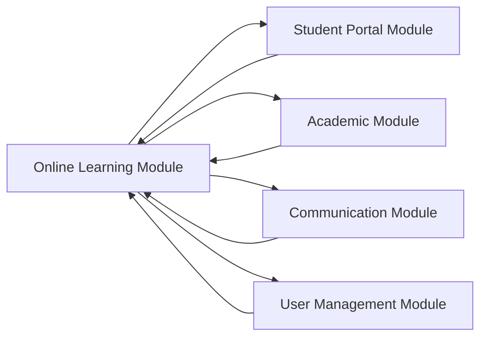
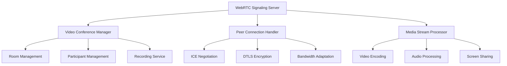
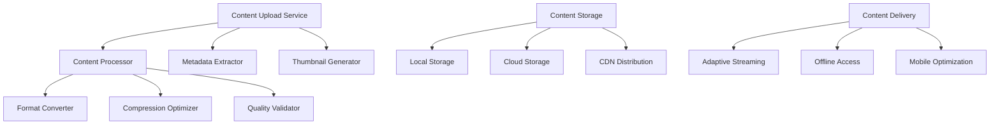
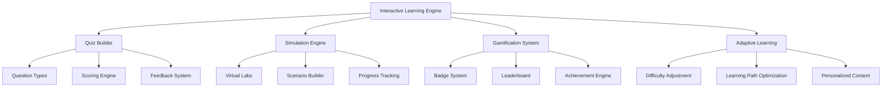
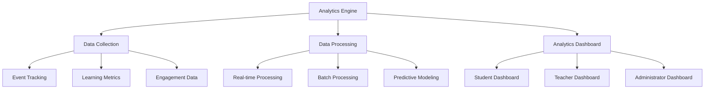
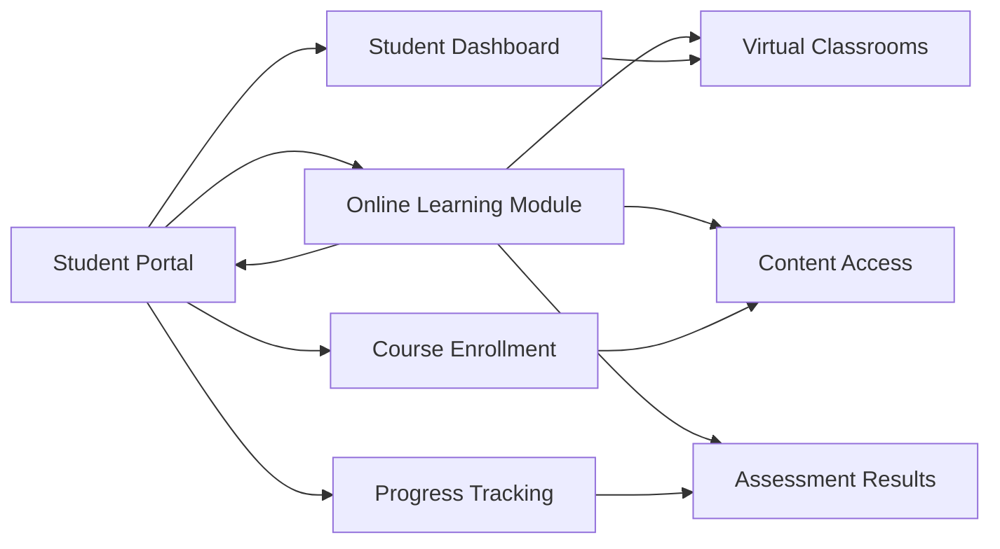
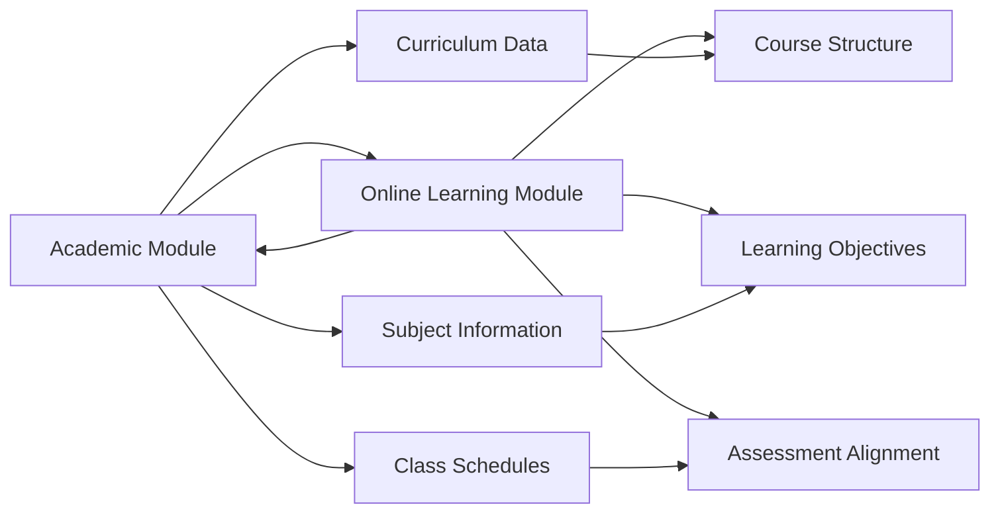
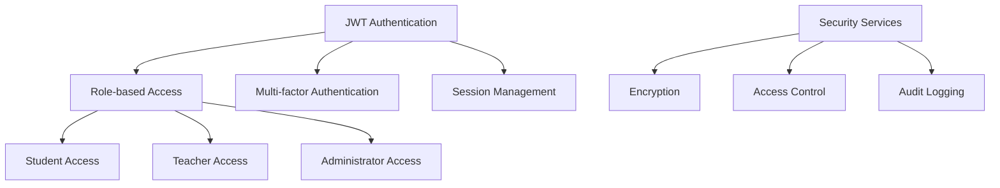

# Online Learning & Digital Classroom Module - Comprehensive Architecture Design

## Executive Summary

This document presents a comprehensive architectural design for the Online Learning & Digital Classroom Module that integrates seamlessly with the existing Academia Pro system. The design encompasses virtual classrooms, digital content management, interactive learning tools, assessment capabilities, and learning analytics while ensuring security, scalability, and performance.

## 1. Module Structure and Organization

### 1.1 Core Architecture

The Online Learning module follows the established NestJS modular architecture pattern, integrating with the existing system through well-defined interfaces and shared services.

```mermaid
graph TB
    A[Online Learning Module] --> B[Virtual Classroom Service]
    A --> C[Content Management Service]
    A --> D[Learning Management Service]
    A --> E[Assessment Service]
    A --> F[Analytics Service]
    A --> G[Collaboration Service]

    B --> H[Video Conferencing]
    B --> I[Real-time Communication]
    B --> J[Session Management]

    C --> K[Content Storage]
    C --> L[Content Delivery]
    C --> M[Content Versioning]

    D --> N[Learning Paths]
    D --> O[Progress Tracking]
    D --> P[Personalization]

    E --> Q[Assessment Engine]
    E --> R[Grading System]
    E --> S[Feedback Management]

    F --> T[Learning Analytics]
    F --> U[Performance Metrics]
    F --> V[Predictive Modeling]

    G --> W[Discussion Forums]
    G --> X[Group Projects]
    G --> Y[Peer Collaboration]
```



### 1.2 Module Dependencies



### 1.3 Database Schema Design

The module extends the existing database schema with online learning specific tables:

```sql
-- Virtual Classroom Management
CREATE TABLE virtual_classrooms (
    classroom_id UUID PRIMARY KEY,
    school_id UUID REFERENCES schools(school_id),
    course_id UUID REFERENCES courses(course_id),
    classroom_name VARCHAR(255) NOT NULL,
    description TEXT,
    instructor_id UUID REFERENCES users(user_id),
    max_participants INTEGER DEFAULT 50,
    start_time TIMESTAMP,
    end_time TIMESTAMP,
    status ENUM('scheduled', 'active', 'completed', 'cancelled'),
    recording_enabled BOOLEAN DEFAULT true,
    interactive_tools JSONB,
    settings JSONB,
    created_at TIMESTAMP DEFAULT CURRENT_TIMESTAMP,
    updated_at TIMESTAMP DEFAULT CURRENT_TIMESTAMP
);

-- Digital Content Management
CREATE TABLE digital_content (
    content_id UUID PRIMARY KEY,
    school_id UUID REFERENCES schools(school_id),
    title VARCHAR(500) NOT NULL,
    description TEXT,
    content_type ENUM('video', 'audio', 'document', 'presentation', 'interactive', 'scorm'),
    file_path VARCHAR(1000),
    thumbnail_path VARCHAR(500),
    duration_minutes INTEGER,
    file_size_bytes BIGINT,
    metadata JSONB,
    tags JSONB,
    access_level ENUM('public', 'enrolled', 'private'),
    created_by UUID REFERENCES users(user_id),
    version_number INTEGER DEFAULT 1,
    is_active BOOLEAN DEFAULT true,
    created_at TIMESTAMP DEFAULT CURRENT_TIMESTAMP,
    updated_at TIMESTAMP DEFAULT CURRENT_TIMESTAMP
);

-- Learning Modules and Content Organization
CREATE TABLE content_modules (
    module_id UUID PRIMARY KEY,
    course_id UUID REFERENCES courses(course_id),
    module_title VARCHAR(255) NOT NULL,
    module_description TEXT,
    sequence_order INTEGER,
    estimated_duration_minutes INTEGER,
    prerequisites JSONB,
    completion_criteria JSONB,
    is_mandatory BOOLEAN DEFAULT true,
    is_active BOOLEAN DEFAULT true,
    created_at TIMESTAMP DEFAULT CURRENT_TIMESTAMP
);

CREATE TABLE module_content (
    module_content_id UUID PRIMARY KEY,
    module_id UUID REFERENCES content_modules(module_id),
    content_id UUID REFERENCES digital_content(content_id),
    content_order INTEGER,
    is_required BOOLEAN DEFAULT true,
    time_limit_minutes INTEGER,
    created_at TIMESTAMP DEFAULT CURRENT_TIMESTAMP
);

-- Learning Paths and Progress Tracking
CREATE TABLE learning_paths (
    path_id UUID PRIMARY KEY,
    student_id UUID REFERENCES students(student_id),
    course_id UUID REFERENCES courses(course_id),
    current_module_id UUID REFERENCES content_modules(module_id),
    progress_percentage DECIMAL(5,2) DEFAULT 0,
    estimated_completion_date DATE,
    learning_pace ENUM('accelerated', 'normal', 'relaxed'),
    personalized_recommendations JSONB,
    path_status ENUM('active', 'completed', 'paused', 'abandoned'),
    created_at TIMESTAMP DEFAULT CURRENT_TIMESTAMP,
    updated_at TIMESTAMP DEFAULT CURRENT_TIMESTAMP
);

-- Assessment and Evaluation
CREATE TABLE assessments (
    assessment_id UUID PRIMARY KEY,
    module_id UUID REFERENCES content_modules(module_id),
    assessment_title VARCHAR(255) NOT NULL,
    assessment_type ENUM('quiz', 'assignment', 'project', 'exam', 'discussion'),
    instructions TEXT,
    time_limit_minutes INTEGER,
    passing_score DECIMAL(5,2),
    max_attempts INTEGER DEFAULT 1,
    is_graded BOOLEAN DEFAULT true,
    rubric JSONB,
    plagiarism_check_enabled BOOLEAN DEFAULT false,
    created_at TIMESTAMP DEFAULT CURRENT_TIMESTAMP
);

CREATE TABLE assessment_submissions (
    submission_id UUID PRIMARY KEY,
    assessment_id UUID REFERENCES assessments(assessment_id),
    student_id UUID REFERENCES students(student_id),
    submission_content JSONB,
    submitted_at TIMESTAMP DEFAULT CURRENT_TIMESTAMP,
    graded_at TIMESTAMP,
    score DECIMAL(5,2),
    feedback TEXT,
    attempt_number INTEGER DEFAULT 1,
    status ENUM('submitted', 'graded', 'returned', 'late'),
    plagiarism_score DECIMAL(5,2),
    created_at TIMESTAMP DEFAULT CURRENT_TIMESTAMP
);

-- Learning Analytics
CREATE TABLE learning_analytics (
    analytics_id UUID PRIMARY KEY,
    student_id UUID REFERENCES students(student_id),
    course_id UUID REFERENCES courses(course_id),
    module_id UUID REFERENCES content_modules(module_id),
    activity_type ENUM('content_view', 'assessment_attempt', 'discussion_participation', 'classroom_attendance'),
    activity_data JSONB,
    duration_seconds INTEGER,
    completion_status ENUM('started', 'in_progress', 'completed', 'abandoned'),
    engagement_score DECIMAL(5,2),
    timestamp TIMESTAMP DEFAULT CURRENT_TIMESTAMP
);

-- Real-time Collaboration
CREATE TABLE discussion_forums (
    forum_id UUID PRIMARY KEY,
    course_id UUID REFERENCES courses(course_id),
    forum_title VARCHAR(255) NOT NULL,
    forum_description TEXT,
    is_moderated BOOLEAN DEFAULT false,
    moderator_id UUID REFERENCES users(user_id),
    allow_anonymous_posts BOOLEAN DEFAULT false,
    is_active BOOLEAN DEFAULT true,
    created_at TIMESTAMP DEFAULT CURRENT_TIMESTAMP
);

CREATE TABLE forum_posts (
    post_id UUID PRIMARY KEY,
    forum_id UUID REFERENCES discussion_forums(forum_id),
    parent_post_id UUID REFERENCES forum_posts(post_id),
    author_id UUID REFERENCES users(user_id),
    post_title VARCHAR(500),
    post_content TEXT,
    is_pinned BOOLEAN DEFAULT false,
    is_locked BOOLEAN DEFAULT false,
    likes_count INTEGER DEFAULT 0,
    replies_count INTEGER DEFAULT 0,
    created_at TIMESTAMP DEFAULT CURRENT_TIMESTAMP,
    updated_at TIMESTAMP DEFAULT CURRENT_TIMESTAMP
);
```

## 2. Video Conferencing and Real-time Collaboration Features

### 2.1 Video Conferencing Architecture



### 2.2 Real-time Communication System

The system implements WebSocket-based real-time communication for:

- **Live Chat**: Real-time messaging during virtual classroom sessions
- **Whiteboard Collaboration**: Synchronized drawing and annotation tools
- **Polling and Quizzes**: Instant interactive assessments
- **Screen Sharing**: Presenter screen broadcasting
- **Breakout Rooms**: Small group collaboration spaces

### 2.3 Integration with External Services

```typescript
// Video Conferencing Service Integration
@Injectable()
export class VideoConferencingService {
  private zoomClient: ZoomClient;
  private teamsClient: TeamsClient;
  private webrtcService: WebRTCService;

  async createMeeting(meetingConfig: MeetingConfig): Promise<MeetingDetails> {
    // Implementation for multiple video platforms
  }

  async joinMeeting(meetingId: string, participant: Participant): Promise<JoinResponse> {
    // Platform-agnostic meeting join
  }
}
```

## 3. Digital Content Management and Delivery System

### 3.1 Content Management Architecture



### 3.2 Content Delivery Network (CDN) Integration

The system integrates with multiple CDN providers for global content distribution:

- **AWS CloudFront**: Primary CDN for global distribution
- **Cloudflare**: Secondary CDN with additional security features
- **Akamai**: Enterprise-grade CDN for high-traffic scenarios

### 3.3 Content Security and DRM

```typescript
// Digital Rights Management Service
@Injectable()
export class ContentDRMService {
  async encryptContent(content: DigitalContent): Promise<EncryptedContent> {
    // AES-256 encryption for content protection
  }

  async generateLicense(contentId: string, userId: string): Promise<License> {
    // License generation with expiration and access controls
  }

  async validateAccess(contentId: string, userId: string, license: License): Promise<boolean> {
    // Access validation and usage tracking
  }
}
```

## 4. Interactive Learning Tools and Assessment Capabilities

### 4.1 Interactive Learning Components



### 4.2 Assessment Engine Architecture

The assessment system supports multiple assessment types:

- **Formative Assessments**: Real-time quizzes and polls
- **Summative Assessments**: Comprehensive exams and projects
- **Peer Assessments**: Student-to-student evaluation
- **Self-Assessments**: Reflective learning activities
- **Adaptive Assessments**: Difficulty adjustment based on performance

### 4.3 Automated Grading System

```typescript
// Automated Grading Service
@Injectable()
export class AutomatedGradingService {
  async gradeSubmission(submission: AssessmentSubmission): Promise<GradingResult> {
    const assessment = await this.assessmentRepository.findOne(submission.assessmentId);

    switch (assessment.assessmentType) {
      case 'quiz':
        return this.gradeQuiz(submission, assessment);
      case 'assignment':
        return this.gradeAssignment(submission, assessment);
      case 'project':
        return this.gradeProject(submission, assessment);
      default:
        throw new Error('Unsupported assessment type');
    }
  }

  private async gradeQuiz(submission: AssessmentSubmission, assessment: Assessment): Promise<GradingResult> {
    // AI-powered quiz grading with natural language processing
  }
}
```

## 5. Learning Analytics and Personalization Engine

### 5.1 Analytics Architecture



### 5.2 Personalization Engine

The personalization engine uses machine learning to:

- **Content Recommendation**: Suggest relevant learning materials
- **Learning Path Optimization**: Adjust course sequence based on performance
- **Difficulty Adaptation**: Modify content difficulty based on learner ability
- **Pace Adjustment**: Customize learning speed based on engagement patterns

### 5.3 Predictive Analytics

```typescript
// Predictive Analytics Service
@Injectable()
export class PredictiveAnalyticsService {
  async predictStudentSuccess(studentId: string, courseId: string): Promise<PredictionResult> {
    const historicalData = await this.analyticsRepository.getStudentHistory(studentId);
    const courseData = await this.courseRepository.getCourseAnalytics(courseId);

    // Machine learning model for success prediction
    const features = this.extractFeatures(historicalData, courseData);
    const prediction = await this.mlModel.predict(features);

    return {
      successProbability: prediction.probability,
      riskFactors: prediction.riskFactors,
      recommendations: prediction.recommendations
    };
  }
}
```

## 6. Integration Points with Student Portal and Academic Modules

### 6.1 Student Portal Integration



### 6.2 Academic Module Integration



### 6.3 Integration Services

```typescript
// Integration Service
@Injectable()
export class IntegrationService {
  constructor(
    private readonly studentPortalService: StudentPortalService,
    private readonly academicService: AcademicService,
    private readonly communicationService: CommunicationService
  ) {}

  async syncStudentData(studentId: string): Promise<void> {
    // Sync student profile and enrollment data
    const studentData = await this.studentPortalService.getStudentProfile(studentId);
    const academicData = await this.academicService.getStudentAcademicRecord(studentId);

    await this.onlineLearningService.updateStudentLearningProfile(studentId, {
      ...studentData,
      ...academicData
    });
  }

  async syncCurriculumData(courseId: string): Promise<void> {
    // Sync curriculum and subject data
    const curriculumData = await this.academicService.getCurriculum(courseId);
    await this.onlineLearningService.updateCourseStructure(courseId, curriculumData);
  }
}
```

## 7. Security Considerations for Online Learning Environment

### 7.1 Authentication and Authorization



### 7.2 Data Protection

- **End-to-end Encryption**: All video and data communications
- **Content Encryption**: Digital content protected with DRM
- **Personal Data Protection**: GDPR and FERPA compliance
- **Secure Storage**: Encrypted database storage with access controls

### 7.3 Assessment Security

```typescript
// Assessment Security Service
@Injectable()
export class AssessmentSecurityService {
  async secureAssessment(assessment: Assessment): Promise<SecureAssessment> {
    // Browser lockdown for online exams
    // Screen monitoring and recording
    // Plagiarism detection integration
    // Time-based access controls
  }

  async monitorAssessment(sessionId: string): Promise<SecurityStatus> {
    // Real-time monitoring during assessment
    // Suspicious activity detection
    // Automated alerts for security breaches
  }
}
```

### 7.4 Network Security

- **DDoS Protection**: Cloud-based DDoS mitigation
- **Web Application Firewall**: WAF for API protection
- **SSL/TLS Encryption**: End-to-end encryption for all communications
- **Rate Limiting**: API rate limiting and abuse prevention

## 8. API Specifications

### 8.1 REST API Endpoints

```typescript
// Virtual Classroom APIs
POST   /api/online-learning/classrooms          // Create virtual classroom
GET    /api/online-learning/classrooms/:id      // Get classroom details
PUT    /api/online-learning/classrooms/:id      // Update classroom
DELETE /api/online-learning/classrooms/:id      // Delete classroom
POST   /api/online-learning/classrooms/:id/join // Join classroom session

// Content Management APIs
POST   /api/online-learning/content             // Upload content
GET    /api/online-learning/content/:id         // Get content details
PUT    /api/online-learning/content/:id         // Update content
DELETE /api/online-learning/content/:id         // Delete content
GET    /api/online-learning/content/:id/stream  // Stream content

// Assessment APIs
POST   /api/online-learning/assessments         // Create assessment
GET    /api/online-learning/assessments/:id     // Get assessment details
POST   /api/online-learning/assessments/:id/submit // Submit assessment
GET    /api/online-learning/assessments/:id/results // Get results

// Analytics APIs
GET    /api/online-learning/analytics/students/:id // Student analytics
GET    /api/online-learning/analytics/courses/:id  // Course analytics
GET    /api/online-learning/analytics/performance  // Performance metrics
```

### 8.2 WebSocket Events

```typescript
// Real-time Communication Events
interface WebSocketEvents {
  // Classroom events
  'classroom:join': (data: JoinData) => void;
  'classroom:leave': (data: LeaveData) => void;
  'classroom:chat': (data: ChatMessage) => void;
  'classroom:video': (data: VideoData) => void;

  // Collaboration events
  'collaboration:whiteboard': (data: WhiteboardData) => void;
  'collaboration:cursor': (data: CursorData) => void;
  'collaboration:selection': (data: SelectionData) => void;

  // Assessment events
  'assessment:start': (data: AssessmentData) => void;
  'assessment:submit': (data: SubmissionData) => void;
  'assessment:complete': (data: CompletionData) => void;
}
```

## 9. Implementation Roadmap

### Phase 1: Foundation (Weeks 1-2)
- [ ] Set up module structure and basic entities
- [ ] Implement virtual classroom infrastructure
- [ ] Create basic content upload and storage
- [ ] Establish integration with existing modules

### Phase 2: Core Features (Weeks 3-6)
- [ ] Implement video conferencing capabilities
- [ ] Build content management system
- [ ] Create assessment engine
- [ ] Develop learning analytics foundation

### Phase 3: Advanced Features (Weeks 7-10)
- [ ] Add real-time collaboration tools
- [ ] Implement personalization engine
- [ ] Build predictive analytics
- [ ] Create mobile learning features

### Phase 4: Integration & Optimization (Weeks 11-12)
- [ ] Complete system integration
- [ ] Performance optimization
- [ ] Security hardening
- [ ] Documentation and testing

## 10. Performance and Scalability Considerations

### 10.1 Database Optimization
- **Partitioning**: Time-based partitioning for analytics data
- **Indexing**: Optimized indexes for frequently queried fields
- **Caching**: Redis caching for frequently accessed data
- **Read Replicas**: Database read replicas for analytics queries

### 10.2 Content Delivery Optimization
- **CDN Integration**: Global content distribution
- **Adaptive Streaming**: Quality adjustment based on bandwidth
- **Caching Strategy**: Intelligent content caching
- **Compression**: Content compression for faster delivery

### 10.3 Real-time Performance
- **WebSocket Optimization**: Efficient real-time communication
- **Load Balancing**: Distributed WebSocket connections
- **Message Queuing**: Asynchronous processing for heavy operations
- **Horizontal Scaling**: Auto-scaling based on load

## 11. Monitoring and Analytics

### 11.1 System Monitoring
- **Application Performance Monitoring**: APM tools integration
- **Real-time Metrics**: System health and performance metrics
- **Error Tracking**: Comprehensive error logging and alerting
- **User Experience Monitoring**: Frontend performance tracking

### 11.2 Learning Analytics
- **Student Engagement Tracking**: Real-time engagement monitoring
- **Learning Outcome Measurement**: Assessment and progress analytics
- **System Usage Analytics**: Platform utilization and performance
- **Predictive Insights**: Early warning systems for at-risk students

This comprehensive architecture design provides a solid foundation for implementing a robust, scalable, and secure online learning platform that seamlessly integrates with the existing Academia Pro system while delivering exceptional learning experiences for students and educators.