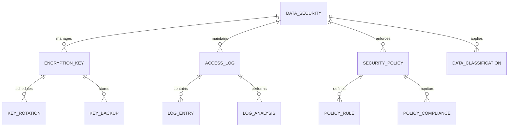
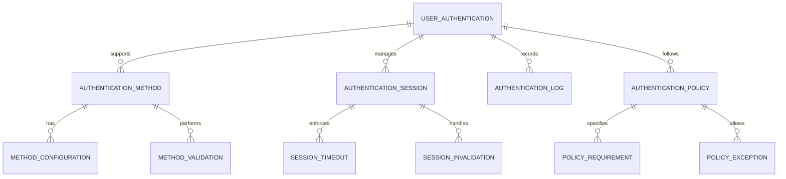
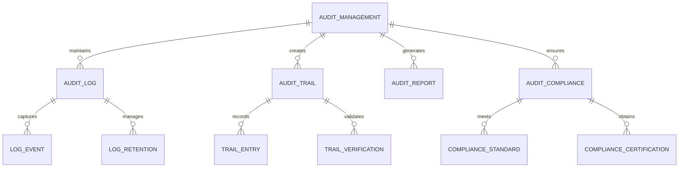
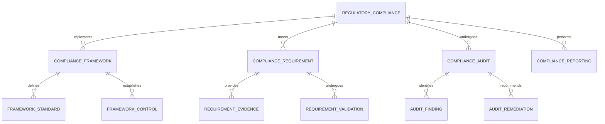
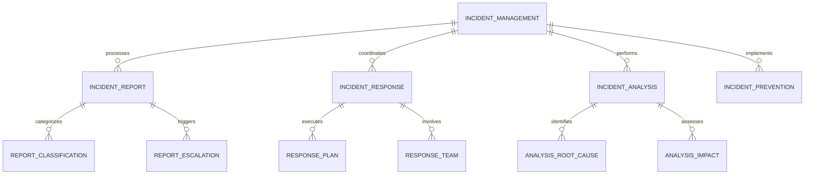
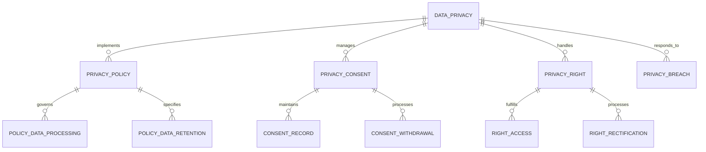
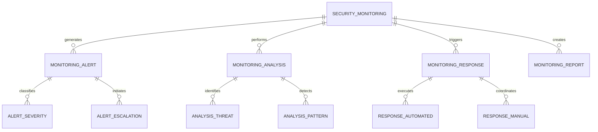

# Security & Compliance Module - Entity Relationship Diagram

## Overview
This ER diagram illustrates the entities and relationships for comprehensive security management and regulatory compliance, ensuring data protection, system security, and adherence to educational standards and privacy regulations.

## Data Security & Protection

## User Authentication & Access Control

## Audit & Compliance Management

## Regulatory Compliance Framework

## Incident Management & Response

## Data Privacy & Protection

## Security Monitoring & Threat Detection

## Entity Descriptions

### **DATA_SECURITY**
**Purpose**: Core data security management and protection
**Key Attributes**:
- `security_id` (Primary Key)
- `school_id` (Foreign Key)
- `security_level` (Basic/Standard/Advanced/Enterprise)
- `encryption_standard` (AES-256/RSA-2048)
- `data_classification_policy` (Public/Internal/Confidential/Restricted)
- `backup_frequency` (Daily/Weekly/Monthly)
- `retention_period_years` (Data retention requirements)
- `last_security_audit` (Date of last security assessment)
- `security_rating` (Current security posture rating)

### **USER_AUTHENTICATION**
**Purpose**: User authentication and access control management
**Key Attributes**:
- `auth_id` (Primary Key)
- `user_id` (Foreign Key)
- `auth_method` (Password/MFA/Biometric/Smart Card)
- `auth_strength` (Weak/Medium/Strong/Very Strong)
- `last_login_date`, `last_password_change`
- `failed_attempt_count`, `account_lockout_until`
- `password_expiry_days`, `mfa_enabled`
- `device_fingerprint`, `geolocation_tracking`
- `session_timeout_minutes`, `max_concurrent_sessions`

### **AUDIT_MANAGEMENT**
**Purpose**: Audit trail management and compliance tracking
**Key Attributes**:
- `audit_id` (Primary Key)
- `school_id` (Foreign Key)
- `audit_type` (System/User/Data/Compliance)
- `audit_scope` (Full/Partial/Module-specific)
- `audit_frequency` (Real-time/Daily/Weekly/Monthly)
- `retention_period_years` (Audit log retention)
- `last_audit_date`, `next_audit_date`
- `audit_status` (Scheduled/In Progress/Completed/Failed)
- `audit_findings_count`, `critical_findings`

### **REGULATORY_COMPLIANCE**
**Purpose**: Regulatory compliance management and certification
**Key Attributes**:
- `compliance_id` (Primary Key)
- `school_id` (Foreign Key)
- `regulation_type` (GDPR/FERPA/SOX/HIPAA/Local Education Laws)
- `compliance_standard` (ISO 27001/SOC 2/PCI DSS)
- `certification_status` (Compliant/Non-compliant/Under Review)
- `last_certification_date`, `next_certification_date`
- `certification_body`, `certification_expiry`
- `compliance_score_percentage`, `risk_level`
- `remediation_plan_required` (Yes/No)

### **INCIDENT_MANAGEMENT**
**Purpose**: Security incident detection, response, and management
**Key Attributes**:
- `incident_id` (Primary Key)
- `school_id` (Foreign Key)
- `incident_type` (Data Breach/Unauthorized Access/Denial of Service/Malware)
- `incident_severity` (Low/Medium/High/Critical)
- `incident_status` (Detected/Investigating/Contained/Resolved/Closed)
- `detection_date`, `reported_date`, `resolved_date`
- `affected_users_count`, `affected_data_types`
- `response_time_minutes`, `resolution_time_hours`
- `incident_cost_estimate`, `lessons_learned`

### **DATA_PRIVACY**
**Purpose**: Data privacy management and GDPR compliance
**Key Attributes**:
- `privacy_id` (Primary Key)
- `school_id` (Foreign Key)
- `privacy_framework` (GDPR/CCPA/PIPEDA/Local Privacy Laws)
- `data_processing_purpose` (Education/Administration/Communication)
- `data_retention_period_years`, `data_minimization_applied`
- `consent_required` (Yes/No), `consent_obtained_percentage`
- `privacy_impact_assessment_completed` (Yes/No)
- `data_subject_rights_requests_count`, `response_time_days`
- `privacy_breach_incidents_count`, `last_privacy_audit`

### **SECURITY_MONITORING**
**Purpose**: Continuous security monitoring and threat detection
**Key Attributes**:
- `monitoring_id` (Primary Key)
- `school_id` (Foreign Key)
- `monitoring_type` (Network/Host/Application/User Behavior)
- `monitoring_tool` (SIEM/IDS/IPS/EDR)
- `alert_threshold` (Low/Medium/High/Critical)
- `false_positive_rate`, `detection_accuracy`
- `monitoring_coverage_percentage`, `response_time_seconds`
- `threat_intelligence_enabled` (Yes/No)
- `automated_response_enabled` (Yes/No)

## Key Relationships

### **Security Management**
- **DATA_SECURITY → ENCRYPTION_KEY**: One security system manages multiple keys
- **DATA_SECURITY → ACCESS_LOG**: One security system maintains access logs
- **ENCRYPTION_KEY → KEY_ROTATION**: One key undergoes rotation schedule
- **ACCESS_LOG → LOG_ANALYSIS**: One log undergoes analysis

### **Authentication Management**
- **USER_AUTHENTICATION → AUTHENTICATION_METHOD**: One authentication supports multiple methods
- **USER_AUTHENTICATION → AUTHENTICATION_SESSION**: One authentication manages sessions
- **AUTHENTICATION_METHOD → METHOD_VALIDATION**: One method performs validation
- **AUTHENTICATION_SESSION → SESSION_TIMEOUT**: One session enforces timeout

### **Audit Management**
- **AUDIT_MANAGEMENT → AUDIT_LOG**: One management maintains multiple logs
- **AUDIT_MANAGEMENT → AUDIT_TRAIL**: One management creates audit trails
- **AUDIT_LOG → LOG_EVENT**: One log captures multiple events
- **AUDIT_TRAIL → TRAIL_VERIFICATION**: One trail undergoes verification

### **Compliance Management**
- **REGULATORY_COMPLIANCE → COMPLIANCE_FRAMEWORK**: One compliance implements frameworks
- **REGULATORY_COMPLIANCE → COMPLIANCE_REQUIREMENT**: One compliance meets requirements
- **COMPLIANCE_FRAMEWORK → FRAMEWORK_STANDARD**: One framework defines standards
- **COMPLIANCE_REQUIREMENT → REQUIREMENT_EVIDENCE**: One requirement provides evidence

### **Incident Management**
- **INCIDENT_MANAGEMENT → INCIDENT_REPORT**: One management processes reports
- **INCIDENT_MANAGEMENT → INCIDENT_RESPONSE**: One management coordinates response
- **INCIDENT_REPORT → REPORT_CLASSIFICATION**: One report categorizes incident
- **INCIDENT_RESPONSE → RESPONSE_PLAN**: One response executes plan

### **Privacy Management**
- **DATA_PRIVACY → PRIVACY_POLICY**: One privacy implements policies
- **DATA_PRIVACY → PRIVACY_CONSENT**: One privacy manages consents
- **PRIVACY_POLICY → POLICY_DATA_PROCESSING**: One policy governs processing
- **PRIVACY_CONSENT → CONSENT_RECORD**: One consent maintains records

### **Monitoring Management**
- **SECURITY_MONITORING → MONITORING_ALERT**: One monitoring generates alerts
- **SECURITY_MONITORING → MONITORING_ANALYSIS**: One monitoring performs analysis
- **MONITORING_ALERT → ALERT_SEVERITY**: One alert classifies severity
- **MONITORING_ANALYSIS → ANALYSIS_THREAT**: One analysis identifies threats

## Business Rules & Validation

### **Security Rules**
- **Access Control**: Multi-factor authentication for sensitive operations
- **Data Encryption**: All sensitive data encrypted at rest and in transit
- **Session Management**: Automatic session timeout and invalidation
- **Password Policies**: Strong password requirements and regular updates

### **Compliance Rules**
- **Regulatory Adherence**: Compliance with all applicable regulations
- **Audit Requirements**: Regular audits and compliance assessments
- **Documentation**: Complete documentation of compliance measures
- **Certification Maintenance**: Regular certification renewal and validation

### **Incident Response Rules**
- **Immediate Response**: Rapid response to security incidents
- **Escalation Procedures**: Clear escalation paths for different incident types
- **Documentation**: Complete incident documentation and analysis
- **Prevention Measures**: Implementation of lessons learned

## Security & Compliance

### **Data Protection**
- **Encryption Standards**: Industry-standard encryption for all data
- **Access Controls**: Role-based access with principle of least privilege
- **Data Masking**: Sensitive data masking in non-production environments
- **Secure Communication**: TLS/SSL encryption for all network communications

### **Regulatory Compliance**
- **GDPR Compliance**: Data subject rights and privacy by design
- **Educational Standards**: Compliance with educational data protection laws
- **Audit Trails**: Immutable audit trails for all system activities
- **Regular Assessments**: Quarterly security and compliance assessments

## Performance Considerations

### **Database Optimization**
- **Partitioning**: Security logs partitioned by date and type
- **Indexing**: Optimized indexes for security queries and audits
- **Archival**: Historical security data moved to archival storage
- **Compression**: Log data compression for storage efficiency

### **Real-time Processing**
- **Alert Processing**: Real-time security alert detection and response
- **Log Analysis**: Continuous log analysis for threat detection
- **Compliance Monitoring**: Real-time compliance status monitoring
- **Incident Response**: Immediate incident detection and notification

### **Scalability Features**
- **Distributed Monitoring**: Multi-server security monitoring deployment
- **Load Balancing**: Distributed processing of security events
- **Auto-scaling**: Automatic scaling based on security event volume
- **Cloud Integration**: Integration with cloud security services

## Implementation Guidelines

### **Security Architecture**
- **Defense in Depth**: Multiple layers of security controls
- **Zero Trust Model**: Never trust, always verify security principle
- **Micro-segmentation**: Network segmentation for security isolation
- **Continuous Monitoring**: 24/7 security monitoring and alerting

### **Compliance Framework**
- **Automated Compliance**: Automated compliance checking and reporting
- **Policy Management**: Centralized security policy management
- **Risk Assessment**: Regular security risk assessments
- **Training Programs**: Security awareness training for all users

### **Incident Response**
- **Automated Response**: Automated response to common security incidents
- **Coordination Tools**: Incident response coordination and communication
- **Forensic Tools**: Digital forensics capabilities for incident investigation
- **Recovery Procedures**: Comprehensive disaster recovery procedures

### **Audit & Reporting**
- **Automated Auditing**: Automated audit log generation and analysis
- **Compliance Reporting**: Automated regulatory compliance reporting
- **Security Dashboards**: Real-time security status dashboards
- **Executive Reporting**: High-level security and compliance reports

This ER diagram provides a comprehensive foundation for implementing a robust security and compliance management system that ensures data protection, regulatory compliance, incident response, and continuous security monitoring while maintaining educational standards and privacy requirements.