# Security & Compliance Module - Comprehensive Architecture Design

## Executive Summary

The Security & Compliance Module provides enterprise-grade security infrastructure and regulatory compliance framework for the Academia Pro platform. This module ensures comprehensive data protection, audit capabilities, threat detection, and compliance automation across all educational operations while maintaining system performance and user experience.

## Current System Analysis

### Architecture Overview
- **Backend**: NestJS with TypeORM and PostgreSQL
- **Frontend**: Next.js with React and Redux Toolkit
- **Authentication**: JWT-based with Passport.js
- **Database**: PostgreSQL with TypeORM entities
- **Deployment**: Docker containerized with nginx

### Existing Security Components
- Basic JWT authentication with role-based access
- Rate limiting with ThrottlerModule
- Global exception handling and logging
- Session management with configurable timeouts

### Integration Points
- **AuthModule**: Extend with MFA and advanced authentication
- **UsersModule**: Integrate with identity governance
- **All Operational Modules**: Apply security policies and monitoring
- **ReportsModule**: Generate security and compliance reports

## Core Architecture Components

### 1. Security Framework & Authentication System

#### Enhanced Authentication Architecture

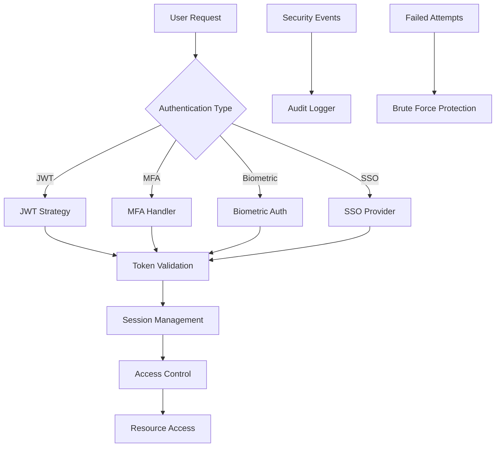

#### Multi-Factor Authentication (MFA)
- **TOTP**: Time-based One-Time Password
- **SMS/Email**: OTP delivery via communication channels
- **Hardware Keys**: FIDO2/WebAuthn support
- **Biometric**: Device-level biometric authentication
- **Risk-based**: Adaptive authentication based on risk scoring

#### Session Security
- **Secure Session Storage**: HttpOnly, Secure, SameSite cookies
- **Session Timeout**: Configurable timeouts with activity tracking
- **Concurrent Session Limits**: Prevent session hijacking
- **Device Fingerprinting**: Track and validate device characteristics

### 2. Authorization & Access Control Mechanisms

#### Role-Based Access Control (RBAC) Enhancement

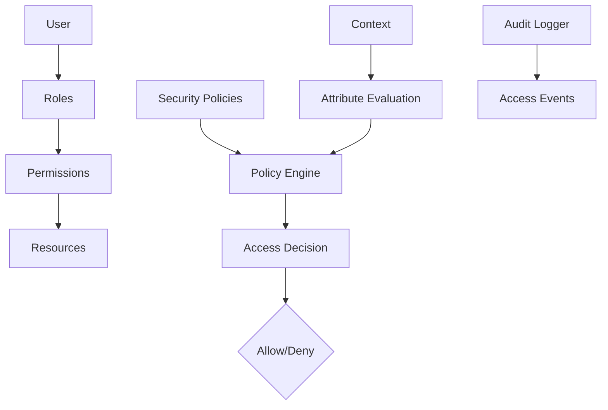

#### Attribute-Based Access Control (ABAC)
- **User Attributes**: Role, department, clearance level
- **Resource Attributes**: Sensitivity, classification, ownership
- **Environment Attributes**: Time, location, device type
- **Action Attributes**: Read, write, delete, execute

#### Policy Decision Point (PDP)
- **Policy Evaluation Engine**: XACML-based policy evaluation
- **Dynamic Policy Updates**: Real-time policy modification
- **Policy Inheritance**: Hierarchical policy application
- **Policy Conflicts Resolution**: Priority-based conflict resolution

### 3. GDPR Compliance & Data Protection Framework

#### Data Protection Architecture

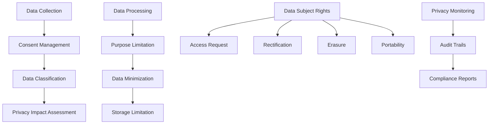

#### GDPR Compliance Components
- **Consent Management System**: Granular consent tracking and management
- **Data Mapping**: Comprehensive data inventory and flow mapping
- **Privacy Impact Assessments**: Automated PIA generation and tracking
- **Data Subject Rights Portal**: Self-service portal for GDPR rights
- **Breach Notification System**: Automated breach detection and reporting
- **Data Protection Officer Tools**: Compliance monitoring and reporting

#### Educational Data Protection
- **FERPA Compliance**: Family Educational Rights and Privacy Act
- **COPPA Compliance**: Children's Online Privacy Protection Act
- **Student Data Privacy**: Age-appropriate data handling
- **Parental Consent Management**: Guardian approval workflows

### 4. Audit Logging & Monitoring System

#### Comprehensive Audit Architecture

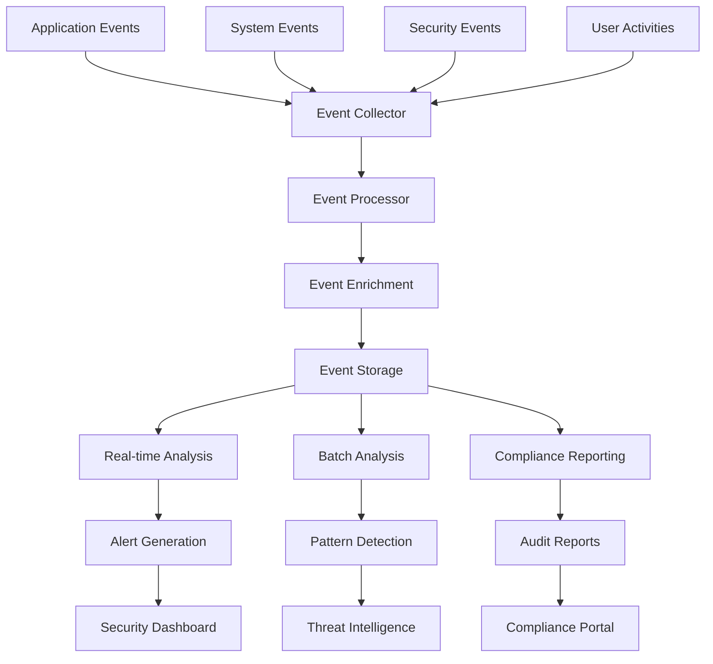

#### Audit Logging Components
- **Event Collection**: Centralized event collection from all modules
- **Event Processing**: Real-time event processing and enrichment
- **Immutable Storage**: Tamper-proof audit log storage
- **Log Retention**: Configurable retention policies and archival
- **Log Analysis**: Automated log analysis and anomaly detection
- **Compliance Reporting**: Automated audit report generation

#### Security Information and Event Management (SIEM)
- **Real-time Monitoring**: Continuous security event monitoring
- **Correlation Engine**: Event correlation and pattern detection
- **Threat Intelligence**: Integration with threat intelligence feeds
- **Automated Response**: Automated incident response workflows
- **Forensic Analysis**: Detailed incident investigation capabilities

### 5. Encryption & Data Security Measures

#### Encryption Architecture

```mermaid
graph TB
    A[Data at Rest] --> B[Database Encryption]
    A --> C[File Encryption]
    A --> D[Backup Encryption]

    E[Data in Transit] --> F[TLS 1.3]
    E --> G[End-to-End Encryption]

    H[Key Management] --> I[Key Generation]
    H --> J[Key Rotation]
    H --> K[Key Storage]
    H --> L[Key Backup]

    M[Encryption Services] --> N[Symmetric Encryption]
    M --> O[Asymmetric Encryption]
    M --> P[Hash Functions]

    Q[Certificate Management] --> R[SSL/TLS Certificates]
    Q --> S[Code Signing Certificates]
    Q --> T[Client Certificates]
```

#### Data Encryption Strategy
- **Database Encryption**: Transparent Data Encryption (TDE) for PostgreSQL
- **Application-Level Encryption**: Field-level encryption for sensitive data
- **File Encryption**: Encrypted file storage with access controls
- **Backup Encryption**: Encrypted backup storage and transmission
- **API Encryption**: End-to-end encryption for sensitive API communications

#### Key Management System
- **Hardware Security Modules (HSM)**: Secure key storage and operations
- **Key Rotation**: Automated key rotation policies
- **Key Backup**: Secure key backup and recovery procedures
- **Certificate Management**: SSL/TLS certificate lifecycle management
- **Quantum-Resistant Algorithms**: Future-proof encryption algorithms

### 6. Security Policies & Compliance Frameworks

#### Policy Management Architecture

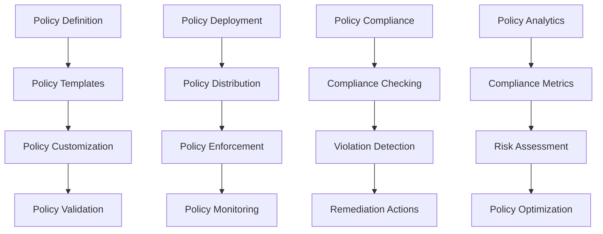

#### Compliance Frameworks
- **ISO 27001**: Information Security Management System
- **NIST Cybersecurity Framework**: Risk-based security framework
- **CIS Controls**: Critical security controls implementation
- **GDPR**: General Data Protection Regulation
- **FERPA**: Family Educational Rights and Privacy Act
- **Local Education Regulations**: Region-specific compliance requirements

### 7. Threat Detection & Response Capabilities

#### Threat Detection Architecture

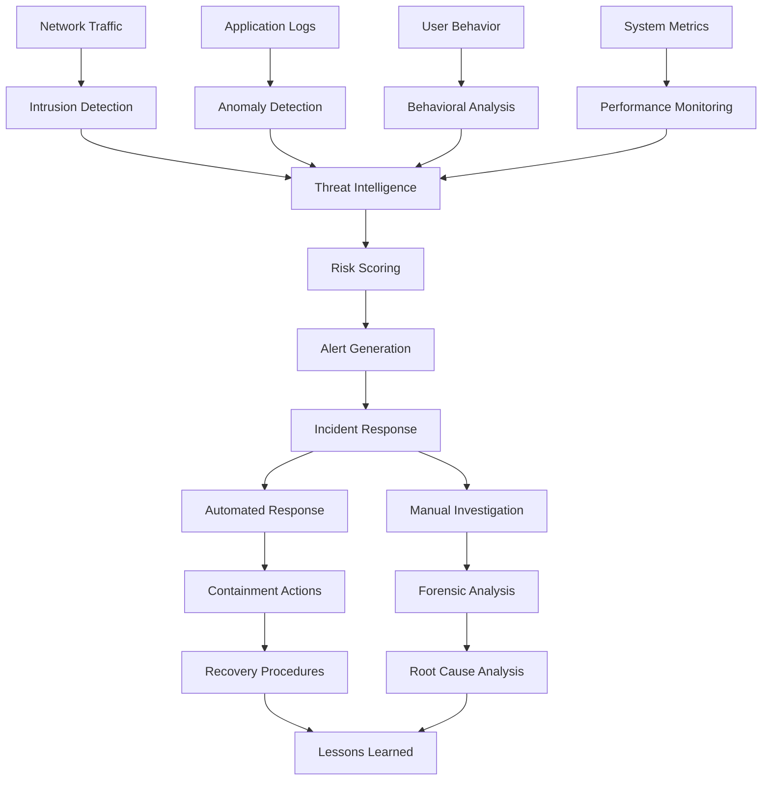

#### Threat Detection Components
- **Intrusion Detection System (IDS)**: Network and host-based intrusion detection
- **Security Information and Event Management (SIEM)**: Centralized security event management
- **Endpoint Detection and Response (EDR)**: Advanced endpoint threat detection
- **User and Entity Behavior Analytics (UEBA)**: Behavioral anomaly detection
- **Vulnerability Management**: Automated vulnerability scanning and assessment

#### Incident Response Framework
- **Incident Classification**: Automated incident severity assessment
- **Response Playbooks**: Pre-defined response procedures for common incidents
- **Coordination Tools**: Incident response team coordination and communication
- **Forensic Tools**: Digital forensics and evidence collection
- **Recovery Procedures**: Comprehensive system recovery and restoration

### 8. Integration Points with Existing Modules

#### Module Integration Architecture

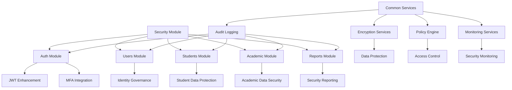

#### Integration Patterns
- **Security Interceptors**: Automatic security policy application
- **Audit Middleware**: Transparent audit logging for all operations
- **Encryption Middleware**: Automatic data encryption/decryption
- **Compliance Hooks**: Compliance checking at key business processes
- **Security Dashboards**: Integrated security monitoring across modules

## Database Schema Design

### Core Security Tables

```sql
-- Security Policies
CREATE TABLE security_policies (
    policy_id UUID PRIMARY KEY DEFAULT gen_random_uuid(),
    policy_name VARCHAR(255) NOT NULL,
    policy_type VARCHAR(100) NOT NULL,
    policy_description TEXT,
    policy_rules JSONB,
    enforcement_level VARCHAR(50) DEFAULT 'mandatory',
    is_active BOOLEAN DEFAULT true,
    created_by UUID REFERENCES users(user_id),
    created_at TIMESTAMP DEFAULT CURRENT_TIMESTAMP,
    updated_at TIMESTAMP DEFAULT CURRENT_TIMESTAMP
);

-- Access Control Rules
CREATE TABLE access_control_rules (
    rule_id UUID PRIMARY KEY DEFAULT gen_random_uuid(),
    policy_id UUID REFERENCES security_policies(policy_id),
    resource_type VARCHAR(100) NOT NULL,
    resource_id UUID,
    user_role VARCHAR(100),
    permission_type VARCHAR(50) NOT NULL,
    condition_expression TEXT,
    is_active BOOLEAN DEFAULT true,
    created_at TIMESTAMP DEFAULT CURRENT_TIMESTAMP
);

-- Audit Logs
CREATE TABLE audit_logs (
    audit_id UUID PRIMARY KEY DEFAULT gen_random_uuid(),
    user_id UUID REFERENCES users(user_id),
    session_id VARCHAR(255),
    action_type VARCHAR(100) NOT NULL,
    resource_type VARCHAR(100) NOT NULL,
    resource_id UUID,
    action_details JSONB,
    ip_address INET,
    user_agent TEXT,
    location_data JSONB,
    risk_score DECIMAL(5,2),
    timestamp TIMESTAMP DEFAULT CURRENT_TIMESTAMP,
    INDEX idx_audit_timestamp (timestamp),
    INDEX idx_audit_user (user_id),
    INDEX idx_audit_resource (resource_type, resource_id)
);

-- Security Events
CREATE TABLE security_events (
    event_id UUID PRIMARY KEY DEFAULT gen_random_uuid(),
    event_type VARCHAR(100) NOT NULL,
    severity_level VARCHAR(50) NOT NULL,
    event_description TEXT,
    source_system VARCHAR(100),
    user_id UUID REFERENCES users(user_id),
    ip_address INET,
    event_data JSONB,
    is_resolved BOOLEAN DEFAULT false,
    resolved_at TIMESTAMP,
    resolved_by UUID REFERENCES users(user_id),
    created_at TIMESTAMP DEFAULT CURRENT_TIMESTAMP
);

-- Compliance Requirements
CREATE TABLE compliance_requirements (
    requirement_id UUID PRIMARY KEY DEFAULT gen_random_uuid(),
    regulation_name VARCHAR(255) NOT NULL,
    regulation_version VARCHAR(50),
    requirement_category VARCHAR(100),
    requirement_description TEXT,
    compliance_criteria JSONB,
    assessment_frequency VARCHAR(50) DEFAULT 'quarterly',
    responsible_party VARCHAR(255),
    last_assessment_date DATE,
    compliance_status VARCHAR(50) DEFAULT 'not_assessed',
    next_assessment_date DATE,
    created_at TIMESTAMP DEFAULT CURRENT_TIMESTAMP
);

-- Encryption Keys
CREATE TABLE encryption_keys (
    key_id UUID PRIMARY KEY DEFAULT gen_random_uuid(),
    key_name VARCHAR(255) NOT NULL,
    key_type VARCHAR(50) NOT NULL,
    key_algorithm VARCHAR(50) NOT NULL,
    key_size INTEGER,
    key_status VARCHAR(50) DEFAULT 'active',
    activation_date DATE,
    expiry_date DATE,
    rotation_required BOOLEAN DEFAULT false,
    created_by UUID REFERENCES users(user_id),
    created_at TIMESTAMP DEFAULT CURRENT_TIMESTAMP
);

-- Security Incidents
CREATE TABLE security_incidents (
    incident_id UUID PRIMARY KEY DEFAULT gen_random_uuid(),
    incident_title VARCHAR(255) NOT NULL,
    incident_description TEXT,
    incident_category VARCHAR(100) NOT NULL,
    severity_level VARCHAR(50) NOT NULL,
    affected_systems JSONB,
    affected_users JSONB,
    incident_start TIMESTAMP,
    incident_discovery TIMESTAMP,
    incident_resolution TIMESTAMP,
    impact_assessment TEXT,
    root_cause_analysis TEXT,
    remediation_actions JSONB,
    reported_by UUID REFERENCES users(user_id),
    assigned_to UUID REFERENCES users(user_id),
    status VARCHAR(50) DEFAULT 'reported',
    created_at TIMESTAMP DEFAULT CURRENT_TIMESTAMP
);
```

## API Architecture

### Security Module API Structure

```
api/security/
├── auth/
│   ├── login
│   ├── logout
│   ├── refresh
│   ├── mfa/
│   │   ├── setup
│   │   ├── verify
│   │   └── disable
│   └── sessions/
│       ├── list
│       ├── revoke
│       └── active
├── policies/
│   ├── list
│   ├── create
│   ├── update
│   ├── delete
│   └── evaluate
├── access-control/
│   ├── roles
│   ├── permissions
│   ├── rules
│   └── decisions
├── audit/
│   ├── logs
│   ├── events
│   ├── reports
│   └── retention
├── compliance/
│   ├── requirements
│   ├── assessments
│   ├── reports
│   └── violations
├── encryption/
│   ├── keys
│   ├── certificates
│   └── policies
├── monitoring/
│   ├── alerts
│   ├── metrics
│   ├── dashboards
│   └── health
└── incidents/
    ├── list
    ├── create
    ├── update
    ├── response
    └── reports
```

### Key API Endpoints

```typescript
// Authentication Enhancement
POST   /api/security/auth/mfa/setup
POST   /api/security/auth/mfa/verify
POST   /api/security/auth/sessions/revoke

// Policy Management
GET    /api/security/policies
POST   /api/security/policies
PUT    /api/security/policies/:id
DELETE /api/security/policies/:id

// Access Control
POST   /api/security/access-control/evaluate
GET    /api/security/access-control/roles
GET    /api/security/access-control/permissions

// Audit & Monitoring
GET    /api/security/audit/logs
POST   /api/security/audit/events
GET    /api/security/monitoring/alerts
GET    /api/security/monitoring/metrics

// Compliance
GET    /api/security/compliance/requirements
POST   /api/security/compliance/assessments
GET    /api/security/compliance/reports

// Incident Response
POST   /api/security/incidents
PUT    /api/security/incidents/:id/response
GET    /api/security/incidents/:id/forensic
```

## Frontend Architecture

### Security Dashboard Components

```typescript
// Security Dashboard Layout
components/security/
├── dashboard/
│   ├── SecurityOverview.tsx
│   ├── ThreatDashboard.tsx
│   ├── ComplianceDashboard.tsx
│   └── AuditDashboard.tsx
├── auth/
│   ├── MFASetup.tsx
│   ├── SessionManager.tsx
│   └── PasswordPolicy.tsx
├── policies/
│   ├── PolicyManager.tsx
│   ├── AccessControl.tsx
│   └── PermissionMatrix.tsx
├── monitoring/
│   ├── AlertCenter.tsx
│   ├── LogViewer.tsx
│   └── MetricsCharts.tsx
├── compliance/
│   ├── ComplianceTracker.tsx
│   ├── AssessmentManager.tsx
│   └── ReportGenerator.tsx
└── incidents/
    ├── IncidentList.tsx
    ├── IncidentDetails.tsx
    └── ResponseWorkflow.tsx
```

### Redux State Management

```typescript
// Security State Structure
interface SecurityState {
  auth: {
    mfa: MFASetup;
    sessions: Session[];
    preferences: AuthPreferences;
  };
  policies: {
    list: SecurityPolicy[];
    current: SecurityPolicy | null;
    evaluation: PolicyEvaluation;
  };
  audit: {
    logs: AuditLog[];
    filters: AuditFilters;
    retention: RetentionPolicy;
  };
  compliance: {
    requirements: ComplianceRequirement[];
    assessments: ComplianceAssessment[];
    reports: ComplianceReport[];
  };
  monitoring: {
    alerts: SecurityAlert[];
    metrics: SecurityMetrics;
    health: SystemHealth;
  };
  incidents: {
    list: SecurityIncident[];
    current: SecurityIncident | null;
    response: IncidentResponse;
  };
}
```

## Security Monitoring & Alerting

### Real-time Monitoring Architecture

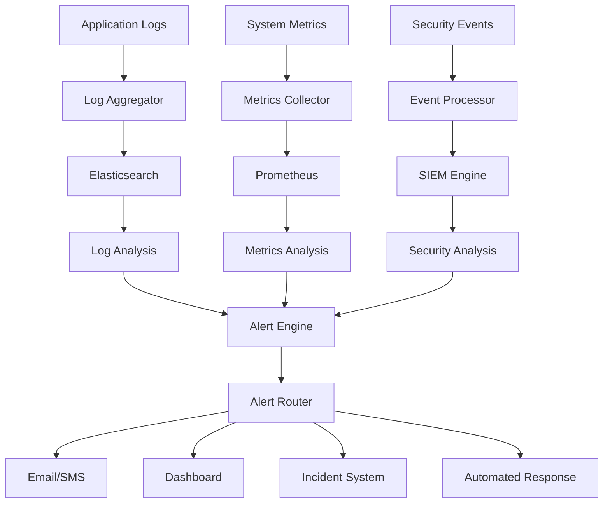

### Alert Classification & Response

- **Critical**: Immediate response required (system compromise, data breach)
- **High**: Urgent attention needed (suspicious activity, policy violation)
- **Medium**: Review within 24 hours (configuration drift, unusual patterns)
- **Low**: Monitor and log (informational security events)
- **Info**: Log only (normal security operations)

## Compliance Reporting Framework

### Automated Compliance Reporting

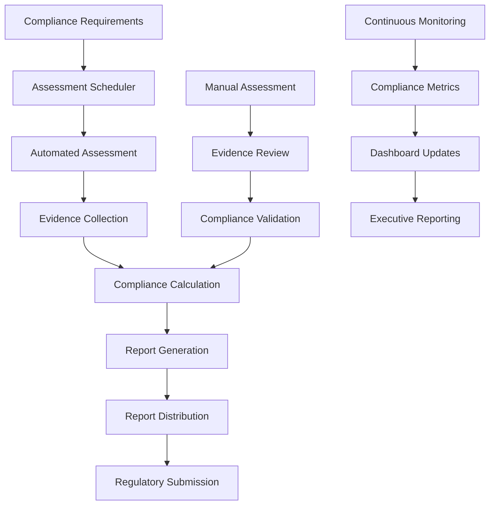

### Compliance Report Types

- **GDPR Compliance Report**: Data protection compliance status
- **Security Audit Report**: Technical security assessment results
- **Access Control Report**: User access and permission audit
- **Incident Response Report**: Security incident handling effectiveness
- **Data Privacy Report**: Privacy program effectiveness metrics
- **Regulatory Compliance Report**: Overall regulatory compliance status

## Incident Response Procedures

### Incident Response Workflow

```mermaid
stateDiagram-v2
    [*] --> Detected
    Detected --> Classified
    Classified --> Contained
    Contained --> Eradicated
    Eradicated --> Recovered
    Recovered --> LessonsLearned
    LessonsLearned --> [*]

    Classified --> FalsePositive
    FalsePositive --> [*]

    state Detected as "Incident Detected"
    state Classified as "Severity Assessment"
    state Contained as "Containment Actions"
    state Eradicated as "Threat Eradication"
    state Recovered as "System Recovery"
    state LessonsLearned as "Post-Incident Review"
```

### Incident Response Teams

- **Security Operations Center (SOC)**: 24/7 monitoring and initial response
- **Incident Response Team (IRT)**: Technical incident investigation and containment
- **Communications Team**: Stakeholder notification and coordination
- **Legal/Compliance Team**: Regulatory notification and legal guidance
- **Executive Team**: Strategic decision-making and resource allocation

## Deployment & Infrastructure Security

### Secure Deployment Architecture

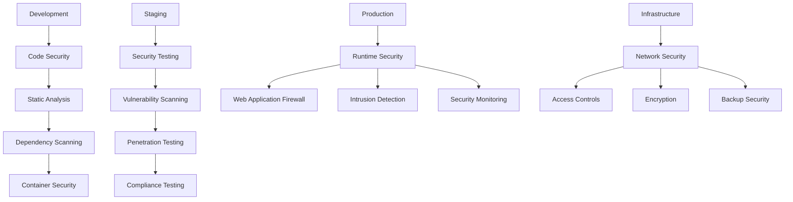

### Infrastructure Security Measures

- **Network Segmentation**: Isolated security zones and DMZs
- **Web Application Firewall (WAF)**: Application-layer attack protection
- **Intrusion Detection/Prevention**: Network and host-based security
- **Container Security**: Docker image scanning and runtime protection
- **Infrastructure as Code Security**: Automated security validation
- **Secrets Management**: Secure credential and key management

## Performance & Scalability Considerations

### Security Performance Optimization

- **Asynchronous Processing**: Non-blocking security operations
- **Caching Strategies**: Security policy and rule caching
- **Database Optimization**: Indexed security queries and partitioned tables
- **Load Balancing**: Distributed security processing
- **Rate Limiting**: Adaptive rate limiting based on risk scoring

### Scalability Architecture

- **Microservices Security**: Decentralized security enforcement
- **Event-Driven Security**: Asynchronous security event processing
- **Distributed Caching**: Global security policy distribution
- **Horizontal Scaling**: Auto-scaling security services
- **Global Distribution**: Multi-region security infrastructure

## Risk Management & Business Continuity

### Risk Assessment Framework

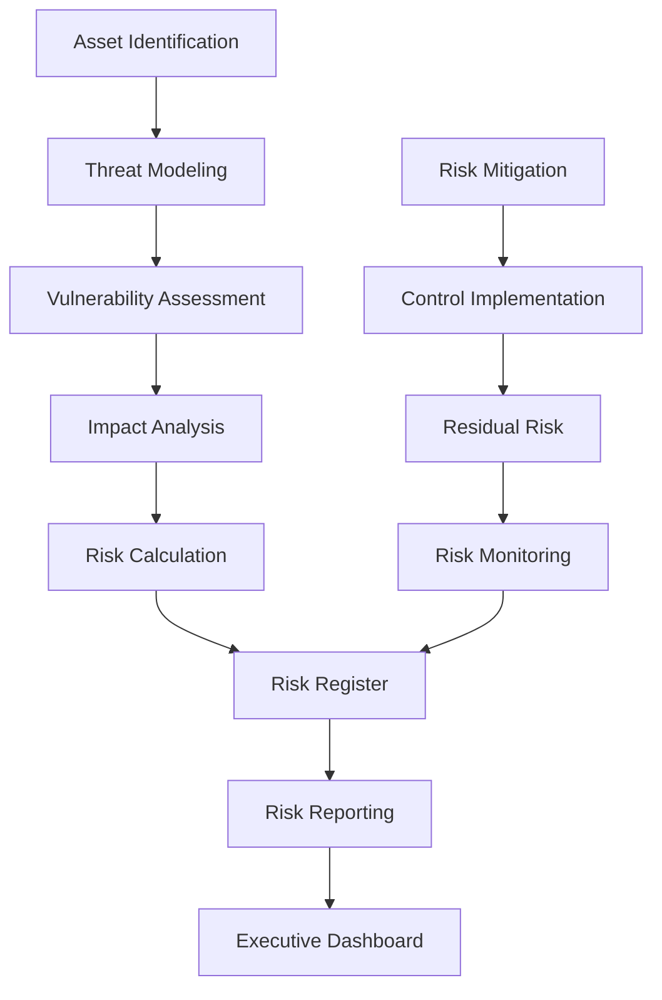

### Business Continuity Planning

- **Risk Assessment**: Comprehensive risk identification and evaluation
- **Business Impact Analysis**: Critical business process prioritization
- **Continuity Strategies**: Alternate processing methods and facilities
- **Recovery Objectives**: RTO/RPO definition and testing
- **Plan Maintenance**: Regular testing and updating of continuity plans

## Future Enhancements

### Advanced Security Features

- **AI-Powered Threat Detection**: Machine learning for anomaly detection
- **Zero-Trust Architecture**: Complete identity verification for all access
- **Blockchain Security**: Immutable audit trails and secure credentialing
- **Quantum-Resistant Encryption**: Future-proof cryptographic algorithms
- **IoT Security Integration**: Connected device security management

### Compliance Automation

- **Automated Compliance Monitoring**: Real-time compliance status tracking
- **Predictive Compliance**: AI-powered compliance risk prediction
- **Regulatory Change Management**: Automated regulatory update processing
- **Compliance as Code**: Infrastructure and policy as code for compliance
- **Continuous Compliance**: DevSecOps integration for ongoing compliance

## Implementation Roadmap

### Phase 1: Foundation (Weeks 1-2)
- Security framework and authentication enhancements
- Basic audit logging and access control
- Database schema implementation

### Phase 2: Core Security (Weeks 3-4)
- Advanced authentication and authorization
- Comprehensive audit and monitoring system
- Encryption and data protection implementation

### Phase 3: Compliance & Response (Weeks 5-6)
- GDPR compliance and data protection framework
- Incident response and threat detection
- Compliance reporting and automation

### Phase 4: Integration & Optimization (Weeks 7-8)
- Module integration and testing
- Performance optimization and scalability
- Security monitoring and alerting

### Phase 5: Advanced Features (Weeks 9-10)
- AI-powered security features
- Advanced compliance automation
- Zero-trust architecture implementation

## Success Metrics

### Security Metrics
- **Mean Time to Detect (MTTD)**: < 15 minutes for critical incidents
- **Mean Time to Respond (MTTR)**: < 1 hour for security incidents
- **False Positive Rate**: < 5% for security alerts
- **Security Incident Frequency**: < 5 incidents per year

### Compliance Metrics
- **Compliance Assessment Score**: > 95% for all regulations
- **Audit Finding Rate**: < 10 findings per annual audit
- **Data Breach Response Time**: < 24 hours notification
- **Privacy Request Fulfillment**: 100% within regulatory deadlines

### Performance Metrics
- **Security Overhead**: < 5% performance impact
- **System Availability**: > 99.9% uptime
- **Audit Log Processing**: < 1 second average latency
- **API Response Time**: < 100ms for security operations

This comprehensive architecture provides a robust, scalable, and compliant security framework that protects the Academia Pro platform while ensuring regulatory compliance and maintaining operational efficiency. The modular design allows for phased implementation and future enhancements while providing enterprise-grade security capabilities from day one.