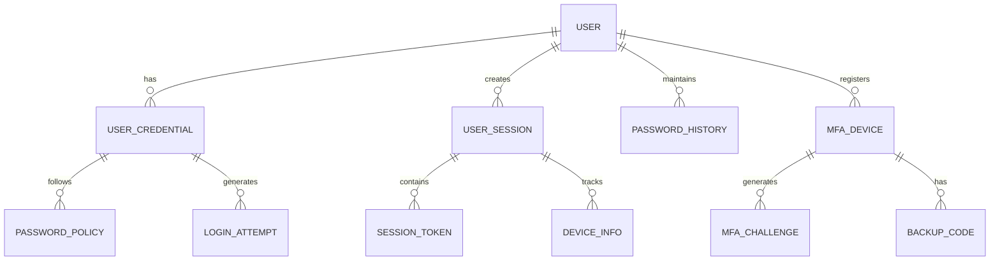
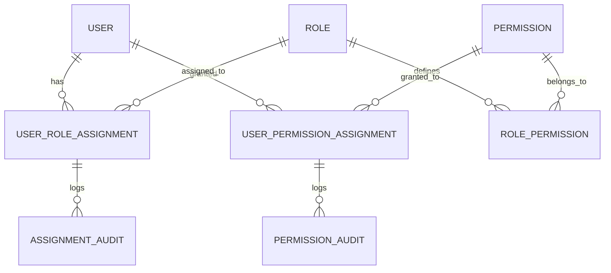
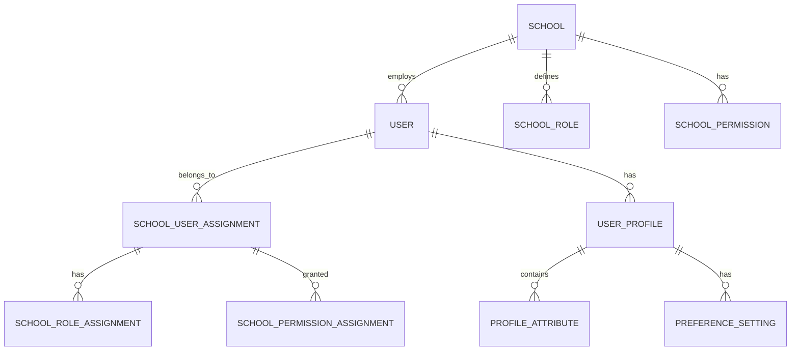
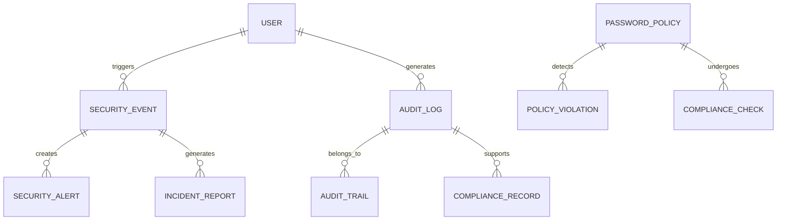
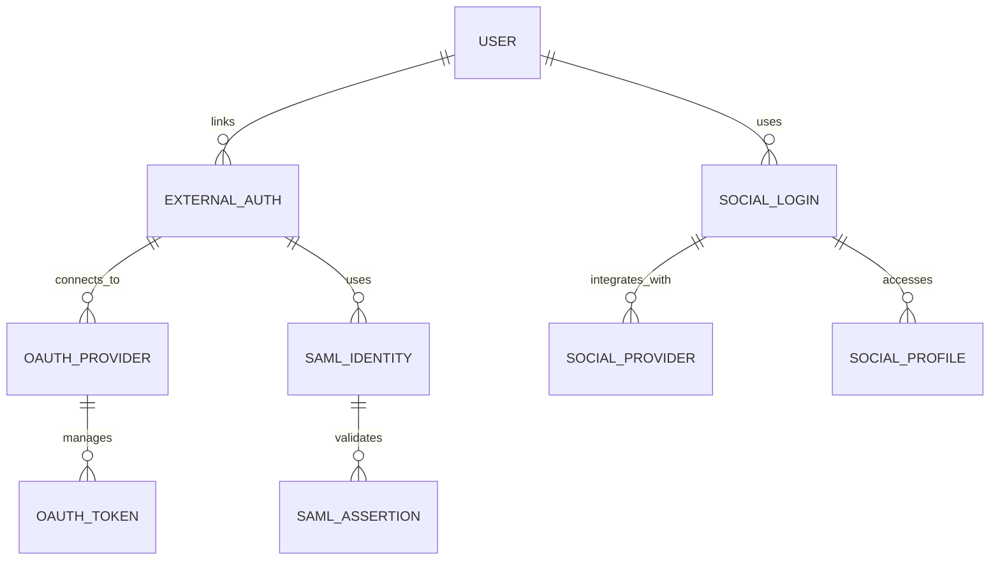
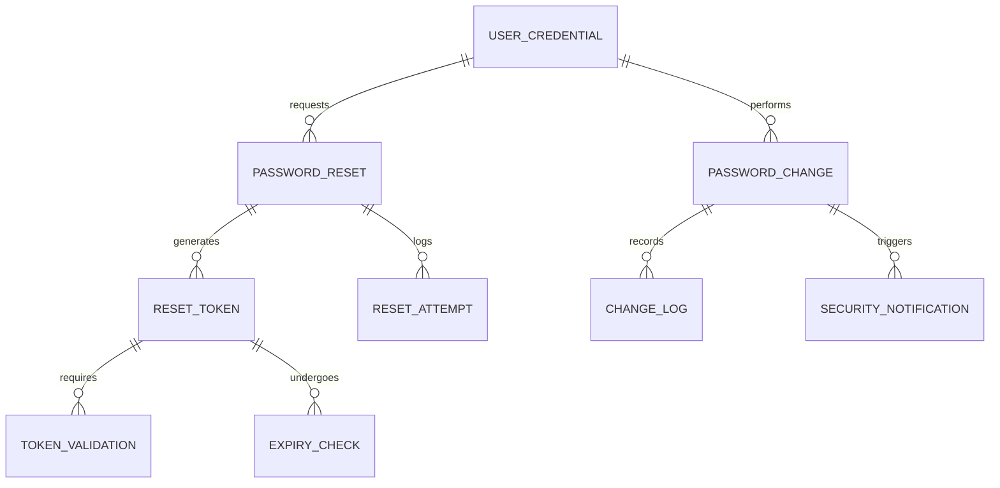

# User Management & Authentication - Entity Relationship Diagram

## Overview
This ER diagram illustrates the entities and relationships for comprehensive user management and authentication system, supporting multi-school architecture with role-based access control and secure authentication mechanisms.

## Core Authentication Entities

## Role-Based Access Control

## Multi-School User Management

## Security & Compliance

## Third-Party Authentication

## Password & Security Management

## Entity Descriptions

### **USER**
**Purpose**: Central entity for system users across all schools
**Key Attributes**:
- `user_id` (Primary Key)
- `username`, `email` (Unique identifiers)
- `first_name`, `last_name` (Personal details)
- `phone`, `date_of_birth` (Contact & demographics)
- `status` (Active/Inactive/Suspended/Locked)
- `created_date`, `updated_date` (Audit fields)
- `last_login`, `login_count` (Activity tracking)

### **USER_CREDENTIAL**
**Purpose**: Authentication credentials management
**Key Attributes**:
- `credential_id` (Primary Key)
- `user_id` (Foreign Key)
- `password_hash` (Encrypted password)
- `password_salt` (Salt for encryption)
- `password_changed_date` (Last change timestamp)
- `failed_attempt_count` (Failed login tracking)
- `lockout_until` (Account lockout timestamp)
- `credential_status` (Active/Expired/Compromised)

### **USER_SESSION**
**Purpose**: Active user session management
**Key Attributes**:
- `session_id` (Primary Key)
- `user_id` (Foreign Key)
- `session_token` (JWT token)
- `ip_address` (Login source)
- `user_agent` (Device/browser info)
- `login_time`, `last_activity` (Session timing)
- `is_active` (Session status)
- `expiry_time` (Session expiration)

### **ROLE**
**Purpose**: System-defined roles for access control
**Key Attributes**:
- `role_id` (Primary Key)
- `name` (Role name: Super Admin, School Admin, etc.)
- `description` (Role purpose and scope)
- `is_system_role` (System vs custom roles)
- `hierarchy_level` (Role precedence)
- `created_date`, `updated_date` (Audit fields)
- `status` (Active/Inactive)

### **PERMISSION**
**Purpose**: Granular permissions for system access
**Key Attributes**:
- `permission_id` (Primary Key)
- `name` (Permission identifier)
- `resource` (Module/resource name)
- `action` (CRUD operations: Create, Read, Update, Delete)
- `description` (Permission description)
- `is_system_permission` (System vs custom)
- `scope` (Global/School/User level)

### **USER_ROLE_ASSIGNMENT**
**Purpose**: User-role relationship management
**Key Attributes**:
- `assignment_id` (Primary Key)
- `user_id` (Foreign Key)
- `role_id` (Foreign Key)
- `school_id` (Foreign Key - for school-specific roles)
- `assigned_by` (User who assigned)
- `assigned_date` (Assignment timestamp)
- `expiry_date` (Optional expiration)
- `status` (Active/Inactive)

### **MFA_DEVICE**
**Purpose**: Multi-factor authentication device management
**Key Attributes**:
- `device_id` (Primary Key)
- `user_id` (Foreign Key)
- `device_type` (SMS/Authenticator/Email)
- `device_identifier` (Phone/Authenticator ID)
- `is_verified` (Device verification status)
- `created_date`, `last_used` (Activity tracking)
- `backup_codes` (Emergency access codes)

### **SECURITY_EVENT**
**Purpose**: Security incident tracking and response
**Key Attributes**:
- `event_id` (Primary Key)
- `user_id` (Foreign Key - affected user)
- `event_type` (Login Failure/Unauthorized Access/etc.)
- `severity` (Low/Medium/High/Critical)
- `description` (Event details)
- `source_ip`, `user_agent` (Origin tracking)
- `timestamp` (Event time)
- `status` (Detected/Investigating/Resolved)

### **AUDIT_LOG**
**Purpose**: Comprehensive activity logging for compliance
**Key Attributes**:
- `audit_id` (Primary Key)
- `user_id` (Foreign Key - who performed action)
- `action` (What was done)
- `resource` (Which entity was affected)
- `resource_id` (Specific record ID)
- `old_values`, `new_values` (Before/after data)
- `ip_address`, `user_agent` (Origin tracking)
- `timestamp` (When it happened)
- `session_id` (Related session)

### **EXTERNAL_AUTH**
**Purpose**: Third-party authentication integration
**Key Attributes**:
- `auth_id` (Primary Key)
- `user_id` (Foreign Key)
- `provider` (Google/Microsoft/SSO Provider)
- `provider_user_id` (External user identifier)
- `access_token`, `refresh_token` (OAuth tokens)
- `token_expiry` (Token expiration)
- `last_sync` (Last synchronization)
- `status` (Active/Inactive)

## Key Relationships

### **Authentication Flow**
- **USER → USER_CREDENTIAL**: One user has one set of credentials
- **USER_CREDENTIAL → LOGIN_ATTEMPT**: One credential generates multiple login attempts
- **USER → USER_SESSION**: One user can have multiple active sessions
- **USER_SESSION → SESSION_TOKEN**: One session contains one token

### **Role-Based Access Control**
- **USER → USER_ROLE_ASSIGNMENT**: One user can have multiple role assignments
- **ROLE → ROLE_PERMISSION**: One role defines multiple permissions
- **USER_ROLE_ASSIGNMENT → ASSIGNMENT_AUDIT**: Each assignment is logged for audit

### **Multi-Factor Authentication**
- **USER → MFA_DEVICE**: One user can register multiple MFA devices
- **MFA_DEVICE → MFA_CHALLENGE**: One device generates multiple challenges
- **MFA_CHALLENGE → BACKUP_CODE**: Emergency access through backup codes

### **Security & Compliance**
- **USER → SECURITY_EVENT**: One user can trigger multiple security events
- **SECURITY_EVENT → SECURITY_ALERT**: Critical events create alerts
- **USER → AUDIT_LOG**: One user generates multiple audit entries

### **Third-Party Integration**
- **USER → EXTERNAL_AUTH**: One user can link multiple external accounts
- **EXTERNAL_AUTH → OAUTH_PROVIDER**: One auth links to one provider
- **OAUTH_PROVIDER → OAUTH_TOKEN**: One provider manages tokens

## Security Architecture

### **Password Security**
- **bcrypt hashing** with salt for password storage
- **Password history** to prevent reuse
- **Complexity requirements** and regular rotation
- **Brute force protection** with account lockout

### **Session Management**
- **JWT tokens** with expiration and refresh mechanisms
- **Session invalidation** on logout or security events
- **Concurrent session limits** per user
- **Device fingerprinting** for security

### **Multi-Factor Authentication**
- **SMS-based MFA** for mobile verification
- **Authenticator apps** (Google Authenticator, Authy)
- **Email-based MFA** as secondary option
- **Hardware security keys** for high-security users

### **Access Control**
- **Role-Based Access Control** (RBAC) with hierarchical roles
- **Attribute-Based Access Control** (ABAC) for fine-grained permissions
- **Context-aware access** based on time, location, and device
- **Permission inheritance** from higher-level roles

## Performance Considerations

### **Authentication Performance**
- **Token caching** in Redis for fast validation
- **Session storage** optimization
- **Database connection pooling** for credential checks
- **CDN integration** for global authentication

### **Audit & Logging Performance**
- **Asynchronous logging** to prevent blocking
- **Log aggregation** and compression
- **Indexed search** for audit queries
- **Archival strategies** for long-term storage

### **Scalability Features**
- **Horizontal scaling** for authentication services
- **Load balancing** across multiple instances
- **Database sharding** for user data distribution
- **Caching layers** for frequently accessed data

## Implementation Guidelines

### **Database Design**
- **Partitioned user tables** for scalability
- **Encrypted sensitive fields** (passwords, tokens)
- **Indexed search fields** for performance
- **Audit trail partitioning** by date

### **API Design**
- **Stateless authentication** with JWT
- **Rate limiting** to prevent abuse
- **CORS configuration** for web applications
- **API versioning** for backward compatibility

### **Security Best Practices**
- **Regular security audits** and penetration testing
- **Automated vulnerability scanning**
- **Security headers** and CSP implementation
- **Regular dependency updates** and patches

### **Compliance Requirements**
- **GDPR compliance** for data subject rights
- **CCPA compliance** for California users
- **SOX compliance** for financial data access
- **Regular compliance assessments**

This ER diagram provides a comprehensive foundation for implementing a secure, scalable, and compliant user management and authentication system that supports multi-school operations with enterprise-grade security features.