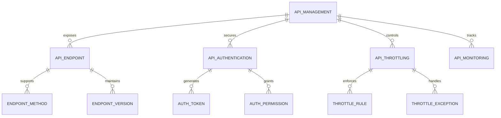
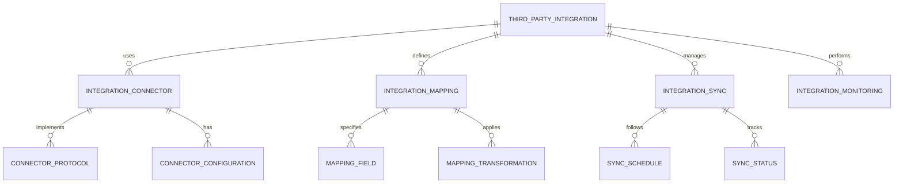
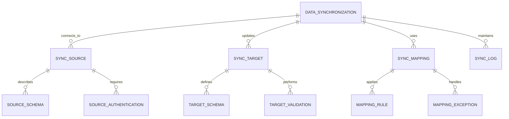
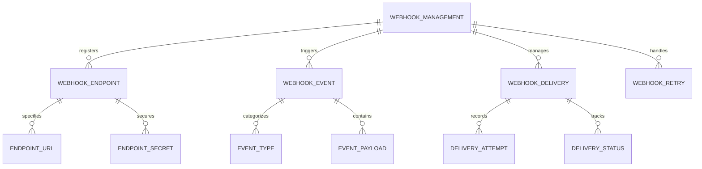
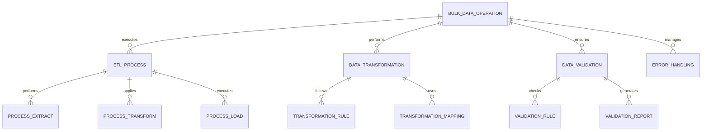
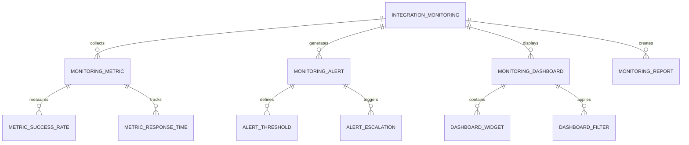
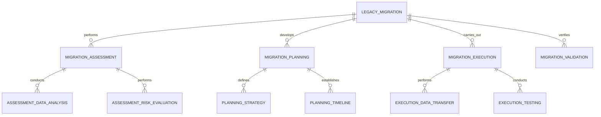

# Integration Capabilities - Entity Relationship Diagram

## Overview
This ER diagram illustrates the entities and relationships for comprehensive system integration capabilities, enabling seamless connectivity with third-party systems, APIs, data synchronization, and external service integration for the Academia Pro platform.

## API Management & Configuration

## Third-Party System Integration

## Data Synchronization & Exchange

## Webhook & Event-Driven Integration

## Bulk Data Operations & ETL

## Integration Monitoring & Analytics

## Legacy System Migration

## Entity Descriptions

### **API_MANAGEMENT**
**Purpose**: API gateway and management for all system integrations
**Key Attributes**:
- `api_id` (Primary Key)
- `school_id` (Foreign Key)
- `api_name`, `api_description`
- `api_version` (v1.0/v2.0/v3.0)
- `api_status` (Development/Testing/Production/Deprecated)
- `base_url`, `documentation_url`
- `rate_limit_per_minute`, `rate_limit_per_hour`
- `authentication_required` (Yes/No)
- `last_updated_date`, `created_by`

### **THIRD_PARTY_INTEGRATION**
**Purpose**: Third-party system integration management and configuration
**Key Attributes**:
- `integration_id` (Primary Key)
- `school_id` (Foreign Key)
- `system_name` (Payment Gateway/Email Service/SMS Provider)
- `system_type` (Financial/Communication/Administrative)
- `integration_status` (Active/Inactive/Testing/Error)
- `connection_type` (API/Webhook/Database/File)
- `sync_frequency` (Real-time/Hourly/Daily/Weekly)
- `last_sync_date`, `next_sync_date`
- `error_count`, `success_rate_percentage`

### **DATA_SYNCHRONIZATION**
**Purpose**: Data synchronization between Academia Pro and external systems
**Key Attributes**:
- `sync_id` (Primary Key)
- `school_id` (Foreign Key)
- `source_system`, `target_system`
- `sync_type` (Full/Incremental/Delta)
- `sync_direction` (Unidirectional/Bidirectional)
- `sync_schedule` (Manual/Scheduled/Event-driven)
- `last_sync_status` (Success/Failed/Partial/In Progress)
- `records_processed`, `records_failed`
- `sync_duration_minutes`, `next_sync_time`

### **WEBHOOK_MANAGEMENT**
**Purpose**: Webhook configuration and event-driven notifications
**Key Attributes**:
- `webhook_id` (Primary Key)
- `school_id` (Foreign Key)
- `webhook_name`, `webhook_description`
- `endpoint_url`, `http_method` (POST/PUT)
- `content_type` (JSON/XML/Form-data)
- `secret_key` (For webhook verification)
- `retry_policy` (Retry count and intervals)
- `active_status` (Yes/No)
- `created_date`, `last_triggered`

### **BULK_DATA_OPERATION**
**Purpose**: Bulk data import, export, and transformation operations
**Key Attributes**:
- `operation_id` (Primary Key)
- `school_id` (Foreign Key)
- `operation_type` (Import/Export/Transform/Migration)
- `data_source` (File/Database/API)
- `file_format` (CSV/Excel/XML/JSON)
- `record_count`, `file_size_mb`
- `operation_status` (Queued/Processing/Completed/Failed)
- `start_time`, `end_time`, `duration_minutes`
- `success_count`, `error_count`, `skipped_count`

### **INTEGRATION_MONITORING**
**Purpose**: Integration performance monitoring and health tracking
**Key Attributes**:
- `monitoring_id` (Primary Key)
- `school_id` (Foreign Key)
- `integration_type` (API/Webhook/Database/File)
- `monitoring_period` (Hourly/Daily/Weekly/Monthly)
- `uptime_percentage`, `response_time_ms`
- `success_rate_percentage`, `error_rate_percentage`
- `data_volume_processed`, `throughput_rate`
- `last_check_date`, `alert_threshold_breached`

### **LEGACY_MIGRATION**
**Purpose**: Legacy system data migration and transition management
**Key Attributes**:
- `migration_id` (Primary Key)
- `school_id` (Foreign Key)
- `legacy_system_name`, `legacy_system_version`
- `migration_scope` (Full/Partial/Module-specific)
- `migration_status` (Planning/Assessment/Execution/Validation/Completed)
- `data_volume_estimate`, `complexity_level`
- `migration_start_date`, `migration_end_date`
- `risk_assessment_score`, `rollback_plan_available`

## Key Relationships

### **API Management**
- **API_MANAGEMENT → API_ENDPOINT**: One API management exposes multiple endpoints
- **API_MANAGEMENT → API_AUTHENTICATION**: One API management secures with authentication
- **API_ENDPOINT → ENDPOINT_METHOD**: One endpoint supports multiple HTTP methods
- **API_AUTHENTICATION → AUTH_TOKEN**: One authentication generates tokens

### **Third-Party Integration**
- **THIRD_PARTY_INTEGRATION → INTEGRATION_CONNECTOR**: One integration uses connectors
- **THIRD_PARTY_INTEGRATION → INTEGRATION_MAPPING**: One integration defines mappings
- **INTEGRATION_CONNECTOR → CONNECTOR_PROTOCOL**: One connector implements protocols
- **INTEGRATION_MAPPING → MAPPING_FIELD**: One mapping specifies fields

### **Data Synchronization**
- **DATA_SYNCHRONIZATION → SYNC_SOURCE**: One synchronization connects to sources
- **DATA_SYNCHRONIZATION → SYNC_TARGET**: One synchronization updates targets
- **SYNC_SOURCE → SOURCE_SCHEMA**: One source describes schema
- **SYNC_TARGET → TARGET_VALIDATION**: One target performs validation

### **Webhook Management**
- **WEBHOOK_MANAGEMENT → WEBHOOK_ENDPOINT**: One management registers endpoints
- **WEBHOOK_MANAGEMENT → WEBHOOK_EVENT**: One management triggers events
- **WEBHOOK_ENDPOINT → ENDPOINT_URL**: One endpoint specifies URL
- **WEBHOOK_EVENT → EVENT_PAYLOAD**: One event contains payload

### **Bulk Data Operations**
- **BULK_DATA_OPERATION → ETL_PROCESS**: One operation executes ETL processes
- **BULK_DATA_OPERATION → DATA_TRANSFORMATION**: One operation performs transformations
- **ETL_PROCESS → PROCESS_EXTRACT**: One process performs extraction
- **DATA_TRANSFORMATION → TRANSFORMATION_RULE**: One transformation follows rules

### **Integration Monitoring**
- **INTEGRATION_MONITORING → MONITORING_METRIC**: One monitoring collects metrics
- **INTEGRATION_MONITORING → MONITORING_ALERT**: One monitoring generates alerts
- **MONITORING_METRIC → METRIC_SUCCESS_RATE**: One metric measures success rate
- **MONITORING_ALERT → ALERT_THRESHOLD**: One alert defines thresholds

### **Legacy Migration**
- **LEGACY_MIGRATION → MIGRATION_ASSESSMENT**: One migration performs assessment
- **LEGACY_MIGRATION → MIGRATION_PLANNING**: One migration develops planning
- **MIGRATION_ASSESSMENT → ASSESSMENT_DATA_ANALYSIS**: One assessment conducts analysis
- **MIGRATION_PLANNING → PLANNING_STRATEGY**: One planning defines strategy

## Business Rules & Validation

### **API Management Rules**
- **Version Control**: API versioning for backward compatibility
- **Rate Limiting**: Protection against API abuse and overload
- **Authentication**: Secure API access with proper authentication
- **Documentation**: Comprehensive API documentation and examples

### **Integration Rules**
- **Data Consistency**: Ensuring data integrity across integrated systems
- **Error Handling**: Robust error handling and recovery mechanisms
- **Security**: Secure data transmission and access controls
- **Monitoring**: Continuous monitoring of integration health

### **Synchronization Rules**
- **Conflict Resolution**: Handling data conflicts during synchronization
- **Data Validation**: Validating data before and after synchronization
- **Rollback Capability**: Ability to rollback failed synchronizations
- **Audit Trail**: Complete audit trail of all synchronization activities

## Security & Compliance

### **Integration Security**
- **API Security**: OAuth 2.0, JWT, and API key authentication
- **Data Encryption**: End-to-end encryption for data in transit
- **Access Control**: Granular access controls for integration endpoints
- **Audit Logging**: Comprehensive logging of all integration activities

### **Data Privacy**
- **Consent Management**: Proper handling of data sharing consents
- **Data Minimization**: Only sharing necessary data for integration
- **Retention Policies**: Clear data retention and deletion policies
- **Cross-border Compliance**: Compliance with international data transfer regulations

## Performance Considerations

### **API Performance**
- **Caching**: API response caching for improved performance
- **Load Balancing**: Distribution of API requests across multiple servers
- **Rate Limiting**: Intelligent rate limiting based on usage patterns
- **Optimization**: Query optimization and database indexing

### **Integration Performance**
- **Asynchronous Processing**: Non-blocking integration operations
- **Batch Processing**: Efficient bulk data operations
- **Queue Management**: Message queuing for reliable data transfer
- **Compression**: Data compression for efficient transmission

### **Scalability Features**
- **Horizontal Scaling**: Ability to scale integration services horizontally
- **Auto-scaling**: Automatic scaling based on integration load
- **Microservices**: Modular integration services for flexibility
- **Cloud Integration**: Integration with cloud services for scalability

## Implementation Guidelines

### **API Design**
- **RESTful Principles**: Following REST architectural principles
- **OpenAPI Specification**: Comprehensive API documentation
- **Versioning Strategy**: Clear API versioning and deprecation policies
- **Testing Framework**: Automated API testing and validation

### **Integration Patterns**
- **Event-Driven Architecture**: Event-driven integration for real-time updates
- **Message Queues**: Asynchronous message processing for reliability
- **Circuit Breaker**: Fault tolerance patterns for integration resilience
- **Saga Pattern**: Distributed transaction management for complex integrations

### **Data Integration**
- **ETL Best Practices**: Extract, Transform, Load best practices
- **Data Quality**: Data quality checks and validation rules
- **Master Data Management**: Centralized management of master data
- **Data Governance**: Data governance policies and procedures

### **Monitoring & Alerting**
- **Health Checks**: Automated health checks for all integrations
- **Performance Monitoring**: Real-time performance monitoring and alerting
- **Error Tracking**: Comprehensive error tracking and analysis
- **Business Metrics**: Business-level integration metrics and KPIs

This ER diagram provides a comprehensive foundation for implementing robust integration capabilities that enable seamless connectivity, data synchronization, API management, and third-party system integration while ensuring security, performance, and scalability.