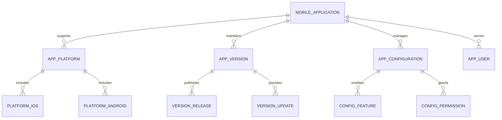
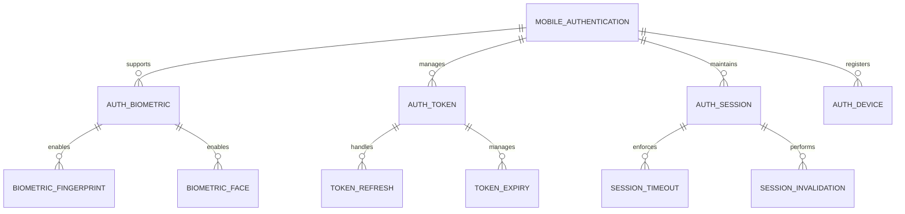
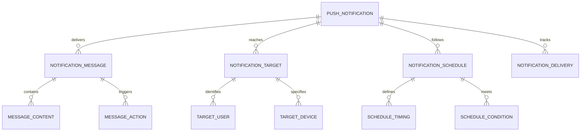
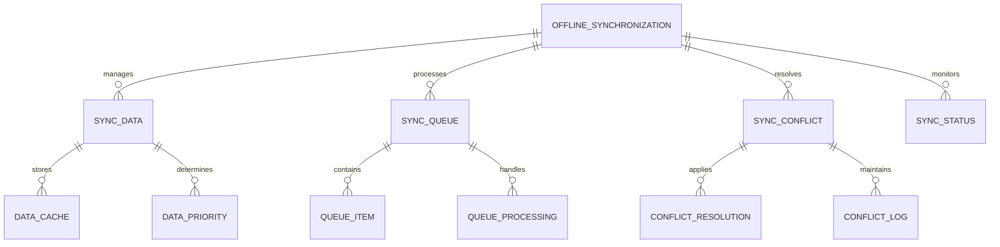
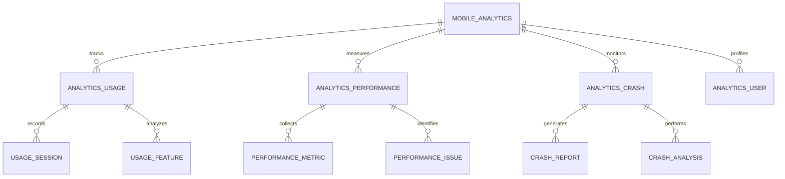
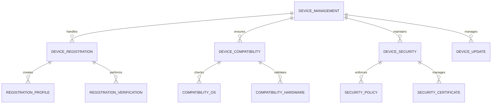
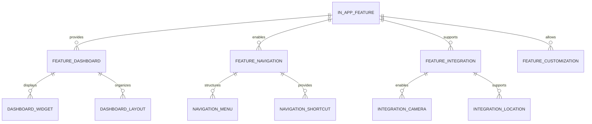

# Mobile Applications - Entity Relationship Diagram

## Overview
This ER diagram illustrates the entities and relationships for comprehensive mobile application ecosystem, supporting native mobile apps for parents, students, and staff with offline capabilities, push notifications, and seamless integration with the main Academia Pro platform.

## Mobile Application Management

## User Authentication & Security

## Push Notification System

## Offline Data Synchronization

## Mobile App Analytics & Usage

## Device Management & Compatibility

## In-App Features & Functionality

## Entity Descriptions

### **MOBILE_APPLICATION**
**Purpose**: Mobile application management and distribution
**Key Attributes**:
- `app_id` (Primary Key)
- `school_id` (Foreign Key)
- `app_name`, `app_description`
- `app_type` (Parent/Student/Staff/Universal)
- `app_store_id_ios`, `app_store_id_android`
- `current_version`, `minimum_version_supported`
- `download_count`, `active_users_count`
- `last_updated_date`, `published_date`
- `app_status` (Development/Beta/Production/Deprecated)

### **MOBILE_AUTHENTICATION**
**Purpose**: Mobile-specific authentication and security
**Key Attributes**:
- `auth_id` (Primary Key)
- `user_id` (Foreign Key)
- `device_id` (Unique device identifier)
- `auth_method` (Biometric/PIN/Pattern/Password)
- `biometric_type` (Fingerprint/FaceID/TouchID)
- `token_expiry_hours`, `refresh_token_validity`
- `max_failed_attempts`, `lockout_duration_minutes`
- `last_login_date`, `device_trust_level`
- `jailbreak_detection` (Yes/No)

### **PUSH_NOTIFICATION**
**Purpose**: Push notification management and delivery
**Key Attributes**:
- `notification_id` (Primary Key)
- `school_id` (Foreign Key)
- `user_id` (Foreign Key)
- `device_token` (FCM/APNs device token)
- `notification_title`, `notification_message`
- `notification_type` (Alert/Update/Reminder/Action)
- `priority` (Low/Normal/High/Critical)
- `scheduled_time`, `expiry_time`
- `delivery_status` (Pending/Sent/Delivered/Failed)
- `action_url`, `action_type`

### **OFFLINE_SYNCHRONIZATION**
**Purpose**: Offline data management and synchronization
**Key Attributes**:
- `sync_id` (Primary Key)
- `user_id` (Foreign Key)
- `device_id` (Foreign Key)
- `sync_type` (Full/Incremental/Delta)
- `data_categories` (Academic/Communication/Administrative)
- `cache_size_mb`, `sync_frequency_hours`
- `last_sync_date`, `next_sync_date`
- `sync_status` (Idle/Syncing/Completed/Failed)
- `conflict_count`, `resolution_method`

### **MOBILE_ANALYTICS**
**Purpose**: Mobile application usage analytics and performance monitoring
**Key Attributes**:
- `analytics_id` (Primary Key)
- `app_id` (Foreign Key)
- `user_id` (Foreign Key)
- `session_start_time`, `session_end_time`
- `device_model`, `os_version`, `app_version`
- `screen_views_count`, `feature_usage_count`
- `crash_count`, `error_count`, `performance_score`
- `network_type`, `battery_level`, `location_enabled`
- `user_engagement_score`, `retention_rate`

### **DEVICE_MANAGEMENT**
**Purpose**: Mobile device registration and management
**Key Attributes**:
- `device_id` (Primary Key)
- `user_id` (Foreign Key)
- `device_uuid` (Unique device identifier)
- `device_model`, `device_manufacturer`
- `os_type`, `os_version`
- `app_version`, `registration_date`
- `device_status` (Active/Inactive/Blocked)
- `security_level` (Standard/Enhanced/Maximum)
- `last_sync_date`, `push_enabled`

### **IN_APP_FEATURE**
**Purpose**: In-app features and functionality management
**Key Attributes**:
- `feature_id` (Primary Key)
- `app_id` (Foreign Key)
- `feature_name`, `feature_description`
- `feature_category` (Core/Advanced/Premium)
- `access_level` (All/Premium/Staff Only)
- `feature_status` (Enabled/Disabled/Beta)
- `usage_count`, `popularity_score`
- `last_used_date`, `feature_version`
- `dependencies` (Required features/modules)

## Key Relationships

### **Application Management**
- **MOBILE_APPLICATION → APP_PLATFORM**: One application supports multiple platforms
- **MOBILE_APPLICATION → APP_VERSION**: One application maintains versions
- **APP_PLATFORM → PLATFORM_IOS**: One platform includes iOS support
- **APP_VERSION → VERSION_RELEASE**: One version publishes releases

### **Authentication Management**
- **MOBILE_AUTHENTICATION → AUTH_BIOMETRIC**: One authentication supports biometrics
- **MOBILE_AUTHENTICATION → AUTH_TOKEN**: One authentication manages tokens
- **AUTH_BIOMETRIC → BIOMETRIC_FINGERPRINT**: One biometric enables fingerprint
- **AUTH_TOKEN → TOKEN_REFRESH**: One token handles refresh

### **Notification Management**
- **PUSH_NOTIFICATION → NOTIFICATION_MESSAGE**: One notification delivers messages
- **PUSH_NOTIFICATION → NOTIFICATION_TARGET**: One notification reaches targets
- **NOTIFICATION_MESSAGE → MESSAGE_CONTENT**: One message contains content
- **NOTIFICATION_TARGET → TARGET_DEVICE**: One target specifies device

### **Offline Synchronization**
- **OFFLINE_SYNCHRONIZATION → SYNC_DATA**: One synchronization manages data
- **OFFLINE_SYNCHRONIZATION → SYNC_QUEUE**: One synchronization processes queue
- **SYNC_DATA → DATA_CACHE**: One data stores in cache
- **SYNC_QUEUE → QUEUE_PROCESSING**: One queue handles processing

### **Analytics Management**
- **MOBILE_ANALYTICS → ANALYTICS_USAGE**: One analytics tracks usage
- **MOBILE_ANALYTICS → ANALYTICS_PERFORMANCE**: One analytics measures performance
- **ANALYTICS_USAGE → USAGE_SESSION**: One usage records sessions
- **ANALYTICS_PERFORMANCE → PERFORMANCE_METRIC**: One performance collects metrics

### **Device Management**
- **DEVICE_MANAGEMENT → DEVICE_REGISTRATION**: One management handles registration
- **DEVICE_MANAGEMENT → DEVICE_COMPATIBILITY**: One management ensures compatibility
- **DEVICE_REGISTRATION → REGISTRATION_PROFILE**: One registration creates profile
- **DEVICE_COMPATIBILITY → COMPATIBILITY_OS**: One compatibility checks OS

### **Feature Management**
- **IN_APP_FEATURE → FEATURE_DASHBOARD**: One feature provides dashboard
- **IN_APP_FEATURE → FEATURE_NAVIGATION**: One feature enables navigation
- **FEATURE_DASHBOARD → DASHBOARD_WIDGET**: One dashboard displays widgets
- **FEATURE_NAVIGATION → NAVIGATION_MENU**: One navigation structures menu

## Business Rules & Validation

### **Application Management Rules**
- **Version Compatibility**: Backward compatibility across app versions
- **Platform Standards**: Compliance with iOS and Android app store guidelines
- **Update Policies**: Clear update policies and user communication
- **Distribution Control**: Controlled distribution based on user roles

### **Authentication Rules**
- **Biometric Security**: Secure biometric data handling and storage
- **Token Management**: Proper token lifecycle management and rotation
- **Device Trust**: Device registration and trust level assessment
- **Session Security**: Secure session management and timeout policies

### **Notification Rules**
- **User Consent**: Explicit user consent for push notifications
- **Content Guidelines**: Appropriate content and timing for notifications
- **Delivery Reliability**: Reliable notification delivery with retry mechanisms
- **Privacy Protection**: Protection of user data in notifications

## Security & Compliance

### **Mobile Security**
- **App Security**: Code obfuscation and reverse engineering protection
- **Data Encryption**: End-to-end encryption for sensitive data
- **Certificate Pinning**: SSL certificate pinning for secure connections
- **Jailbreak Detection**: Detection and handling of jailbroken devices

### **Privacy Compliance**
- **Data Collection**: Minimal data collection with user consent
- **Location Privacy**: Proper handling of location data and permissions
- **Data Retention**: Clear data retention and deletion policies
- **User Rights**: Implementation of data subject rights (GDPR/CCPA)

## Performance Considerations

### **Mobile Performance**
- **App Size Optimization**: Minimal app size with on-demand features
- **Battery Optimization**: Efficient battery usage and background processing
- **Memory Management**: Efficient memory usage and leak prevention
- **Network Optimization**: Efficient network usage and offline capabilities

### **Synchronization Performance**
- **Incremental Sync**: Efficient incremental data synchronization
- **Conflict Resolution**: Automated conflict resolution for data consistency
- **Queue Management**: Efficient processing of synchronization queues
- **Bandwidth Optimization**: Compressed data transmission and caching

### **Scalability Features**
- **Push Notification Scaling**: Scalable push notification infrastructure
- **Analytics Processing**: Efficient processing of mobile analytics data
- **Device Management**: Scalable device registration and management
- **Content Delivery**: Efficient content delivery and caching

## Implementation Guidelines

### **Native App Development**
- **Platform-Specific Features**: Leveraging platform-specific capabilities
- **Cross-Platform Frameworks**: React Native, Flutter, or native development
- **Code Architecture**: Clean architecture with separation of concerns
- **Testing Strategy**: Comprehensive testing including device testing

### **Offline-First Architecture**
- **Data Caching**: Intelligent caching strategies for offline access
- **Sync Strategies**: Conflict-free synchronization with server
- **User Experience**: Seamless offline-to-online transition
- **Data Consistency**: Maintaining data consistency across offline/online states

### **Push Notification Implementation**
- **Notification Services**: Integration with FCM (Android) and APNs (iOS)
- **Rich Notifications**: Support for rich media and interactive notifications
- **Scheduled Notifications**: Time-based and event-driven notifications
- **Analytics Integration**: Notification delivery and engagement analytics

### **Mobile Analytics & Monitoring**
- **Crash Reporting**: Comprehensive crash reporting and analysis
- **Performance Monitoring**: Real-time performance monitoring and alerting
- **User Behavior Analytics**: Understanding user behavior and preferences
- **A/B Testing**: Feature testing and optimization capabilities

This ER diagram provides a comprehensive foundation for implementing a robust mobile application ecosystem that supports native apps for parents, students, and staff with offline capabilities, push notifications, and seamless integration with the main Academia Pro platform.