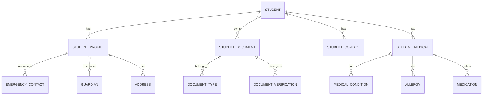
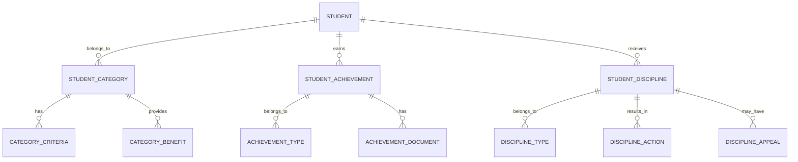
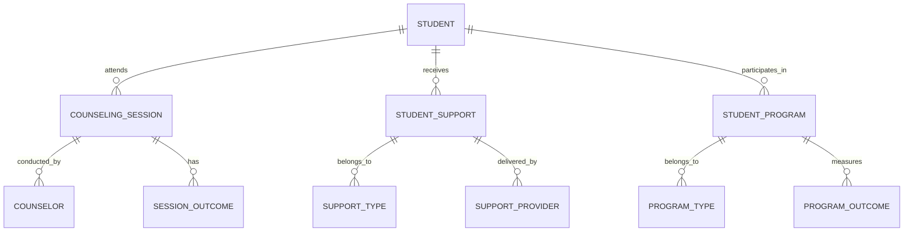
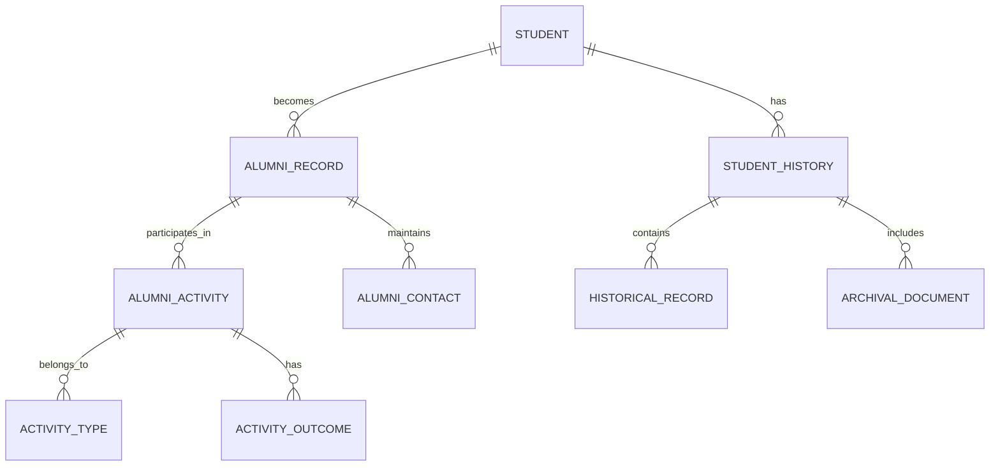

# Student Management Module - Entity Relationship Diagram

## Overview
This ER diagram illustrates the entities and relationships for comprehensive student lifecycle management, from enrollment through graduation, including academic records, health information, and disciplinary tracking.

## Core Student Entities



## Academic Enrollment & Progression

```mermaid
erDiagram
    STUDENT ||--o{ ENROLLMENT : participates_in
    STUDENT ||--o{ STUDENT_TRANSFER : undergoes
    STUDENT ||--o{ STUDENT_WITHDRAWAL : experiences

    ENROLLMENT ||--o{ CLASS : belongs_to
    ENROLLMENT ||--o{ ACADEMIC_YEAR : occurs_in
    ENROLLMENT ||--o{ GRADE : receives

    STUDENT_TRANSFER ||--o{ TRANSFER_DOCUMENT : requires
    STUDENT_TRANSFER ||--o{ TRANSFER_REASON : has

    STUDENT_WITHDRAWAL ||--o{ WITHDRAWAL_REASON : has
    STUDENT_WITHDRAWAL ||--o{ EXIT_INTERVIEW : includes
```

## Student Categories & Classifications



## Student Support & Development



## Alumni & Historical Records



## Entity Descriptions

### **STUDENT**
**Purpose**: Central entity for student information and lifecycle management
**Key Attributes**:
- `student_id` (Primary Key)
- `school_id` (Foreign Key)
- `admission_number` (Unique student identifier)
- `first_name`, `last_name`, `date_of_birth`
- `gender`, `nationality`, `religion`
- `admission_date`, `expected_graduation`
- `current_status` (Active/Alumni/Transferred/Withdrawn)
- `photo_path` (Student photo)

### **STUDENT_PROFILE**
**Purpose**: Comprehensive student profile information
**Key Attributes**:
- `profile_id` (Primary Key)
- `student_id` (Foreign Key)
- `blood_group`, `height`, `weight`
- `previous_school`, `transfer_reason`
- `special_needs`, `learning_disability`
- `transport_required`, `hostel_required`
- `scholarship_status`, `financial_aid`

### **STUDENT_DOCUMENT**
**Purpose**: Document management for student records
**Key Attributes**:
- `document_id` (Primary Key)
- `student_id` (Foreign Key)
- `document_type` (Birth Certificate/Transcript/Passport)
- `document_number`, `issue_date`, `expiry_date`
- `file_path`, `file_size`, `upload_date`
- `verification_status` (Pending/Verified/Rejected)
- `verified_by`, `verified_date`

### **STUDENT_MEDICAL**
**Purpose**: Medical information and health records
**Key Attributes**:
- `medical_id` (Primary Key)
- `student_id` (Foreign Key)
- `insurance_provider`, `policy_number`
- `emergency_contact_name`, `emergency_phone`
- `doctor_name`, `doctor_phone`, `hospital_name`
- `medical_conditions`, `allergies`, `medications`
- `last_checkup_date`, `next_checkup_date`

### **ENROLLMENT**
**Purpose**: Student enrollment in classes and academic years
**Key Attributes**:
- `enrollment_id` (Primary Key)
- `student_id` (Foreign Key)
- `class_id` (Foreign Key)
- `academic_year_id` (Foreign Key)
- `enrollment_date`, `withdrawal_date`
- `enrollment_type` (Regular/Transfer/Lateral)
- `status` (Active/Completed/Withdrawn)
- `final_grade`, `grade_points`

### **STUDENT_TRANSFER**
**Purpose**: Student transfer between schools or classes
**Key Attributes**:
- `transfer_id` (Primary Key)
- `student_id` (Foreign Key)
- `from_school`, `to_school`
- `from_class`, `to_class`
- `transfer_date`, `effective_date`
- `transfer_reason` (Academic/Administrative/Family)
- `transfer_documents`, `approval_status`

### **STUDENT_CATEGORY**
**Purpose**: Student categorization for benefits and programs
**Key Attributes**:
- `category_id` (Primary Key)
- `student_id` (Foreign Key)
- `category_type` (Merit/Need-based/Sports/Special Needs)
- `category_level` (Bronze/Silver/Gold/Platinum)
- `assigned_date`, `review_date`, `expiry_date`
- `assigned_by`, `approval_required`
- `benefits_eligible`, `restrictions_apply`

### **STUDENT_ACHIEVEMENT**
**Purpose**: Academic and extracurricular achievements tracking
**Key Attributes**:
- `achievement_id` (Primary Key)
- `student_id` (Foreign Key)
- `achievement_type` (Academic/Sports/Cultural/Leadership)
- `achievement_title`, `achievement_description`
- `achievement_date`, `recognition_level`
- `awarding_body`, `certificate_number`
- `points_earned`, `badge_awarded`

### **STUDENT_DISCIPLINE**
**Purpose**: Disciplinary actions and behavioral tracking
**Key Attributes**:
- `discipline_id` (Primary Key)
- `student_id` (Foreign Key)
- `incident_date`, `reported_date`
- `incident_type` (Minor/Major/Severe)
- `incident_description`, `witnesses`
- `disciplinary_action` (Warning/Suspension/Counseling)
- `action_duration`, `probation_period`
- `assigned_by`, `approved_by`

### **COUNSELING_SESSION**
**Purpose**: Student counseling and support sessions
**Key Attributes**:
- `session_id` (Primary Key)
- `student_id` (Foreign Key)
- `counselor_id` (Foreign Key)
- `session_date`, `session_duration`
- `session_type` (Academic/Personal/Career)
- `session_topic`, `session_outcome`
- `follow_up_required`, `follow_up_date`
- `confidentiality_level`, `parent_involved`

### **ALUMNI_RECORD**
**Purpose**: Post-graduation alumni information management
**Key Attributes**:
- `alumni_id` (Primary Key)
- `student_id` (Foreign Key)
- `graduation_date`, `graduation_year`
- `final_gpa`, `rank_in_class`, `valedictorian_status`
- `degree_earned`, `major_field`, `minor_field`
- `contact_email`, `contact_phone`, `current_address`
- `current_occupation`, `further_education`

## Key Relationships

### **Student Lifecycle**
- **STUDENT → STUDENT_PROFILE**: One student has one comprehensive profile
- **STUDENT → STUDENT_DOCUMENT**: One student owns multiple documents
- **STUDENT → STUDENT_MEDICAL**: One student has medical information
- **STUDENT → ENROLLMENT**: One student participates in multiple enrollments

### **Academic Progression**
- **ENROLLMENT → CLASS**: One enrollment belongs to one class
- **ENROLLMENT → ACADEMIC_YEAR**: One enrollment occurs in one academic year
- **ENROLLMENT → GRADE**: One enrollment receives final grades
- **STUDENT → STUDENT_TRANSFER**: One student may undergo multiple transfers

### **Student Development**
- **STUDENT → STUDENT_CATEGORY**: One student belongs to multiple categories
- **STUDENT → STUDENT_ACHIEVEMENT**: One student earns multiple achievements
- **STUDENT → STUDENT_DISCIPLINE**: One student may receive disciplinary actions
- **STUDENT → COUNSELING_SESSION**: One student attends multiple counseling sessions

### **Support Services**
- **STUDENT → STUDENT_SUPPORT**: One student receives multiple support services
- **STUDENT → STUDENT_PROGRAM**: One student participates in multiple programs
- **COUNSELING_SESSION → COUNSELOR**: One session conducted by one counselor
- **STUDENT_SUPPORT → SUPPORT_PROVIDER**: One support delivered by one provider

### **Historical Records**
- **STUDENT → ALUMNI_RECORD**: One student becomes one alumni record
- **STUDENT → STUDENT_HISTORY**: One student has comprehensive historical records
- **ALUMNI_RECORD → ALUMNI_ACTIVITY**: One alumni participates in multiple activities

## Data Integrity & Validation

### **Required Fields**
- **STUDENT**: Basic personal information, admission details
- **STUDENT_PROFILE**: Emergency contacts, medical information
- **ENROLLMENT**: Class assignment, academic year
- **STUDENT_DOCUMENT**: Identity documents, academic records

### **Business Rules**
- **Unique Constraints**: Admission number unique per school
- **Age Validation**: Students must be within school age range
- **Document Verification**: Critical documents must be verified
- **Transfer Validation**: Transfer requires approval and documentation

### **Data Consistency**
- **Referential Integrity**: All foreign key relationships maintained
- **Status Synchronization**: Student status affects related records
- **Date Validation**: Chronological order of events maintained
- **Duplicate Prevention**: Multiple enrollments in same class prevented

## Security & Privacy Considerations

### **Data Classification**
- **Public Data**: Basic student information for directories
- **Internal Data**: Academic records, contact information
- **Confidential Data**: Medical records, disciplinary actions
- **Restricted Data**: Psychological evaluations, family situations

### **Access Controls**
- **Role-Based Access**: Different access levels for different user types
- **Context-Aware Access**: Access based on relationship to student
- **Audit Logging**: All access to student data logged
- **Data Encryption**: Sensitive data encrypted at rest and in transit

### **Privacy Compliance**
- **GDPR Compliance**: Data subject rights for students and parents
- **FERPA Compliance**: Educational record privacy protection
- **Parental Consent**: Required for data sharing and processing
- **Data Retention**: Defined retention periods for different data types

## Performance Considerations

### **Database Optimization**
- **Partitioning**: Student records partitioned by school and academic year
- **Indexing**: Optimized indexes on frequently queried fields
- **Caching**: Student profile caching for quick access
- **Archival**: Historical data moved to archival storage

### **Query Optimization**
- **Student Search**: Full-text search on student names and IDs
- **Bulk Operations**: Efficient bulk enrollment and updates
- **Reporting Queries**: Optimized for academic performance reports
- **Real-time Updates**: Efficient handling of concurrent updates

### **Scalability Features**
- **Horizontal Scaling**: Database sharding by school
- **Read Replicas**: Separate read instances for reporting
- **Load Balancing**: Distributed processing of student operations
- **Caching Strategy**: Multi-level caching for student data

## Implementation Guidelines

### **Data Migration**
- **Legacy System Integration**: Import existing student data
- **Data Validation**: Comprehensive validation during migration
- **Duplicate Handling**: Identify and merge duplicate records
- **Data Quality**: Clean and standardize imported data

### **API Design**
- **RESTful Endpoints**: Standard CRUD operations for student management
- **GraphQL Support**: Flexible queries for complex student data
- **Bulk Operations**: Efficient handling of bulk student operations
- **Real-time Updates**: WebSocket support for live student data

### **User Interface**
- **Student Dashboard**: Self-service student information access
- **Parent Portal**: Comprehensive child information access
- **Admin Interface**: Bulk operations and advanced management
- **Mobile Support**: Mobile-optimized student management

### **Integration Points**
- **Government Systems**: Integration with education ministry databases
- **Health Systems**: Connection with student health records
- **Transportation**: Integration with school bus management
- **Library Systems**: Connection with library borrowing records

This ER diagram provides a comprehensive foundation for implementing a robust student management system that handles the complete student lifecycle from enrollment to alumni status, with proper data integrity, security, and scalability considerations.