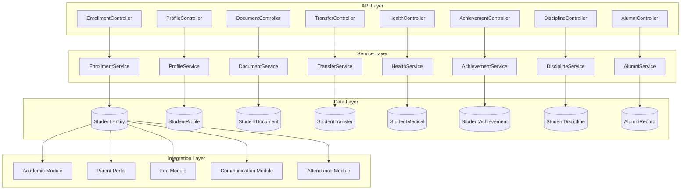
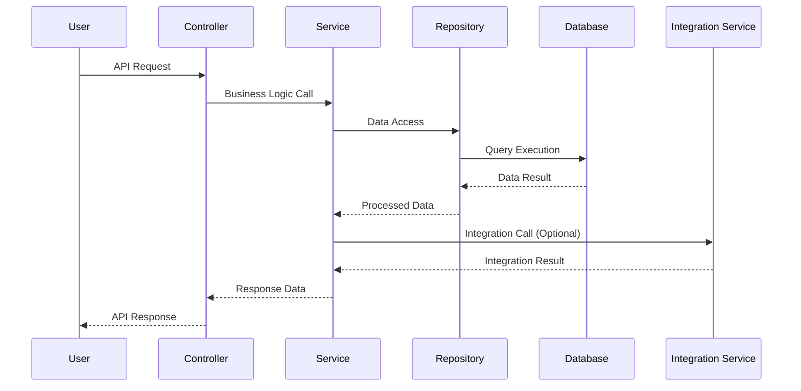
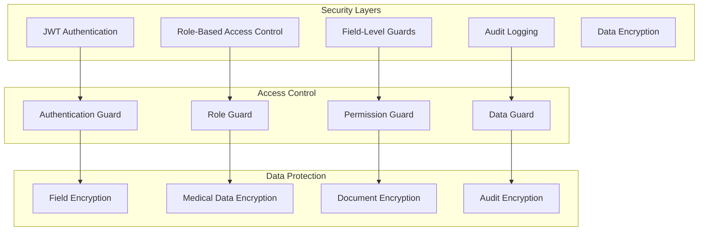

# Student Management Module - Comprehensive Architecture Design

## Overview

The Student Management module provides comprehensive student lifecycle management from enrollment through graduation, including academic records, personal information, and administrative processes. This design builds upon the existing basic student infrastructure and extends it with complete functionality for enterprise-level school management.

## 1. Module Structure and Organization

### **Core Architecture Pattern**
```
Student Management Module
├── Controllers (API Endpoints)
│   ├── EnrollmentController - Admission & registration
│   ├── ProfileController - Student profile management
│   ├── TransferController - Student transfers & withdrawals
│   ├── HealthController - Medical records & emergency contacts
│   ├── AchievementController - Academic & extracurricular achievements
│   ├── DisciplineController - Disciplinary actions & tracking
│   ├── DocumentController - Document upload & management
│   └── AlumniController - Post-graduation alumni management
├── Services (Business Logic)
│   ├── EnrollmentService - Enrollment workflow management
│   ├── ProfileService - Profile data management
│   ├── TransferService - Transfer & withdrawal processing
│   ├── HealthService - Medical record management
│   ├── AchievementService - Achievement tracking
│   ├── DisciplineService - Disciplinary action processing
│   ├── DocumentService - Document processing & storage
│   └── AlumniService - Alumni relationship management
├── Entities (Data Models)
│   ├── Student (Enhanced from existing)
│   ├── StudentProfile
│   ├── StudentDocument
│   ├── StudentTransfer
│   ├── StudentWithdrawal
│   ├── StudentMedicalRecord
│   ├── StudentAchievement
│   ├── StudentDiscipline
│   ├── StudentCategory
│   ├── AlumniRecord
│   └── DocumentVerification
├── DTOs (Data Transfer Objects)
│   ├── Request DTOs
│   └── Response DTOs
├── Guards & Interceptors
│   ├── StudentAccessGuard
│   ├── ParentAccessGuard
│   └── AuditLoggingInterceptor
└── Utils & Helpers
    ├── DocumentProcessor
    ├── AdmissionNumberGenerator
    └── ValidationHelpers
```

### **Module Dependencies**
- **Framework**: NestJS with TypeORM
- **Database**: PostgreSQL with JSONB support
- **Authentication**: JWT with role-based access
- **File Storage**: AWS S3 or local file system
- **Cache**: Redis for performance optimization
- **Queue**: Bull for background processing

## 2. API Endpoint Design

### **Enrollment & Registration Endpoints**

#### **Admission Management**
```typescript
// Online Application Submission
POST /api/students/enrollment/applications
GET /api/students/enrollment/applications/:id
PUT /api/students/enrollment/applications/:id
DELETE /api/students/enrollment/applications/:id

// Application Processing
POST /api/students/enrollment/applications/:id/review
POST /api/students/enrollment/applications/:id/approve
POST /api/students/enrollment/applications/:id/reject

// Document Verification
POST /api/students/enrollment/applications/:id/documents
GET /api/students/enrollment/applications/:id/documents
POST /api/students/enrollment/applications/:id/documents/:docId/verify

// Enrollment Confirmation
POST /api/students/enrollment/confirm
GET /api/students/enrollment/status/:applicationId
```

#### **Student Registration**
```typescript
// Student Creation & Management
POST /api/students
GET /api/students
GET /api/students/:id
PUT /api/students/:id
PATCH /api/students/:id/status
DELETE /api/students/:id

// Bulk Operations
POST /api/students/bulk
PUT /api/students/bulk/update
DELETE /api/students/bulk/delete

// Student Search & Filtering
GET /api/students/search
GET /api/students/advanced-search
GET /api/students/filter
```

### **Profile Management Endpoints**

#### **Personal Information**
```typescript
// Profile CRUD
GET /api/students/:id/profile
PUT /api/students/:id/profile
PATCH /api/students/:id/profile

// Contact Information
GET /api/students/:id/contacts
PUT /api/students/:id/contacts
POST /api/students/:id/contacts/emergency
DELETE /api/students/:id/contacts/emergency/:contactId

// Address Management
GET /api/students/:id/addresses
POST /api/students/:id/addresses
PUT /api/students/:id/addresses/:addressId
DELETE /api/students/:id/addresses/:addressId
```

#### **Academic Information**
```typescript
// Academic Records
GET /api/students/:id/academic-records
POST /api/students/:id/academic-records
PUT /api/students/:id/academic-records/:recordId

// Grade & Section Management
PATCH /api/students/:id/grade-section
GET /api/students/:id/grade-history

// Subject Enrollment
GET /api/students/:id/subjects
POST /api/students/:id/subjects
DELETE /api/students/:id/subjects/:subjectId
```

### **Transfer & Withdrawal Endpoints**

#### **Transfer Management**
```typescript
// Transfer Requests
POST /api/students/:id/transfers
GET /api/students/:id/transfers
GET /api/students/transfers
PUT /api/students/transfers/:transferId
DELETE /api/students/transfers/:transferId

// Transfer Processing
POST /api/students/transfers/:transferId/approve
POST /api/students/transfers/:transferId/reject
POST /api/students/transfers/:transferId/process

// Transfer Documents
GET /api/students/transfers/:transferId/documents
POST /api/students/transfers/:transferId/documents
DELETE /api/students/transfers/:transferId/documents/:docId
```

#### **Withdrawal Management**
```typescript
// Withdrawal Requests
POST /api/students/:id/withdrawals
GET /api/students/:id/withdrawals
GET /api/students/withdrawals
PUT /api/students/withdrawals/:withdrawalId

// Withdrawal Processing
POST /api/students/withdrawals/:withdrawalId/approve
POST /api/students/withdrawals/:withdrawalId/process
POST /api/students/withdrawals/:withdrawalId/complete

// Exit Procedures
GET /api/students/withdrawals/:withdrawalId/checklist
POST /api/students/withdrawals/:withdrawalId/checklist/:itemId/complete
```

### **Health & Medical Endpoints**

#### **Medical Records**
```typescript
// Medical Information
GET /api/students/:id/medical
PUT /api/students/:id/medical
PATCH /api/students/:id/medical

// Health Incidents
GET /api/students/:id/health-incidents
POST /api/students/:id/health-incidents
PUT /api/students/:id/health-incidents/:incidentId

// Emergency Contacts
GET /api/students/:id/emergency-contacts
POST /api/students/:id/emergency-contacts
PUT /api/students/:id/emergency-contacts/:contactId
DELETE /api/students/:id/emergency-contacts/:contactId

// Medical Appointments
GET /api/students/:id/appointments
POST /api/students/:id/appointments
PUT /api/students/:id/appointments/:appointmentId
```

### **Achievement & Discipline Endpoints**

#### **Achievement Management**
```typescript
// Achievement Records
GET /api/students/:id/achievements
POST /api/students/:id/achievements
PUT /api/students/:id/achievements/:achievementId
DELETE /api/students/:id/achievements/:achievementId

// Achievement Categories
GET /api/achievements/categories
POST /api/achievements/categories
PUT /api/achievements/categories/:categoryId

// Certificate Generation
POST /api/students/:id/achievements/:achievementId/certificate
GET /api/students/:id/certificates
```

#### **Disciplinary Management**
```typescript
// Discipline Records
GET /api/students/:id/discipline
POST /api/students/:id/discipline
PUT /api/students/:id/discipline/:recordId

// Discipline Types
GET /api/discipline/types
POST /api/discipline/types
PUT /api/discipline/types/:typeId

// Disciplinary Actions
POST /api/students/:id/discipline/:recordId/actions
GET /api/students/:id/discipline/:recordId/actions

// Appeals Process
POST /api/students/:id/discipline/:recordId/appeal
GET /api/students/:id/discipline/:recordId/appeal
PUT /api/students/:id/discipline/:recordId/appeal
```

### **Document Management Endpoints**

#### **Document Operations**
```typescript
// Document Upload & Management
POST /api/students/:id/documents
GET /api/students/:id/documents
GET /api/students/:id/documents/:documentId
DELETE /api/students/:id/documents/:documentId

// Document Verification
POST /api/students/:id/documents/:documentId/verify
POST /api/students/:id/documents/:documentId/reject
GET /api/students/:id/documents/verification-status

// Document Categories
GET /api/documents/categories
POST /api/documents/categories
PUT /api/documents/categories/:categoryId

// Bulk Document Operations
POST /api/students/documents/bulk-upload
GET /api/students/documents/bulk-status/:batchId
```

### **Alumni Management Endpoints**

#### **Alumni Records**
```typescript
// Alumni Profile Management
GET /api/alumni
GET /api/alumni/:id
PUT /api/alumni/:id
DELETE /api/alumni/:id

// Alumni Engagement
GET /api/alumni/:id/activities
POST /api/alumni/:id/activities
PUT /api/alumni/:id/activities/:activityId

// Alumni Communications
POST /api/alumni/communications
GET /api/alumni/communications
GET /api/alumni/:id/communications

// Alumni Analytics
GET /api/alumni/statistics
GET /api/alumni/career-tracking
```

## 3. Data Models and Relationships

### **Core Entities**

#### **Enhanced Student Entity**
```typescript
@Entity('students')
export class Student {
  @PrimaryGeneratedColumn('uuid')
  id: string;

  // Basic Information
  @Column()
  firstName: string;

  @Column()
  lastName: string;

  @Column({ nullable: true })
  middleName?: string;

  @Column({ type: 'date' })
  dateOfBirth: Date;

  @Column()
  gender: 'male' | 'female' | 'other';

  // Academic Information
  @Column({ unique: true })
  admissionNumber: string;

  @Column()
  currentGrade: string;

  @Column()
  currentSection: string;

  @Column({ type: 'date' })
  admissionDate: Date;

  @Column()
  enrollmentType: EnrollmentType;

  // Status & Classification
  @Column()
  status: StudentStatus;

  // Relationships
  @ManyToOne(() => School)
  @JoinColumn({ name: 'schoolId' })
  school: School;

  @OneToOne(() => StudentProfile)
  @JoinColumn()
  profile: StudentProfile;

  @OneToMany(() => StudentDocument, doc => doc.student)
  documents: StudentDocument[];

  @OneToMany(() => StudentTransfer, transfer => transfer.student)
  transfers: StudentTransfer[];

  @OneToMany(() => StudentWithdrawal, withdrawal => withdrawal.student)
  withdrawals: StudentWithdrawal[];

  @OneToMany(() => StudentMedicalRecord, record => record.student)
  medicalRecords: StudentMedicalRecord[];

  @OneToMany(() => StudentAchievement, achievement => achievement.student)
  achievements: StudentAchievement[];

  @OneToMany(() => StudentDiscipline, discipline => discipline.student)
  disciplineRecords: StudentDiscipline[];

  @OneToOne(() => AlumniRecord)
  @JoinColumn()
  alumniRecord?: AlumniRecord;

  // Audit Fields
  @CreateDateColumn()
  createdAt: Date;

  @UpdateDateColumn()
  updatedAt: Date;

  @Column({ nullable: true })
  createdBy?: string;

  @Column({ nullable: true })
  updatedBy?: string;
}
```

#### **Student Profile Entity**
```typescript
@Entity('student_profiles')
export class StudentProfile {
  @PrimaryGeneratedColumn('uuid')
  id: string;

  @OneToOne(() => Student)
  @JoinColumn({ name: 'studentId' })
  student: Student;

  @Column()
  studentId: string;

  // Personal Information
  @Column({ type: 'jsonb', nullable: true })
  address: Address;

  @Column({ nullable: true })
  phone?: string;

  @Column({ nullable: true })
  email?: string;

  // Family Information
  @Column({ type: 'jsonb', nullable: true })
  parents: ParentsInfo;

  // Medical Information
  @Column({ type: 'jsonb', nullable: true })
  medicalInfo: MedicalInfo;

  // Transportation
  @Column({ type: 'jsonb', nullable: true })
  transportation: TransportationInfo;

  // Hostel
  @Column({ type: 'jsonb', nullable: true })
  hostel: HostelInfo;

  // Financial Information
  @Column({ type: 'jsonb' })
  financialInfo: FinancialInfo;

  // Preferences
  @Column({ type: 'jsonb' })
  preferences: StudentPreferences;

  // Academic Standing
  @Column({ type: 'jsonb' })
  academicStanding: AcademicStanding;

  @CreateDateColumn()
  createdAt: Date;

  @UpdateDateColumn()
  updatedAt: Date;
}
```

#### **Student Document Entity**
```typescript
@Entity('student_documents')
export class StudentDocument {
  @PrimaryGeneratedColumn('uuid')
  id: string;

  @ManyToOne(() => Student)
  @JoinColumn({ name: 'studentId' })
  student: Student;

  @Column()
  studentId: string;

  @Column()
  documentType: string; // 'birth_certificate', 'transcript', 'photo', etc.

  @Column()
  documentName: string;

  @Column()
  filePath: string;

  @Column({ type: 'bigint' })
  fileSize: number;

  @Column()
  mimeType: string;

  @Column({ default: 'pending' })
  verificationStatus: 'pending' | 'verified' | 'rejected';

  @Column({ nullable: true })
  verifiedBy?: string;

  @Column({ type: 'timestamp', nullable: true })
  verifiedAt?: Date;

  @Column({ type: 'text', nullable: true })
  verificationNotes?: string;

  @Column({ type: 'date', nullable: true })
  expiryDate?: Date;

  @CreateDateColumn()
  uploadedAt: Date;

  @UpdateDateColumn()
  updatedAt: Date;

  @Column({ nullable: true })
  uploadedBy?: string;
}
```

#### **Student Transfer Entity**
```typescript
@Entity('student_transfers')
export class StudentTransfer {
  @PrimaryGeneratedColumn('uuid')
  id: string;

  @ManyToOne(() => Student)
  @JoinColumn({ name: 'studentId' })
  student: Student;

  @Column()
  studentId: string;

  @Column()
  fromSchoolId: string;

  @Column()
  toSchoolId: string;

  @Column({ nullable: true })
  fromGrade?: string;

  @Column({ nullable: true })
  toGrade?: string;

  @Column({ nullable: true })
  fromSection?: string;

  @Column({ nullable: true })
  toSection?: string;

  @Column({ type: 'date' })
  transferDate: Date;

  @Column({ type: 'date', nullable: true })
  effectiveDate?: Date;

  @Column()
  transferReason: string;

  @Column({ type: 'text', nullable: true })
  transferNotes?: string;

  @Column({ default: 'pending' })
  approvalStatus: 'pending' | 'approved' | 'rejected';

  @Column({ nullable: true })
  approvedBy?: string;

  @Column({ type: 'timestamp', nullable: true })
  approvedAt?: Date;

  @Column({ type: 'text', nullable: true })
  approvalNotes?: string;

  @Column({ type: 'jsonb', default: [] })
  requiredDocuments: TransferDocument[];

  @Column({ type: 'jsonb', default: [] })
  submittedDocuments: TransferDocument[];

  @CreateDateColumn()
  createdAt: Date;

  @UpdateDateColumn()
  updatedAt: Date;

  @Column({ nullable: true })
  createdBy?: string;
}
```

#### **Student Achievement Entity**
```typescript
@Entity('student_achievements')
export class StudentAchievement {
  @PrimaryGeneratedColumn('uuid')
  id: string;

  @ManyToOne(() => Student)
  @JoinColumn({ name: 'studentId' })
  student: Student;

  @Column()
  studentId: string;

  @Column()
  achievementType: string; // 'academic', 'sports', 'cultural', 'leadership'

  @Column()
  achievementCategory: string; // 'merit', 'competition', 'participation'

  @Column()
  title: string;

  @Column({ type: 'text' })
  description: string;

  @Column({ type: 'date' })
  achievementDate: Date;

  @Column({ nullable: true })
  awardingBody?: string;

  @Column({ nullable: true })
  level?: string; // 'school', 'district', 'state', 'national', 'international'

  @Column({ type: 'decimal', precision: 5, scale: 2, nullable: true })
  points?: number;

  @Column({ default: false })
  verified: boolean;

  @Column({ nullable: true })
  verifiedBy?: string;

  @Column({ type: 'timestamp', nullable: true })
  verifiedAt?: Date;

  @Column({ type: 'jsonb', nullable: true })
  evidence?: AchievementEvidence[];

  @Column({ type: 'jsonb', nullable: true })
  certificate?: CertificateInfo;

  @CreateDateColumn()
  createdAt: Date;

  @UpdateDateColumn()
  updatedAt: Date;

  @Column({ nullable: true })
  createdBy?: string;
}
```

#### **Student Discipline Entity**
```typescript
@Entity('student_discipline')
export class StudentDiscipline {
  @PrimaryGeneratedColumn('uuid')
  id: string;

  @ManyToOne(() => Student)
  @JoinColumn({ name: 'studentId' })
  student: Student;

  @Column()
  studentId: string;

  @Column({ type: 'date' })
  incidentDate: Date;

  @Column({ type: 'timestamp' })
  reportedAt: Date;

  @Column()
  incidentType: string; // 'minor', 'moderate', 'major', 'critical'

  @Column()
  category: string; // 'academic', 'behavioral', 'safety', 'other'

  @Column({ type: 'text' })
  description: string;

  @Column({ type: 'text', nullable: true })
  location?: string;

  @Column({ type: 'jsonb', nullable: true })
  witnesses?: WitnessInfo[];

  @Column({ type: 'jsonb', nullable: true })
  evidence?: DisciplineEvidence[];

  @Column({ nullable: true })
  reportedBy?: string;

  @Column({ default: 'investigating' })
  status: 'investigating' | 'resolved' | 'appealed' | 'closed';

  @Column({ type: 'jsonb', nullable: true })
  disciplinaryAction?: DisciplinaryAction;

  @Column({ type: 'jsonb', nullable: true })
  appeal?: DisciplineAppeal;

  @Column({ type: 'text', nullable: true })
  resolution?: string;

  @CreateDateColumn()
  createdAt: Date;

  @UpdateDateColumn()
  updatedAt: Date;

  @Column({ nullable: true })
  createdBy?: string;
}
```

## 4. Integration Points with Existing Modules

### **Academic Management Module Integration**

#### **Data Synchronization**
```typescript
// Student-Class Enrollment Sync
POST /api/academic/sync/student-enrollment
{
  "studentId": "uuid",
  "classId": "uuid",
  "academicYearId": "uuid",
  "enrollmentDate": "2024-01-15"
}

// Grade Updates from Academic Module
POST /api/students/:id/academic-records
{
  "subjectId": "uuid",
  "grade": "A",
  "term": "Term 1",
  "academicYear": "2024"
}
```

#### **Academic Performance Integration**
```typescript
// GPA Calculation Integration
GET /api/academic/students/:id/gpa
PUT /api/students/:id/profile/academic-standing
{
  "gpa": 3.8,
  "honors": true,
  "academicWarning": false
}
```

### **Parent Portal Integration**

#### **Parent-Student Relationship Management**
```typescript
// Parent Access to Student Data
GET /api/parent/students
GET /api/parent/students/:id/profile
PUT /api/parent/students/:id/emergency-contacts

// Parent Communication Integration
POST /api/communication/parent-notification
{
  "studentId": "uuid",
  "parentIds": ["uuid1", "uuid2"],
  "type": "achievement",
  "message": "Your child has won the science competition"
}
```

### **Fee Management Module Integration**

#### **Financial Information Sync**
```typescript
// Outstanding Balance Updates
PUT /api/students/:id/financial-info
{
  "outstandingBalance": 1500.00,
  "lastPaymentDate": "2024-01-15",
  "paymentPlan": "monthly"
}

// Fee Category Assignment
POST /api/fee/students/:id/category
{
  "categoryId": "uuid",
  "effectiveDate": "2024-01-01"
}
```

### **Attendance Management Module Integration**

#### **Attendance Record Integration**
```typescript
// Attendance Statistics for Student Profile
GET /api/attendance/students/:id/summary
{
  "totalDays": 180,
  "presentDays": 175,
  "absentDays": 5,
  "attendancePercentage": 97.2
}

// Disciplinary Actions Based on Attendance
POST /api/students/:id/discipline/attendance
{
  "type": "attendance",
  "description": "Excessive absences",
  "action": "counseling"
}
```

### **Communication Module Integration**

#### **Automated Notifications**
```typescript
// Enrollment Status Notifications
POST /api/communication/enrollment-status
{
  "studentId": "uuid",
  "status": "approved",
  "notificationType": "email",
  "template": "enrollment_approved"
}

// Achievement Announcements
POST /api/communication/achievement-announcement
{
  "studentId": "uuid",
  "achievementId": "uuid",
  "channels": ["email", "sms", "portal"]
}
```

## 5. Security and Authentication Approach

### **Role-Based Access Control (RBAC)**

#### **User Roles & Permissions**
```typescript
enum UserRole {
  SUPER_ADMIN = 'super-admin',
  SCHOOL_ADMIN = 'school-admin',
  PRINCIPAL = 'principal',
  VICE_PRINCIPAL = 'vice-principal',
  TEACHER = 'teacher',
  STUDENT = 'student',
  PARENT = 'parent',
  SUPPORT_STAFF = 'support-staff',
  MEDICAL_STAFF = 'medical-staff',
  LIBRARIAN = 'librarian'
}

// Permission Matrix
const STUDENT_PERMISSIONS = {
  [UserRole.SUPER_ADMIN]: {
    create: true,
    read: true,
    update: true,
    delete: true,
    transfer: true,
    withdraw: true,
    viewMedical: true,
    viewDiscipline: true
  },
  [UserRole.SCHOOL_ADMIN]: {
    create: true,
    read: true,
    update: true,
    delete: false,
    transfer: true,
    withdraw: true,
    viewMedical: true,
    viewDiscipline: true
  },
  [UserRole.TEACHER]: {
    create: false,
    read: true, // Only their students
    update: false,
    delete: false,
    transfer: false,
    withdraw: false,
    viewMedical: false,
    viewDiscipline: true
  },
  [UserRole.STUDENT]: {
    create: false,
    read: true, // Own profile only
    update: true, // Limited fields
    delete: false,
    transfer: false,
    withdraw: false,
    viewMedical: true,
    viewDiscipline: true
  },
  [UserRole.PARENT]: {
    create: false,
    read: true, // Children's profiles only
    update: false,
    delete: false,
    transfer: false,
    withdraw: false,
    viewMedical: true,
    viewDiscipline: true
  }
};
```

### **Data Privacy & Security**

#### **Field-Level Security**
```typescript
// Sensitive Data Access Control
const SENSITIVE_FIELDS = [
  'medicalInfo',
  'financialInfo',
  'disciplineRecords',
  'emergencyContacts'
];

const MEDICAL_FIELDS = [
  'allergies',
  'medications',
  'conditions',
  'doctorInfo',
  'insuranceInfo'
];

// Access Control Decorator
@FieldAccess({
  roles: [UserRole.MEDICAL_STAFF, UserRole.SCHOOL_ADMIN],
  fields: MEDICAL_FIELDS
})
export class StudentMedicalRecord {
  // Medical fields with restricted access
}
```

#### **Audit Logging**
```typescript
// Comprehensive Audit Trail
interface AuditLog {
  id: string;
  userId: string;
  action: 'create' | 'read' | 'update' | 'delete';
  resource: string; // 'student', 'document', etc.
  resourceId: string;
  changes: AuditChange[];
  ipAddress: string;
  userAgent: string;
  timestamp: Date;
  schoolId: string;
}

interface AuditChange {
  field: string;
  oldValue: any;
  newValue: any;
  reason?: string;
}
```

### **Document Security**

#### **Secure File Handling**
```typescript
// Document Access Control
export class DocumentSecurityService {
  async validateDocumentAccess(
    userId: string,
    documentId: string,
    action: 'view' | 'download' | 'delete'
  ): Promise<boolean> {
    // Check user permissions
    // Verify document ownership
    // Log access attempt
    // Return access decision
  }

  async generateSecureUrl(
    documentId: string,
    userId: string,
    expiryMinutes: number = 15
  ): Promise<string> {
    // Generate time-limited access URL
    // Include user permissions in token
    // Return secure URL
  }
}
```

## 6. Database Schema Design

### **Core Tables**

#### **Students Table (Enhanced)**
```sql
CREATE TABLE students (
    id UUID PRIMARY KEY DEFAULT gen_random_uuid(),
    school_id UUID NOT NULL REFERENCES schools(id),
    user_id UUID REFERENCES users(id),

    -- Basic Information
    first_name VARCHAR(100) NOT NULL,
    last_name VARCHAR(100) NOT NULL,
    middle_name VARCHAR(100),
    date_of_birth DATE NOT NULL,
    gender VARCHAR(10) NOT NULL CHECK (gender IN ('male', 'female', 'other')),
    blood_group VARCHAR(5) CHECK (blood_group IN ('A+', 'A-', 'B+', 'B-', 'AB+', 'AB-', 'O+', 'O-')),

    -- Contact Information
    email VARCHAR(255),
    phone VARCHAR(20),

    -- Academic Information
    admission_number VARCHAR(50) UNIQUE NOT NULL,
    current_grade VARCHAR(20) NOT NULL,
    current_section VARCHAR(10) NOT NULL,
    admission_date DATE NOT NULL,
    enrollment_type VARCHAR(20) NOT NULL DEFAULT 'regular'
        CHECK (enrollment_type IN ('regular', 'special_needs', 'gifted', 'international', 'transfer')),

    -- Status
    status VARCHAR(20) NOT NULL DEFAULT 'active'
        CHECK (status IN ('active', 'inactive', 'graduated', 'transferred', 'withdrawn', 'suspended')),

    -- Audit Fields
    created_at TIMESTAMP WITH TIME ZONE DEFAULT CURRENT_TIMESTAMP,
    updated_at TIMESTAMP WITH TIME ZONE DEFAULT CURRENT_TIMESTAMP,
    created_by UUID REFERENCES users(id),
    updated_by UUID REFERENCES users(id),

    -- Indexes
    INDEX idx_students_school_status (school_id, status),
    INDEX idx_students_admission_number (admission_number),
    INDEX idx_students_email (email),
    INDEX idx_students_grade_section (school_id, current_grade, current_section)
);
```

#### **Student Profiles Table**
```sql
CREATE TABLE student_profiles (
    id UUID PRIMARY KEY DEFAULT gen_random_uuid(),
    student_id UUID NOT NULL REFERENCES students(id) ON DELETE CASCADE,

    -- Address Information
    address JSONB,

    -- Family Information
    parents JSONB,

    -- Medical Information
    medical_info JSONB,

    -- Transportation
    transportation JSONB,

    -- Hostel
    hostel JSONB,

    -- Financial Information
    financial_info JSONB NOT NULL DEFAULT '{}',

    -- Preferences
    preferences JSONB NOT NULL DEFAULT '{}',

    -- Academic Standing
    academic_standing JSONB NOT NULL DEFAULT '{}',

    -- Audit Fields
    created_at TIMESTAMP WITH TIME ZONE DEFAULT CURRENT_TIMESTAMP,
    updated_at TIMESTAMP WITH TIME ZONE DEFAULT CURRENT_TIMESTAMP,

    -- Constraints
    UNIQUE(student_id)
);
```

#### **Student Documents Table**
```sql
CREATE TABLE student_documents (
    id UUID PRIMARY KEY DEFAULT gen_random_uuid(),
    student_id UUID NOT NULL REFERENCES students(id) ON DELETE CASCADE,

    document_type VARCHAR(50) NOT NULL,
    document_name VARCHAR(255) NOT NULL,
    file_path VARCHAR(500) NOT NULL,
    file_size BIGINT NOT NULL,
    mime_type VARCHAR(100) NOT NULL,

    verification_status VARCHAR(20) NOT NULL DEFAULT 'pending'
        CHECK (verification_status IN ('pending', 'verified', 'rejected')),

    verified_by UUID REFERENCES users(id),
    verified_at TIMESTAMP WITH TIME ZONE,
    verification_notes TEXT,

    expiry_date DATE,
    is_archived BOOLEAN NOT NULL DEFAULT FALSE,

    -- Audit Fields
    uploaded_at TIMESTAMP WITH TIME ZONE DEFAULT CURRENT_TIMESTAMP,
    updated_at TIMESTAMP WITH TIME ZONE DEFAULT CURRENT_TIMESTAMP,
    uploaded_by UUID REFERENCES users(id),

    -- Indexes
    INDEX idx_student_documents_student (student_id),
    INDEX idx_student_documents_type (document_type),
    INDEX idx_student_documents_verification (verification_status)
);
```

#### **Student Transfers Table**
```sql
CREATE TABLE student_transfers (
    id UUID PRIMARY KEY DEFAULT gen_random_uuid(),
    student_id UUID NOT NULL REFERENCES students(id),

    from_school_id UUID NOT NULL REFERENCES schools(id),
    to_school_id UUID NOT NULL REFERENCES schools(id),
    from_grade VARCHAR(20),
    to_grade VARCHAR(20),
    from_section VARCHAR(10),
    to_section VARCHAR(10),

    transfer_date DATE NOT NULL,
    effective_date DATE,
    transfer_reason VARCHAR(100) NOT NULL,
    transfer_notes TEXT,

    approval_status VARCHAR(20) NOT NULL DEFAULT 'pending'
        CHECK (approval_status IN ('pending', 'approved', 'rejected')),

    approved_by UUID REFERENCES users(id),
    approved_at TIMESTAMP WITH TIME ZONE,
    approval_notes TEXT,

    required_documents JSONB NOT NULL DEFAULT '[]',
    submitted_documents JSONB NOT NULL DEFAULT '[]',

    -- Audit Fields
    created_at TIMESTAMP WITH TIME ZONE DEFAULT CURRENT_TIMESTAMP,
    updated_at TIMESTAMP WITH TIME ZONE DEFAULT CURRENT_TIMESTAMP,
    created_by UUID REFERENCES users(id),

    -- Indexes
    INDEX idx_student_transfers_student (student_id),
    INDEX idx_student_transfers_status (approval_status),
    INDEX idx_student_transfers_date (transfer_date)
);
```

#### **Student Achievements Table**
```sql
CREATE TABLE student_achievements (
    id UUID PRIMARY KEY DEFAULT gen_random_uuid(),
    student_id UUID NOT NULL REFERENCES students(id),

    achievement_type VARCHAR(50) NOT NULL,
    achievement_category VARCHAR(50) NOT NULL,
    title VARCHAR(255) NOT NULL,
    description TEXT NOT NULL,
    achievement_date DATE NOT NULL,

    awarding_body VARCHAR(255),
    level VARCHAR(50),
    points DECIMAL(5,2),

    verified BOOLEAN NOT NULL DEFAULT FALSE,
    verified_by UUID REFERENCES users(id),
    verified_at TIMESTAMP WITH TIME ZONE,

    evidence JSONB,
    certificate JSONB,

    -- Audit Fields
    created_at TIMESTAMP WITH TIME ZONE DEFAULT CURRENT_TIMESTAMP,
    updated_at TIMESTAMP WITH TIME ZONE DEFAULT CURRENT_TIMESTAMP,
    created_by UUID REFERENCES users(id),

    -- Indexes
    INDEX idx_student_achievements_student (student_id),
    INDEX idx_student_achievements_type (achievement_type),
    INDEX idx_student_achievements_date (achievement_date),
    INDEX idx_student_achievements_verified (verified)
);
```

#### **Student Discipline Table**
```sql
CREATE TABLE student_discipline (
    id UUID PRIMARY KEY DEFAULT gen_random_uuid(),
    student_id UUID NOT NULL REFERENCES students(id),

    incident_date DATE NOT NULL,
    reported_at TIMESTAMP WITH TIME ZONE NOT NULL,

    incident_type VARCHAR(20) NOT NULL
        CHECK (incident_type IN ('minor', 'moderate', 'major', 'critical')),
    category VARCHAR(50) NOT NULL,

    description TEXT NOT NULL,
    location VARCHAR(255),

    witnesses JSONB,
    evidence JSONB,

    reported_by UUID REFERENCES users(id),

    status VARCHAR(20) NOT NULL DEFAULT 'investigating'
        CHECK (status IN ('investigating', 'resolved', 'appealed', 'closed')),

    disciplinary_action JSONB,
    appeal JSONB,
    resolution TEXT,

    -- Audit Fields
    created_at TIMESTAMP WITH TIME ZONE DEFAULT CURRENT_TIMESTAMP,
    updated_at TIMESTAMP WITH TIME ZONE DEFAULT CURRENT_TIMESTAMP,
    created_by UUID REFERENCES users(id),

    -- Indexes
    INDEX idx_student_discipline_student (student_id),
    INDEX idx_student_discipline_type (incident_type),
    INDEX idx_student_discipline_status (status),
    INDEX idx_student_discipline_date (incident_date)
);
```

### **Performance Optimization**

#### **Indexes Strategy**
```sql
-- Composite indexes for common queries
CREATE INDEX CONCURRENTLY idx_students_school_grade_section
ON students(school_id, current_grade, current_section);

CREATE INDEX CONCURRENTLY idx_students_status_updated
ON students(status, updated_at DESC);

-- Partial indexes for active records
CREATE INDEX CONCURRENTLY idx_students_active
ON students(admission_number)
WHERE status = 'active';

-- JSONB indexes for flexible queries
CREATE INDEX CONCURRENTLY idx_student_profiles_address_city
ON student_profiles USING GIN ((address -> 'city'));

CREATE INDEX CONCURRENTLY idx_student_profiles_medical_allergies
ON student_profiles USING GIN ((medical_info -> 'allergies'));
```

#### **Partitioning Strategy**
```sql
-- Partition students table by school for better performance
CREATE TABLE students_y2024 PARTITION OF students
    FOR VALUES FROM ('2024-01-01') TO ('2025-01-01');

-- Partition documents by upload date
CREATE TABLE student_documents_2024 PARTITION OF student_documents
    FOR VALUES FROM ('2024-01-01') TO ('2025-01-01');
```

## 7. Implementation Roadmap and Dependencies

### **Phase 1: Foundation (Weeks 1-2)**

#### **Week 1: Enhanced Student Entity & Basic Services**
- ✅ Extend existing Student entity with new fields
- ✅ Create StudentProfile entity and relationships
- ✅ Update existing DTOs and services
- ✅ Implement basic CRUD operations for profiles

#### **Week 2: Document Management System**
- ✅ Create StudentDocument entity
- ✅ Implement document upload service
- ✅ Add document verification workflow
- ✅ Create document access controls

### **Phase 2: Core Processes (Weeks 3-6)**

#### **Week 3: Enrollment & Registration Enhancement**
- ✅ Build comprehensive enrollment workflow
- ✅ Implement admission number generation
- ✅ Create enrollment status tracking
- ✅ Add bulk enrollment capabilities

#### **Week 4: Transfer & Withdrawal System**
- ✅ Create StudentTransfer entity
- ✅ Implement transfer approval workflow
- ✅ Build withdrawal processing system
- ✅ Add transfer document management

#### **Week 5: Health & Medical Records**
- ✅ Create StudentMedicalRecord entity
- ✅ Implement medical information management
- ✅ Add emergency contact system
- ✅ Create health incident tracking

#### **Week 6: Achievement & Discipline Management**
- ✅ Create StudentAchievement entity
- ✅ Implement achievement tracking
- ✅ Build disciplinary action system
- ✅ Add certificate generation

### **Phase 3: Advanced Features (Weeks 7-8)**

#### **Week 7: Alumni Management**
- ✅ Create AlumniRecord entity
- ✅ Implement alumni profile management
- ✅ Add alumni engagement features
- ✅ Create alumni analytics

#### **Week 8: Integration & Optimization**
- ✅ Implement module integrations
- ✅ Add comprehensive API endpoints
- ✅ Optimize database queries
- ✅ Implement caching strategies

### **Phase 4: Testing & Deployment (Weeks 9-10)**

#### **Week 9: Testing & Quality Assurance**
- ✅ Unit testing for all services
- ✅ Integration testing for workflows
- ✅ Performance testing
- ✅ Security testing

#### **Week 10: Deployment & Monitoring**
- ✅ Production deployment
- ✅ Monitoring setup
- ✅ Documentation completion
- ✅ User training materials

## 8. Architectural Diagrams

### **Module Architecture Diagram**


### **Data Flow Architecture**


### **Security Architecture**


## Summary

This comprehensive Student Management module architecture provides:

1. **Complete Student Lifecycle Management**: From enrollment through graduation and alumni engagement
2. **Modular Design**: Well-organized controllers, services, and entities for maintainability
3. **Comprehensive API**: RESTful endpoints covering all student management processes
4. **Strong Security**: Role-based access control, audit logging, and data encryption
5. **Integration Ready**: Seamless integration with existing academic, parent, and fee modules
6. **Scalable Database Design**: Optimized PostgreSQL schema with proper indexing and partitioning
7. **Performance Optimized**: Caching, query optimization, and efficient data structures

The architecture follows enterprise-grade patterns and provides a solid foundation for comprehensive student information management in the Academia Pro system.