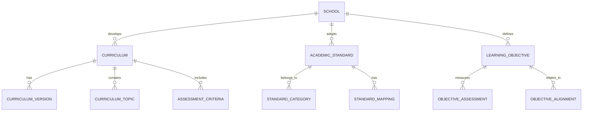
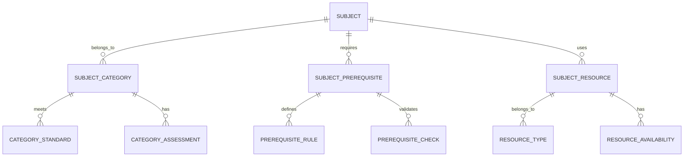
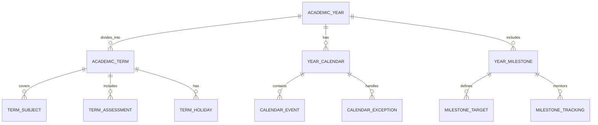
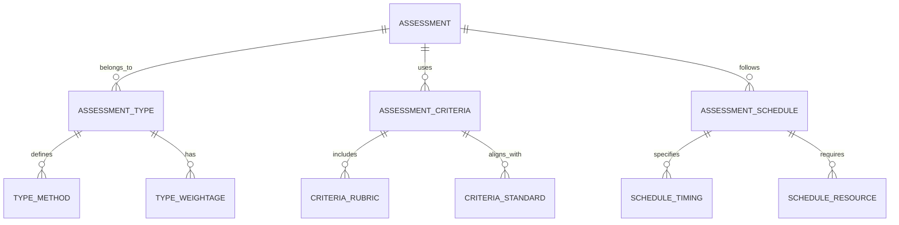
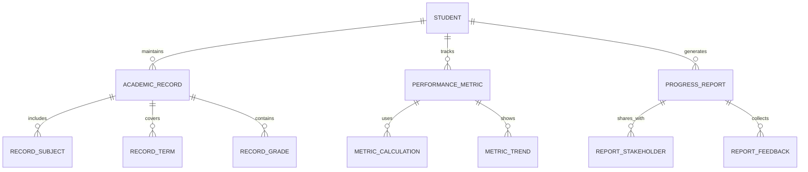
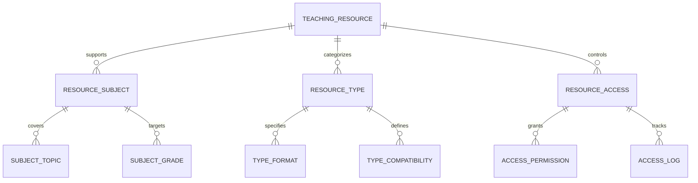

# Academic Management Module - Entity Relationship Diagram

## Overview
This ER diagram illustrates the entities and relationships for comprehensive academic management, including curriculum design, subject organization, class structures, and academic standards implementation across the school system.

## Curriculum & Standards Management



## Subject & Course Management



## Class & Section Organization

```mermaid
erDiagram
    CLASS ||--o{ CLASS_SECTION : divides_into
    CLASS ||--o{ CLASS_SUBJECT : offers
    CLASS ||--o{ CLASS_TEACHER : assigns

    CLASS_SECTION ||--o{ SECTION_STUDENT : enrolls
    CLASS_SECTION ||--o{ SECTION_CAPACITY : limits

    CLASS_SUBJECT ||--o{ SUBJECT_TEACHER : taught_by
    CLASS_SUBJECT ||--o{ SUBJECT_SCHEDULE : follows

    CLASS_TEACHER ||--o{ TEACHER_WORKLOAD : manages
    CLASS_TEACHER ||--o{ TEACHER_SUBJECT : specializes_in
```

## Academic Year & Term Management



## Assessment & Evaluation Framework



## Academic Performance Tracking



## Teaching & Learning Resources



## Entity Descriptions

### **CURRICULUM**
**Purpose**: Academic curriculum framework and standards
**Key Attributes**:
- `curriculum_id` (Primary Key)
- `school_id` (Foreign Key)
- `name` (Curriculum name)
- `version` (Version number)
- `grade_level` (Applicable grade)
- `subject_id` (Foreign Key)
- `approval_status` (Draft/Approved/Under Review)
- `effective_date`, `review_date`
- `created_by`, `approved_by`

### **SUBJECT**
**Purpose**: Academic subject definitions and management
**Key Attributes**:
- `subject_id` (Primary Key)
- `school_id` (Foreign Key)
- `name` (Subject name)
- `code` (Unique subject code)
- `category` (Core/Elective/Co-curricular)
- `credits` (Credit hours)
- `description` (Subject description)
- `is_active` (Status)
- `created_date`, `updated_date`

### **CLASS**
**Purpose**: Academic class organization and management
**Key Attributes**:
- `class_id` (Primary Key)
- `school_id` (Foreign Key)
- `grade_level` (Grade number)
- `section` (A, B, C, etc.)
- `capacity` (Maximum students)
- `class_teacher_id` (Foreign Key)
- `academic_year_id` (Foreign Key)
- `status` (Active/Completed/Dissolved)
- `created_date`, `updated_date`

### **ACADEMIC_YEAR**
**Purpose**: Academic year and calendar management
**Key Attributes**:
- `academic_year_id` (Primary Key)
- `school_id` (Foreign Key)
- `year_name` (2024-2025)
- `start_date`, `end_date`
- `term_structure` (Number of terms)
- `status` (Planning/Active/Completed)
- `created_date`, `updated_date`

### **ASSESSMENT**
**Purpose**: Academic assessment and evaluation framework
**Key Attributes**:
- `assessment_id` (Primary Key)
- `school_id` (Foreign Key)
- `name` (Assessment name)
- `type` (Quiz/Test/Exam/Project)
- `subject_id` (Foreign Key)
- `class_id` (Foreign Key)
- `scheduled_date`, `duration`
- `total_marks`, `passing_marks`
- `status` (Scheduled/Ongoing/Completed/Graded)

### **ACADEMIC_RECORD**
**Purpose**: Student academic performance records
**Key Attributes**:
- `record_id` (Primary Key)
- `student_id` (Foreign Key)
- `academic_year_id` (Foreign Key)
- `term_id` (Foreign Key)
- `subject_id` (Foreign Key)
- `marks_obtained`, `total_marks`
- `grade`, `grade_point`
- `attendance_percentage`
- `teacher_comments`, `remarks`

### **TEACHING_RESOURCE**
**Purpose**: Educational materials and learning resources
**Key Attributes**:
- `resource_id` (Primary Key)
- `school_id` (Foreign Key)
- `title` (Resource title)
- `type` (Book/Video/Presentation/Document)
- `subject_id` (Foreign Key)
- `grade_level` (Applicable grade)
- `file_path`, `file_size`
- `upload_date`, `uploaded_by`
- `access_level` (Public/Restricted/Private)
- `download_count`, `view_count`

## Key Relationships

### **Curriculum Development**
- **SCHOOL → CURRICULUM**: One school develops multiple curricula
- **CURRICULUM → CURRICULUM_VERSION**: One curriculum has multiple versions
- **CURRICULUM → CURRICULUM_TOPIC**: One curriculum contains multiple topics
- **CURRICULUM → ASSESSMENT_CRITERIA**: One curriculum includes assessment criteria

### **Subject Organization**
- **SUBJECT → SUBJECT_CATEGORY**: One subject belongs to one category
- **SUBJECT → SUBJECT_PREREQUISITE**: One subject may require prerequisites
- **SUBJECT → SUBJECT_RESOURCE**: One subject uses multiple resources
- **SUBJECT_PREREQUISITE → PREREQUISITE_RULE**: One prerequisite has validation rules

### **Class Management**
- **CLASS → CLASS_SECTION**: One class divides into multiple sections
- **CLASS → CLASS_SUBJECT**: One class offers multiple subjects
- **CLASS → CLASS_TEACHER**: One class assigns class teachers
- **CLASS_SECTION → SECTION_STUDENT**: One section enrolls multiple students

### **Academic Calendar**
- **ACADEMIC_YEAR → ACADEMIC_TERM**: One year divides into multiple terms
- **ACADEMIC_YEAR → YEAR_CALENDAR**: One year has one calendar
- **ACADEMIC_TERM → TERM_SUBJECT**: One term covers multiple subjects
- **ACADEMIC_TERM → TERM_ASSESSMENT**: One term includes multiple assessments

### **Assessment Framework**
- **ASSESSMENT → ASSESSMENT_TYPE**: One assessment belongs to one type
- **ASSESSMENT → ASSESSMENT_CRITERIA**: One assessment uses specific criteria
- **ASSESSMENT → ASSESSMENT_SCHEDULE**: One assessment follows a schedule
- **ASSESSMENT_CRITERIA → CRITERIA_RUBRIC**: One criteria includes rubrics

### **Performance Tracking**
- **STUDENT → ACADEMIC_RECORD**: One student maintains multiple records
- **ACADEMIC_RECORD → RECORD_SUBJECT**: One record includes multiple subjects
- **ACADEMIC_RECORD → RECORD_GRADE**: One record contains grades
- **STUDENT → PERFORMANCE_METRIC**: One student tracks multiple metrics

### **Resource Management**
- **TEACHING_RESOURCE → RESOURCE_SUBJECT**: One resource supports multiple subjects
- **TEACHING_RESOURCE → RESOURCE_TYPE**: One resource belongs to one type
- **TEACHING_RESOURCE → RESOURCE_ACCESS**: One resource has access controls
- **RESOURCE_ACCESS → ACCESS_LOG**: One access creates log entries

## Business Rules & Validation

### **Curriculum Rules**
- **Version Control**: New curriculum versions require approval
- **Standard Alignment**: Curriculum must align with academic standards
- **Grade Progression**: Curriculum builds progressively by grade
- **Review Cycles**: Regular curriculum review and updates

### **Subject Rules**
- **Prerequisite Validation**: Students must meet prerequisites
- **Credit Requirements**: Subjects must have defined credit values
- **Category Classification**: Subjects properly categorized
- **Resource Availability**: Required resources must be available

### **Class Rules**
- **Capacity Limits**: Classes cannot exceed capacity limits
- **Teacher Assignment**: Each class must have assigned teachers
- **Subject Coverage**: All required subjects must be offered
- **Section Balance**: Students distributed evenly across sections

### **Assessment Rules**
- **Schedule Conflicts**: No overlapping assessments for students
- **Fair Distribution**: Assessments distributed evenly across terms
- **Standard Compliance**: Assessments meet academic standards
- **Grading Consistency**: Consistent grading across sections

## Security & Compliance

### **Academic Data Protection**
- **Grade Privacy**: Student grades protected from unauthorized access
- **Curriculum Security**: Curriculum documents secured and versioned
- **Assessment Integrity**: Assessment materials protected from unauthorized access
- **Audit Trails**: All academic changes logged and auditable

### **Compliance Requirements**
- **Academic Standards**: Compliance with national education standards
- **Data Privacy**: Protection of student academic records
- **Assessment Fairness**: Equal opportunity and unbiased assessment
- **Record Retention**: Academic records retained as per regulations

## Performance Considerations

### **Database Optimization**
- **Partitioning**: Academic records partitioned by academic year
- **Indexing**: Optimized indexes on frequently queried fields
- **Caching**: Curriculum and subject data cached for performance
- **Archival**: Historical academic data moved to archival storage

### **Query Optimization**
- **Student Records**: Fast retrieval of student academic history
- **Assessment Results**: Efficient grade calculation and reporting
- **Curriculum Access**: Quick access to curriculum materials
- **Performance Analytics**: Optimized queries for academic analytics

### **Scalability Features**
- **Horizontal Scaling**: Database sharding by school and academic year
- **Load Balancing**: Distributed processing of academic operations
- **Caching Strategy**: Multi-level caching for academic data
- **Asynchronous Processing**: Background processing for bulk operations

## Implementation Guidelines

### **Curriculum Management**
- **Version Control**: Git-like versioning for curriculum changes
- **Collaborative Editing**: Multi-user curriculum development
- **Approval Workflows**: Structured approval processes for changes
- **Change Tracking**: Complete audit trail of curriculum modifications

### **Assessment Management**
- **Automated Scheduling**: AI-powered assessment scheduling
- **Conflict Detection**: Automatic detection of scheduling conflicts
- **Resource Allocation**: Automated allocation of assessment resources
- **Result Processing**: Efficient processing of assessment results

### **Performance Tracking**
- **Real-time Updates**: Live updates of student performance
- **Predictive Analytics**: Early warning systems for at-risk students
- **Progress Monitoring**: Continuous tracking of learning progress
- **Intervention Planning**: Automated recommendations for student support

### **Resource Management**
- **Digital Library**: Centralized repository of teaching resources
- **Access Control**: Role-based access to educational materials
- **Usage Analytics**: Tracking of resource utilization
- **Content Management**: Version control and content organization

This ER diagram provides a comprehensive foundation for implementing a robust academic management system that supports curriculum development, subject organization, class management, assessment frameworks, and comprehensive academic performance tracking while ensuring data integrity, security, and scalability.