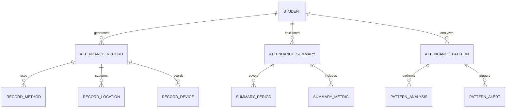
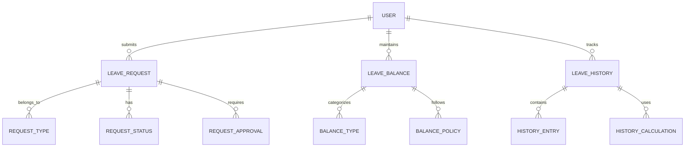
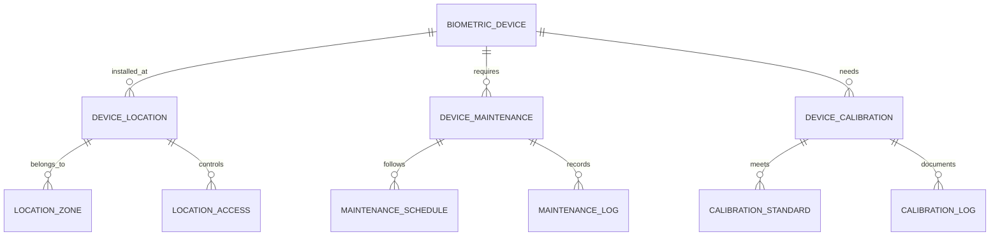
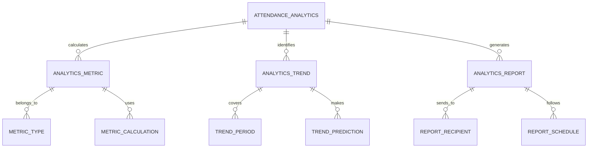
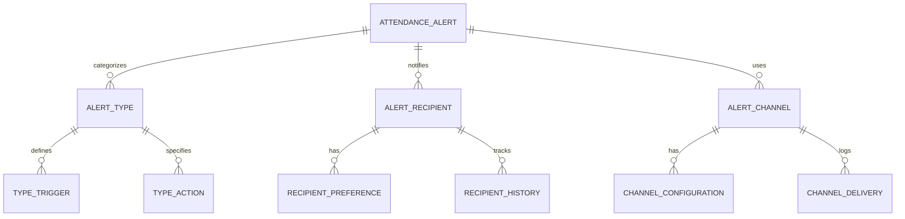
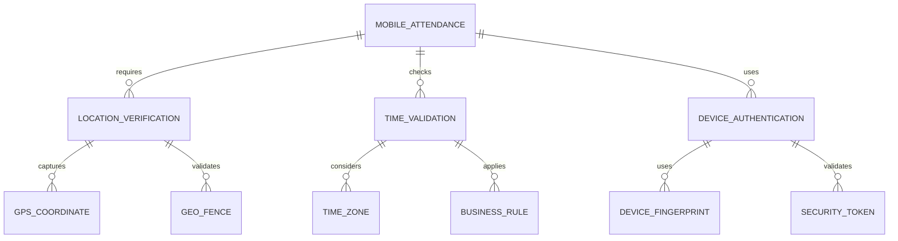
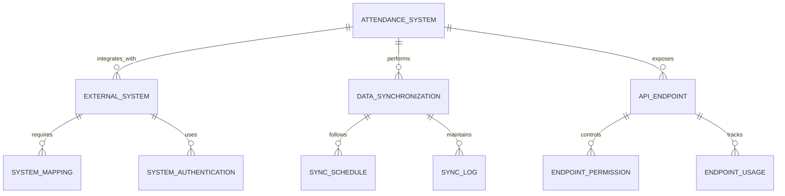

# Attendance Management Module - Entity Relationship Diagram

## Overview
This ER diagram illustrates the entities and relationships for comprehensive attendance tracking and management, including various marking methods, leave management, analytics, and automated reporting for both students and staff.

## Attendance Recording & Tracking

## Leave & Absence Management

## Biometric & Device Integration

## Attendance Analytics & Reporting

## Notification & Communication

## Mobile & Remote Attendance

## Integration & Synchronization

## Entity Descriptions

### **ATTENDANCE_RECORD**
**Purpose**: Individual attendance entries and time tracking
**Key Attributes**:
- `record_id` (Primary Key)
- `student_id` (Foreign Key)
- `date` (Attendance date)
- `check_in_time`, `check_out_time`
- `status` (Present/Absent/Late/Early Departure)
- `method` (Biometric/Manual/Mobile/QR Code)
- `device_id` (Recording device)
- `location` (Attendance location)
- `marked_by` (User who marked attendance)
- `notes` (Additional comments)

### **LEAVE_REQUEST**
**Purpose**: Leave and absence request management
**Key Attributes**:
- `request_id` (Primary Key)
- `user_id` (Foreign Key)
- `leave_type` (Casual/Medical/Emergency/Study)
- `start_date`, `end_date`
- `total_days` (Duration)
- `reason` (Detailed reason)
- `status` (Pending/Approved/Rejected/Cancelled)
- `applied_date`, `approved_date`
- `approved_by` (Approver user ID)
- `attachment_path` (Supporting documents)

### **BIOMETRIC_DEVICE**
**Purpose**: Biometric attendance device management
**Key Attributes**:
- `device_id` (Primary Key)
- `school_id` (Foreign Key)
- `device_type` (Fingerprint/Facial Recognition/Iris)
- `device_model`, `serial_number`
- `location` (Installation location)
- `ip_address`, `mac_address`
- `status` (Active/Inactive/Maintenance)
- `last_calibration`, `next_maintenance`
- `battery_level`, `connectivity_status`

### **ATTENDANCE_ANALYTICS**
**Purpose**: Attendance data analysis and insights
**Key Attributes**:
- `analytics_id` (Primary Key)
- `school_id` (Foreign Key)
- `analysis_type` (Daily/Weekly/Monthly/Trend)
- `start_date`, `end_date`
- `total_students`, `present_count`, `absent_count`
- `attendance_rate` (Percentage)
- `generated_date`, `generated_by`
- `report_path` (Generated report file)

### **ATTENDANCE_ALERT**
**Purpose**: Automated attendance notifications and alerts
**Key Attributes**:
- `alert_id` (Primary Key)
- `student_id` (Foreign Key)
- `alert_type` (Late Arrival/Absent/Regular Absentee)
- `severity` (Low/Medium/High/Critical)
- `message` (Alert content)
- `recipient_type` (Parent/Teacher/Administrator)
- `channel` (SMS/Email/Push Notification)
- `status` (Sent/Delivered/Read/Failed)
- `sent_date`, `delivered_date`

### **MOBILE_ATTENDANCE**
**Purpose**: Mobile application attendance tracking
**Key Attributes**:
- `mobile_id` (Primary Key)
- `student_id` (Foreign Key)
- `device_id` (Mobile device identifier)
- `app_version` (Mobile app version)
- `location_latitude`, `location_longitude`
- `location_accuracy` (GPS accuracy)
- `ip_address` (Network address)
- `timestamp` (Attendance timestamp)
- `verification_status` (Verified/Pending/Flagged)

### **ATTENDANCE_SYSTEM**
**Purpose**: Overall attendance system configuration
**Key Attributes**:
- `system_id` (Primary Key)
- `school_id` (Foreign Key)
- `system_name` (Configuration name)
- `attendance_policy` (School attendance rules)
- `grace_period` (Late arrival tolerance in minutes)
- `working_hours_start`, `working_hours_end`
- `auto_lockout_threshold` (Failed attempts before lockout)
- `notification_settings` (Alert preferences)
- `integration_settings` (External system connections)

## Key Relationships

### **Attendance Recording**
- **STUDENT → ATTENDANCE_RECORD**: One student generates multiple records
- **ATTENDANCE_RECORD → RECORD_METHOD**: One record uses one method
- **ATTENDANCE_RECORD → RECORD_DEVICE**: One record captured by one device
- **ATTENDANCE_RECORD → RECORD_LOCATION**: One record has location data

### **Leave Management**
- **USER → LEAVE_REQUEST**: One user submits multiple requests
- **LEAVE_REQUEST → REQUEST_TYPE**: One request belongs to one type
- **LEAVE_REQUEST → REQUEST_APPROVAL**: One request requires approval
- **USER → LEAVE_BALANCE**: One user maintains multiple balances

### **Biometric Integration**
- **BIOMETRIC_DEVICE → DEVICE_LOCATION**: One device installed at one location
- **BIOMETRIC_DEVICE → DEVICE_MAINTENANCE**: One device requires maintenance
- **DEVICE_MAINTENANCE → MAINTENANCE_SCHEDULE**: One maintenance follows schedule
- **BIOMETRIC_DEVICE → DEVICE_CALIBRATION**: One device needs calibration

### **Analytics & Reporting**
- **ATTENDANCE_ANALYTICS → ANALYTICS_METRIC**: One analysis calculates multiple metrics
- **ATTENDANCE_ANALYTICS → ANALYTICS_TREND**: One analysis identifies trends
- **ANALYTICS_REPORT → REPORT_RECIPIENT**: One report sends to multiple recipients
- **ANALYTICS_REPORT → REPORT_SCHEDULE**: One report follows schedule

### **Notification System**
- **ATTENDANCE_ALERT → ALERT_TYPE**: One alert belongs to one type
- **ATTENDANCE_ALERT → ALERT_RECIPIENT**: One alert notifies multiple recipients
- **ATTENDANCE_ALERT → ALERT_CHANNEL**: One alert uses multiple channels
- **ALERT_RECIPIENT → RECIPIENT_PREFERENCE**: One recipient has preferences

### **Mobile Attendance**
- **MOBILE_ATTENDANCE → LOCATION_VERIFICATION**: One attendance requires location verification
- **LOCATION_VERIFICATION → GPS_COORDINATE**: One verification captures coordinates
- **MOBILE_ATTENDANCE → DEVICE_AUTHENTICATION**: One attendance uses device authentication
- **DEVICE_AUTHENTICATION → SECURITY_TOKEN**: One authentication validates token

### **System Integration**
- **ATTENDANCE_SYSTEM → EXTERNAL_SYSTEM**: One system integrates with multiple external systems
- **ATTENDANCE_SYSTEM → DATA_SYNCHRONIZATION**: One system performs synchronization
- **DATA_SYNCHRONIZATION → SYNC_LOG**: One synchronization maintains logs
- **ATTENDANCE_SYSTEM → API_ENDPOINT**: One system exposes multiple endpoints

## Business Rules & Validation

### **Attendance Rules**
- **Time Validation**: Attendance can only be marked within valid time windows
- **Duplicate Prevention**: No duplicate attendance records for same student/day
- **Method Consistency**: Consistent attendance marking methods for fairness
- **Location Verification**: GPS verification for mobile attendance

### **Leave Rules**
- **Balance Validation**: Leave requests cannot exceed available balance
- **Advance Notice**: Minimum notice period for leave requests
- **Documentation**: Medical leave requires supporting documentation
- **Approval Hierarchy**: Different approval levels based on leave duration

### **Device Rules**
- **Calibration Schedule**: Regular calibration of biometric devices
- **Maintenance Windows**: Scheduled maintenance without disrupting attendance
- **Security Standards**: Device security meets organizational standards
- **Backup Systems**: Alternative attendance methods when devices fail

### **Analytics Rules**
- **Data Accuracy**: Analytics based on verified attendance data
- **Privacy Compliance**: Analytics respect student privacy regulations
- **Trend Analysis**: Minimum data period for meaningful trend analysis
- **Report Distribution**: Authorized recipients only receive reports

## Security & Compliance

### **Data Protection**
- **Attendance Privacy**: Student attendance data protected from unauthorized access
- **Biometric Security**: Biometric data encrypted and securely stored
- **Audit Trails**: Complete audit trail of all attendance modifications
- **Data Retention**: Attendance records retained as per regulatory requirements

### **Compliance Requirements**
- **Labor Laws**: Compliance with working hour and leave regulations
- **Education Standards**: Meeting educational attendance requirements
- **Data Privacy**: GDPR and FERPA compliance for student data
- **Security Standards**: ISO 27001 compliance for data security

## Performance Considerations

### **Database Optimization**
- **Partitioning**: Attendance records partitioned by date and school
- **Indexing**: Optimized indexes on student_id, date, and status
- **Archival**: Historical attendance data moved to archival storage
- **Caching**: Frequently accessed attendance summaries cached

### **Real-time Processing**
- **Stream Processing**: Real-time attendance data processing
- **Event-driven Architecture**: Immediate response to attendance events
- **Queue Management**: Asynchronous processing of bulk operations
- **Load Balancing**: Distributed processing across multiple servers

### **Scalability Features**
- **Horizontal Scaling**: Database sharding by school and time period
- **Microservices**: Separate services for different attendance functions
- **CDN Integration**: Global distribution of attendance data
- **Auto-scaling**: Automatic scaling based on attendance load

## Implementation Guidelines

### **Biometric Integration**
- **Device Compatibility**: Support for multiple biometric device manufacturers
- **API Standardization**: Standardized APIs for device communication
- **Error Handling**: Robust error handling for device failures
- **Security Protocols**: Secure communication between devices and system

### **Mobile Application**
- **Offline Capability**: Attendance marking when offline
- **Location Services**: GPS integration for location verification
- **Push Notifications**: Real-time alerts and reminders
- **Cross-platform Support**: iOS and Android compatibility

### **Analytics Engine**
- **Real-time Dashboards**: Live attendance monitoring dashboards
- **Predictive Analytics**: Early warning systems for attendance issues
- **Custom Reports**: User-defined attendance reports
- **Data Visualization**: Interactive charts and graphs

### **Integration APIs**
- **RESTful APIs**: Standard REST endpoints for attendance operations
- **Webhook Support**: Real-time notifications for attendance events
- **Bulk Operations**: Efficient handling of bulk attendance imports
- **Third-party Integration**: APIs for HR systems, payroll, and student information systems

This ER diagram provides a comprehensive foundation for implementing a robust attendance management system that supports multiple marking methods, leave management, biometric integration, mobile attendance, and comprehensive analytics while ensuring security, compliance, and scalability.