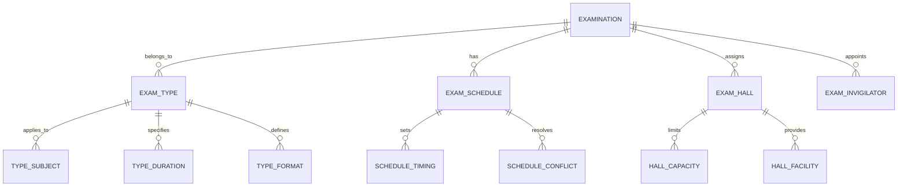
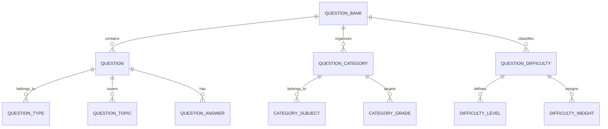
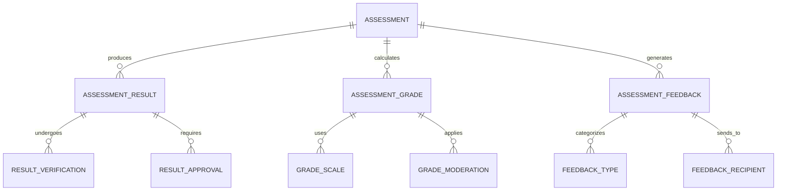
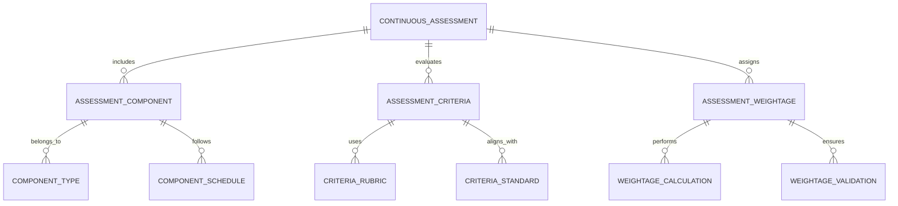
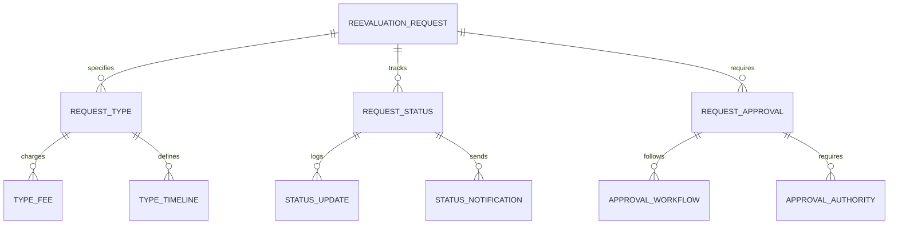
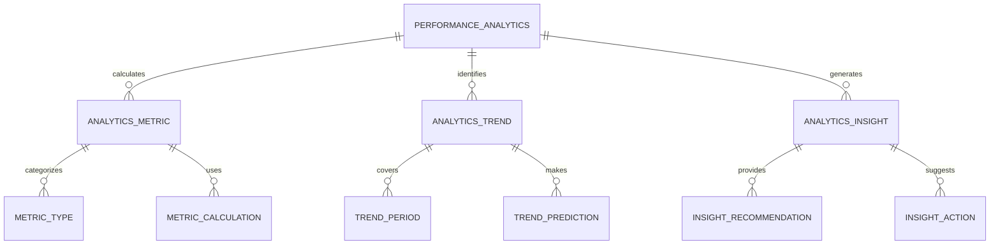
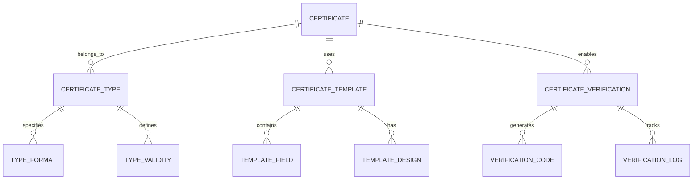

# Examination & Assessment Module - Entity Relationship Diagram

## Overview
This ER diagram illustrates the entities and relationships for comprehensive examination and assessment management, including question banks, result processing, continuous assessment, and performance analytics throughout the academic evaluation process.

## Examination Setup & Management

## Question Bank & Content Management

## Assessment & Result Processing

## Continuous Assessment Framework

## Re-evaluation & Appeals Management

## Performance Analytics & Reporting

## Certification & Transcript Management

## Entity Descriptions

### **EXAMINATION**
**Purpose**: Examination event management and coordination
**Key Attributes**:
- `exam_id` (Primary Key)
- `school_id` (Foreign Key)
- `exam_name` (Examination title)
- `exam_type` (Mid-term/Final/Entrance/Competitive)
- `subject_id` (Foreign Key)
- `class_id` (Foreign Key)
- `exam_date`, `exam_duration`
- `total_marks`, `passing_marks`
- `status` (Scheduled/Ongoing/Completed/Graded)
- `created_by`, `approved_by`

### **QUESTION_BANK**
**Purpose**: Repository of examination questions and content
**Key Attributes**:
- `bank_id` (Primary Key)
- `school_id` (Foreign Key)
- `subject_id` (Foreign Key)
- `bank_name` (Question bank title)
- `difficulty_distribution` (Easy/Medium/Hard percentages)
- `total_questions` (Number of questions)
- `last_updated`, `updated_by`
- `access_level` (Public/Restricted/Private)
- `version_number` (Bank version)

### **QUESTION**
**Purpose**: Individual question management and metadata
**Key Attributes**:
- `question_id` (Primary Key)
- `bank_id` (Foreign Key)
- `question_text` (Question content)
- `question_type` (Multiple Choice/Essay/Practical)
- `difficulty_level` (Easy/Medium/Hard)
- `topic_id` (Foreign Key)
- `marks_allocated` (Question marks)
- `time_allocated` (Time in minutes)
- `correct_answer` (For objective questions)
- `explanation` (Answer explanation)

### **ASSESSMENT**
**Purpose**: Student assessment and evaluation management
**Key Attributes**:
- `assessment_id` (Primary Key)
- `student_id` (Foreign Key)
- `exam_id` (Foreign Key)
- `marks_obtained`, `total_marks`
- `percentage`, `grade`
- `assessment_date`, `evaluated_by`
- `status` (Pending/Evaluated/Approved)
- `remarks`, `feedback`
- `reassessment_eligible` (Yes/No)

### **ASSESSMENT_RESULT**
**Purpose**: Comprehensive assessment result management
**Key Attributes**:
- `result_id` (Primary Key)
- `assessment_id` (Foreign Key)
- `raw_score`, `scaled_score`
- `percentile_rank`, `grade_point`
- `result_status` (Provisional/Final)
- `verified_by`, `verified_date`
- `approved_by`, `approved_date`
- `publication_date`, `certificate_issued`

### **CONTINUOUS_ASSESSMENT**
**Purpose**: Ongoing assessment throughout academic term
**Key Attributes**:
- `continuous_id` (Primary Key)
- `student_id` (Foreign Key)
- `subject_id` (Foreign Key)
- `term_id` (Foreign Key)
- `assessment_type` (Quiz/Assignment/Project/Presentation)
- `component_weight` (Percentage weight in final grade)
- `scheduled_date`, `submission_date`
- `evaluation_criteria` (Rubric or criteria)
- `max_score`, `obtained_score`

### **REEVALUATION_REQUEST**
**Purpose**: Re-evaluation and appeals request management
**Key Attributes**:
- `request_id` (Primary Key)
- `assessment_id` (Foreign Key)
- `student_id` (Foreign Key)
- `request_type` (Re-totaling/Re-evaluation/Review)
- `request_reason` (Detailed justification)
- `request_date`, `expected_completion`
- `processing_fee`, `payment_status`
- `status` (Submitted/Under Review/Completed/Rejected)
- `reviewed_by`, `review_date`

### **PERFORMANCE_ANALYTICS**
**Purpose**: Examination and assessment performance analysis
**Key Attributes**:
- `analytics_id` (Primary Key)
- `school_id` (Foreign Key)
- `analysis_type` (Subject/Class/Grade/School-wide)
- `analysis_period` (Term/Year/Custom)
- `start_date`, `end_date`
- `average_score`, `pass_percentage`
- `top_performer`, `improvement_areas`
- `generated_date`, `generated_by`

### **CERTIFICATE**
**Purpose**: Academic certificate and transcript management
**Key Attributes**:
- `certificate_id` (Primary Key)
- `student_id` (Foreign Key)
- `certificate_type` (Mark Sheet/Degree Certificate/Transcript)
- `issue_date`, `valid_until`
- `certificate_number` (Unique identifier)
- `verification_code` (Digital verification)
- `issued_by`, `authorized_signatory`
- `digital_signature`, `blockchain_hash`
- `status` (Active/Expired/Revoked)

## Key Relationships

### **Examination Management**
- **EXAMINATION → EXAM_TYPE**: One examination belongs to one type
- **EXAMINATION → EXAM_SCHEDULE**: One examination has one schedule
- **EXAMINATION → EXAM_HALL**: One examination assigns multiple halls
- **EXAMINATION → EXAM_INVIGILATOR**: One examination appoints multiple invigilators

### **Question Bank Management**
- **QUESTION_BANK → QUESTION**: One bank contains multiple questions
- **QUESTION_BANK → QUESTION_CATEGORY**: One bank organizes into categories
- **QUESTION → QUESTION_TYPE**: One question belongs to one type
- **QUESTION → QUESTION_ANSWER**: One question has associated answers

### **Assessment Processing**
- **ASSESSMENT → ASSESSMENT_RESULT**: One assessment produces one result
- **ASSESSMENT → ASSESSMENT_GRADE**: One assessment calculates grades
- **ASSESSMENT_RESULT → RESULT_VERIFICATION**: One result undergoes verification
- **ASSESSMENT_RESULT → RESULT_APPROVAL**: One result requires approval

### **Continuous Assessment**
- **CONTINUOUS_ASSESSMENT → ASSESSMENT_COMPONENT**: One assessment includes multiple components
- **ASSESSMENT_COMPONENT → COMPONENT_TYPE**: One component belongs to one type
- **CONTINUOUS_ASSESSMENT → ASSESSMENT_CRITERIA**: One assessment uses criteria
- **ASSESSMENT_CRITERIA → CRITERIA_RUBRIC**: One criteria uses rubrics

### **Re-evaluation Management**
- **REEVALUATION_REQUEST → REQUEST_TYPE**: One request specifies one type
- **REEVALUATION_REQUEST → REQUEST_STATUS**: One request has one status
- **REQUEST_TYPE → TYPE_FEE**: One type charges specific fee
- **REQUEST_STATUS → STATUS_UPDATE**: One status logs multiple updates

### **Performance Analytics**
- **PERFORMANCE_ANALYTICS → ANALYTICS_METRIC**: One analysis calculates multiple metrics
- **PERFORMANCE_ANALYTICS → ANALYTICS_TREND**: One analysis identifies trends
- **ANALYTICS_METRIC → METRIC_CALCULATION**: One metric uses calculations
- **ANALYTICS_TREND → TREND_PREDICTION**: One trend makes predictions

### **Certification Management**
- **CERTIFICATE → CERTIFICATE_TYPE**: One certificate belongs to one type
- **CERTIFICATE → CERTIFICATE_TEMPLATE**: One certificate uses one template
- **CERTIFICATE → CERTIFICATE_VERIFICATION**: One certificate enables verification
- **CERTIFICATE_VERIFICATION → VERIFICATION_CODE**: One verification generates codes

## Business Rules & Validation

### **Examination Rules**
- **Schedule Conflicts**: No overlapping examinations for students
- **Hall Capacity**: Student assignments within hall capacity limits
- **Invigilator Assignment**: Qualified invigilators for each examination
- **Question Paper Security**: Secure handling and distribution of papers

### **Assessment Rules**
- **Grading Consistency**: Standardized grading across all assessments
- **Result Verification**: Double-check of all assessment results
- **Appeal Deadlines**: Defined timelines for re-evaluation requests
- **Grade Moderation**: Statistical moderation for fair grading

### **Question Bank Rules**
- **Difficulty Balance**: Proper distribution of question difficulties
- **Topic Coverage**: Comprehensive coverage of syllabus topics
- **Question Quality**: Regular review and validation of questions
- **Usage Tracking**: Monitoring of question usage and performance

### **Continuous Assessment Rules**
- **Weightage Distribution**: Proper distribution of assessment weights
- **Timeline Compliance**: Assessments conducted within scheduled periods
- **Fair Evaluation**: Consistent evaluation criteria application
- **Progress Tracking**: Regular monitoring of student progress

## Security & Compliance

### **Assessment Security**
- **Question Paper Protection**: Secure storage and distribution
- **Examination Integrity**: Prevention of cheating and malpractice
- **Result Security**: Protection of assessment results and grades
- **Audit Trails**: Complete audit trail of all assessment activities

### **Data Privacy**
- **Student Performance Data**: Protection of sensitive academic information
- **Assessment Records**: Secure storage of examination papers and answers
- **Certificate Verification**: Secure verification of academic credentials
- **GDPR Compliance**: Data subject rights for student assessment data

### **Academic Integrity**
- **Plagiarism Detection**: Automated detection of academic dishonesty
- **Assessment Fairness**: Equal opportunity and unbiased assessment
- **Result Accuracy**: Verification and validation of assessment results
- **Appeal Fairness**: Transparent and fair appeal processes

## Performance Considerations

### **Database Optimization**
- **Partitioning**: Assessment data partitioned by academic year and subject
- **Indexing**: Optimized indexes on student_id, exam_id, and result fields
- **Archival**: Historical assessment data moved to archival storage
- **Caching**: Frequently accessed assessment results and certificates cached

### **Processing Optimization**
- **Batch Processing**: Bulk result processing and certificate generation
- **Parallel Processing**: Concurrent processing of multiple assessments
- **Queue Management**: Asynchronous processing for large-scale operations
- **Load Balancing**: Distributed processing across multiple servers

### **Scalability Features**
- **Horizontal Scaling**: Database sharding by school and assessment type
- **Microservices**: Separate services for different assessment functions
- **CDN Integration**: Global distribution of assessment materials
- **Auto-scaling**: Automatic scaling based on assessment load

## Implementation Guidelines

### **Examination Management**
- **Automated Scheduling**: AI-powered examination scheduling algorithms
- **Hall Allocation**: Intelligent hall assignment based on capacity and requirements
- **Invigilator Management**: Automated assignment and training tracking
- **Conflict Resolution**: Automated detection and resolution of scheduling conflicts

### **Assessment Processing**
- **Optical Mark Recognition**: Automated processing of objective assessments
- **AI Grading**: Machine learning for essay and subjective assessment grading
- **Result Analytics**: Advanced analytics for assessment performance insights
- **Certificate Generation**: Automated certificate creation and digital signing

### **Continuous Assessment**
- **Digital Submission**: Online submission platforms for assignments and projects
- **Peer Assessment**: Collaborative evaluation systems for group work
- **Progress Tracking**: Real-time monitoring of student learning progress
- **Intervention Planning**: Automated recommendations for academic support

### **Quality Assurance**
- **Assessment Validation**: Statistical validation of assessment results
- **Standard Setting**: Regular review and updating of assessment standards
- **Stakeholder Feedback**: Collection and analysis of feedback from all stakeholders
- **Continuous Improvement**: Regular assessment of assessment system effectiveness

This ER diagram provides a comprehensive foundation for implementing a robust examination and assessment management system that supports traditional examinations, continuous assessment, result processing, re-evaluation, and comprehensive performance analytics while ensuring academic integrity, security, and scalability.