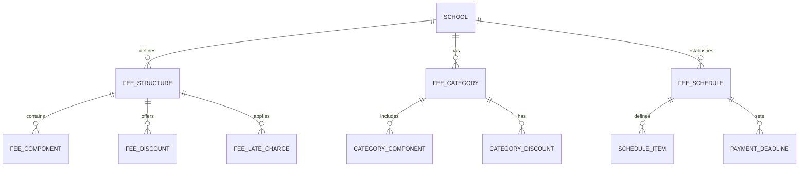
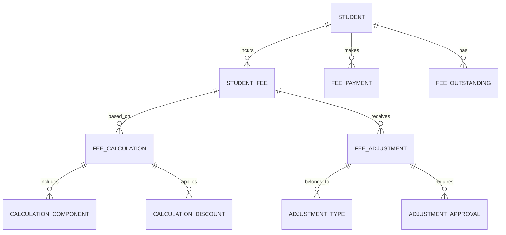
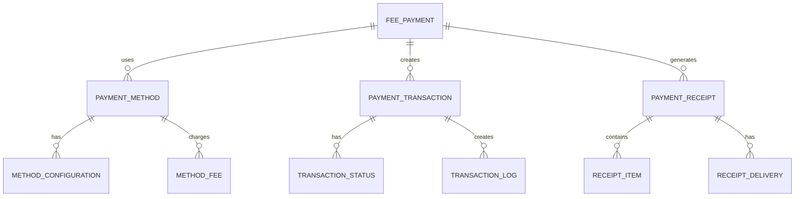
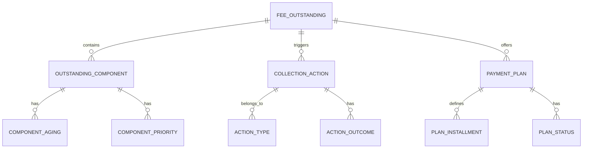
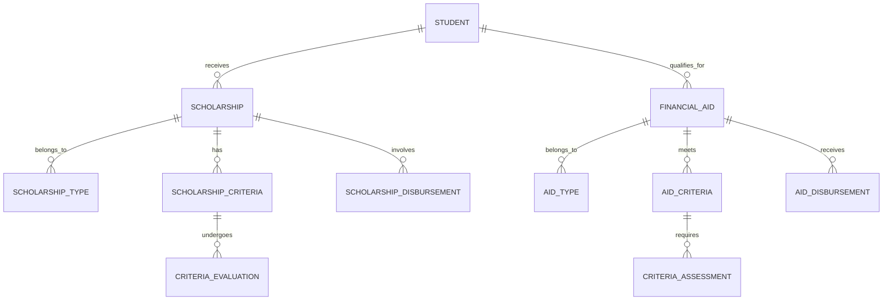
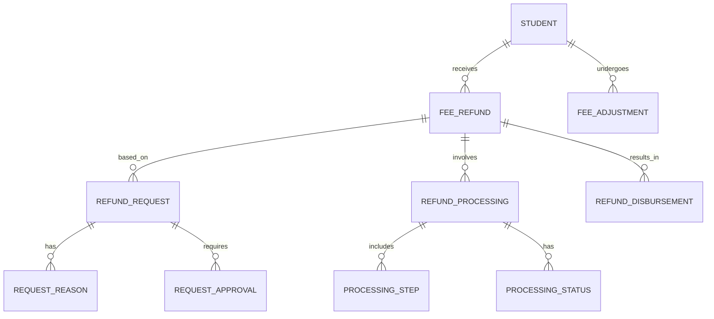
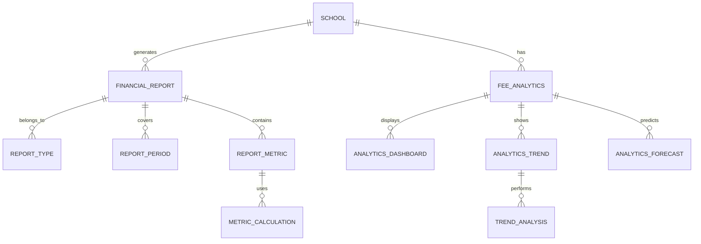

# Fee Management Module - Entity Relationship Diagram

## Overview
This ER diagram illustrates the entities and relationships for comprehensive fee management, including fee structure setup, payment processing, outstanding fee tracking, and financial reporting for both individual students and institutional management.

## Fee Structure & Configuration

## Student Fee Assignment & Calculation

## Payment Processing & Transactions

## Outstanding Fees & Collections

## Scholarships & Financial Aid

## Refunds & Adjustments

## Financial Reporting & Analytics

## Entity Descriptions

### **FEE_STRUCTURE**
**Purpose**: Core fee configuration for schools and programs
**Key Attributes**:
- `fee_id` (Primary Key)
- `school_id` (Foreign Key)
- `fee_name` (Tuition, Transport, Hostel, etc.)
- `fee_type` (Academic/Operational/Optional)
- `amount` (Base fee amount)
- `frequency` (Monthly/Quarterly/Annual/One-time)
- `grade_level` (Applicable grades)
- `academic_year_id` (Foreign Key)
- `is_mandatory` (Required or optional)
- `effective_date`, `end_date` (Validity period)

### **STUDENT_FEE**
**Purpose**: Individual student fee assignments and calculations
**Key Attributes**:
- `student_fee_id` (Primary Key)
- `student_id` (Foreign Key)
- `fee_id` (Foreign Key)
- `calculated_amount` (Final fee amount)
- `discount_amount` (Applied discounts)
- `final_amount` (Amount after discounts)
- `due_date` (Payment deadline)
- `status` (Pending/Paid/Overdue/Waived)
- `assigned_date`, `last_updated`

### **FEE_PAYMENT**
**Purpose**: Payment transactions and processing
**Key Attributes**:
- `payment_id` (Primary Key)
- `student_id` (Foreign Key)
- `amount` (Payment amount)
- `payment_date` (When payment was made)
- `payment_method` (Cash/Card/Online Transfer/Bank)
- `transaction_id` (Payment gateway reference)
- `receipt_number` (Unique receipt identifier)
- `status` (Pending/Completed/Failed/Refunded)
- `processed_by`, `processed_date`

### **FEE_OUTSTANDING**
**Purpose**: Tracking of unpaid fees and collection management
**Key Attributes**:
- `outstanding_id` (Primary Key)
- `student_id` (Foreign Key)
- `total_outstanding` (Total unpaid amount)
- `overdue_days` (Days past due date)
- `last_payment_date` (Most recent payment)
- `collection_status` (Active/Under Review/Legal)
- `collection_priority` (High/Medium/Low)
- `assigned_collector`, `last_contact_date`

### **SCHOLARSHIP**
**Purpose**: Scholarship awards and management
**Key Attributes**:
- `scholarship_id` (Primary Key)
- `student_id` (Foreign Key)
- `scholarship_name` (Award name)
- `scholarship_type` (Merit/Need-based/Sports)
- `amount` (Scholarship amount)
- `coverage_percentage` (Percentage of fees covered)
- `academic_year_id` (Foreign Key)
- `status` (Applied/Awarded/Active/Expired)
- `awarded_date`, `expiry_date`

### **FEE_REFUND**
**Purpose**: Refund processing and management
**Key Attributes**:
- `refund_id` (Primary Key)
- `student_id` (Foreign Key)
- `original_payment_id` (Foreign Key)
- `refund_amount` (Amount to be refunded)
- `refund_reason` (Withdrawal/Overpayment/Error)
- `request_date`, `approval_date`
- `processing_status` (Requested/Approved/Processed/Rejected)
- `refund_method` (Original method/Bank transfer/Check)
- `processed_by`, `processed_date`

### **FINANCIAL_REPORT**
**Purpose**: Financial reporting and analytics generation
**Key Attributes**:
- `report_id` (Primary Key)
- `school_id` (Foreign Key)
- `report_type` (Revenue/Outstanding/Collection/Trend)
- `report_period` (Monthly/Quarterly/Annual)
- `start_date`, `end_date` (Reporting period)
- `generated_date`, `generated_by`
- `total_revenue`, `total_outstanding`
- `collection_rate`, `average_payment_time`

## Key Relationships

### **Fee Structure Setup**
- **SCHOOL → FEE_STRUCTURE**: One school defines multiple fee structures
- **FEE_STRUCTURE → FEE_COMPONENT**: One structure contains multiple components
- **FEE_STRUCTURE → FEE_DISCOUNT**: One structure offers multiple discounts
- **FEE_CATEGORY → CATEGORY_COMPONENT**: One category includes multiple components

### **Student Fee Management**
- **STUDENT → STUDENT_FEE**: One student incurs multiple fees
- **STUDENT_FEE → FEE_CALCULATION**: One fee based on one calculation
- **FEE_CALCULATION → CALCULATION_COMPONENT**: One calculation includes multiple components
- **STUDENT_FEE → FEE_ADJUSTMENT**: One fee may receive multiple adjustments

### **Payment Processing**
- **FEE_PAYMENT → PAYMENT_METHOD**: One payment uses one method
- **FEE_PAYMENT → PAYMENT_TRANSACTION**: One payment creates one transaction
- **PAYMENT_TRANSACTION → TRANSACTION_STATUS**: One transaction has one status
- **FEE_PAYMENT → PAYMENT_RECEIPT**: One payment generates one receipt

### **Outstanding Management**
- **FEE_OUTSTANDING → COLLECTION_ACTION**: One outstanding triggers multiple actions
- **COLLECTION_ACTION → ACTION_TYPE**: One action belongs to one type
- **FEE_OUTSTANDING → PAYMENT_PLAN**: One outstanding may have payment plan
- **PAYMENT_PLAN → PLAN_INSTALLMENT**: One plan defines multiple installments

### **Scholarship Management**
- **STUDENT → SCHOLARSHIP**: One student may receive multiple scholarships
- **SCHOLARSHIP → SCHOLARSHIP_TYPE**: One scholarship belongs to one type
- **SCHOLARSHIP → SCHOLARSHIP_CRITERIA**: One scholarship has evaluation criteria
- **SCHOLARSHIP → SCHOLARSHIP_DISBURSEMENT**: One scholarship involves disbursement

### **Refund Processing**
- **STUDENT → FEE_REFUND**: One student may receive multiple refunds
- **FEE_REFUND → REFUND_REQUEST**: One refund based on one request
- **REFUND_REQUEST → REQUEST_APPROVAL**: One request requires approval
- **FEE_REFUND → REFUND_PROCESSING**: One refund involves processing steps

### **Financial Reporting**
- **SCHOOL → FINANCIAL_REPORT**: One school generates multiple reports
- **FINANCIAL_REPORT → REPORT_TYPE**: One report belongs to one type
- **FINANCIAL_REPORT → REPORT_METRIC**: One report contains multiple metrics
- **SCHOOL → FEE_ANALYTICS**: One school has fee analytics

## Business Rules & Validation

### **Fee Calculation Rules**
- **Automatic Calculation**: Fees calculated based on student profile and enrolled programs
- **Discount Application**: Discounts applied in predefined order (merit, need-based, sibling)
- **Late Fee Calculation**: Late fees calculated based on days overdue
- **Tax Calculation**: Applicable taxes added to final amount

### **Payment Validation**
- **Amount Validation**: Payment amount must match or be less than outstanding
- **Method Validation**: Payment method must be enabled for the school
- **Duplicate Prevention**: Duplicate payments detected and prevented
- **Fraud Detection**: Suspicious payment patterns flagged for review

### **Outstanding Management Rules**
- **Aging Classification**: Outstanding amounts classified by age (0-30, 31-60, 61-90, 90+ days)
- **Collection Priority**: Priority based on amount, days overdue, and student status
- **Escalation Rules**: Automatic escalation based on days overdue
- **Legal Action Threshold**: Threshold for initiating legal collection procedures

### **Scholarship Rules**
- **Eligibility Verification**: Automatic verification of scholarship criteria
- **Award Limits**: Maximum scholarship amount per student
- **Renewal Criteria**: Automatic renewal based on academic performance
- **Disbursement Rules**: Scholarship applied to specific fee types

## Security & Compliance

### **Financial Data Security**
- **Encryption**: All financial data encrypted at rest and in transit
- **Access Control**: Role-based access to financial information
- **Audit Trail**: Complete audit trail for all financial transactions
- **Data Backup**: Regular encrypted backups with disaster recovery

### **Compliance Requirements**
- **Financial Reporting**: Regular financial statements and tax compliance
- **Data Privacy**: Protection of student financial information
- **Regulatory Compliance**: Adherence to education finance regulations
- **Internal Controls**: Segregation of duties and approval workflows

### **Fraud Prevention**
- **Transaction Monitoring**: Real-time monitoring for suspicious activities
- **Payment Verification**: Multi-factor verification for large payments
- **Anomaly Detection**: AI-powered detection of unusual patterns
- **Incident Response**: Defined procedures for financial security incidents

## Performance Considerations

### **Database Optimization**
- **Partitioning**: Financial data partitioned by academic year and school
- **Indexing**: Optimized indexes on frequently queried financial fields
- **Archival**: Historical financial data moved to archival storage
- **Caching**: Financial calculations cached for improved performance

### **Processing Optimization**
- **Batch Processing**: Bulk fee calculations and payment processing
- **Real-time Updates**: Immediate fee status updates after payments
- **Queue Management**: Asynchronous processing for large operations
- **Load Balancing**: Distributed processing across multiple servers

### **Reporting Optimization**
- **Pre-calculated Metrics**: Commonly used metrics pre-calculated and cached
- **Incremental Updates**: Financial reports updated incrementally
- **Data Warehousing**: Separate data warehouse for complex analytics
- **API Optimization**: Efficient APIs for financial data access

## Implementation Guidelines

### **Payment Gateway Integration**
- **Multiple Gateways**: Support for local and international payment providers
- **Webhook Handling**: Real-time payment status updates
- **Error Handling**: Robust error handling for payment failures
- **Testing Environment**: Sandbox environment for payment testing

### **Financial Reporting**
- **Automated Generation**: Scheduled report generation and delivery
- **Custom Reports**: User-defined report templates and parameters
- **Export Capabilities**: Multiple export formats (PDF, Excel, CSV)
- **Dashboard Integration**: Real-time financial dashboards

### **Mobile Payment Support**
- **Mobile Wallets**: Integration with popular mobile payment apps
- **SMS Notifications**: Payment reminders and confirmations via SMS
- **USSD Integration**: Support for USSD-based payments in developing markets
- **QR Code Payments**: Quick payment initiation via QR codes

### **API Design**
- **RESTful APIs**: Standard REST endpoints for financial operations
- **Webhook Support**: Real-time notifications for payment events
- **Bulk Operations**: Efficient handling of bulk fee operations
- **Rate Limiting**: API rate limiting to prevent abuse

This ER diagram provides a comprehensive foundation for implementing a robust fee management system that handles complex financial operations, payment processing, outstanding fee management, and comprehensive financial reporting while ensuring security, compliance, and scalability.