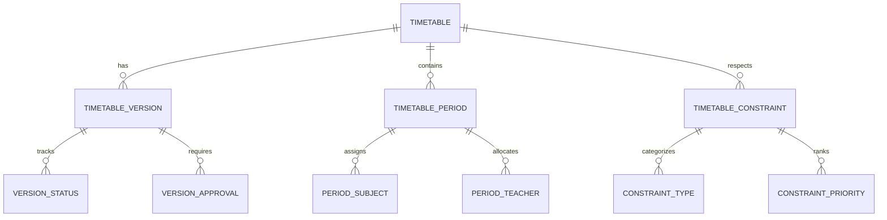
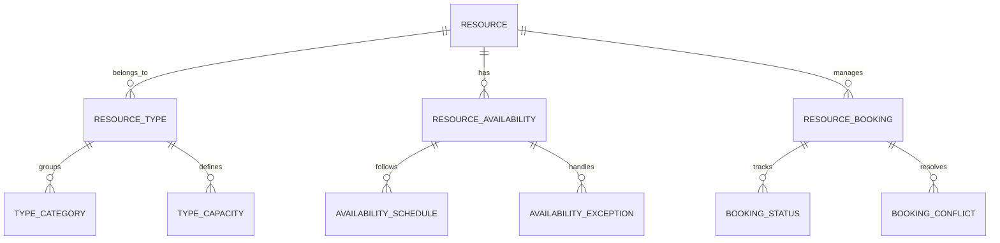
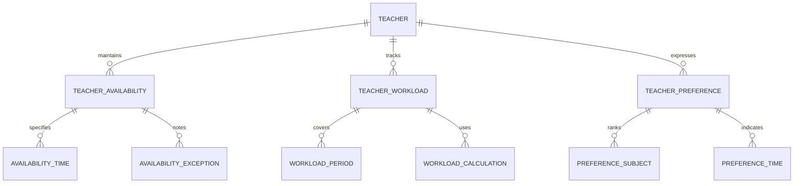
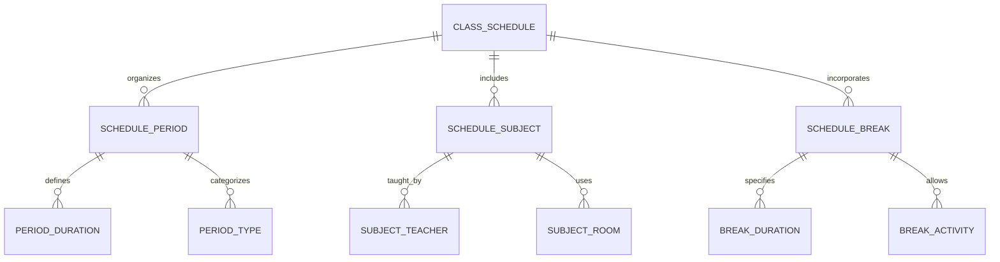
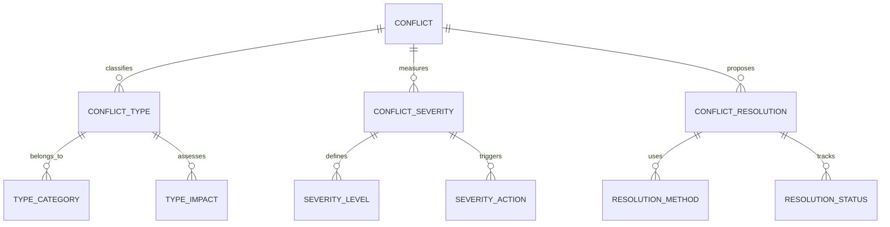
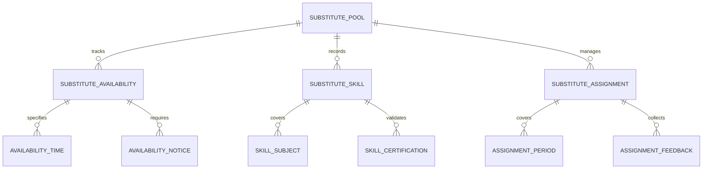
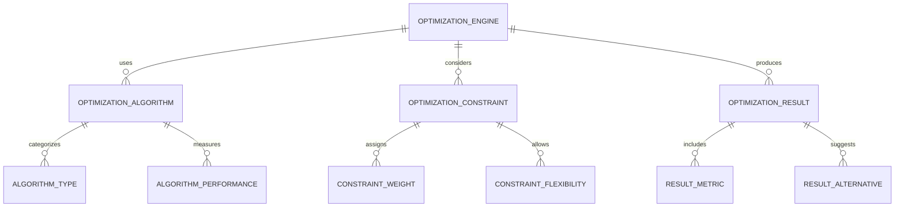

# Timetable & Scheduling Module - Entity Relationship Diagram

## Overview
This ER diagram illustrates the entities and relationships for comprehensive timetable and scheduling management, including automated scheduling algorithms, resource allocation, conflict resolution, and optimization for efficient academic operations.

## Timetable Creation & Management

## Resource Management & Allocation

## Teacher & Subject Assignment

## Class & Student Scheduling

## Conflict Detection & Resolution

## Substitute Teacher Management

## Scheduling Optimization & Analytics

## Entity Descriptions

### **TIMETABLE**
**Purpose**: Master timetable for academic scheduling
**Key Attributes**:
- `timetable_id` (Primary Key)
- `school_id` (Foreign Key)
- `academic_year_id` (Foreign Key)
- `term_id` (Foreign Key)
- `name` (Timetable identifier)
- `version_number` (Current version)
- `status` (Draft/Published/Archived)
- `created_date`, `effective_date`
- `created_by`, `approved_by`

### **TIMETABLE_PERIOD**
**Purpose**: Individual time periods in the timetable
**Key Attributes**:
- `period_id` (Primary Key)
- `timetable_id` (Foreign Key)
- `day_of_week` (Monday-Sunday)
- `start_time`, `end_time`
- `period_number` (1st, 2nd, 3rd period)
- `period_type` (Regular/Break/Lunch/Assembly)
- `is_active` (Status)
- `duration_minutes` (Period length)

### **RESOURCE**
**Purpose**: Physical and digital resources for scheduling
**Key Attributes**:
- `resource_id` (Primary Key)
- `school_id` (Foreign Key)
- `resource_name` (Classroom/Lab/Equipment)
- `resource_type` (Physical/Digital/Human)
- `capacity` (Maximum usage capacity)
- `location` (Building/Room/Floor)
- `maintenance_schedule` (Regular maintenance)
- `status` (Available/Under Maintenance/Out of Service)

### **TEACHER**
**Purpose**: Teacher information for scheduling assignments
**Key Attributes**:
- `teacher_id` (Primary Key)
- `school_id` (Foreign Key)
- `employee_id` (HR system reference)
- `specialization` (Subject expertise)
- `max_periods_per_day` (Workload limit)
- `preferred_days` (Work preference)
- `contract_type` (Full-time/Part-time)
- `availability_status` (Available/On Leave)

### **CLASS_SCHEDULE**
**Purpose**: Specific schedule for each class section
**Key Attributes**:
- `schedule_id` (Primary Key)
- `class_id` (Foreign Key)
- `timetable_id` (Foreign Key)
- `total_periods_per_week` (Weekly load)
- `break_duration` (Break time in minutes)
- `lunch_period` (Lunch break timing)
- `assembly_days` (Days with assembly)
- `flexible_periods` (Optional periods)

### **CONFLICT**
**Purpose**: Scheduling conflicts detection and management
**Key Attributes**:
- `conflict_id` (Primary Key)
- `timetable_id` (Foreign Key)
- `conflict_type` (Teacher Double-booked/Room Conflict/Time Overlap)
- `severity_level` (Critical/High/Medium/Low)
- `affected_entities` (Teachers/Rooms/Students)
- `conflict_description` (Detailed conflict explanation)
- `detection_date`, `resolution_date`
- `status` (Detected/Investigating/Resolved)

### **SUBSTITUTE_POOL**
**Purpose**: Pool of substitute teachers for emergency coverage
**Key Attributes**:
- `substitute_id` (Primary Key)
- `school_id` (Foreign Key)
- `teacher_name`, `contact_info`
- `qualification` (Teaching credentials)
- `experience_years` (Teaching experience)
- `availability_radius` (Geographic availability)
- `emergency_contact` (Emergency contact person)
- `status` (Active/Inactive/On Assignment)

### **OPTIMIZATION_ENGINE**
**Purpose**: AI-powered scheduling optimization system
**Key Attributes**:
- `engine_id` (Primary Key)
- `school_id` (Foreign Key)
- `algorithm_type` (Genetic Algorithm/Constraint Satisfaction/Heuristic)
- `optimization_goal` (Minimize Gaps/Maximize Utilization/Balance Workload)
- `constraint_priority` (Hard vs Soft constraints)
- `processing_time` (Algorithm execution time)
- `success_rate` (Optimization success percentage)
- `last_run_date`, `next_scheduled_run`

## Key Relationships

### **Timetable Structure**
- **TIMETABLE → TIMETABLE_VERSION**: One timetable has multiple versions
- **TIMETABLE → TIMETABLE_PERIOD**: One timetable contains multiple periods
- **TIMETABLE_PERIOD → PERIOD_SUBJECT**: One period assigns one subject
- **TIMETABLE_PERIOD → PERIOD_TEACHER**: One period allocates one teacher

### **Resource Management**
- **RESOURCE → RESOURCE_TYPE**: One resource belongs to one type
- **RESOURCE → RESOURCE_AVAILABILITY**: One resource has availability schedule
- **RESOURCE → RESOURCE_BOOKING**: One resource manages multiple bookings
- **RESOURCE_BOOKING → BOOKING_CONFLICT**: One booking may have conflicts

### **Teacher Scheduling**
- **TEACHER → TEACHER_AVAILABILITY**: One teacher maintains availability
- **TEACHER → TEACHER_WORKLOAD**: One teacher has workload tracking
- **TEACHER → TEACHER_PREFERENCE**: One teacher expresses preferences
- **TEACHER_AVAILABILITY → AVAILABILITY_TIME**: One availability specifies times

### **Class Scheduling**
- **CLASS_SCHEDULE → SCHEDULE_PERIOD**: One schedule organizes multiple periods
- **CLASS_SCHEDULE → SCHEDULE_SUBJECT**: One schedule includes multiple subjects
- **SCHEDULE_SUBJECT → SUBJECT_TEACHER**: One subject taught by one teacher
- **SCHEDULE_SUBJECT → SUBJECT_ROOM**: One subject uses one room

### **Conflict Management**
- **CONFLICT → CONFLICT_TYPE**: One conflict belongs to one type
- **CONFLICT → CONFLICT_SEVERITY**: One conflict has severity level
- **CONFLICT → CONFLICT_RESOLUTION**: One conflict proposes resolutions
- **CONFLICT_RESOLUTION → RESOLUTION_METHOD**: One resolution uses specific method

### **Substitute Management**
- **SUBSTITUTE_POOL → SUBSTITUTE_AVAILABILITY**: One substitute has availability
- **SUBSTITUTE_POOL → SUBSTITUTE_SKILL**: One substitute has skills
- **SUBSTITUTE_POOL → SUBSTITUTE_ASSIGNMENT**: One substitute manages assignments
- **SUBSTITUTE_ASSIGNMENT → ASSIGNMENT_FEEDBACK**: One assignment collects feedback

### **Optimization Engine**
- **OPTIMIZATION_ENGINE → OPTIMIZATION_ALGORITHM**: One engine uses algorithms
- **OPTIMIZATION_ENGINE → OPTIMIZATION_CONSTRAINT**: One engine considers constraints
- **OPTIMIZATION_ENGINE → OPTIMIZATION_RESULT**: One engine produces results
- **OPTIMIZATION_RESULT → RESULT_METRIC**: One result includes metrics

## Business Rules & Validation

### **Scheduling Rules**
- **No Double-booking**: Teachers cannot be assigned to multiple classes simultaneously
- **Room Capacity**: Class size must not exceed room capacity
- **Break Requirements**: Mandatory breaks between consecutive periods
- **Subject Sequencing**: Logical sequencing of related subjects

### **Resource Rules**
- **Maintenance Windows**: Resources unavailable during maintenance
- **Capacity Limits**: Resources have maximum utilization limits
- **Booking Conflicts**: No overlapping bookings for same resource
- **Emergency Access**: Emergency override for critical situations

### **Teacher Rules**
- **Workload Limits**: Maximum periods per day and per week
- **Subject Expertise**: Teachers assigned only to qualified subjects
- **Availability Compliance**: Respect teacher availability preferences
- **Contract Compliance**: Adherence to employment contract terms

### **Optimization Rules**
- **Constraint Hierarchy**: Hard constraints must be satisfied first
- **Fair Distribution**: Equal distribution of workload and resources
- **Quality Metrics**: Optimization considers multiple quality factors
- **Performance Tracking**: Continuous monitoring of optimization effectiveness

## Security & Compliance

### **Schedule Security**
- **Access Control**: Role-based access to scheduling functions
- **Audit Trails**: Complete audit trail of all schedule changes
- **Approval Workflows**: Multi-level approval for schedule modifications
- **Version Control**: Track all changes to timetable versions

### **Data Privacy**
- **Teacher Information**: Protection of teacher personal and availability data
- **Student Schedules**: Secure handling of class schedule information
- **Resource Data**: Protection of resource availability and booking data
- **Compliance**: Adherence to data protection regulations

## Performance Considerations

### **Algorithm Optimization**
- **Genetic Algorithms**: For complex multi-constraint optimization
- **Constraint Satisfaction**: For rule-based scheduling validation
- **Heuristic Methods**: For quick approximate solutions
- **Machine Learning**: For predicting scheduling preferences and patterns

### **Database Optimization**
- **Partitioning**: Timetable data partitioned by academic year
- **Indexing**: Optimized indexes on frequently queried scheduling fields
- **Caching**: Timetable data cached for quick access
- **Archival**: Historical timetables moved to archival storage

### **Real-time Processing**
- **Conflict Detection**: Real-time identification of scheduling conflicts
- **Resource Monitoring**: Live tracking of resource utilization
- **Schedule Updates**: Immediate propagation of schedule changes
- **Notification System**: Automated notifications for schedule modifications

### **Scalability Features**
- **Horizontal Scaling**: Database sharding by school and time period
- **Microservices**: Separate services for different scheduling functions
- **Load Balancing**: Distributed processing of scheduling operations
- **Auto-scaling**: Automatic scaling based on scheduling complexity

## Implementation Guidelines

### **Algorithm Implementation**
- **Constraint Modeling**: Formal modeling of all scheduling constraints
- **Optimization Objectives**: Clear definition of optimization goals
- **Performance Metrics**: Measurement of algorithm effectiveness
- **Fallback Mechanisms**: Alternative scheduling methods when optimization fails

### **User Interface Design**
- **Visual Timetable**: Drag-and-drop timetable creation interface
- **Conflict Visualization**: Clear display of scheduling conflicts
- **Resource Dashboard**: Real-time resource utilization dashboard
- **Mobile Access**: Mobile-optimized scheduling interface

### **Integration Points**
- **Academic Management**: Integration with curriculum and subject data
- **Attendance System**: Synchronization with attendance tracking
- **Communication Module**: Automated notifications for schedule changes
- **Resource Management**: Integration with facility and equipment booking

### **Quality Assurance**
- **Validation Testing**: Comprehensive testing of scheduling algorithms
- **Performance Benchmarking**: Comparison against industry standards
- **User Acceptance Testing**: Validation with teachers and administrators
- **Continuous Monitoring**: Ongoing monitoring of scheduling effectiveness

This ER diagram provides a comprehensive foundation for implementing a sophisticated timetable and scheduling management system that supports automated optimization, resource allocation, conflict resolution, and comprehensive analytics while ensuring flexibility, efficiency, and user satisfaction.