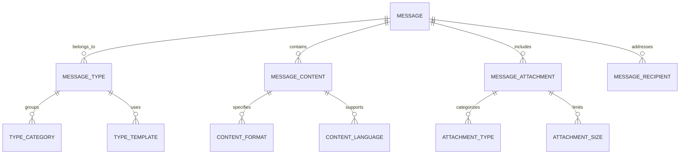
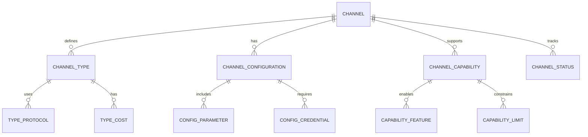
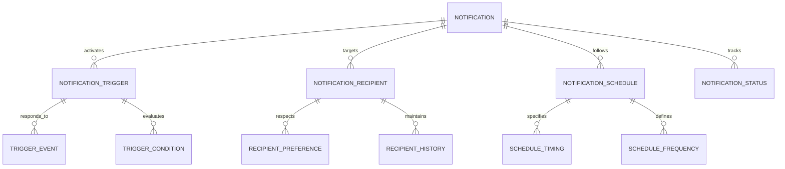
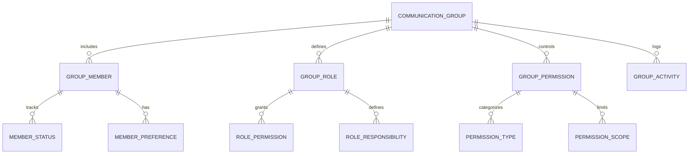
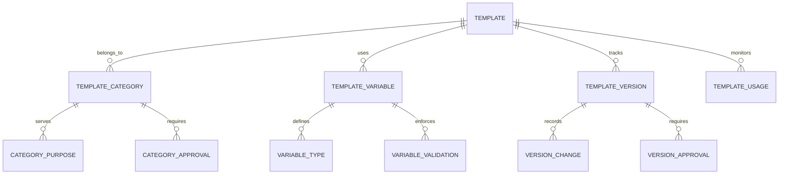
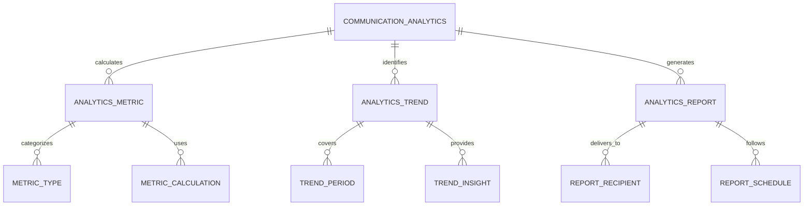
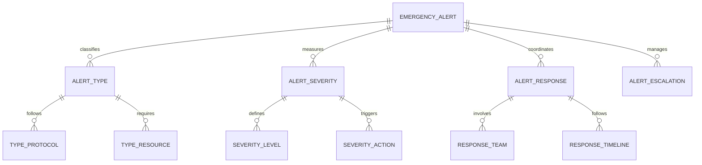

# Communication & Notification Module - Entity Relationship Diagram

## Overview
This ER diagram illustrates the entities and relationships for comprehensive communication and notification management, supporting multi-channel messaging, automated notifications, stakeholder engagement, and communication analytics across the school ecosystem.

## Message & Content Management

## Multi-Channel Delivery System

## Notification & Alert Management

## Stakeholder Communication Groups

## Template & Automation Management

## Communication Analytics & Reporting

## Emergency Communication System

## Entity Descriptions

### **MESSAGE**
**Purpose**: Core message entity for all communications
**Key Attributes**:
- `message_id` (Primary Key)
- `school_id` (Foreign Key)
- `sender_id` (Foreign Key - who sent the message)
- `subject` (Message subject line)
- `body` (Message content)
- `priority` (High/Medium/Low/Urgent)
- `message_type` (Email/SMS/Push/Announcement)
- `status` (Draft/Sent/Delivered/Read)
- `sent_date`, `delivery_date`
- `is_broadcast` (Individual/Group message)

### **CHANNEL**
**Purpose**: Communication channel management and configuration
**Key Attributes**:
- `channel_id` (Primary Key)
- `school_id` (Foreign Key)
- `channel_name` (Email/SMS/WhatsApp/Push)
- `channel_type` (Digital/Physical/Voice)
- `provider` (Service provider name)
- `configuration` (API keys, settings)
- `status` (Active/Inactive/Maintenance)
- `cost_per_message` (Delivery cost)
- `rate_limit` (Messages per minute/hour)

### **NOTIFICATION**
**Purpose**: Automated notification system for events and alerts
**Key Attributes**:
- `notification_id` (Primary Key)
- `school_id` (Foreign Key)
- `event_type` (Attendance/Grade/Assignment/Payment)
- `trigger_condition` (Specific conditions that activate notification)
- `recipient_criteria` (Who should receive the notification)
- `message_template` (Pre-defined message format)
- `schedule_type` (Immediate/Scheduled/Recurring)
- `status` (Active/Inactive/Paused)
- `last_triggered`, `next_scheduled`

### **COMMUNICATION_GROUP**
**Purpose**: Group-based communication management
**Key Attributes**:
- `group_id` (Primary Key)
- `school_id` (Foreign Key)
- `group_name` (Parents/Teachers/Students/Administrators)
- `group_type` (Department/Grade/Interest-based)
- `description` (Group purpose and scope)
- `privacy_level` (Public/Private/Secret)
- `membership_type` (Open/Closed/Invitation-only)
- `created_date`, `created_by`
- `member_count`, `active_members`

### **TEMPLATE**
**Purpose**: Reusable message templates for consistent communication
**Key Attributes**:
- `template_id` (Primary Key)
- `school_id` (Foreign Key)
- `template_name` (Template identifier)
- `template_category` (Announcement/Reminder/Alert/Update)
- `subject_template` (Subject line template)
- `body_template` (Message body template)
- `variables` (Dynamic content placeholders)
- `approval_required` (Yes/No)
- `status` (Draft/Approved/Archived)
- `usage_count`, `last_used`

### **COMMUNICATION_ANALYTICS**
**Purpose**: Communication effectiveness and engagement analytics
**Key Attributes**:
- `analytics_id` (Primary Key)
- `school_id` (Foreign Key)
- `analysis_period` (Daily/Weekly/Monthly)
- `start_date`, `end_date`
- `total_messages_sent`, `total_deliveries`
- `open_rate`, `response_rate`, `engagement_rate`
- `channel_performance` (By communication channel)
- `generated_date`, `generated_by`

### **EMERGENCY_ALERT**
**Purpose**: Critical incident communication and emergency response
**Key Attributes**:
- `alert_id` (Primary Key)
- `school_id` (Foreign Key)
- `alert_type` (Fire/Evacuation/Medical/Security)
- `severity_level` (Critical/High/Medium/Low)
- `alert_message` (Emergency communication content)
- `affected_areas` (Buildings/zones affected)
- `response_required` (Immediate action required)
- `escalation_contacts` (Emergency contact list)
- `status` (Active/Resolved/Cancelled)
- `triggered_date`, `resolved_date`

## Key Relationships

### **Message Management**
- **MESSAGE → MESSAGE_TYPE**: One message belongs to one type
- **MESSAGE → MESSAGE_CONTENT**: One message contains content
- **MESSAGE → MESSAGE_ATTACHMENT**: One message may include attachments
- **MESSAGE → MESSAGE_RECIPIENT**: One message addresses multiple recipients

### **Channel Management**
- **CHANNEL → CHANNEL_TYPE**: One channel has one type
- **CHANNEL → CHANNEL_CONFIGURATION**: One channel has configuration
- **CHANNEL → CHANNEL_CAPABILITY**: One channel supports capabilities
- **CHANNEL → CHANNEL_STATUS**: One channel has status tracking

### **Notification System**
- **NOTIFICATION → NOTIFICATION_TRIGGER**: One notification has trigger conditions
- **NOTIFICATION → NOTIFICATION_RECIPIENT**: One notification targets recipients
- **NOTIFICATION → NOTIFICATION_SCHEDULE**: One notification follows schedule
- **NOTIFICATION_TRIGGER → TRIGGER_EVENT**: One trigger responds to events

### **Group Communication**
- **COMMUNICATION_GROUP → GROUP_MEMBER**: One group includes multiple members
- **COMMUNICATION_GROUP → GROUP_ROLE**: One group defines roles
- **COMMUNICATION_GROUP → GROUP_PERMISSION**: One group has permissions
- **GROUP_MEMBER → MEMBER_STATUS**: One member has status tracking

### **Template Management**
- **TEMPLATE → TEMPLATE_CATEGORY**: One template belongs to category
- **TEMPLATE → TEMPLATE_VARIABLE**: One template uses variables
- **TEMPLATE → TEMPLATE_VERSION**: One template has version tracking
- **TEMPLATE_VARIABLE → VARIABLE_TYPE**: One variable has type definition

### **Analytics & Reporting**
- **COMMUNICATION_ANALYTICS → ANALYTICS_METRIC**: One analysis calculates metrics
- **COMMUNICATION_ANALYTICS → ANALYTICS_TREND**: One analysis identifies trends
- **ANALYTICS_REPORT → REPORT_RECIPIENT**: One report delivers to recipients
- **ANALYTICS_METRIC → METRIC_CALCULATION**: One metric uses calculations

### **Emergency Communication**
- **EMERGENCY_ALERT → ALERT_TYPE**: One alert belongs to type
- **EMERGENCY_ALERT → ALERT_SEVERITY**: One alert has severity level
- **EMERGENCY_ALERT → ALERT_RESPONSE**: One alert coordinates response
- **ALERT_RESPONSE → RESPONSE_TEAM**: One response involves teams

## Business Rules & Validation

### **Message Rules**
- **Content Validation**: Message content meets organizational standards
- **Recipient Verification**: Valid recipient contact information
- **Attachment Limits**: File size and type restrictions
- **Spam Prevention**: Anti-spam measures and rate limiting

### **Channel Rules**
- **Provider Compliance**: Adherence to provider terms and conditions
- **Cost Optimization**: Efficient use of communication channels
- **Delivery Guarantees**: Service level agreements for delivery
- **Security Standards**: Encrypted communication channels

### **Notification Rules**
- **Trigger Accuracy**: Precise conditions for notification activation
- **Recipient Targeting**: Accurate audience segmentation
- **Frequency Limits**: Prevention of notification fatigue
- **Opt-out Compliance**: Respect for communication preferences

### **Emergency Rules**
- **Immediate Delivery**: Priority routing for emergency communications
- **Escalation Protocols**: Clear escalation procedures for critical alerts
- **Response Tracking**: Monitoring of emergency response actions
- **Post-Incident Review**: Analysis and improvement of emergency procedures

## Security & Compliance

### **Communication Security**
- **End-to-End Encryption**: Secure message transmission
- **Data Privacy**: Protection of personal communication data
- **Access Control**: Role-based access to communication features
- **Audit Trails**: Complete logging of all communication activities

### **Compliance Requirements**
- **GDPR Compliance**: Data protection for personal communications
- **CAN-SPAM**: Compliance with anti-spam regulations
- **TCPA Compliance**: Telephone consumer protection rules
- **Educational Privacy**: FERPA compliance for student communications

### **Content Security**
- **Content Filtering**: Prevention of inappropriate content
- **Virus Scanning**: Attachment security scanning
- **DLP Policies**: Data loss prevention for sensitive information
- **Archival Policies**: Secure storage of communication records

## Performance Considerations

### **Delivery Optimization**
- **Queue Management**: Efficient message queuing and processing
- **Batch Processing**: Bulk message delivery optimization
- **Rate Limiting**: Prevention of system overload
- **Retry Mechanisms**: Automatic retry for failed deliveries

### **Database Optimization**
- **Partitioning**: Message data partitioned by date and school
- **Indexing**: Optimized indexes on frequently queried fields
- **Archival**: Historical messages moved to archival storage
- **Caching**: Frequently accessed templates and configurations cached

### **Real-time Processing**
- **Event-driven Architecture**: Immediate response to communication events
- **WebSocket Support**: Real-time communication for live features
- **Push Notifications**: Instant delivery for critical messages
- **Stream Processing**: Real-time analytics and monitoring

### **Scalability Features**
- **Horizontal Scaling**: Message processing distributed across servers
- **Microservices**: Separate services for different communication functions
- **CDN Integration**: Global delivery of communication content
- **Auto-scaling**: Automatic scaling based on communication volume

## Implementation Guidelines

### **Multi-Channel Integration**
- **Provider APIs**: Integration with SMS, email, and push notification providers
- **Webhook Handling**: Real-time delivery status updates
- **Fallback Mechanisms**: Alternative channels when primary fails
- **Cost Optimization**: Intelligent channel selection based on cost and effectiveness

### **Template Engine**
- **Dynamic Content**: Support for personalized message content
- **Multi-language Support**: Templates for different languages
- **Version Control**: Template versioning and approval workflows
- **Testing Framework**: Template testing and validation

### **Analytics Dashboard**
- **Real-time Metrics**: Live communication performance monitoring
- **Engagement Tracking**: Message open rates and response tracking
- **Channel Comparison**: Performance comparison across channels
- **Trend Analysis**: Communication pattern analysis and insights

### **Emergency Communication**
- **Priority Routing**: High-priority message delivery
- **Multi-channel Broadcasting**: Simultaneous delivery across channels
- **Response Coordination**: Integration with emergency response systems
- **Post-incident Analysis**: Communication effectiveness evaluation

This ER diagram provides a comprehensive foundation for implementing a robust communication and notification management system that supports multi-channel messaging, automated notifications, stakeholder engagement, and comprehensive communication analytics while ensuring security, compliance, and scalability.