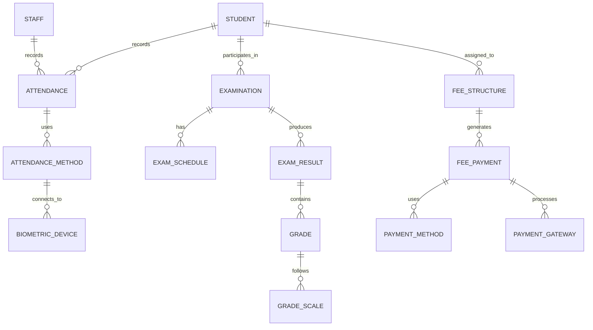
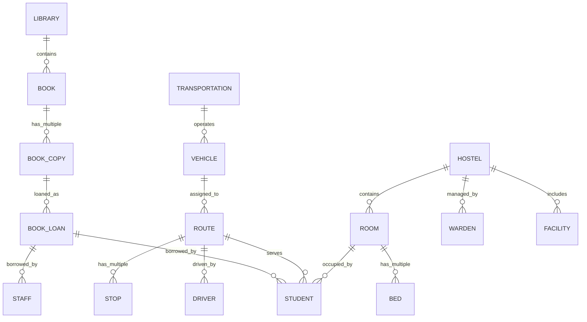
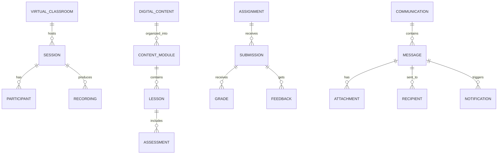
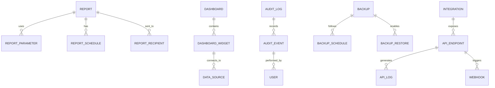
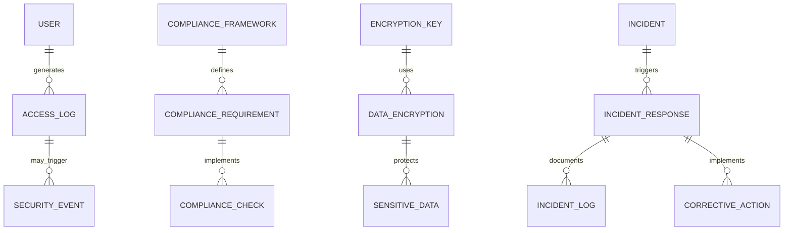

# Academia Pro - Entity Relationship Diagram

## Overview
This Entity Relationship Diagram represents the comprehensive database architecture for the Academia Pro School Management System, supporting multi-school operations with 21 integrated modules.

## Core Infrastructure Entities

```mermaid
erDiagram
    SCHOOL ||--o{ USER : manages
    SCHOOL ||--o{ STUDENT : enrolls
    SCHOOL ||--o{ STAFF : employs
    SCHOOL ||--o{ CLASS : organizes
    SCHOOL ||--o{ SUBJECT : offers
    SCHOOL ||--o{ FACILITY : owns
    SCHOOL ||--o{ ACADEMIC_YEAR : defines
    SCHOOL ||--o{ GRADE_SCALE : uses

    USER ||--o{ USER_ROLE : has
    USER ||--o{ USER_PERMISSION : granted
    USER ||--o{ LOGIN_SESSION : creates
    USER ||--o{ AUDIT_LOG : generates

    STUDENT ||--o{ PARENT : related_to
    STUDENT ||--o{ MEDICAL_RECORD : has
    STUDENT ||--o{ EMERGENCY_CONTACT : has
    STUDENT ||--o{ STUDENT_DOCUMENT : possesses

    STAFF ||--o{ STAFF_DOCUMENT : possesses
    STAFF ||--o{ QUALIFICATION : holds
    STAFF ||--o{ PERFORMANCE_REVIEW : receives
```

## Academic Management Entities

```mermaid
erDiagram
    CLASS ||--o{ STUDENT : contains
    CLASS ||--o{ TIMETABLE : follows
    CLASS ||--o{ TEACHER_ASSIGNMENT : has

    SUBJECT ||--o{ CURRICULUM : belongs_to
    SUBJECT ||--o{ TEACHER_ASSIGNMENT : assigned_to
    SUBJECT ||--o{ LEARNING_OBJECTIVE : has

    CURRICULUM ||--o{ SYLLABUS : contains
    CURRICULUM ||--o{ ASSESSMENT_CRITERIA : defines

    TIMETABLE ||--o{ TIMETABLE_SLOT : consists_of
    TIMETABLE_SLOT ||--o{ SUBJECT : covers
    TIMETABLE_SLOT ||--o{ CLASSROOM : uses
    TIMETABLE_SLOT ||--o{ TEACHER : taught_by
```

## Operational Entities



## Support Services Entities



## Digital Features Entities



## Administrative Entities



## Security & Compliance Entities



## Complete Academia Pro ER Diagram

```mermaid
erDiagram
    SCHOOL ||--o{ USER : manages
    SCHOOL ||--o{ STUDENT : enrolls
    SCHOOL ||--o{ STAFF : employs
    SCHOOL ||--o{ CLASS : organizes
    SCHOOL ||--o{ SUBJECT : offers
    SCHOOL ||--o{ FACILITY : owns

    USER ||--o{ USER_ROLE : has
    USER ||--o{ USER_PERMISSION : granted
    USER ||--o{ LOGIN_SESSION : creates

    STUDENT ||--o{ PARENT : related_to
    STUDENT ||--o{ MEDICAL_RECORD : has
    STUDENT ||--o{ STUDENT_DOCUMENT : possesses

    %% Academic Structure
    CLASS ||--o{ STUDENT : contains
    CLASS ||--o{ TIMETABLE : follows
    SUBJECT ||--o{ CURRICULUM : belongs_to
    SUBJECT ||--o{ TEACHER_ASSIGNMENT : assigned_to
    TIMETABLE ||--o{ TIMETABLE_SLOT : consists_of

    %% Operations
    STUDENT ||--o{ ATTENDANCE : records
    STUDENT ||--o{ EXAMINATION : participates_in
    STUDENT ||--o{ FEE_STRUCTURE : assigned_to
    EXAMINATION ||--o{ EXAM_RESULT : produces
    FEE_STRUCTURE ||--o{ FEE_PAYMENT : generates

    %% Support Services
    LIBRARY ||--o{ BOOK : contains
    BOOK ||--o{ BOOK_COPY : has_multiple
    BOOK_COPY ||--o{ BOOK_LOAN : loaned_as

    TRANSPORTATION ||--o{ VEHICLE : operates
    VEHICLE ||--o{ ROUTE : assigned_to
    ROUTE ||--o{ STUDENT : serves

    HOSTEL ||--o{ ROOM : contains
    ROOM ||--o{ STUDENT : occupied_by

    %% Digital Features
    VIRTUAL_CLASSROOM ||--o{ SESSION : hosts
    DIGITAL_CONTENT ||--o{ CONTENT_MODULE : organized_into
    ASSIGNMENT ||--o{ SUBMISSION : receives

    COMMUNICATION ||--o{ MESSAGE : contains
    MESSAGE ||--o{ RECIPIENT : sent_to
    MESSAGE ||--o{ NOTIFICATION : triggers

    %% Administration
    REPORT ||--o{ REPORT_SCHEDULE : has
    DASHBOARD ||--o{ DASHBOARD_WIDGET : contains
    AUDIT_LOG ||--o{ AUDIT_EVENT : records

    %% Security
    USER ||--o{ ACCESS_LOG : generates
    COMPLIANCE_FRAMEWORK ||--o{ COMPLIANCE_REQUIREMENT : defines
    INCIDENT ||--o{ INCIDENT_RESPONSE : triggers
```

## Entity Descriptions

### Core Entities
| Entity | Description | Key Attributes |
|--------|-------------|----------------|
| **SCHOOL** | Central entity for multi-school architecture | school_id, name, address, type, capacity |
| **USER** | All system users with role-based access | user_id, username, email, role, school_id |
| **STUDENT** | Student profile and academic records | student_id, name, grade, enrollment_date |
| **STAFF** | Teaching and non-teaching personnel | staff_id, name, designation, department |
| **CLASS** | Academic class/section organization | class_id, grade, section, capacity |
| **SUBJECT** | Curriculum subjects and courses | subject_id, name, code, credits |

### Operational Entities
| Entity | Description | Key Attributes |
|--------|-------------|----------------|
| **ATTENDANCE** | Student and staff attendance tracking | attendance_id, date, status, method |
| **EXAMINATION** | Test and assessment management | exam_id, subject, date, type, duration |
| **FEE_STRUCTURE** | Fee configuration and management | fee_id, amount, type, frequency |
| **TIMETABLE** | Class scheduling and resource allocation | timetable_id, class_id, day, period |

### Support Services Entities
| Entity | Description | Key Attributes |
|--------|-------------|----------------|
| **LIBRARY** | Library management and circulation | library_id, name, location, capacity |
| **BOOK** | Book catalog and inventory | book_id, title, author, isbn, category |
| **TRANSPORTATION** | School bus and transport services | transport_id, route, vehicle, capacity |
| **HOSTEL** | Residential facility management | hostel_id, name, type, capacity |

### Digital Features Entities
| Entity | Description | Key Attributes |
|--------|-------------|----------------|
| **VIRTUAL_CLASSROOM** | Online learning environments | classroom_id, name, capacity, features |
| **DIGITAL_CONTENT** | E-learning materials and resources | content_id, title, type, subject, grade |
| **COMMUNICATION** | Multi-channel messaging system | comm_id, type, sender, recipients |
| **ASSIGNMENT** | Digital assignment management | assignment_id, title, subject, due_date |

### Administrative Entities
| Entity | Description | Key Attributes |
|--------|-------------|----------------|
| **REPORT** | Analytics and reporting system | report_id, name, type, parameters |
| **DASHBOARD** | Real-time monitoring dashboards | dashboard_id, user_id, widgets, layout |
| **AUDIT_LOG** | System activity and change tracking | log_id, user_id, action, timestamp |
| **BACKUP** | Data backup and recovery management | backup_id, type, schedule, status |

## Relationship Types

### Cardinality Notations
- **||--||**: One-to-one relationship
- **||--o{**: One-to-many relationship
- **}o--o{**: Many-to-many relationship
- **||--o{**: One-to-many (optional)
- **}o--||**: Many-to-one relationship

### Relationship Descriptions
1. **SCHOOL → USER**: One school manages many users (multi-tenant)
2. **SCHOOL → STUDENT**: One school enrolls many students
3. **STUDENT → ATTENDANCE**: One student has many attendance records
4. **CLASS → STUDENT**: One class contains many students
5. **SUBJECT → TEACHER_ASSIGNMENT**: One subject assigned to multiple teachers
6. **EXAMINATION → EXAM_RESULT**: One exam produces many results
7. **FEE_STRUCTURE → FEE_PAYMENT**: One fee structure generates many payments
8. **BOOK → BOOK_COPY**: One book title has multiple physical copies
9. **VEHICLE → ROUTE**: One vehicle serves multiple routes
10. **ROOM → STUDENT**: One room occupied by one student (hostel)

## Database Design Principles

### Normalization
- **1NF**: All attributes are atomic
- **2NF**: No partial dependencies
- **3NF**: No transitive dependencies
- **BCNF**: Every determinant is a candidate key

### Indexing Strategy
- **Primary Keys**: Auto-increment integer IDs
- **Foreign Keys**: Properly indexed for joins
- **Composite Indexes**: For frequently queried combinations
- **Full-text Indexes**: For search functionality

### Data Integrity
- **Referential Integrity**: Foreign key constraints
- **Check Constraints**: Data validation rules
- **Triggers**: Automated data processing
- **Audit Trails**: Change tracking and logging

## Performance Considerations

### Query Optimization
- **Indexing**: Strategic index placement
- **Partitioning**: Large table partitioning
- **Caching**: Query result caching
- **Connection Pooling**: Database connection management

### Scalability Features
- **Read Replicas**: For reporting queries
- **Sharding**: Multi-school data distribution
- **Archiving**: Historical data management
- **Compression**: Storage optimization

## Security Implementation

### Access Control
- **Row Level Security**: School-specific data isolation
- **Column Level Encryption**: Sensitive data protection
- **API Rate Limiting**: Prevent abuse
- **Audit Logging**: All data access tracking

### Data Protection
- **Encryption at Rest**: Database encryption
- **Encryption in Transit**: SSL/TLS connections
- **Data Masking**: Sensitive data obfuscation
- **Backup Encryption**: Secure backup storage

---

## How to View This Diagram

### Using VSCode with Mermaid Extension:
1. Install the "Markdown Preview Mermaid Support" extension
2. Open this file in VSCode
3. Use `Ctrl+Shift+V` to preview
4. Diagrams will render automatically

### Export Options:
- **PNG/SVG Export**: Right-click on diagram
- **PDF Generation**: Use print to PDF
- **Interactive Viewing**: Zoom and pan capabilities

### Best Practices for ER Diagrams:
- ✅ Use consistent naming conventions
- ✅ Include all major entities and relationships
- ✅ Show cardinality clearly
- ✅ Add entity descriptions
- ✅ Consider performance implications
- ✅ Plan for future scalability

This ER diagram provides a comprehensive foundation for the Academia Pro database architecture, supporting all 21 modules with proper relationships and data integrity.